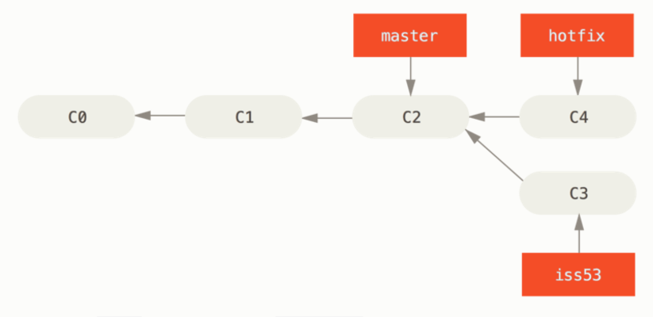
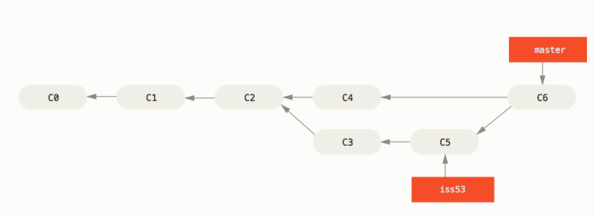

## Git分支的基本操作

### 一. 查看分支

```shell
git branch

  checkout
* master #打星号的分支为当前所在分支
  test
```

 如果需要查看每一个分支的最后一次提交，可以运行 `git branch -v` 命令：

```shell
git branch -v
```

如果需要查看分支跟踪的远程分支就需要使用`-vv`选项了：

```shell
git branch -vv
```

`--merged` 与 `--no-merged` 这两个有用的选项可以过滤这个列表中已经合并或尚未合并到当前分支的分支。 如果要查看哪些分支已经合并到当前分支，可以运行 `git branch --merged`：

```shell
git branch --merged
git branch --no-merged
```

` --sort=committerdate`，分支列表按最新的提交时间进行排序：

```shell
git branch --sort=committerdate
```


### 二. 创建分支

**只创建分支：**

```shell
git branch <branch-name>  #在当前分支最新的commit上新建分支
git branch <branch-name> <SHA-1-Code> #创建一个分支，指向一个指定的commit对象
```

​	这个命令创建一个分支指针，指向`HEAD`所指向的`commit对象`（ `HEAD` 想象为当前分支的别名），分支实际上就是一种指针，指向当前分支上最新的`commit对象`（提交对象总是指向它自己上一次的提交对象），具体分支原理参考 [分支简介](https://git-scm.com/book/zh/v2/Git-%E5%88%86%E6%94%AF-%E5%88%86%E6%94%AF%E7%AE%80%E4%BB%8B)。

**创建分支，并切换到新分支上：**

```shell
git checkout -b <branch-name>

#上面的命令等同于：
git branch <branch-name>
git checkout <branch-name>
```


### 三. 删除分支

```shell
git branch -d <branch-name>
```


### 四. 分支切换

```shell
git checkout <branch-name>  #更换分支后，当前工作目录的文件内容也会回到指定分支的状态
```

例如：

```shell
git checkout master 
```

​	这条命令做了两件事。 一是使 HEAD 指回 `master` 分支，**二是将工作目录恢复成 `master` 分支所指向的快照内容**。 也就是说，你现在做修改的话，项目将始于一个较旧的版本。 本质上来讲，这就是忽略 `testing`分支所做的修改，以便于向另一个方向进行开发。

​	在切换分支时，一定要注意你工作目录里的文件会被改变。 如果是切换到一个较旧的分支，你的工作目录会恢复到该分支最后一次提交时的样子。 **如果 Git 不能干净利落地完成这个任务，它将禁止切换分支**，例如当前分支中有文件被修改但为提交，此时如果系统将分支切换过去就会导致数据丢失，显然在以数据为重的Git系统中是不会这样做的。


### 五. 分支合并

#### 	1. 无分叉分支的合并：

```shell
git merge <branch-name> #无分叉的分支，直接合并（快进）
```

两个分支无冲突指：一个分支所指向的`commit`对象是另个一个分支的直接父`commit`节点。



​	在上图中，C0、C1、C2、C3、C4都是`commit`对象，master、hotfix、iss53分别是三个分支（分支的实质是指向`commit`对象的一个指针），其中master分支指向的`commit`对象是hotfix和iss53的直接父节点，所以此时master与gotfix、iss53这两个分支中任何一个进行合并都是不会产生冲突的。

**在进行无冲突分支合并时，要以较早的版本为基准进行合并：**

```shell
git checkout master  #切换到master分支，因为matser为早期版本
git merge hotfix  #与hotfix进行合并
```

​	换句话说，当你试图合并两个分支时，如果顺着一个分支走下去能够到达另一个分支，那么 Git 在合并两者的时候，只会简单的将指针向前推进（指针右移），因为这种情况下的合并操作没有需要解决的分歧——这就叫做 “快进（fast-forward）”。


#### 2. 分叉分支的合并：

在很多时候，分支可能会产生分叉，也就是下面这个情况：


此种情况，依旧是使用`merge`命令

```shell
git merge iss53 #在master分支中使用该命令
```

​	在这种情况下，你的开发历史从一个更早的地方开始分叉开来（diverged）。 因为，`master` 分支所在提交并不是 `iss53` 分支所在提交的直接祖先，Git 不得不做一些额外的工作。 出现这种情况的时候，Git 会使用两个分支的末端所指的快照（`C4` 和 `C5`）以及这两个分支的工作祖先（`C2`），做一个简单的三方合并。




​	和之前将分支指针向前推进所不同的是，Git 将此次三方合并的结果做了一个新的快照并且自动创建一个新的提交指向它。 这个被称作一次合并提交，它的特别之处在于他有不止一个父提交。

#### 3. 冲突解决	

​	有时候合并操作不会如此顺利。 如果你在两个不同的分支中，对同一个文件的同一个部分进行了不同的修改，Git 就没法干净的合并它们。 此时 Git 做了合并，但是没有自动地创建一个新的合并提交。 **Git 会暂停下来**，等待你去解决合并产生的冲突。 你可以在合并冲突后的任意时刻使用 `git status` 命令来查看那些因包含合并冲突而处于未合并（unmerged）状态的文件：

```console
$ git status
On branch master
You have unmerged paths.
  (fix conflicts and run "git commit")

Unmerged paths:
  (use "git add <file>..." to mark resolution)

    both modified:      index.html

no changes added to commit (use "git add" and/or "git commit -a")
```

​	**如果因为冲突被暂停，我们需要手动解决冲突后，然后通过`git add`将修改放入暂存区，然后提交即可**


#### 4. 若冲突无法解决，取消此次合并

```shell
git reset --merge
```

