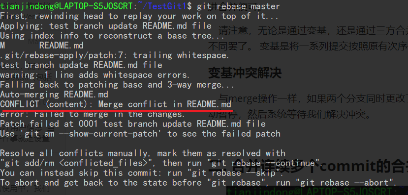
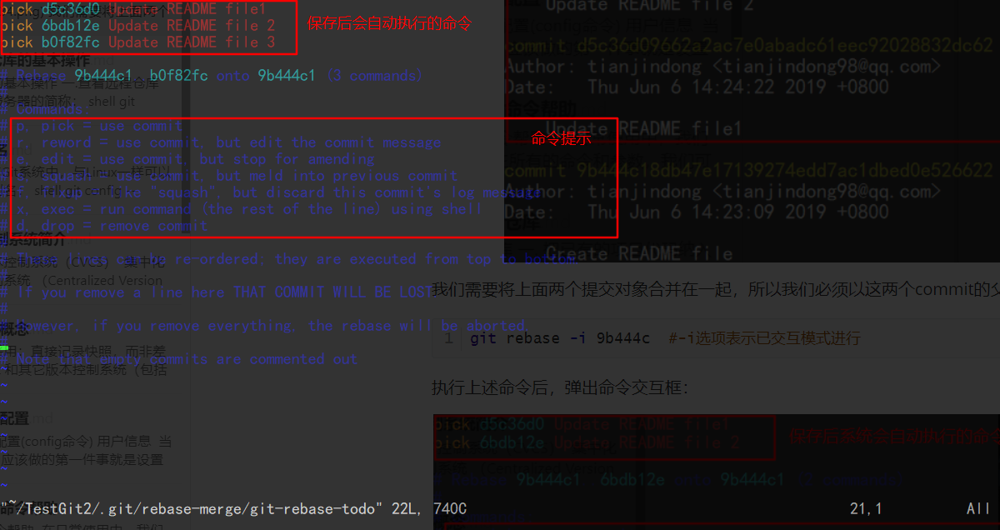
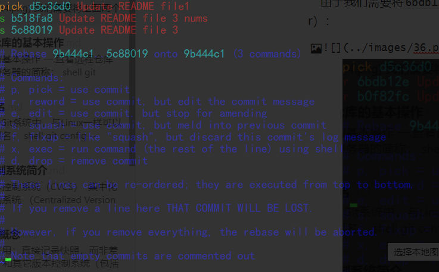

## 变基

### 一. 使用变基操作合并分支


​	在 Git 中整合来自不同分支的修改主要有两种方法：`merge` 以及 `rebase`。

​	在使用`merge`命令时，我们合并分支的效果是这样的：


​	其实，还有一种方法：你可以提取在 `C4` 中引入的补丁和修改，然后在 `C3` 的基础上应用一次。 在 Git 中，这种操作就叫做**变基**。 你可以使用 `rebase` 命令将提交到某一分支上的所有修改都移至另一分支上，就好像“重新播放”一样。

```shell
$ git checkout experiment
$ git rebase master #将test分支变基到master分支
First, rewinding head to replay your work on top of it...
Applying: added staged command
```


​	此时，`C4'` 指向的快照就和上面使用 `merge` 命令的例子中 `C5` 指向的快照一模一样了。 这两种整合方法的最终结果没有任何区别，但是变基使得提交历史更加整洁。 你在查看一个经过变基的分支的历史记录时会发现，尽管实际的开发工作是并行的，但它们看上去就像是串行的一样，提交历史是一条直线没有分叉。

​	一般我们这样做的目的是为了确保在向远程分支推送时能保持提交历史的整洁——例如向某个其他人维护的项目贡献代码时。 在这种情况下，你首先在自己的分支里进行开发，当开发完成时你需要先将你的代码变基到 `origin/master` 上，然后再向主项目提交修改。 这样的话，该项目的维护者就不再需要进行整合工作，只需要快进合并便可。

​	请注意，无论是通过变基，还是通过三方合并，整合的最终结果所指向的快照始终是一样的，只不过提交历史不同罢了。 变基是将一系列提交按照原有次序依次应用到另一分支上，而合并是把最终结果合在一起。

#### 变基冲突解决

​	与merge操作一样，如果两个分支同时更改了某个文件同一个地方，在变基时就会产生冲突，变基操作就会自动暂停，然后系统等待我们解决冲突。



​	与merge解决冲突的操作一样，我们需要重新编辑冲突文件，解决文件中的冲突，然后通过add命令将冲突文件重新放入暂存区，然后执行`git rebase --continue`即可。

#### 若我们无法解决变基冲突，我们就需要取消此次变基操作

```shell
git rebase --abort
```


### 二. 合并连续多个commit的合并


​	我们需要将上面两个提交对象合并到`d5c36d`这个commit对象中，所以`d5c36d`的父节点为基准进行变基操作：

```shell
git rebase -i 9b444c  #-i选项表示以交互模式进行
```

执行上述命令后，弹出命令交互框：我们需要在命令框中输入不同的命令从而达到不同的变基操作，但是第一个命令一定是像`pick`和`reword`这类有 `use commit`作用的命令:



​	由于我们需要将`6bdb12e`和`b0f82fc`合并到`d5c36d0`，所以我们后面两个命令要选用 `squash`命令（可以用简写 s），该命令用于压缩commit对象：



​	我们使用`wq`命令保存这个对话框后系统会自动执行这些命令，从而达到变基操作，执行完毕后系统会自动跳到另一个对话框，在这个对话框中我们可以修改合并后的commit的提交信息，通过`wq`保存后就完成了变基操作。


我们通过`log`命令查看合并后的效果：


### 三. 更改历史某个commit对象的提交信息

​	在[撤销操作](_16撤销操作.md)一文中我们提到了修改上一次的提交信息的操作，但是如果我们需要更改历史版本的提交信息，那么就不能使用`commit --amend`命令来实现这个功能了，我们就需要变基来实现这个功能了：

​	比如我们想要更改下图中`b8b5af`这个commit对象的提交信息：


```shell
git rebase -i 9b444c 
```

执行该命令后进入命令交互框：


​	**根据 reword的命令的提示信息可知，该命令会在变基操作时继续使用该对象，只改变该对象的提示信息。**

​	我们需要将`pick b8b5af2`改为`reword b8b5af2`:


​	保存后，系统执行这些命令，然后自动进入提交信息修改的框，我们修改完成后保存即可。

