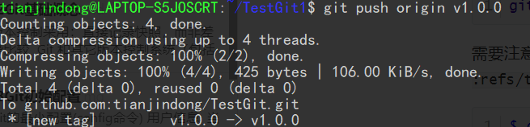

## Git标签

​	像其他版本控制系统（VCS）一样，Git 可以给历史中的某一个提交打上标签，以示重要。 比较有代表性的是人们会使用这个功能来标记发布结点（v1.0 等等）。 在本节中，你将会学习如何列出已有的标签、如何创建新标签、以及不同类型的标签分别是什么。

### 一. 查看标签

```shell
git tag
```


### 二. 标签分类

​	git标签分为两类：

- 轻量标签（lightweight）

  一个轻量标签很像一个不会改变的分支 - 它只是一个特定提交的引用。

- 附注标签（annotated）

  附注标签是存储在 Git 数据库中的一个完整对象。 它们是可以被校验的；其中包含打标签者的名字、电子邮件地址、日期时间；还有一个标签信息。

### 三. 创建附注标签

```shell
git tag -a <标签名> [commit的Hash值] -m '标签信息'
```

- a选项：表示创建附注标签
- m选项：表示添加一条将会存储在标签中的信息
- 如果省略commit Hash值就表示在当前commit上打标签，如果指定就在指定位置上打标签


### 四. 创建轻量标签

​	另一种给提交打标签的方式是使用轻量标签。 轻量标签本质上是将提交校验和存储到一个文件中 - 没有保存任何其他信息。 

```shell
git tag <标签名> [commit的hash值]
```


### 五. 查看标签信息与对应的提交信息

```shell
git show <标签名>
```

只有附注标签会显示标签信息，轻量标签只会显示提交信息。


### 六. 发布标签到远端

​	默认情况下，`git push` 命令并不会传送标签到远程仓库服务器上。 在创建完标签后你必须显式地推送标签到共享服务器上。 这个过程就像共享远程分支一样 - 你可以运行 `git push origin [tagname]`




​	如果想要一次性推送很多标签，也可以使用带有 `--tags` 选项的 `git push` 命令。 这将会把所有不在远程仓库服务器上的标签全部传送到那里。


### 七. 删除标签

```shell
git tag -d <标签名>
```

需要注意的是**上述命令并不会从任何远程仓库中移除这个标签**，你必须使用 `git push <remote> :refs/tags/<tagname>` 来更新你的远程仓库：

```shell
$ git push origin :refs/tags/v1.4-lw
To /git@github.com:schacon/simplegit.git
 - [deleted]         v1.4-lw
```

