# CentOS7搭建GitLab

## 一. 安装依赖

首先要在CentOS系统上面安装所需的依赖：ssh、防火墙、postfix(用于邮件通知)、wegt，以下这些命令也会打开系统防火墙中的HTTP和SSH端口访问。

### 1. 安装SSH协议

执行下列命令：

```shell
sudo yum install -y curl policycoreutils-python openssh-server
```

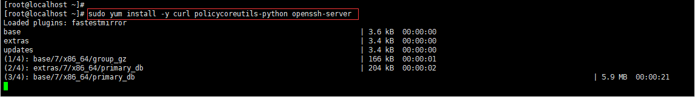

出现如下图所示的界面表示安装成功：

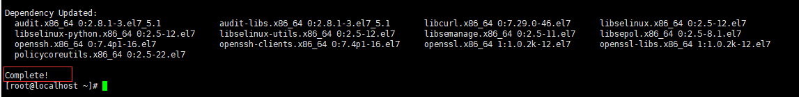

### 2. 设置SSH服务开机自启动

```shell
sudo systemctl enable sshd
```


### 3. 启动SSH服务

```shell
sudo systemctl start sshd
```


### 4. 安装防火墙

```shell
yum install firewalld systemd -y
```

出现如下图所示的界面表示安装成功：

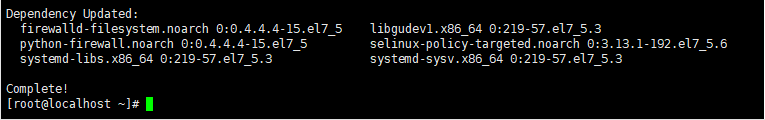

### 5. 开启防火墙

```shell
service firewalld  start
```

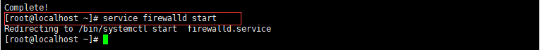

### 6. 添加HTTP服务到firewalld

```shell
sudo firewall-cmd --permanent --add-service=http
```

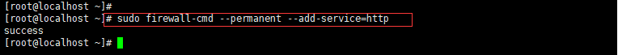

其中，pemmanent表示永久生效，若不加--permanent系统下次启动后就会失效。

### 7. 重启防火墙

```shell
sudo systemctl reload firewalld
```


### 8. 安装Postfix以发送邮件

```shell
sudo yum install postfix
```

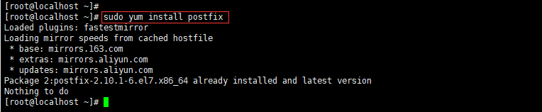

### 9. 将postfix服务设置成开机自启动

```shell
sudo systemctl enable postfix
```


### 10. 启动postfix

```shell
sudo systemctl start postfix
```


### 11. 安装wget，用于从外网上下载插件

```shell
sudo  yum -y install wget
```

出现如下的界面表示安装成功：

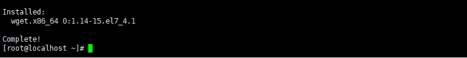

### 12. 安装VIM

```shell
sudo yum install vim -y
```

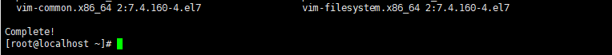


## 二.添加GitLab镜像源并安装GitLab服务

### 1. 添加GitLab镜像

```shell
wget https://mirrors.tuna.tsinghua.edu.cn/gitlab-ce/yum/el7/gitlab-ce-10.5.7-ce.0.el7.x86_64.rpm
```

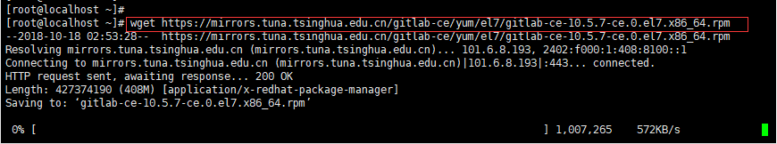

出现下图所示的界面表示已经下载完成，然后就可以安装Gitlab了：

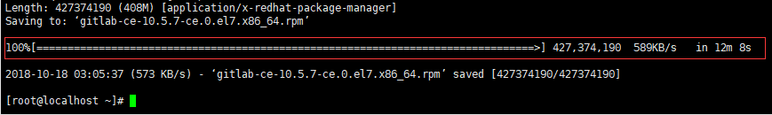

### 2. 安装Gitlab

```shell
rpm -i gitlab-ce-10.5.7-ce.0.el7.x86_64.rpm
```

安装过程会需要一些时间，如果出现下图所示的界面，则表示Gitlab安装成功：

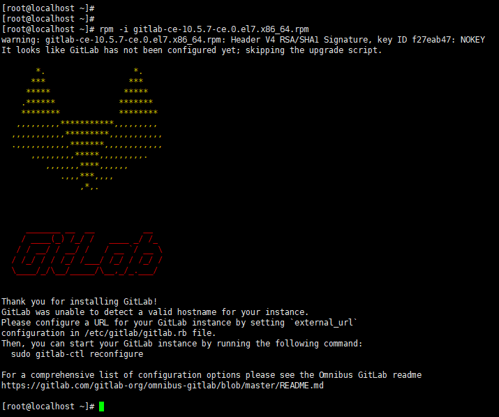

### 3. 修改gitlab配置文件指定服务器ip和自定义端口：

```shell
vim  /etc/gitlab/gitlab.rb
```

然后进入编辑器，这是输入小写的“i”进入编辑模式：

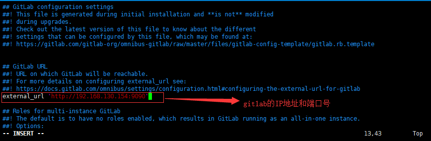

按Esc键退出编辑模式，然后输入命令“:wq”保存并退出。

### 4. 将9090端口添加到防火墙中

```shell
firewall-cmd --zone=public --add-port=9090/tcp --permanent 
```

### 5. 重启防火墙

```shell
sudo systemctl reload firewalld
```

### 6. 重置gitlab

```shell
gitlab-ctl reconfigure
```

重置过程会需要一段时间：

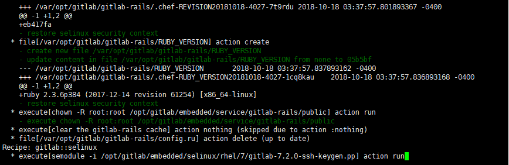

### 7. 启动GitLab

```shell
gitlab-ctl restart
```

出现如下界面表示启动成功：

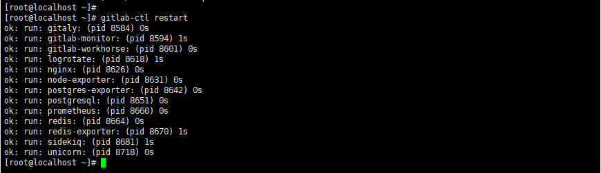

### 8. 访问Gitlab页面

如果没有设置域名，在浏览器里面直接输入服务器IP和指定的端口号就可以进行访问，第一次登陆的时候会默认进入修改密码界面：

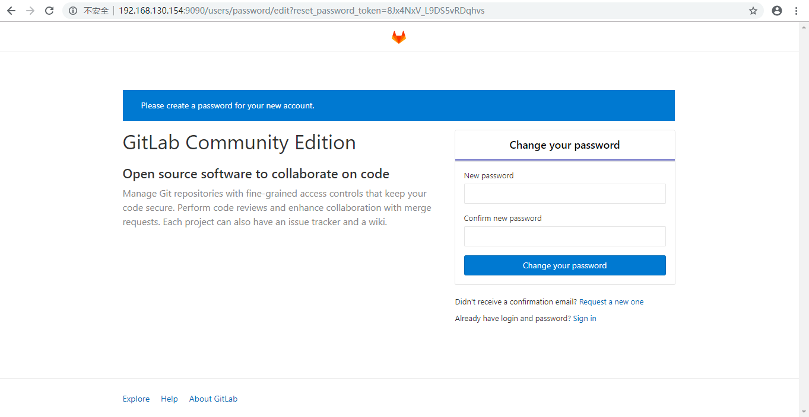

本文转载至：<https://www.cnblogs.com/dotnet261010/p/9811161.html>