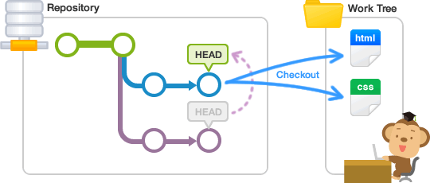
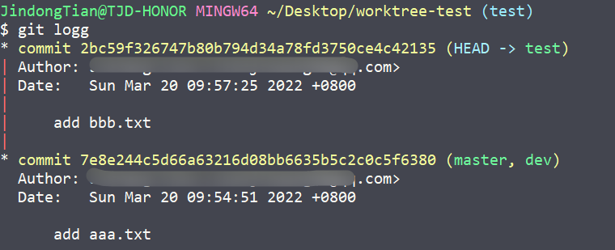

# Git worktree

## 一. 背景

在工作中大家应会碰到需要频繁在两个分支中切换工作的情况，我们通常做法是利用`git stash`命令暂存当前工作区中的变更，然后`git checkout`到目标分支中工作，工作完成后回到刚刚分支使用`git stash pop`命令还原历史工作区变动。

整体流程大致如下：

```shell
# 当前工作分支，存在变更
$ worktree-test (dev1) git status
On branch test
Changes not staged for commit:
  (use "git add <file>..." to update what will be committed)
  (use "git checkout -- <file>..." to discard changes in working directory)

        modified:   bbb.txt

no changes added to commit (use "git add" and/or "git commit -a")

# 暂存变更
$ worktree-test (dev1) git stash
Saved working directory and index state WIP on test: 2bc59f3 add bbb.txt

# 切换分支
$ worktree-test (dev1) git checkout dev2

#........在dev2上进行代码修改并提交

# 切换回原先的dev1分支
$ worktree-test (dev2) git checkout dev1

# 还原工作区变更，继续开发
$ worktree-test (dev1) git stash pop
On branch test
Changes not staged for commit:
  (use "git add <file>..." to update what will be committed)
  (use "git checkout -- <file>..." to discard changes in working directory)

        modified:   bbb.txt

no changes added to commit (use "git add" and/or "git commit -a")
Dropped refs/stash@{0} (3890bfc0568be86c8ba2a26c7138966bf8776e5c)
```

上述流程如果在我们需要反复多次在两个分支间切换工作的时候会很不方便，因为你每一次`checkout`都会使得IDEA重建索引，如果在项目比较大的情况下会非常耗时。

此时有很多小伙伴可能会选择重新`clone`一份代码下来，在两个本地仓库中并行开发，这么做固然可以解决问题，但是Git官方给出了更优雅的解决方案，那就是`git worktree`。

## 二. 什么是worktree

Git worktree严格意义上说已经不是一个新的功能了，它推出也已经好几年了，是在2015年7月发布的2.5版引入的。worktree是链接到统一仓库的多个工作区（目录，树）。一个git仓库可以支持多个工作树，分别对应不同的分支。我们在git中通过`git init`或`git clone`创建一个（主）工作区（树）（main working tree）。

同理，我们使用 `git worktree` 创建一个（和工作区）不同目录的工作区（树），我们称之为为"链接工作区（树）（linked working tree）"。git仓库有一个主工作树（裸库）和零个或多个链接工作树。与重建的孤立的目录不同，链接工作树和主仓库直接就行分支一样是有机关联的，任何一个链接工作树的变更提交都在仓库内部。链接工作树用完后，可以直接通过git worktree remove删除。



## 三. 基本使用



我们当前工作区处在`test`分支上，假设我们需要在`test`和`dev`两个分支间来回切换，此时我们可以创建一个`worktree`并行去开发：

```shell
$ worktree-test (test) git worktree add ../worktree-test-dev dev
Preparing worktree (checking out 'dev')
HEAD is now at 7e8e244 add aaa.txt
```

此时Git就会在我们指定的目录（`../worktree-test-dev`）中创建一个新的worktree，


这样我们就能将`worktree-test-dev`这个文件夹导入IDEA，这样就能在不切换分支的情况下，在两个分支下并行开发，这样就能节约频繁分支切换导致的效率问题。

不同的worktree之间共用同一个 `commit` 树，这样我们在 `worktree-test-dev` 文件夹做变更并提交后，commit信息也会在别的 `worktree` 的commit tree中看到。

当我们在临时创建的 `worktree` 中完成工作后，我们可以通过 `git worktree remove` 删除这个 `worktree`：

```shell
# 查看当前有哪些worktree
$ worktree-test (test) git worktree list
C:/Users/JindongTian/Desktop/worktree-test      2bc59f3 [test]
C:/Users/JindongTian/Desktop/worktree-test-dev  7e8e244 [dev]

# 删除临时创建的 worktree-test-dev worktree
$ worktree-test (test) git worktree remove ../worktree-test-dev/
```

执行完成后，我们就能发现`worktree-test-dev`文件夹被删除，而刚刚在`worktree-test-dev`的提交，仍然保留在 commit 树中。

## 四. 常用命令

### 4.1 新建worktree

```shell
git worktree add <新路径> <分支/commit ID>
```

需要注意的是，使用 git worktree 创建的多个目录，不能有任何两个目录在同一个分支下，这样是防止两个文件夹在相同的分支下做不同的修改。所以我们在创建`worktree`时，`<分支>`一定是不能是当前分支。如果我们想基于当前分支创建一个新分支，并创建基于新分支的`worktree`可以这样做：

```shell
git worktree add -b <新分支名> <新路径> <分支/commit ID>
```

### 4.2 查看 worktree 列表

```shell
git worktree list
```

### 4.3 删除 worktree 

```shell
git worktree remove <路径>
```

需要注意的是：

1. 该命令只能删除干净的工作树（没有未跟踪的文件，也没有对已跟踪文件进行修改但未提交的情况称为干净的工作树）。不干净的工作树或带有子模块的树需要使用--force删除。

2. 主工作树无法删除。

### 4.4 清理worktree的配置信息

```shell
git worktree prune
```

清理worktree的配置信息 `$GIT_DIR/worktrees`。例如手动删除了一个worktree的文件夹但是没有执行`git worktree remove`，git并不能识别出已经删除了。此时就可以使用`git worktree prune`手动更新项目的woktree配置。

### 4.5 移动 worktree 目录

```shell
git worktree move <原路径> <新路径>
```

将working tree目录移动到新位置。主目录和带有子模块(submodules)的目录不可以移动。