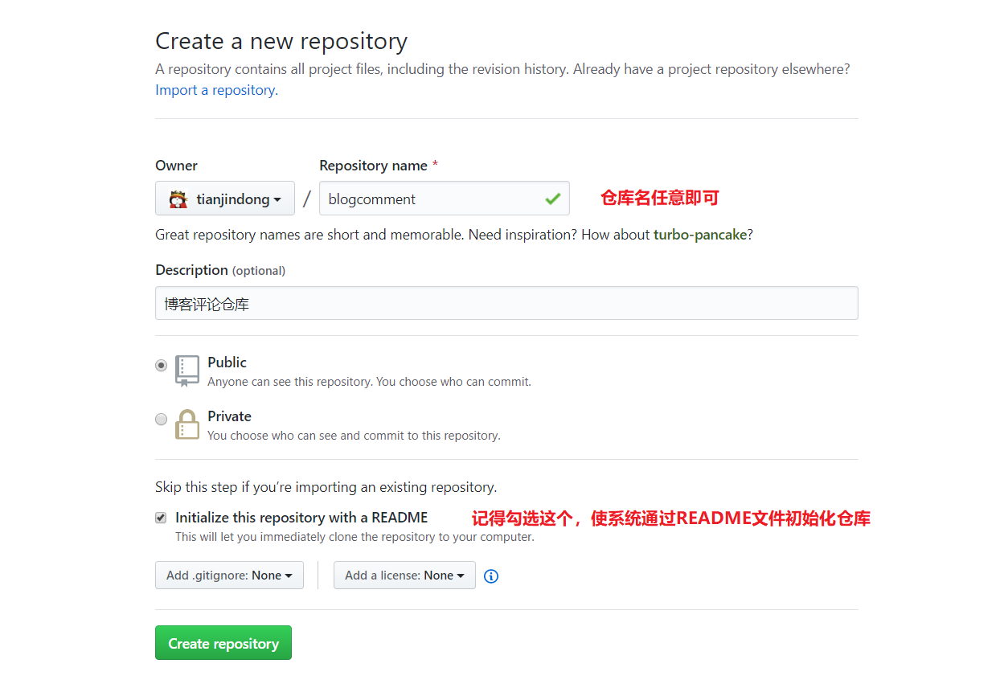
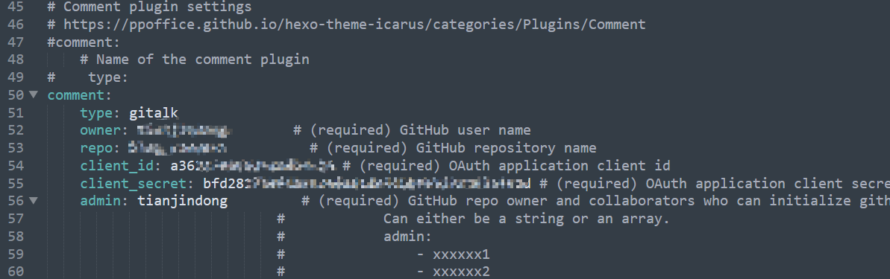

# Icarus主题评论插件配置详解

​	作为一个博客系统，完善文章的评论功能是必不可少的，而由于Hexo博客是静态博客，所以就需要借助第三方的评论系统。博主在这里介绍一个美观且好用的评论系统：[Gitalk](https://gitalk.github.io/)

​	Gitalk 是一个基于 GitHub Issue 和 Preact 开发的评论插件。它只能使用Github登录，由于博客大多面向技术人员，所以这一缺点还是可以接受的，下面我们就来讲解在Icarus主题上配置Gitalk插件的步骤：

## 第一步：进入Github创建一个新仓库



注意检查该仓库的Issue功能是否开启：


## 第二步：创建OAuth应用程序


注册成后进入如下页面：


## 第三步：配置~/themes/icarus/_config.yml文件



```yml
comment:
    type: gitalk
    owner: zhangsan        # 必须填写，填写Github用户名
    repo: blogcomment     # 必须填写，填写Github存放评论的仓库名     
    client_id: a362xxxxxxxxxc24  #必须填写，填写创建OAuth应用程序得到的Client ID
    client_secret: bfd2817xxxxxxxxxxxxxxxxxxxxx4f2d  #必须填写，填写创建OAuth应用程序得到的Client Secret
    admin: zhangsan       #必须填写，这里填写Github用户名即可
```

具体配置参见：[Icarus文档](https://blog.zhangruipeng.me/hexo-theme-icarus/Plugins/Comment/gitalk-comment-plugin/)


## 第四步：发布博客，查看效果

执行下列命令发布博客，然后进入首页即可查看效果：

```shell
$ hexo g -d
```

