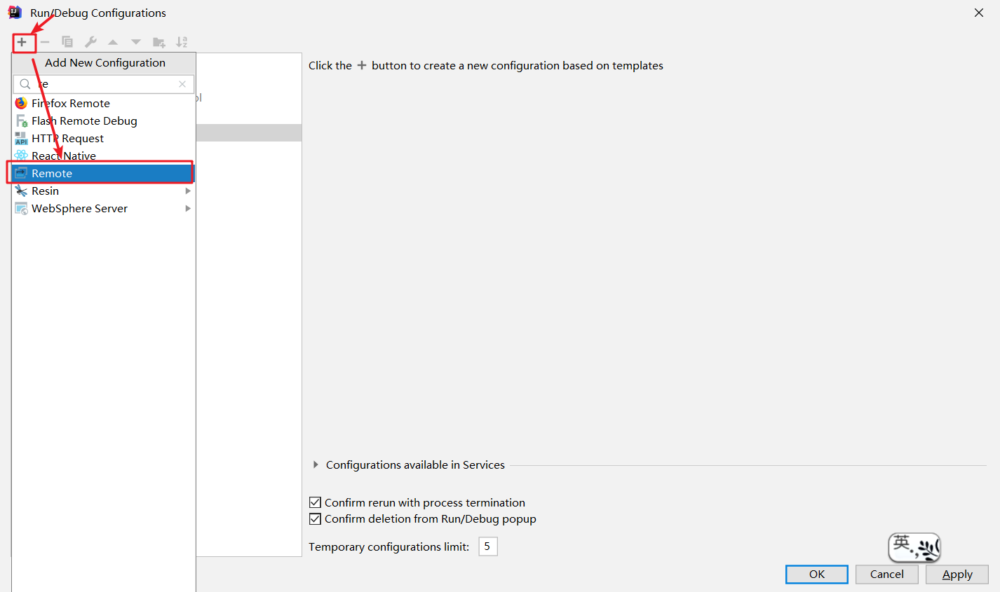
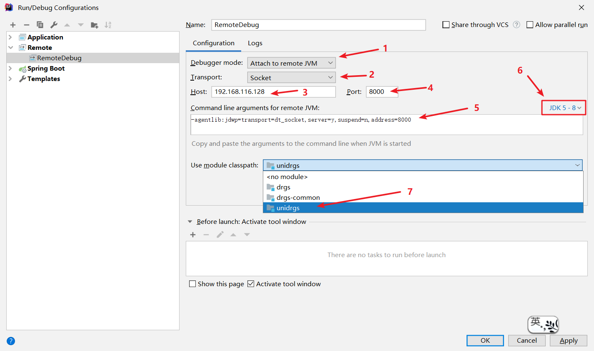
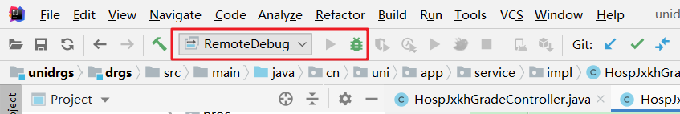

# IDEA远程Debug

## 第一步：配置`remote`：


如上图所示，点击`Edit Configurations`，进入如下界面：



如上图所示，我们进入了`Run/Debug Configurations`界面，然后点击左上角的`+`，选择`Remote`：



- **标注一**：调试模式，默认为`Attach`：
  - `Attach`：此种模式下，远程服务端启动一个端口等待我们去连接；
  - `Listen`：此种模式下，是我们去监听一个端口，当调试服务端准备好了，就会进行连接。

- **标注二**：传输方式，默认为Socket：
  - `Socket`：MacOS及Linux系统使用此种传输方式。
  - `Shared memory`： Windows 系统使用此种传输方式。
- **标注三**：远程服务器IP。
- **标注四**：服务器提供Socket连接的端口号，默认为5005。
- **标识五**：运行远程 JVM 的命令行参数。
- **标识六**：远程服务器的JDK版本，标识五的命令行参数根据JDK版本会有不同。
- **标识七**：搜索资源是使用的环境变量。


## 第二步：配置Tomcat

选好`标志六`中的JDK版本后，复制`标志五`中的JVM参数：

### Linux版本Tomcat

编辑`bin`目录下的`catalina.sh`文件，在第一行添加下列语句即可：

```shell
export JAVA_OPTS='-agentlib:jdwp=transport=dt_socket,server=y,suspend=n,address=8000'
```


### Windows版本Tomcat

编辑`bin`目录下的`catalina.bat`文件，在第一行添加下列语句即可：

```shell
set JAVA_OPTS=-agentlib:jdwp=transport=dt_socket,server=y,suspend=n,address=8000
```

Linux和Windows两者的区别在于导入语句的关键字不同以及有无引号，Linux 系统的导入关键字为`export`，Windows 为`set`；Linux 的导入值需要用单引号`''`括起来，而 Windows 则不用。

至此，远程Debug配置就完成了，我们只需要运行`startup.sh`或`startup.bat`启动服务器即可，然后在IDEA中点击刚刚配置的`remote`即可：



如果连接成功，控制台会打印会有以下提示：

