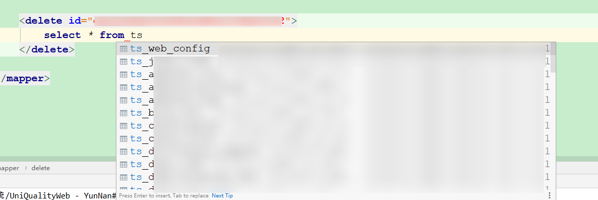
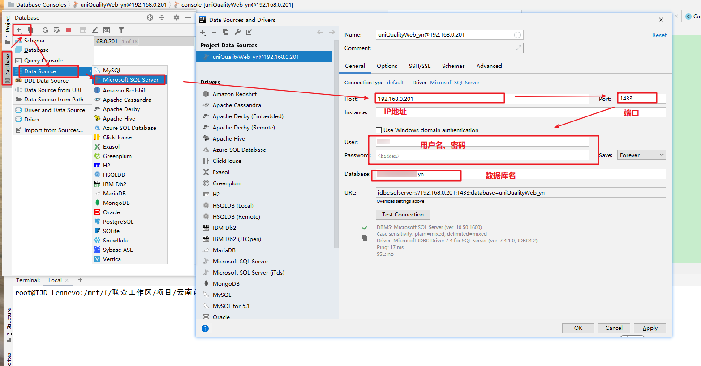
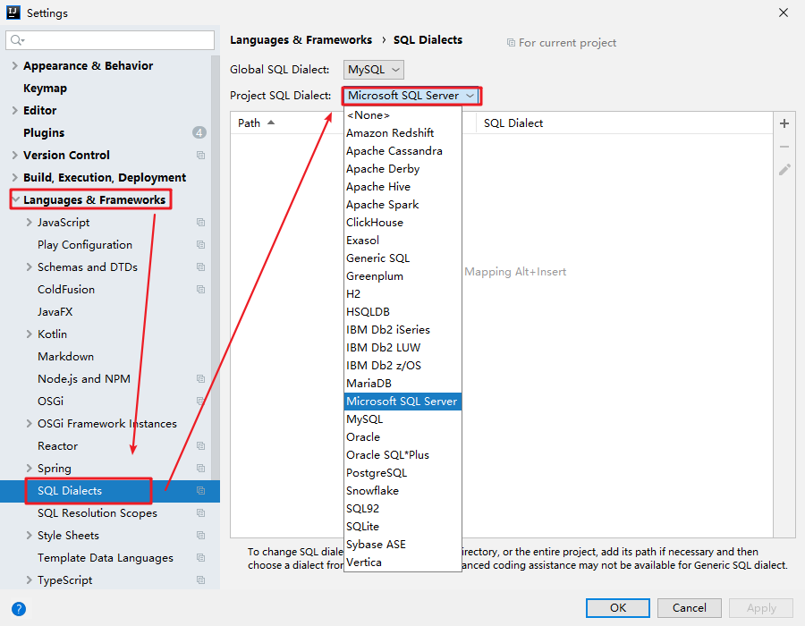

# 开启SQL智能提醒

在默认情况下，IDEA在编写MyBatis项目的SQL语句是没有表名和列名的提示的，但是我们经过配置可以达到智能提醒的效果：

## 第一步：配置数据库

双击shift打开全局搜索框，搜索Database：

配置当前项目所依赖的数据库，最好指定数据库名称：

## 第二步：配置方言

如果你的项目所依赖的数据库是MySQL，或许你已经出现SQL提醒功能了，如果还是没有就需要设置当前项目的SQL方言：

File->Settings：

