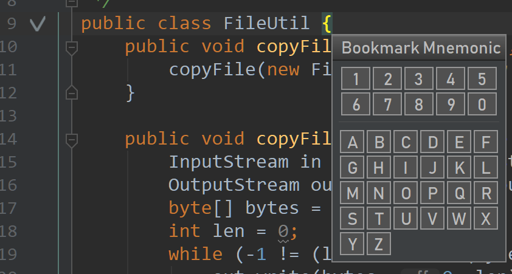
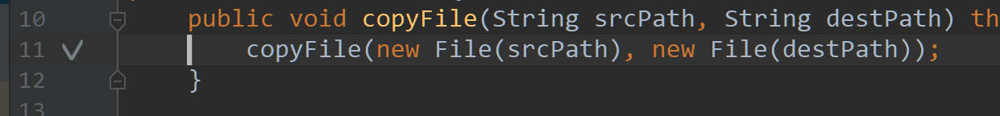
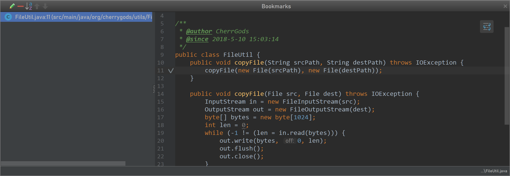

# 使用BookMark对代码进行标记方便阅读源码

> 说明：本文转载自：<https://blog.csdn.net/qq_36376059/article/details/80277767>

今天用idea的时候，无意中发现了了一个小功能，叫做BookMark：

然后去查阅了一下文档，主要功能也就是可以清晰的看到自己标的书签附近的代码，比如我们在第11行**按一下Ctrl+Shift+F11插入一个书签**，就会有一个小钩子。

我们可以按**Shift+F11**就可以直接看到11行附近的代码:

如果有多个书签，在打开这个书签管理的时候，可以完全使用键盘进行控制：按上下键进行选择,Enter键跳转到所选的书签那，Esc关闭窗口，Alt+上/下可以在这个列表将某个书签以Y轴移动。

我们还可以使用以（**助记符**）数字作为书签，在所在行按快捷键**Ctrl+Shift+任意数字**，就可以插入一个标签了，要将光标跳转到某个书签，只需要**Ctrl+对应的标签数字**。实在是很方便。

