# IDEA查看UML图

> 说明本文转载至：https://www.toutiao.com/i6589439160472306189/

## 一. 检查UML类图插件是否开启

idea默认已经集成了该功能，只是默认没打开，我们要手动打开它，参考下图：

File——Settings——Plugins——UML Support：

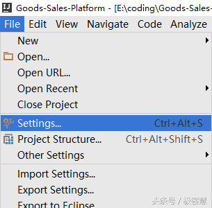

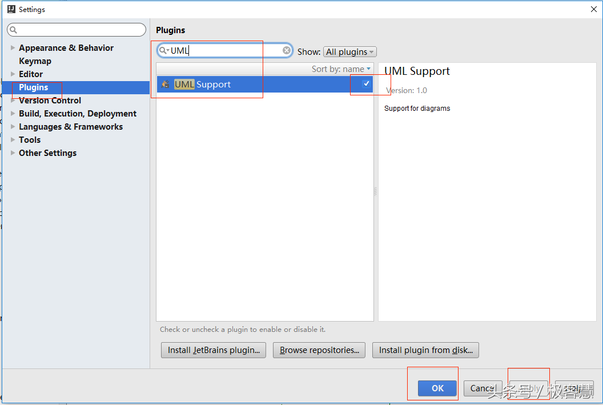

确认UML 这个勾已经勾上了，然后点击Apply，重启idea，然后您就可以使用该功能了，当然你可以自己个爽，但推荐你继续往下看，你会更爽

## 二. 详细使用

**你有以下方式来使用UML类图：**

1）在类的内部，点击右键，选择 Diagrams——Show Diagram

2）在左侧栏中选择某一个类，点击右键，选择 Diagrams——Show Diagram

3）你甚至可以选择一个包，再点击右键，选择 Diagrams——Show Diagram（接下来的演示，我们就是通过选择一个包）

注释：show 和 show ... Popup的区别，只是前者新建在标签页内，后者以浮窗的形式展示：

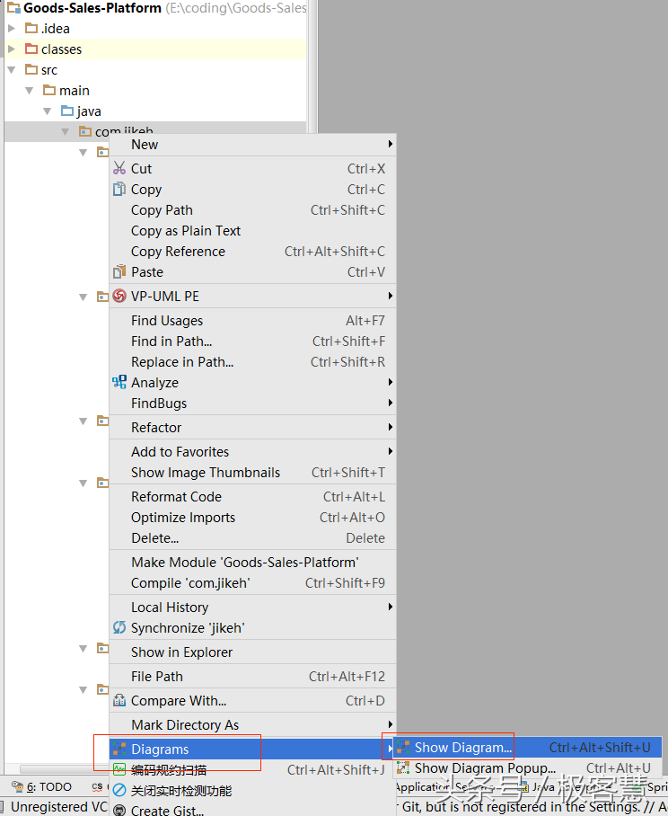

结果图：

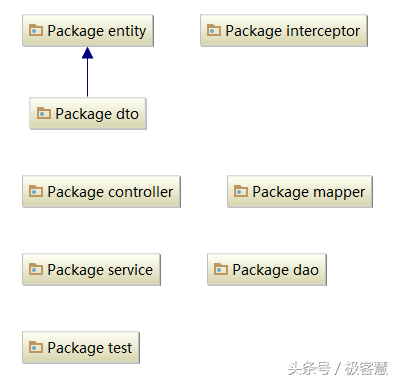

### 2.1 依次展开各个包下的所有节点

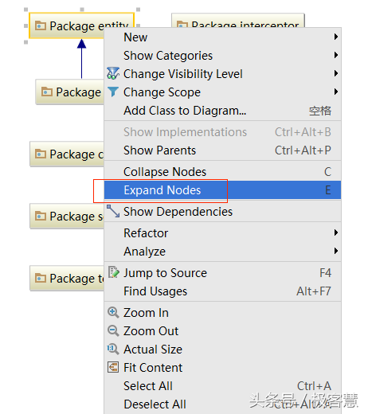

结果图：

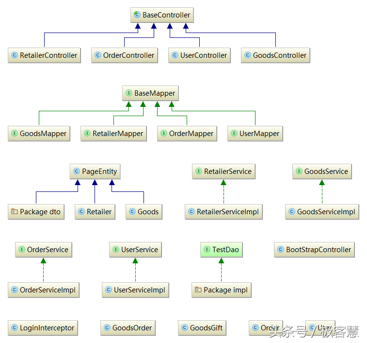

### 2.2 查看类的依赖关系

右键——选择Show Dependencies

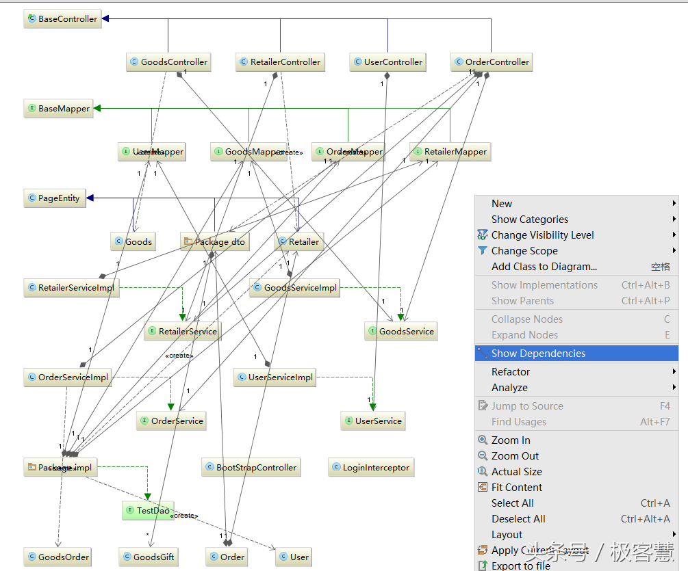

此时，你发现界面很乱，线的关系也很乱，此时你可以综合使用**调整布局**的相关命令了

### 2.3 去掉不关心的类

通过第3步，你发现类太多了，图形太大了我们根本理不清了，此时，我们可以手动删除我们不关心的类

点击选择你想要删除的类，然后直接使用键盘上的delete键就行了。

### 2.4 查看类的详细信息

右键——Show Categories：可以选择Fields、Constructors、Methods、Properties

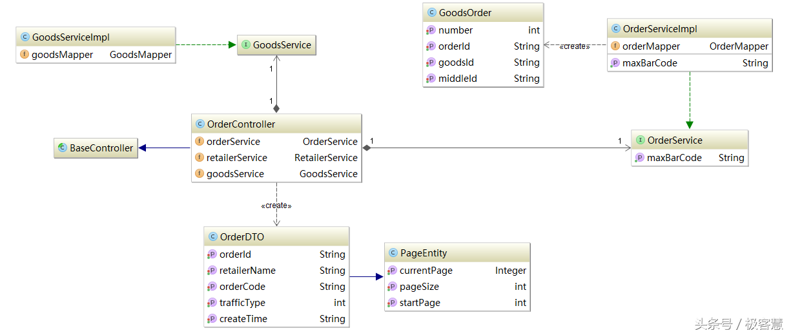

有人说，诶，这怎么够呢，那继承下来的那些方法我也想看啊？简单，IDEA通通满足你。

什么，方法里你还想筛选，比如说想看protected权限及以上范围的？简单，右键选择 Change Visibility Level，根据需要调整即可。

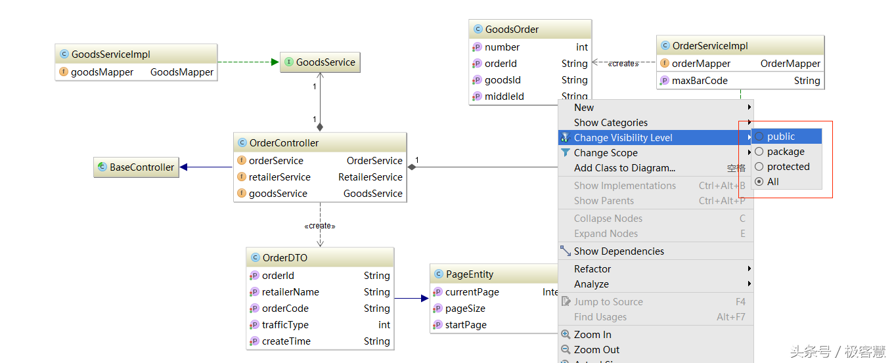

### 2.5 手动加入其它类

在页面点击右键，选择 Add Class to Diagram或者直接按下空格，然后输入你想加入的类就可以了：

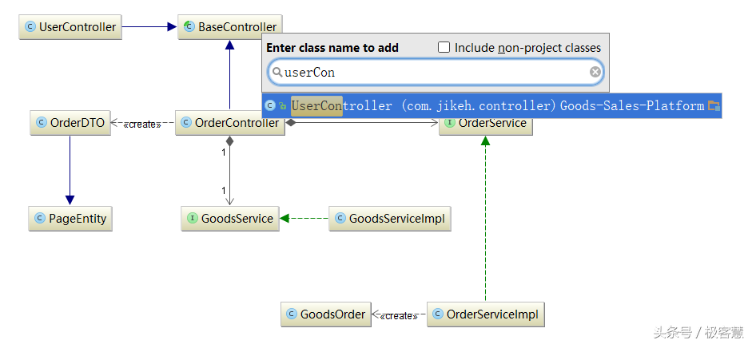

### 2.6 查看类的实现/继承/父类

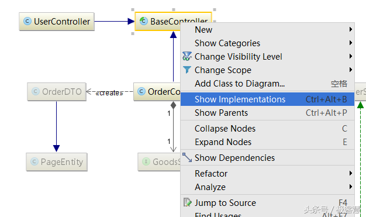