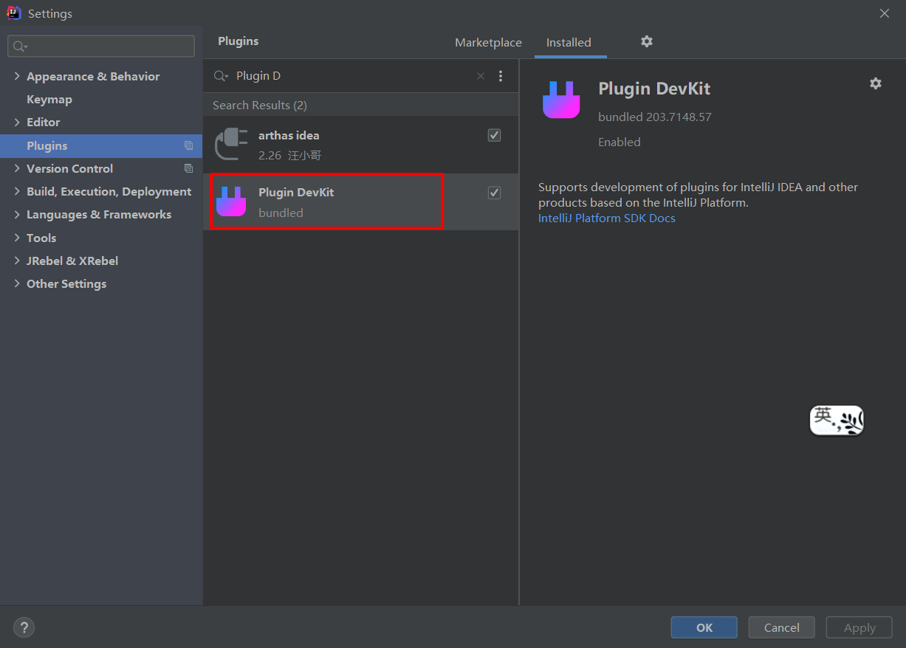
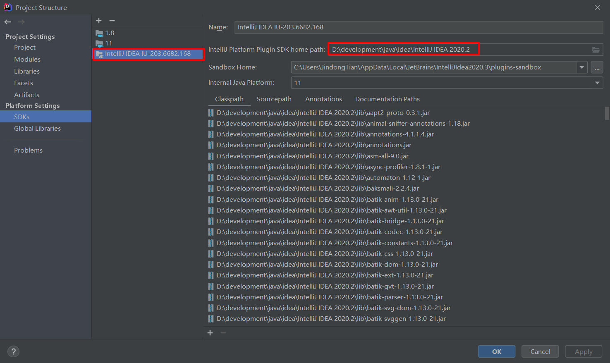
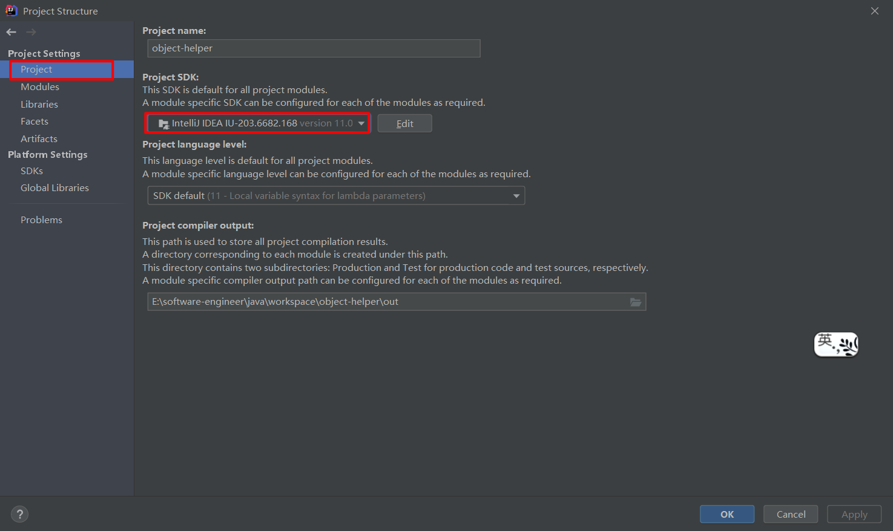
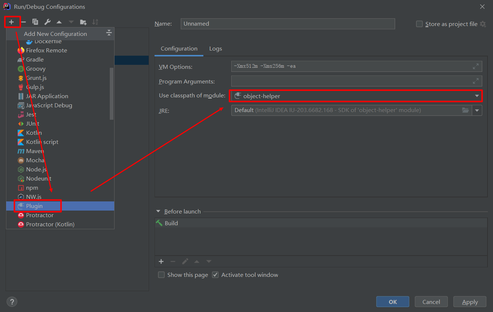

# IDEA导入插件项目

当我们导入一个Plugin工程到Intellij的时候，run 按钮可能是灰色的，这时候工程运行不起来，解决方法也很简单：

- 首先，先检查你的Intellij有没有安装Plugin的支持插件（Plugin Devkit）没有的话，安装上：

  

- 在工程的直接目录下找到.iml文件，文件内容如下：

  ```xml
  <?xml version="1.0" encoding="UTF-8"?>
  <module type="PLUGIN_MODULE" version="4">
    <component name="NewModuleRootManager" inherit-compiler-output="true">
      <exclude-output />
      <content url="file://$MODULE_DIR$">
        <sourceFolder url="file://$MODULE_DIR$/src" isTestSource="false" />
      </content>
      <orderEntry type="inheritedJdk" />
      <orderEntry type="sourceFolder" forTests="false" />
    </component>
  </module>1234567891011
  ```

  上面的`<module type="PLUGIN_MODULE" version="4">`
  项目不能运行的原因可能是 : type 不是 “PLUGIN_MODULE”,所以将其修改为PLUGIN_MODULE。

- 之后，如果还是不能运行的话，可能就是你还没指定SDK，进入Project Structure，在SDKs中添加Intellij SDK（一般都是Intellij的安装目录），如下图：

  

- 然后在Project中把Project SDK切换为刚才设置Intellij SDK ，如下图：

  

- 然后，如果还是不能运行，可以在Edit Configuration里面配置一下：

  点击“+”，然后选择 Plugin（当前列表可能隐藏了几个选项，点击 more 查看即可），配置如下：

  