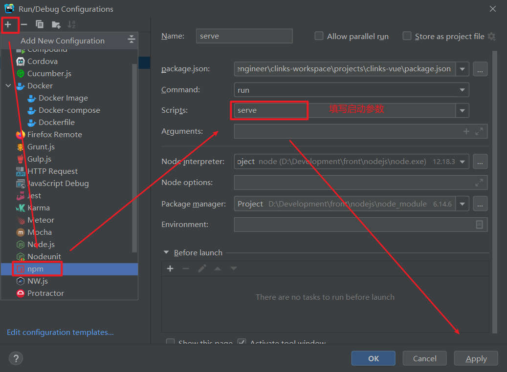
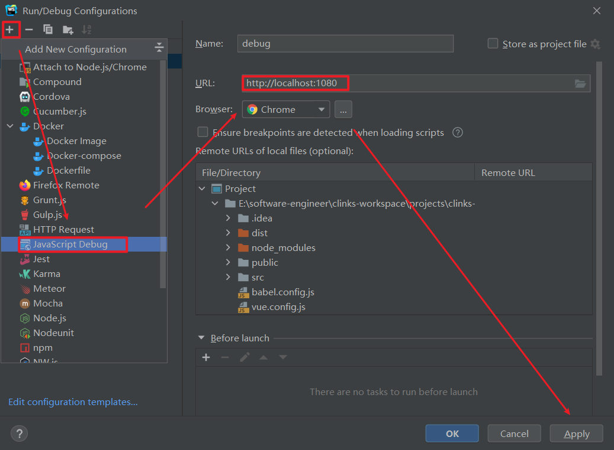
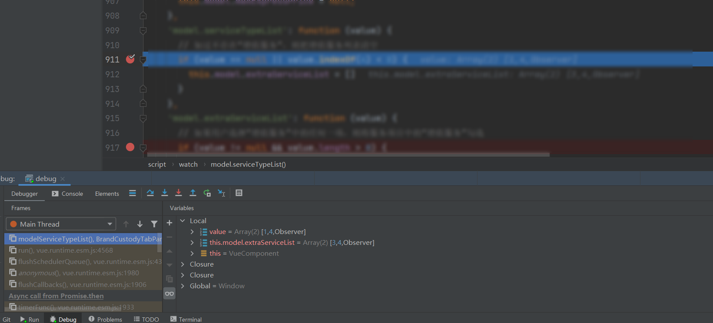
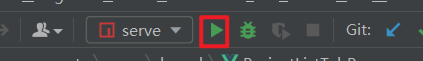

# WebStorm中Vue源码Debug

在WebStorm中启动调试时，WebStorm会根据你设置的url，自动打开新的Chrome浏览器进程访问这个设置的url，而且这个浏览器页面和你平常看到的浏览器差异会比较大，看不到书签栏，也看不到你先前所装的所有插件。这是因为平常我们打开Chrome浏览器进程时，并不会添加–remote-debugging-port选项，而WebStorm无法让已经打开的Chrome实例支持调试，所以必须重新打开一个新的Chrome浏览器进程，而且不能和原来的Chrome浏览器进程使用相同的用户数据文件夹，所以它会使用一个临时的文件夹，因此当它开始调试时看到的Chrome没有任何标签，也没有任何安装的插件。我们可以在这个浏览器上登录我们的google账号，然后将所有数据同步过来，这样下次调试时所有的书签和安装的应用也就都会存在了。我们也就可以将原来浏览器的数据导出到新的文件夹，然后在WebStorm中设置Chrome的用户数据文件夹为这个新的文件夹，这样也能将所有的书签和安装的应用导过来。

另外一个 **注意点** :

Web项目的调试和我们平常调试Java项目并不同，因为我们开发Vue项目时，使用webpack-dev-server，也就是说不是WebStorm自带的Server，此时需要先启动Server(可以使用命令行 npm run serve，也可以通过在ide的Npm Script管理器中启动Server)，然后才能启动调试器。 平常我们调试Java项目或者安卓项目时都是一键启动的，而调试Web项目是需要两步的，当然我们可以在配置JavaScript Debug时，添加前置步骤来简化操作步骤

## 第一步：配置基础启动

这样我们只需要点击上面启动按钮就可以把Vue项目启动起来了。

## 第二步：配置Debug

这样我们只需要先启动基础服务器，然后在将Js Debug启动起来，会弹出浏览器，在弹出的浏览器上操作就会进入断点。

需要注意的是，vue的基础服务器启动使用即可，而JsDebug需要使用`Debug`启动才能够在操作时进入断点。

> 参考文章：
>
> [WebStorm+Chrome调试Vue步骤 - 以德为先 - 博客园 (cnblogs.com)](https://www.cnblogs.com/li150dan/p/10451824.html)
>
> [使用WebStorm/IDEA开发调试Vue/Webpack工程项目 - 简书 (jianshu.com)](https://www.jianshu.com/p/3f7504558f0d)