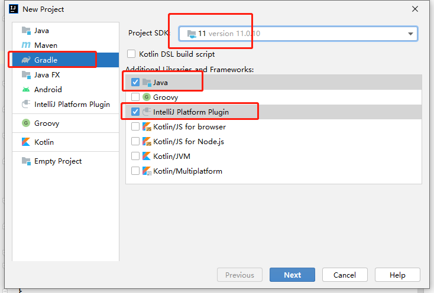
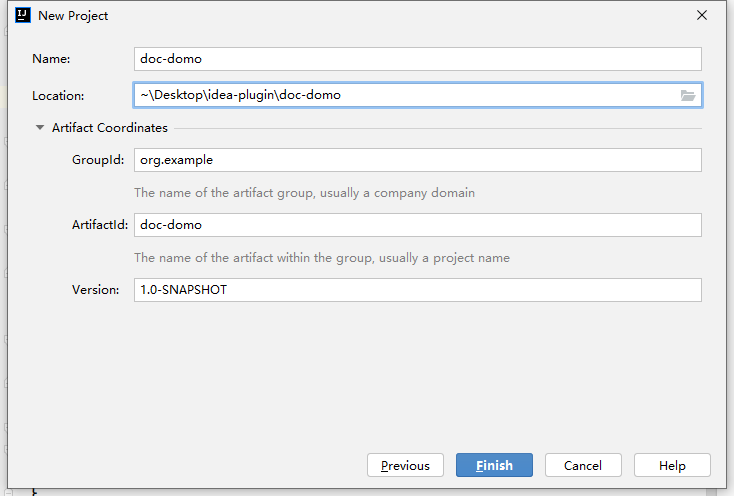
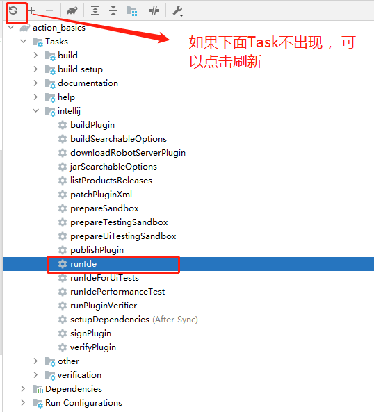
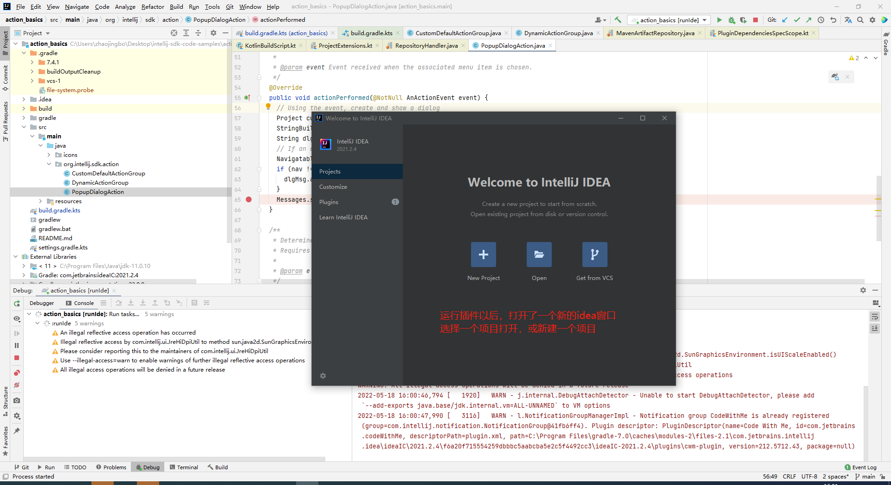
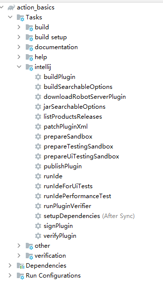
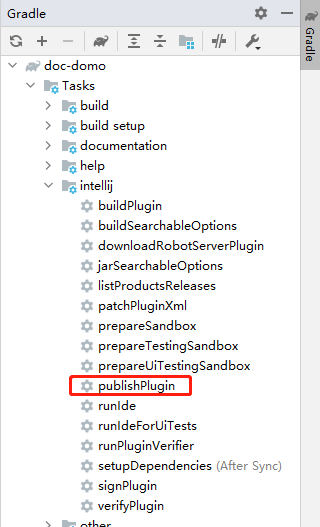
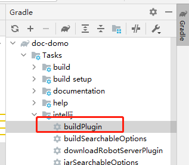
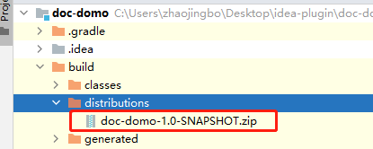

# IDEA插件开发-Gradle工程项目

## 一. 创建Gradle工程项目

使用 [Gradle向导](https://www.jetbrains.com/help/idea/gradle.html#project_create_gradle) 创建插件开发项目, File -> New -> Project



配置name、artifact



### 1.1 项目目录结构

```text
doc-demo
├── build.gradle   //gradle配置文件，详解看下面
├── gradle
│   └── wrapper
│       ├── gradle-wrapper.jar
│       └── gradle-wrapper.properties
├── gradlew
├── gradlew.bat
├── settings.gradle  //项目名称
└── src
├── main
│   ├── java
│   └── resources
│       └── META-INF  
│           └── plugin.xml
└── test
├── java
└── resources
```

META-INF目录下是插件的[配置文件](https://www.ideaplugin.com/idea-docs/Part I 插件/PluginStructure/Plugin Configuration File.html)

```java
plugins {
    id 'java'  //gradle-java插件
    id 'org.jetbrains.intellij' version '1.3.0' //gradle-intellij-plugin 插件  https://github.com/JetBrains/gradle-intellij-plugin/blob/master/README.md
}

group 'org.example'
version '1.0-SNAPSHOT'

repositories {
    mavenCentral()
}

dependencies {
    testImplementation 'org.junit.jupiter:junit-jupiter-api:5.7.0'
    testRuntimeOnly 'org.junit.jupiter:junit-jupiter-engine:5.7.0'
}

// See https://github.com/JetBrains/gradle-intellij-plugin/
intellij {
    version '2021.1'   //编辑此插件的 idea版本
}
patchPluginXml {    //覆盖META-INF/plugin.xml 中的插件描述，可以删掉
    changeNotes """
      Add change notes here.<br>
      <em>most HTML tags may be used</em>"""
}
test {
    useJUnitPlatform()
}
```

### 1.2 运行插件

1. 创建一个操作，具体可 [参考文档](https://www.ideaplugin.com/idea-docs/Part II — Base Platform/Actions/Creating Actions.html)，也可以直接从[仓库地址](https://github.com/JetBrains/intellij-sdk-code-samples/tree/main/action_basics) 下载该代码
2. 运行插件，见下图，插件运行以后，将会打开一个新的idea , 在新的idea里新建或者打开一个项目





## 二. 配置Gradle项目

### 2.1 gradle-intellij-plugin插件

Gradle plugin 的源码是[gradle-intellij-plugin](https://github.com/JetBrains/gradle-intellij-plugin) ，插件提供了Gradle的task

Gradle plugin的配置文件是 build.gradle.kts 或者 build.gradle



Gradle plugin 的属性基本上都有默认值，满足基本需求

查看task详情，可以参考[README](https://github.com/JetBrains/gradle-intellij-plugin/blob/master/README.md)，需要注意以下几点：

- 插件的[最新版本](https://github.com/JetBrains/gradle-intellij-plugin#the-latest-version) ，建议更新该插件到最新版本
- 必需的Gradle版本
- Gradle task ，本文档主要介绍下面几个：
  - 设置环境和依赖的 [Setup DSL](https://github.com/JetBrains/gradle-intellij-plugin#setup-dsl)
  - 继承了gradle命令，运行插件 [Running DSL](https://github.com/JetBrains/gradle-intellij-plugin#running-dsl)
  - 修改 plugin.xml(src/main/resources/META-INF/plugin.xml) 中的一些属性 [patching-dsl](https://github.com/JetBrains/gradle-intellij-plugin#patching-dsl)
  - 发布插件到 [jetbrains插件市场](https://plugins.jetbrains.com/) [publishing-dsl](https://github.com/JetBrains/gradle-intellij-plugin#publishing-dsl)

这里提供了一些开源的[插件](https://github.com/JetBrains/gradle-intellij-plugin#examples)

### 2.2 配置gradle-intellij-plugin

默认情况下，是用最新版本的 IntelliJ IDEA Community Edition 构建的Gradle plugin，如果自己本地 IntelliJ IDEA Community Edition和Gradle plugin不兼容，那么Gradle plugin会自动下载所对应的IntelliJ IDEA Community Edition版本和JetBrains Java Runtime.

#### 2.2.1 IntelliJ Platform 配置 (build.gradle.kts)

设置 Setup DSL 的 intellij.version 和 intellij.type 2个属性，来指明创建项目所需要的 intellij版本和类型：

```java
intellij {
  version.set("2021.2.4")  //idea 版本
  type.set("IC") // 可以不配置，默认值为 'IC'  
                 //   'IC' - IntelliJ IDEA Community Edition.
                 //   'IU' - IntelliJ IDEA Ultimate Edition.
                 //   'CL' - CLion.
                 //   'PY' - PyCharm Professional Edition.
                 //   'PC' - PyCharm Community Edition.
                 //   'RD' - Rider.
                 //   'GO' - GoLand.
                 //   'JPS' - JPS-only.
}
```

如果你选择的intellij 版本在[仓库](https://www.ideaplugin.com/idea-docs/Part I 插件/IntelliJ Platform Artifacts Repositories.html) 中没有，或者用的是本地版本 那么可以用属性 intellij.localPath来指定安装目录，如果指定了intellij.localPath，那么intellij.version 和 intellij.type就不需要指定

#### 2.2.2 插件依赖

插件可能依赖第三方插件，那么第三方插件的版本需要和IntelliJ Platform的版本兼容.

Gradle plugin 会加载属性 intellij.plugins 中配置好的插件

```kotlin
intellij {
  version.set("2021.2.4")  //idea 版本
  type.set("IC") // 可以不配置，默认值为 'IC'  
                 //   'IC' - IntelliJ IDEA Community Edition.
                 //   'IU' - IntelliJ IDEA Ultimate Edition.
                 //   'CL' - CLion.
                 //   'PY' - PyCharm Professional Edition.
                 //   'PC' - PyCharm Community Edition.
                 //   'RD' - Rider.
                 //   'GO' - GoLand.
                 //   'JPS' - JPS-only.
  
   plugins.add("java")  // 依赖三方插件
    plugins.add("yaml") // 依赖三方插件
}
```

注意，只是声明了依赖的第三方插件，还必须在项目中的 plugin.xml(src/main/resources/META-INF/plugin.xml) 文件里配置运行时依赖，详见[文档](https://www.ideaplugin.com/idea-docs/Part I 插件/PluginStructure/Dependencies.html#plugin.xml中声明依赖)

```xml
    <depends>com.intellij.java</depends>
    <depends>org.jetbrains.plugins.yaml</depends>
```

#### 2.2.3 配置插件开发项目

默认情况下，Gradle plugin 会自动配置对应的IntelliJ Platform版本

PROJECT_ROOT/gradle/wrapper/gradle-wrapper.properties 可以控制gradle的版本

[patching-dsl](https://github.com/JetBrains/gradle-intellij-plugin#patching-dsl) 可以修补 plugin.xml(src/main/resources/META-INF/plugin.xml) 中的一些属性

很多属性是有默认值的 例如：

- 如果没有明确定义patchPluginXml.sinceBuild 和 patchPluginXml.untilBuild 的值，那么这两个属性的值和指定版本的idea(通过intellij.version属性指定)中的sinceBuild和untilBuild的保持一致
- 如果明确定义了patchPluginXml.sinceBuild 和 patchPluginXml.untilBuild 的值 ，那么这两个值将会替换plugin.xml 中设置的值
- 如果只设置了patchPluginXml.sinceBuild的值，没设置patchPluginXml.untilBuild 的值，那么 plugin.xml将使用设置的patchPluginXml.sinceBuild，和patchPluginXml.untilBuild的默认值

为了统一管理插件的配置，最好的方案是用build.gradle的属性替换plugin.xml中的属性，

- 例如，插件描述如果写在plugin.xml，如果需要html的元素，就需要用<![CDATA[]]>标签，配置在patchPluginXml，就不需要<![CDATA[]]>标签，
- [patchPlugin](https://github.com/JetBrains/gradle-intellij-plugin#patching-dsl) 包含了很多属性，例如 修改内容(changeNotes)和 插件描述（pluginDescription）

> 如果需要 changelog，那么可以使用 [Gradle Changelog Plugin](https://github.com/JetBrains/gradle-changelog-plugin)

## 三. 使用Gradle发布插件

第一次发布插件的时候，需要手动上传发布，详看 [文档](https://www.ideaplugin.com/idea-docs/Part I 插件/第一个插件/Publishing a Plugin.html)

### 3.1 发布

第一次发布成功后，如果配置了buildPlugin，就可以通过 task publishPlugin 自动发布该插件了，见下图：



### 3.2 构建

通过 buildPlugin 可以构建插件,构建完成后位于 PROJECT_ROOT/build/distributions 目录下，构建完成后，你可以安装该插件，也可以上传到[私有仓库](https://www.ideaplugin.com/idea-docs/Part I 插件/Custom Plugin Repositories.html) ，如下图所示：






