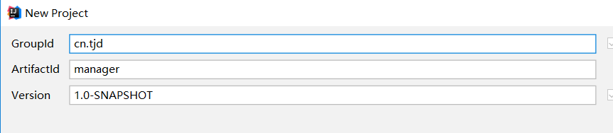
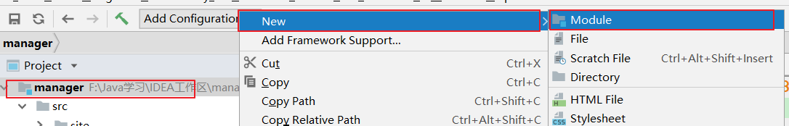
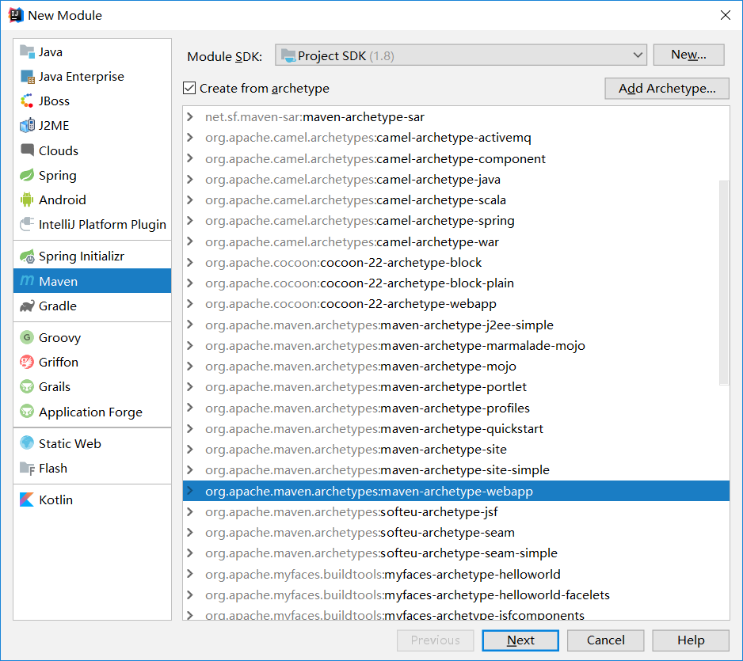
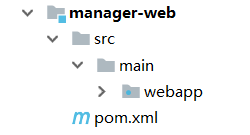
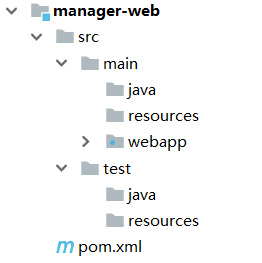

#### 创建Maven聚合项目

#### 一.项目结构

#### 二.IDEA创建时常用的Maven模板

- maven-archetype-webapp	创建war打包方式的项目
- maven-archetype-quickstart	创建jar打包方式的项目
- maven-archetype-site	创建父工程

#### 三.项目构建过程

​	**第一步：新建父工程**

​	**目录结构：**

​	**删除pom.xml中不需要的部分：**

​	**第二步：创建pojo工程**

​	省略相同的步骤：

​	**第三步：`manager-dao` `manager-service`与同上**

​	**第四步：创建`manager-web`**

....

#### 四.完善原始项目的目录结构

​	`manager-web`创建完成后的目录结构：

​	但是这个目录结构是不符合标准的，我们需要手动创建`src/main/java` `src/main/resources` `src/test/java` `src/test/resources`：

​	

​	但是我们发现，我们创建的main/java目录是灰色的，它不能创建java文件，就算手动创建了也不会编译该文件，我们需要标记它为`sources root`：

​	或者我们点击：

​	**然后我们将目录结构标记为：**

- main/java	Sources
- main/resources	Resources
- test/java	Tests
- test/reources	Test Resources

#### 五.运行整个项目

运行整个项目分为两种情况：

**情况一：tomcat插件配置在`manager-web`中**

​	那么此时就需要**依次安装所有依赖的项目**，然后执行`manager-web`中的`tomcat7:run`。

**情况二：tomcat插件配置在父工程中**

​	此种情况不需要手动安装所有项目，直接在父工程中执行`tomcat7:run`。建议采用第二种方法，因为这样我们在修改其他模块的代码后不用手动安装就可以运行。

**如何运行tomcat插件？**

