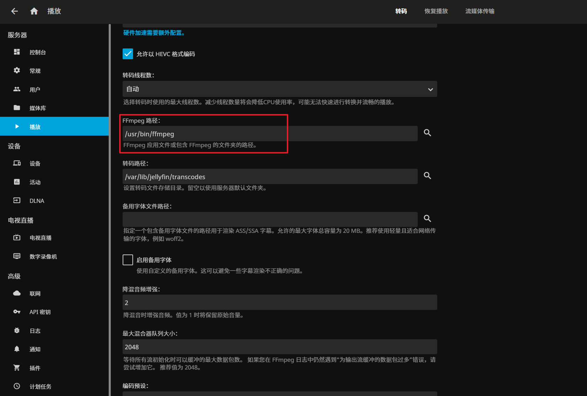
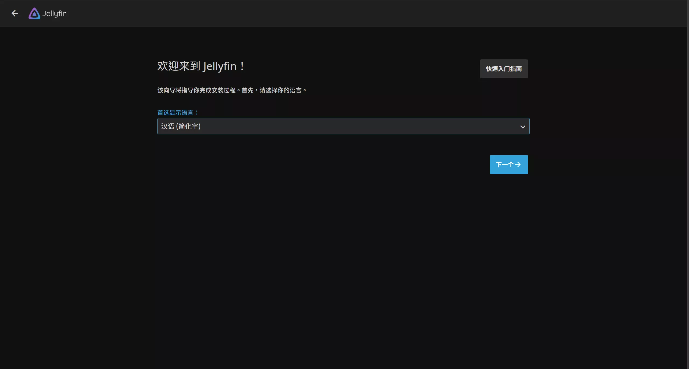
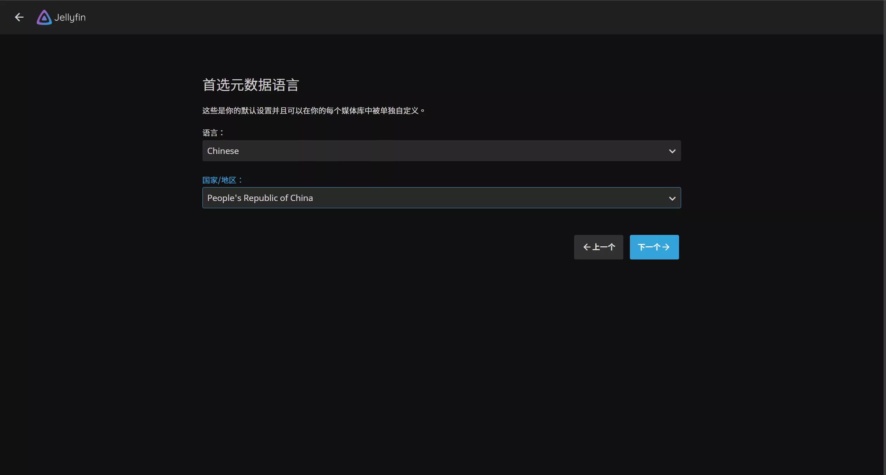
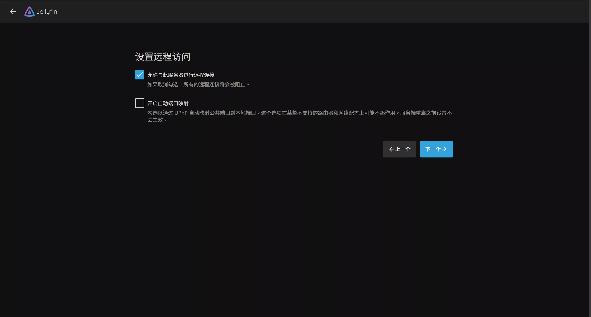
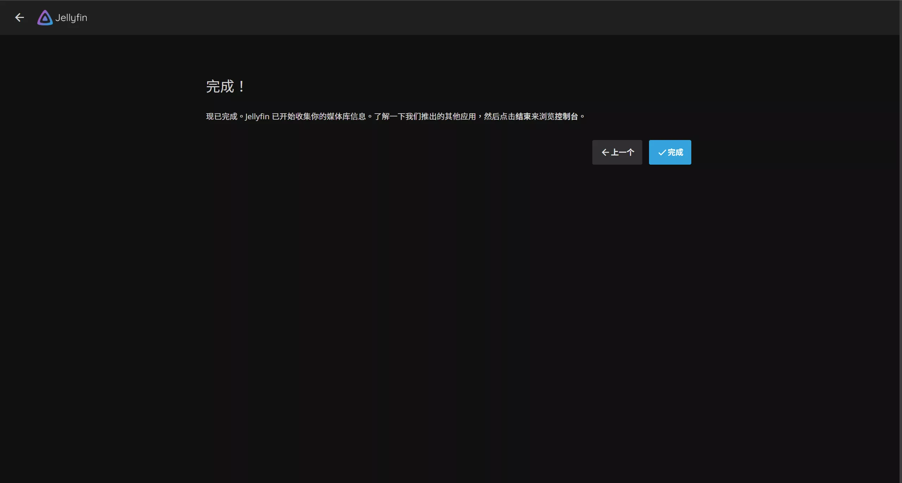
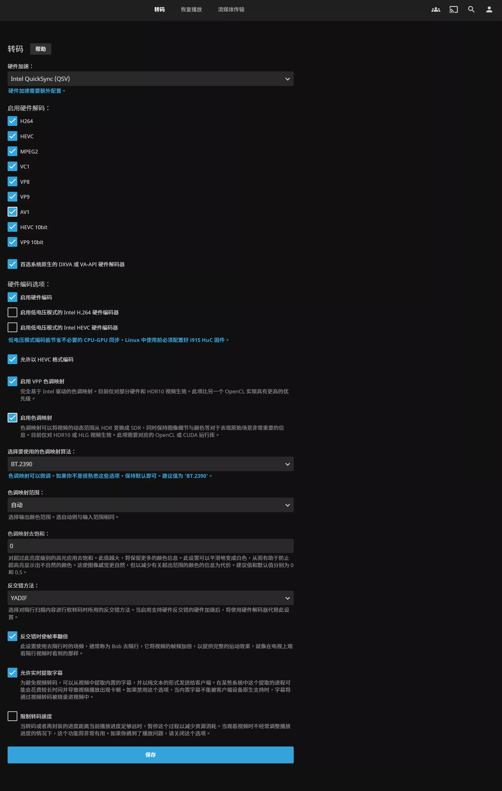
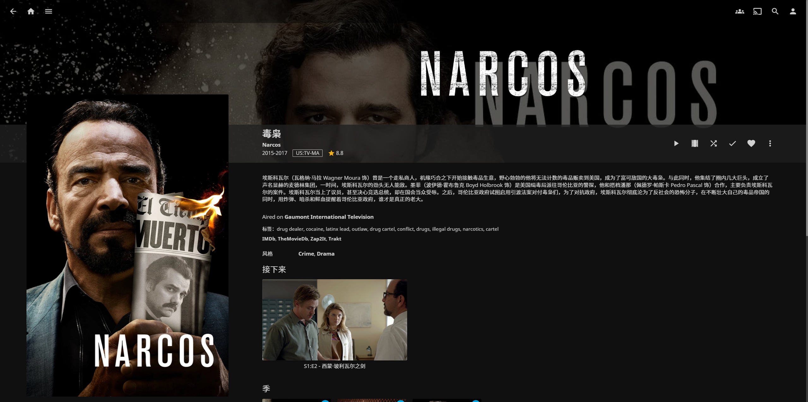
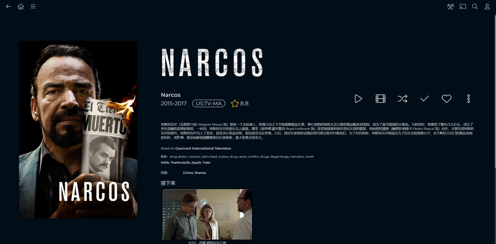

# CentOS搭建Jellyfin影音服务器

## 一. 安装Jellyfin

之前介绍过Docker安装jellyfin，但Docker安装方式存在一些限制，于是一起学习一下用RPM包在CentOS 7下安装方法。

先安装需要的依赖:

```shell
yum install libicu fontconfig -y COPY
```

下载CentOS最新可用RPM包进行安装：

最新版本可以在 https://repo.jellyfin.org/releases/server/centos/ 这个地址查看：


下载这三个包：

```shell
wget -c https://repo.jellyfin.org/releases/server/centos/stable/web/jellyfin-web-10.8.9-1.el7.noarch.rpm
wget -c https://repo.jellyfin.org/releases/server/centos/stable/server/jellyfin-server-10.8.9-1.el7.x86_64.rpm
wget -c https://repo.jellyfin.org/releases/server/centos/stable/server/jellyfin-10.8.9-1.el7.x86_64.rpm
```

安装jellyfin：

```shell
rpm -Uvh --nodeps jellyfin-web-10.8.9-1.el7.noarch.rpm
rpm -Uvh --nodeps jellyfin-server-10.8.9-1.el7.x86_64.rpm
rpm -Uvh --nodeps jellyfin-10.8.9-1.el7.x86_64.rpm
```

启动jellyfin：

```shell
# 启动jellyfin
systemctl start jellyfin
# 设置为开机启动
systemctl enable jellyfin
# 停止 jellyfin
systemctl stop jellyfin
# 查看运行状态
systemctl status jellyfin
# 重启jellyfin
systemctl restart jellyfin
```

访问Jellyfin：

[http://localhost:8096](http://localhost:8096)

## 二. 安装ffmpeg

由于Jellyfin需要使用ffmpeg来进行转码，但是RMP包并没有包含ffmpeg，需要自行安装ffmpeg，这里提供一个静态安装ffmpeg的方法：

```shell
#下载ffmpeg
wget https://johnvansickle.com/ffmpeg/builds/ffmpeg-git-amd64-static.tar.xz
#解压
tar -xvf ffmpeg-git-amd64-static.tar.xz
#移动目录
cp ffmpeg-git-20200211-amd64-static/ffmpeg /usr/bin/
cp ffmpeg-git-20200211-amd64-static/ffprobe /usr/bin/
```

打开Jellyfin设置页面（点击右上角小人图标，进入设置页面）–> 控制台 –> 播放 –> 将FFmpeg 路径设置为 `/usr/bin/ffmpeg`



## 三. 设置Jellyfin

### 3.1 初始化

先选择**语言**。



**用户名**默认是 root，可以修改成自己想要的。密码也可以留空，毕竟是自用嘛！


**媒体库**可以稍后设置，这里点击下一步。


**元数据语言**按图中所示选择。关于何为「元数据」，我会在稍后解释。



**远程访问**这一页保持默认，不勾选「开启自动端口映射」也能用。



这样初始化就搞定啦！相当简单的是吧，复杂的地方在后头。



### 3.2 转码设置

在开始使用前，先不要着急添加媒体库。把转码功能开了。「硬件转码」是流媒体中很重要的一部分，不管是 PLEX 亦或是 Emby，硬解功能都是收费的。

所以只要进入「控制台」-「播放」，选择「In­tel QuickSync (QSV)」，把能勾选的视频编码格式全勾上，其他选项根据自己的理解勾选。




## 三. 页面美化

### 3.1 美化效果

默认的主题个人觉得很难看，我们可以使用自定义css美化页面。

美化前首页：


美化后首页：


美化前海报详情：



美化后海报详情：



### 3.2 页面美化

[JellySkin 官网](https://github.com/prayag17/JellySkin)

要使用 JellySkin 主题，请将下面的行复制到“仪表板 -> 常规 -> 自定义 CSS”并单击保存，它将立即在服务器范围内应用到所有用户可能正在使用的任何主题之上。要删除主题，请清除“自定义 CSS”字段，然后单击保存。


注意：使用 Nginx 反向代理时，主题可能无法工作。向下滚动以了解如何解决此问题。

```shell
@import url("https://cdn.jsdelivr.net/npm/jellyskin@latest/dist/main.css");
```

要启用徽标，请将其添加到自定义 css：

```shell
@import url("https://cdn.jsdelivr.net/npm/jellyskin@latest/dist/logo.css");
```


> 参考文章：
>
> [利用 Jellyfin + Bangumi 打造更舒适的动画媒体库 - 初之音 (himiku.com)](https://www.himiku.com/archives/deploy-a-more-comfortable-animation-library-with-jellyfin-and-bangumi.html)
>
> [CentOS安装jellyfin | 最要学习 (zylearning.top)](https://www.zylearning.top/108.html)