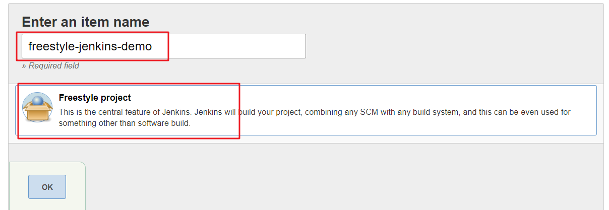
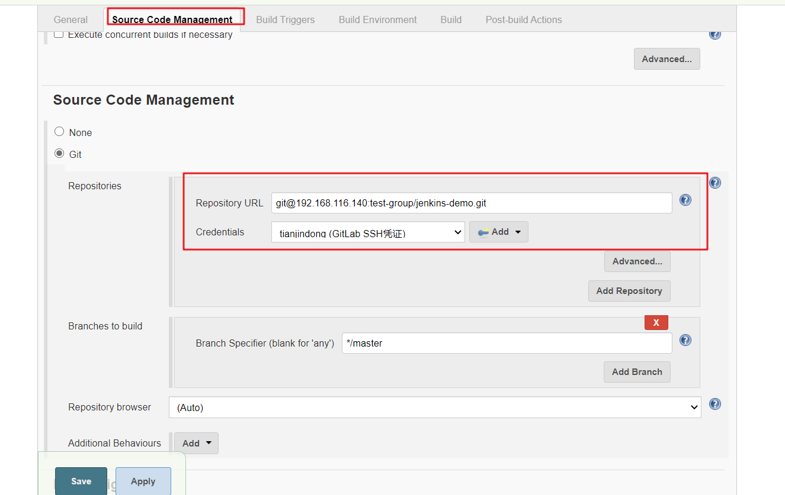
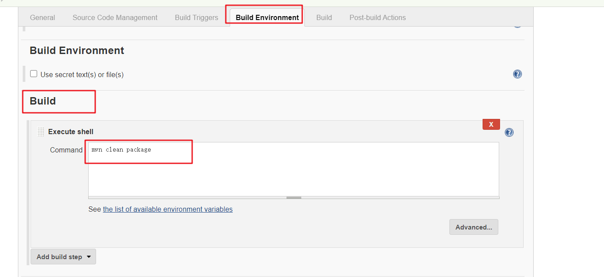
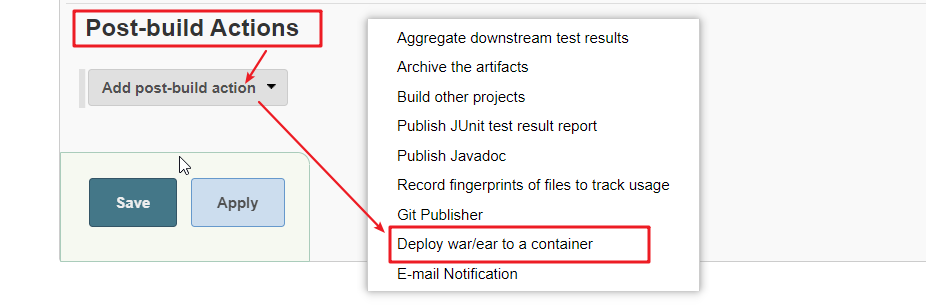
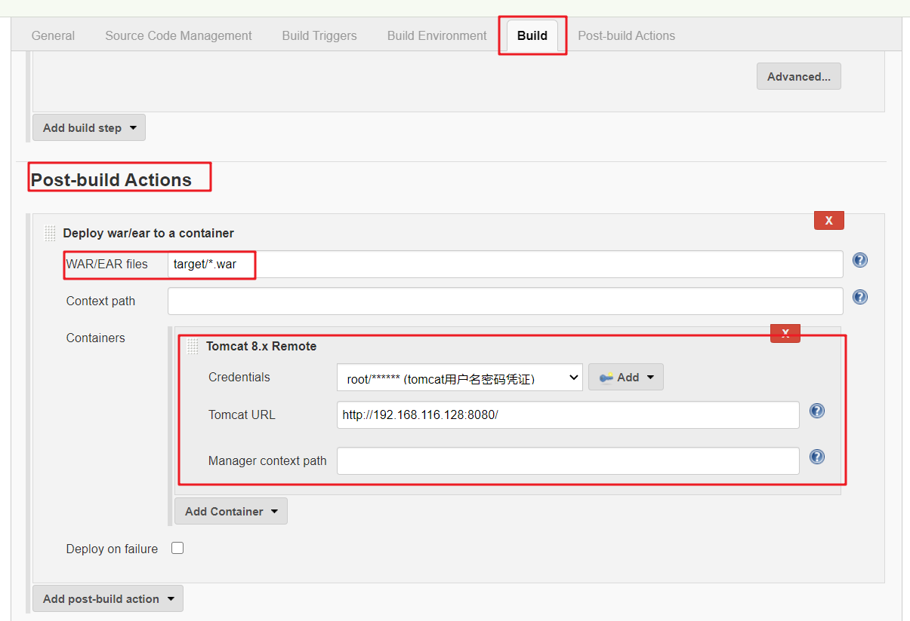
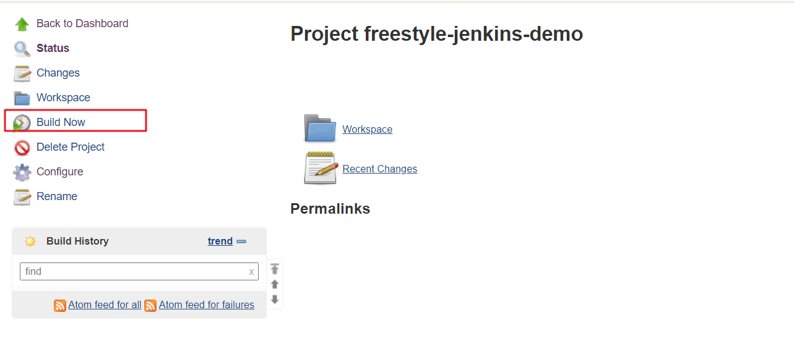
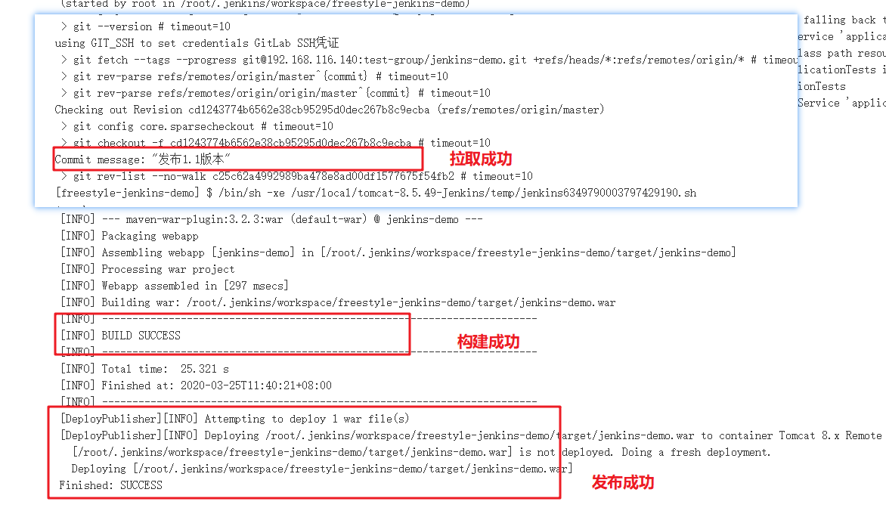

# 自由风格（FreeStyle）项目构建

下面演示创建一个自由风格项目来完成项目的集成过程：

```txt
拉取代码->编译->打包->部署
```

#### **第一步：安装部署插件**

要实现远程部署功能，必须安装`Deploy to container`插件。

插件安装方式参考：[《安装权限管理插件实现用户权限管理》](./_3安装权限管理插件实现用户权限管理.md)的第一章

#### **第二步：新建FreeStyle类型项目**



#### **第三步：配置源码管理，从GitLab拉取代码**



#### **第四步：配置构建步骤**

Build->Add build step->Executor Shell



#### **第五步：配置远程部署**

1. **添加Tomcat凭证**

这里添加Tomcat安装时配置的远程管理用户名和密码。凭证添加方式参考 [Jenkins凭证管理](./subfile/_4Jenkins凭证管理.md)

2. **配置远程部署**





#### **第六步：构建项目**

点击Build Now开始构建，即可自动完成源码拉取，打包，部署这些工作：





