# Pipeline流水线项目构建

## 一. Pipeline简介

### 1.1 概念

Pipeline，简单来说，就是一套运行在 Jenkins 上的工作流框架，将原来独立运行于单个或者多个节点的任务连接起来，实现单个任务难以完成的复杂流程编排和可视化的工作。

### 1.2 使用Pipeline的好处

- 代码：Pipeline以代码的形式实现，通常被检入源代码控制，使团队能够编辑，审查和迭代其传送流程。 

- 持久：无论是计划内的还是计划外的服务器重启，Pipeline都是可恢复的。
-  可停止：Pipeline可接收交互式输入，以确定是否继续执行Pipeline。 
- 多功能：Pipeline支持现实世界中复杂的持续交付要求。它支持fork/join、循环执行，并行执行任务的功能。 
- 可扩展：Pipeline插件支持其DSL的自定义扩展 ，以及与其他插件集成的多个选项。

### 1.3 如何使用Pipeline

- Pipeline 脚本是由 **Groovy** 语言实现的，但是我们没必要单独去学习 Groov。
- Pipeline 支持两种语法：**Declarative**(声明式)和 **Scripted Pipeline**(脚本式)语法
- Pipeline 也有两种创建方法：可以直接在 Jenkins 的 Web UI 界面中输入脚本；也可以通过创建一个 Jenkinsfifile 脚本文件放入项目源码库中（一般我们都推荐在 Jenkins 中直接从源代码控制(SCM)中直接载入 Jenkinsfifile Pipeline 这种方法）。


## 二. 安装`Pipeline`插件

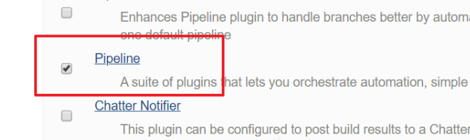

安装插件后，创建项目的时候多了“流水线”类型:

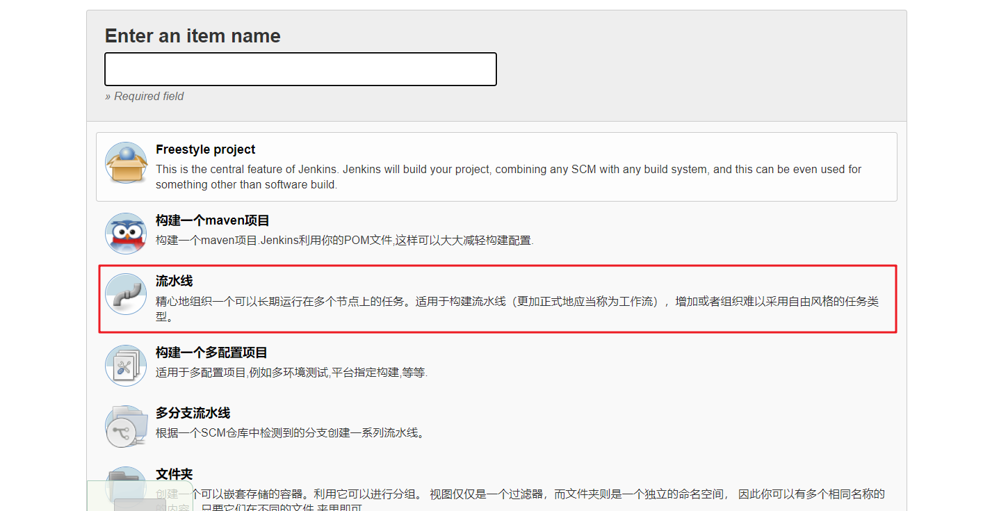

## 三. Pipeline语法结构

### 3.1 Declarative声明式语法

进入流水线项目的配置页面，然后点击“Hello World”创建示例代码：

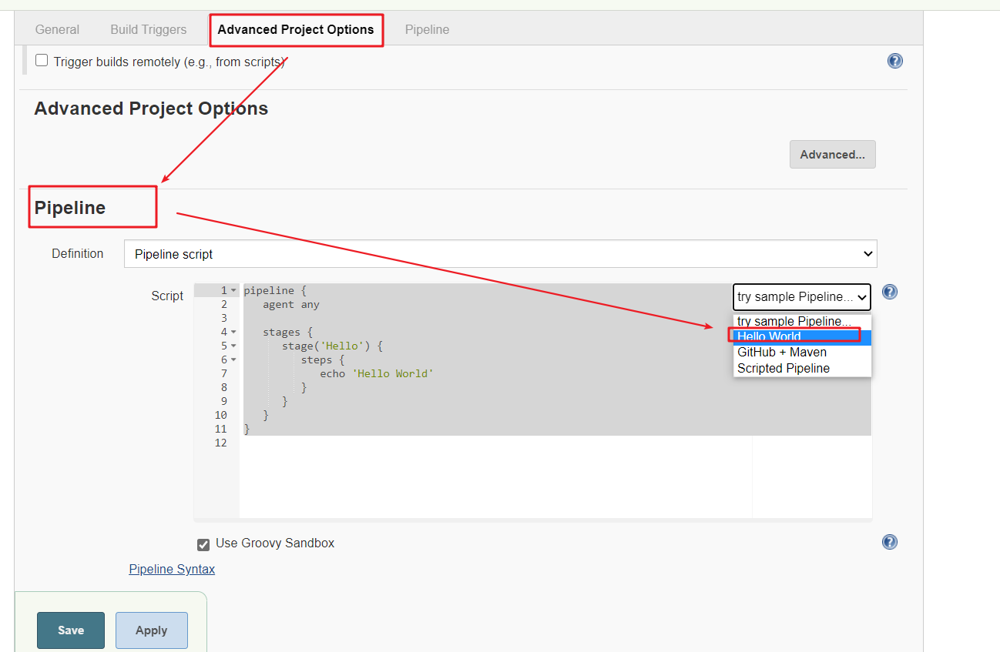

生成内容如下：

```groovy
pipeline {
   agent any

   stages {
      stage('Hello') {
         steps {
            echo 'Hello World'
         }
      }
   }
}
```

- stages：代表整个流水线的所有执行阶段。通常stages只有1个，里面包含多个stage
- stage：代表流水线中的某个阶段，可能出现n个。一般分为拉取代码，编译构建，部署等阶段。
- steps：代表一个阶段内需要执行的逻辑。steps里面是shell脚本，git拉取代码，ssh远程发布等任意内容。

最简单的构建流程如下：

```groovy
pipeline {
   agent any

   stages {
      stage('pull code') {
         steps {
            echo '拉取代码'
         }
      }
      stage('build project') {
         steps {
            echo '构建项目'
         }
      }
      stage('publish') {
         steps {
            echo '发布项目'
         }
      }
   }
}
```

保存脚本，点击构建按钮：

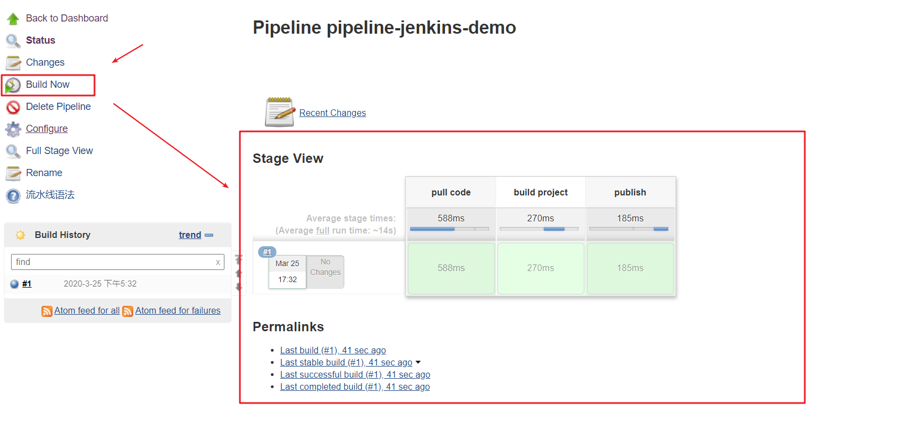

在流水线项目中，构建完成后会显示一个“阶段视图”，它显示每个阶段耗费的时间，以及具体日志等信息。

### 3.2 Scripted Pipeline脚本式

进入流水线项目的配置页面，然后点击“Script Pipeline”创建示例代码：

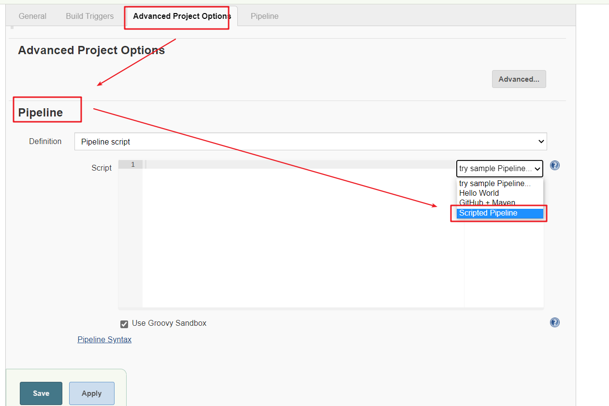

脚本式语法结构：

```groovy
node {
   def mvnHome
   stage('Preparation') { // for display purposes
        
   }
   stage('Build') { // for display purposes
        
   }
   stage('Publish') { // for display purposes
        
   } 
}
```

- Node：节点，一个 Node 就是一个 Jenkins 节点，Master 或者 Agent，是执行 Step 的具体运行环境，后续讲到Jenkins的Master-Slave架构的时候用到。
- Stage：阶段，一个 Pipeline 可以划分为若干个 Stage，每个 Stage 代表一组操作，比如：Build、Test、Deploy，Stage 是一个逻辑分组的概念。
- Step：步骤，Step 是最基本的操作单元，可以是打印一句话，也可以是构建一个 Docker 镜像，由各类 Jenkins 插件提供，比如命令：sh ‘make’，就相当于我们平时 shell 终端中执行 make 命令一样。


## 四. 使用片段生成器帮助生成Pipeline脚本

### 4.1 生成Git拉取脚本

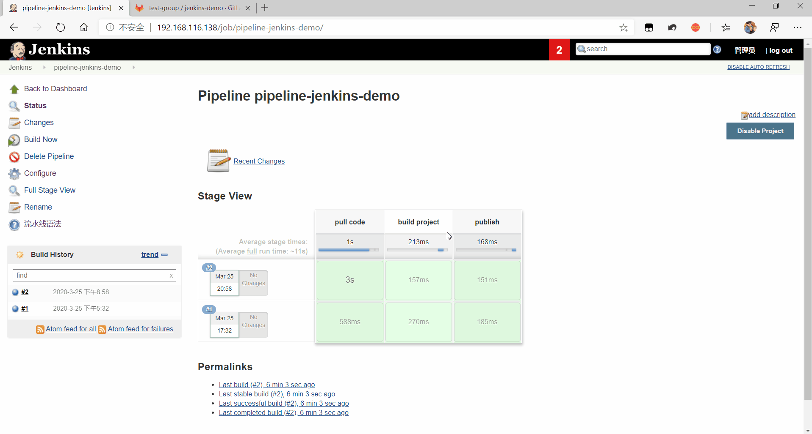

点击构建按钮，测试脚本是否正确：

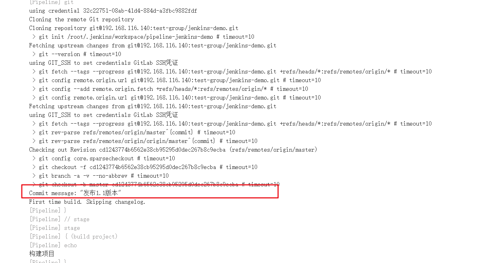


### 4.2 生成构建脚本

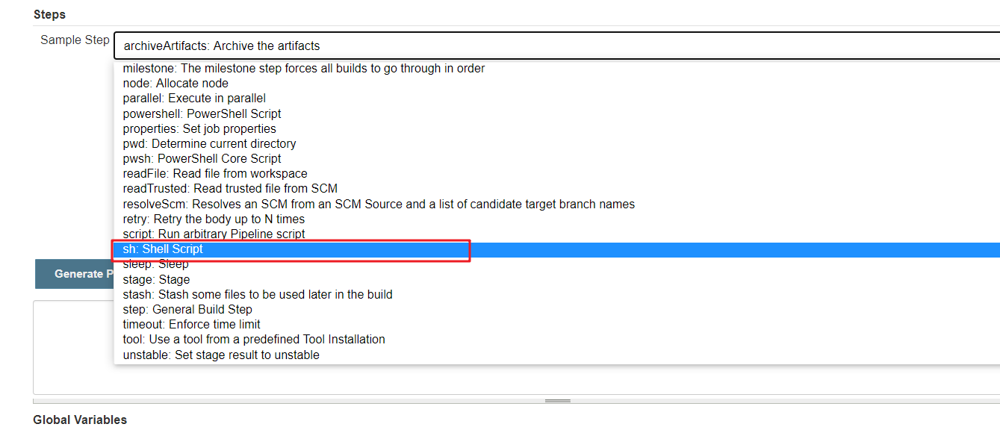

使用`sh:Shell Script`来生成Shell脚本执行模板：

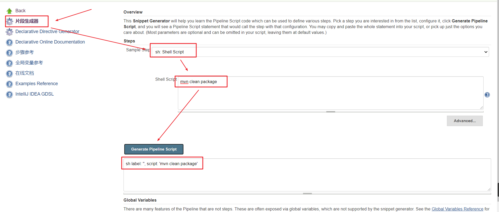

**将脚本复制到，Pipeline脚本声明里面**：

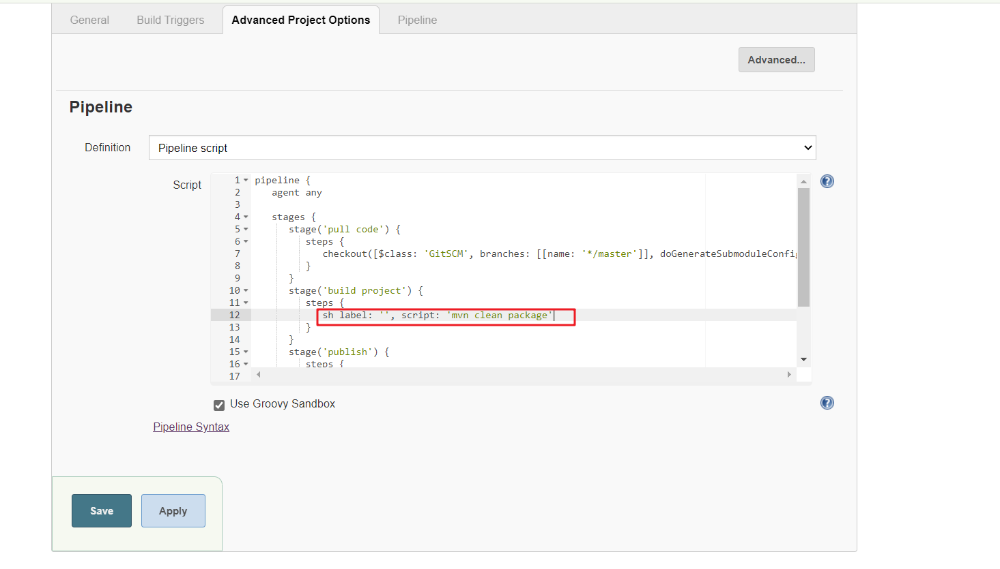

### 4.3 生成发布脚本

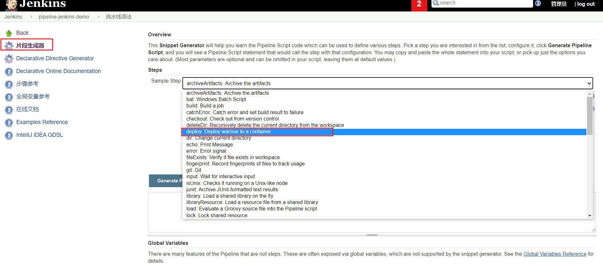

选择`deploy:Deploy war/ear to a container`生成发布脚本：

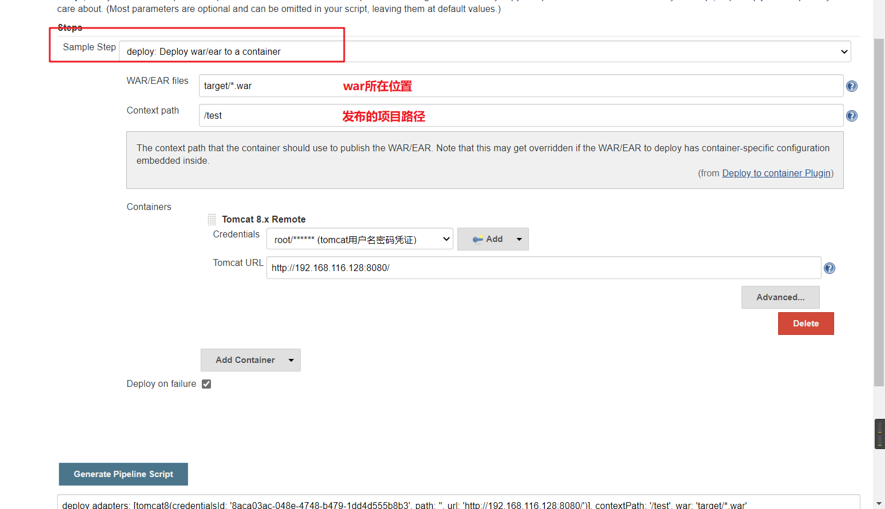


## 五. Pipeline Script from SCM

刚才我们都是直接在Jenkins页面中配置Pipeline脚本，这样不方便脚本维护，建议把Pipeline脚本放在项目中（一起进行版本控制），这样即使服务器宕机，脚本文件也不会丢失。

#### 第一步：在项目根目录建立Jenkinsfifile文件，把内容复制到该文件中

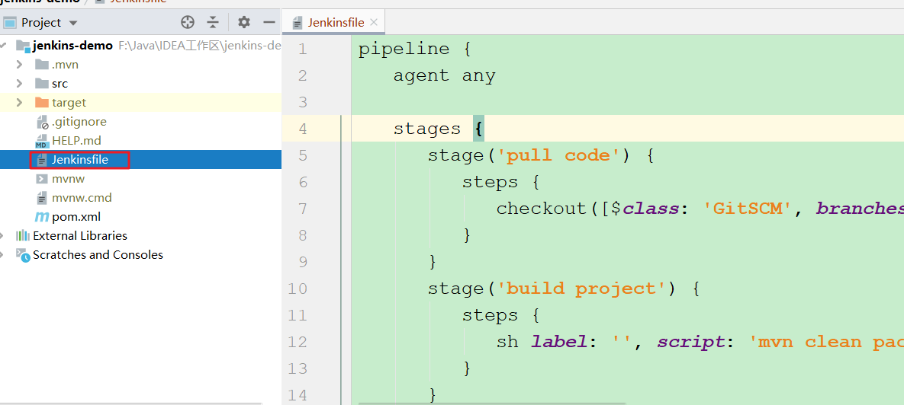

将该文件推送到Git服务器上面。

#### 第二步：在Jenkins项目中引用该文件

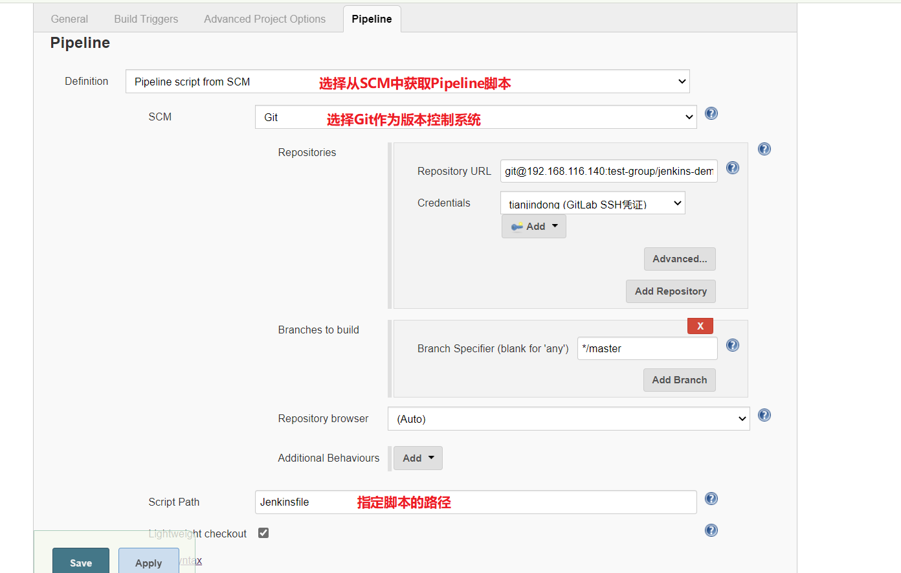