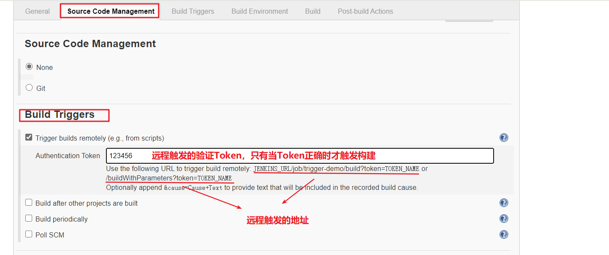
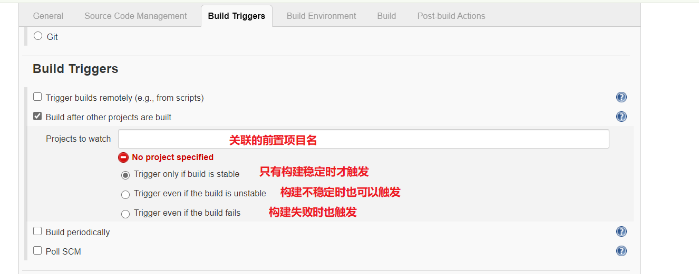
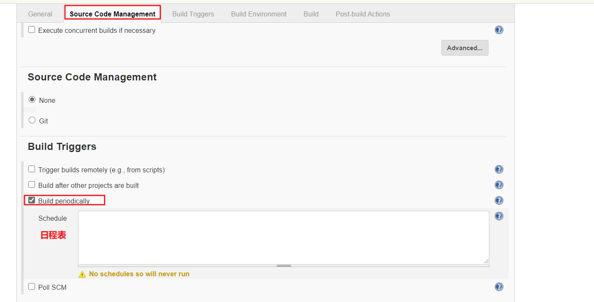
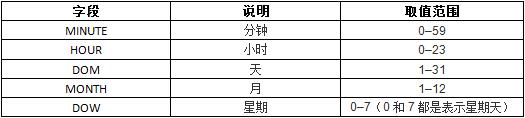
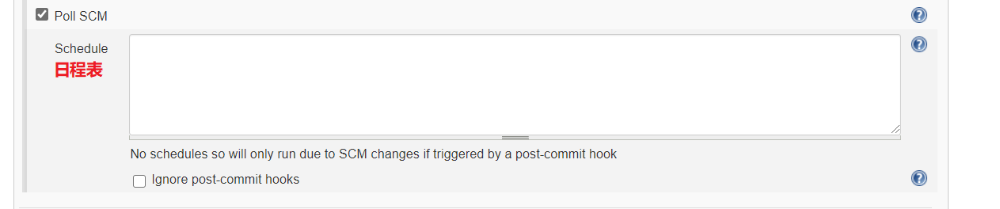

# Jenkins内置触发器

Jenkins内置4种构建触发器：

- 触发远程构建
- 其他工程构建后触发（Build after other projects are build）
- 定时构建（Build periodically)
- 轮询SCM（Poll SCM）

## 一. 触发远程构建（Trigger builds remotely）

触发远程构建是Jenkins对外提供一个URL，当有用户请求该URL时就会触发该项目的构建。



## 二. 其他工程构建后触发（Build after other projects are built）




## 三. 定时构建（Build periodically）



**日程表语法**：

```shell
MINUTE  HOUR  DOM  MONTH  DOW #定时字符串从左往右分别为： 分 时 日 月 周（中间用空格隔开）
```



其中每个字段除了可以使用取值范围内的值外，还能使用一些特殊的字符:

- `*`：匹配范围内所有值
- `M-N`：匹配M~N范围内所有值
- `M-N/X 或者 */X  `：在指定M~N范围内或整个有效区间内每隔X构建一次 

- `A,B,...,Z`：匹配多个值

为了在系统中生成定时任务，符号H（代表Hash））应该用在可能用到的地方，例如：为十几个日常任务配置`0 0 * * *`将会在午夜产生较大峰值。相比之下，配置`H H * * * `仍将每天一次执行每个任务，不是都在同一时刻，可以更好的使用有限资源。

符号H可用于范围，例如，H H(0-7) * * * 代表凌晨0:00到 上午7:59一段时间。你还可以用H代表有或无范围的区间。

符号H 在一定范围内可被认为是一个随机值，但实际上它是任务名称的一个散列而不是随机函数。

```shell
# 每隔15分钟。(或许:07, :22, :37, :52)
H/15 * * * *

# 每前半小时中每隔10分钟。 (3次, 或许:04, :14, :24)
H(0-29)/10 * * * *

# 每个工作日从早上9点45分开始到下午3点45分结束这段时间内每间隔2小时的45分钟那一刻。
45 9-16/2 * * 1-5

#每个工作日从早上9点到下午5点这段时间内每间隔2小时之间的某刻。(或许在上午10:38, 下午12:38, 下午2:38 , 下午4:38)
H H(9-16)/2 * * 1-5

#每月（除了12月）从1号到15号这段时间内某刻。
H H 1,15 1-11 *
```


## 四. 轮询SCM构建（Poll SCM）

轮询SCM，是指定时扫描本地代码仓库的代码是否有变更，如果代码有变更就触发项目构建。



注意：这次构建触发器，Jenkins会定时扫描本地整个项目的代码，增大系统的开销，不建议使用。

