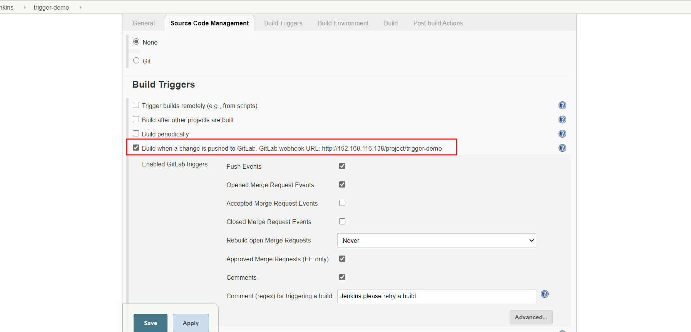
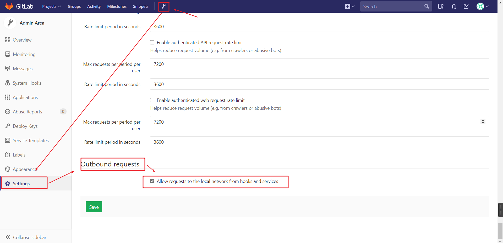
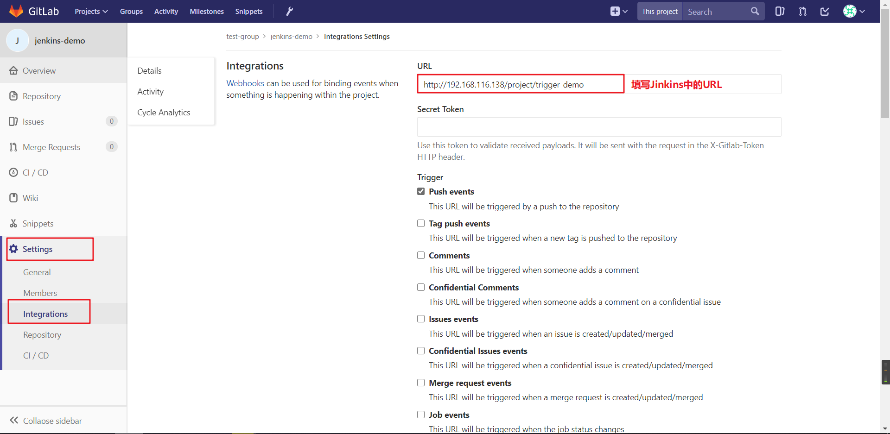
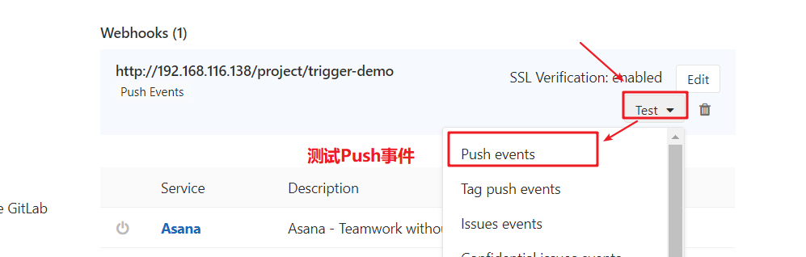
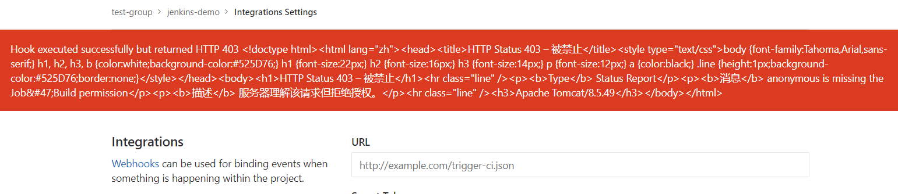
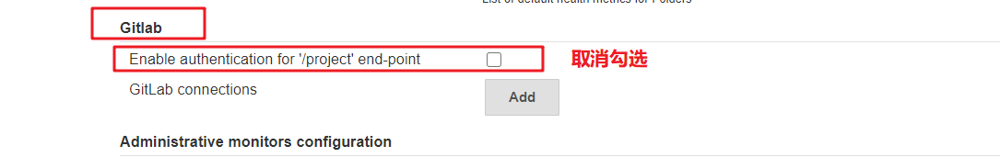
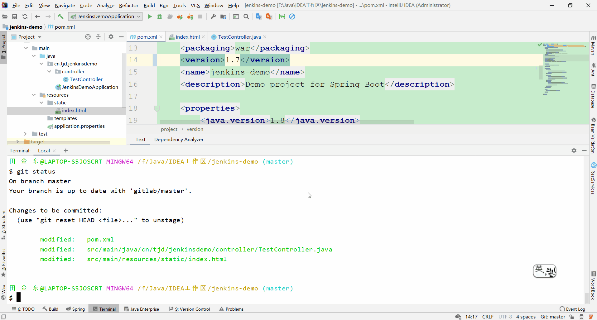
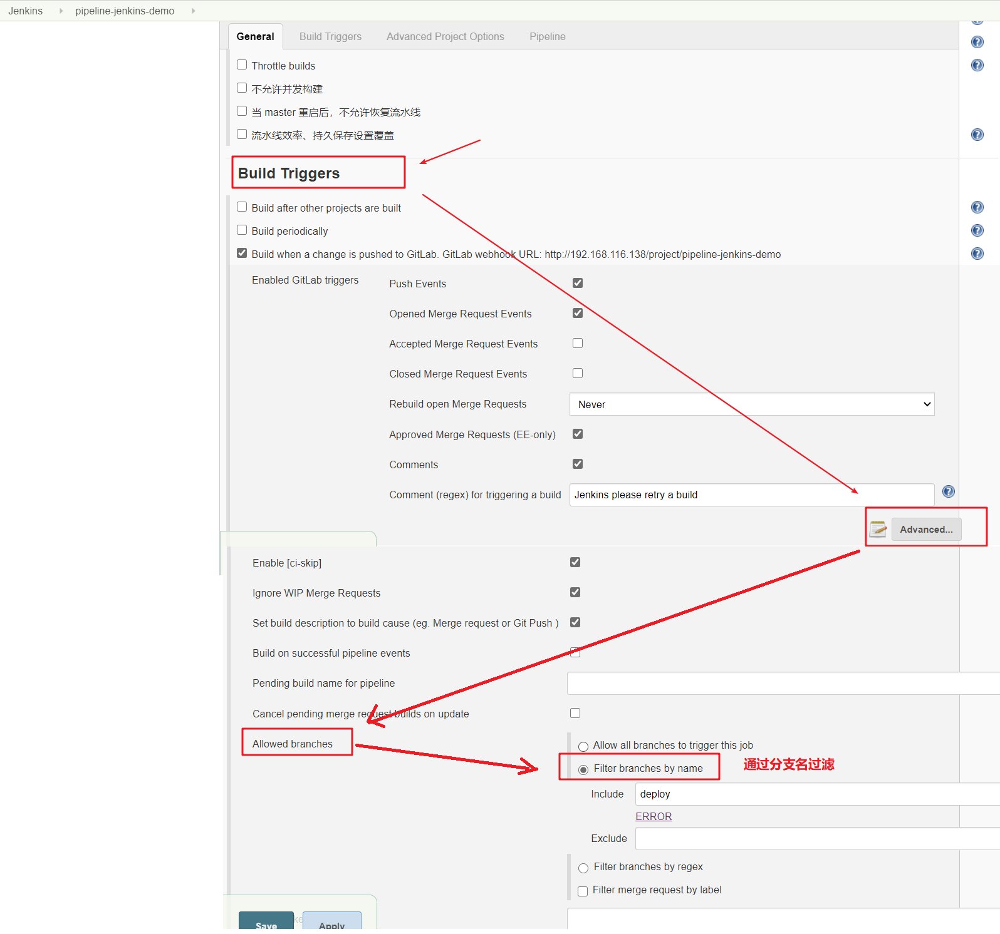
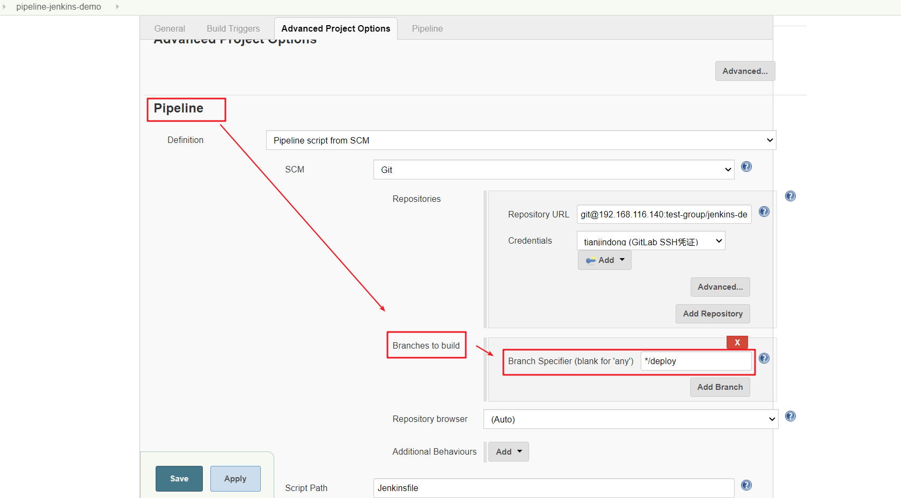

# Git钩子触发自动构建

刚才我们看到在Jenkins的内置构建触发器中，轮询SCM可以实现Gitlab代码更新，项目自动构建，但是该方案的性能不佳。那有没有更好的方案呢？ 有的。就是利用Gitlab的webhook实现代码push到仓库，立即触发项目自动构建。

## 一. 配置WebHook实现自动构建

#### 第一步：安装`Gitlab Hook`和`GitLab`插件

#### 第二步：Jenkins设置自动构建



等会需要把生成的webhook URL配置到Gitlab中。

#### 第三步：GitLab开启WebHook功能

使用root账户登录到后台，点击Admin Area -> Settings -> Outbound request。

勾选"Allow requests to the local network from web hooks and services"




#### 第四步：在GitLab仓库中添加WebHook

点击项目->Settings->Integrations



钩子新增成功后，我们可以进行测试，看是否能够触发构建：



测试可能会发生错误：



#### 第五步：配置Jenkins关闭身份验证，解决拒绝授权的问题

Manage Jenkins->Confifigure Syste->GitLab



#### 第六步：测试




## 二. 配置优化

在上面的配置中，只要Gitlab接收到Push事件都会触发项目的构建，这在生产环境中显然是不合理的，我们需要配置只有指定分支的Push事件才能够触发构建计划。

#### 第一步：配置允许哪些分支Push能够触发推送

```shell
点击configure（Jenkins项目的configure）->Build Triggers->Adcanced->Allowed branches
```



#### 第二步：配置触发构建后，Jenkin从哪个分支拉取代码

```shell
点击configure（Jenkins项目的configure）->Pipeline->Branches to build
```

注：流水线类型的项目，其他类型的项目操作基本类似

