# Jenkins 配置参数构建

## 一. 静态参数

在流水线构建时，通常我们希望用户自定义需要构建的分支，就比如这样：

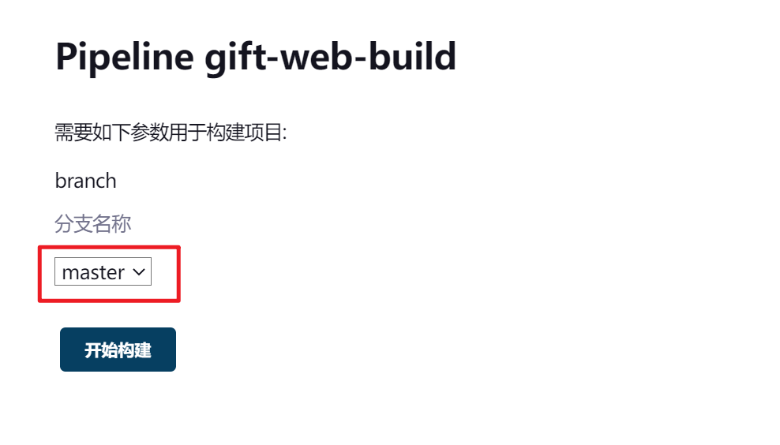

这个只需要我们在配置流水线时，添加参数配置即可：

第一步：勾选 `This project is parameterized` 选项。

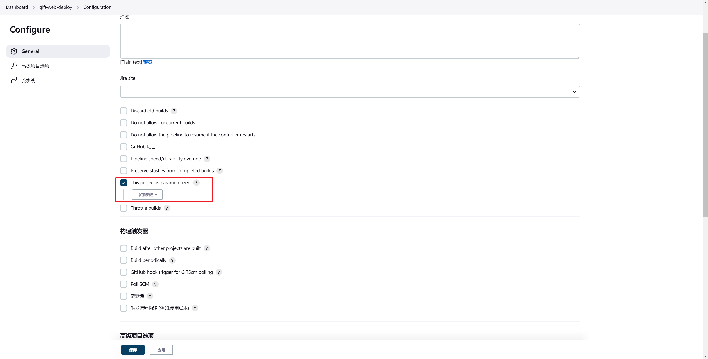

第二步：添加 `Choice Parameter` 类型参数，配置 参数名称 和 参数选项。

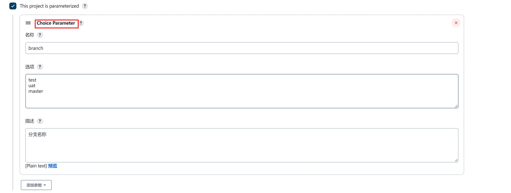

这里参数的选项值在配置时就已经确定了，所以我们称之为“静态参数”。

这样我们在构建的 pipeline 中就可以使用这个变量进行构建了：

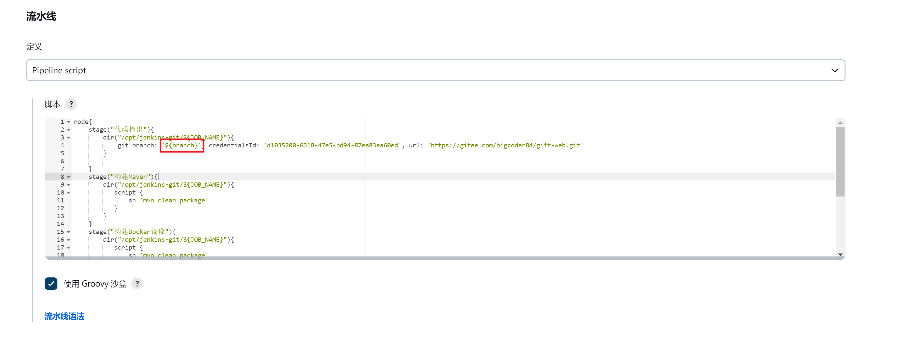

```shell
node{
    stage("代码检出"){
        dir("/opt/jenkins-git/${JOB_NAME}"){
            git branch: '${branch}', credentialsId: 'd1035200-6318-47e5-bd94-87ea83ea60ed', url: 'https://xxxx.com/xxxx/gift-web.git'
        }
         
    }
    stage("构建Maven"){
        dir("/opt/jenkins-git/${JOB_NAME}"){
           script {
               sh 'mvn clean package'
           }
        }
    }
    stage("构建Docker镜像"){
        dir("/opt/jenkins-git/${JOB_NAME}"){
           script {
               sh 'docekr build ...'
           }
        }
    }
    stage("镜像推送"){
        dir("/opt/jenkins-git/${JOB_NAME}"){
           script {
               sh 'docker push ...'
           }
        }
    }
    stage("邮件通知"){
        
    }
}
```

## 二. 动态参数

有些情况下静态参数无法满足我们的应用场景，我们需要从第三方平台通过接口获取参数选项，例如我们需要在发布的时候指定我们需要发布的镜像版本：

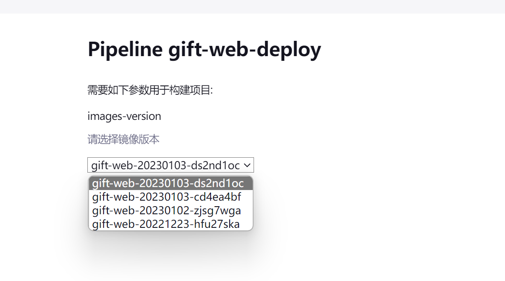

镜像版本无法在配置流水线时确认了，只能通过第三方接口获取，结构类似于这样：

```json
{
    "data": {
        "images": [
            "gift-web-20230103-ds2nd1oc",
            "gift-web-20230103-cd4ea4bf",
            "gift-web-20230102-zjsg7wga",
            "gift-web-20221223-hfu27ska"
        ]
    }
}
```

动态参数需要Jenkins 安装 `Extended Choice Parameter` 插件：

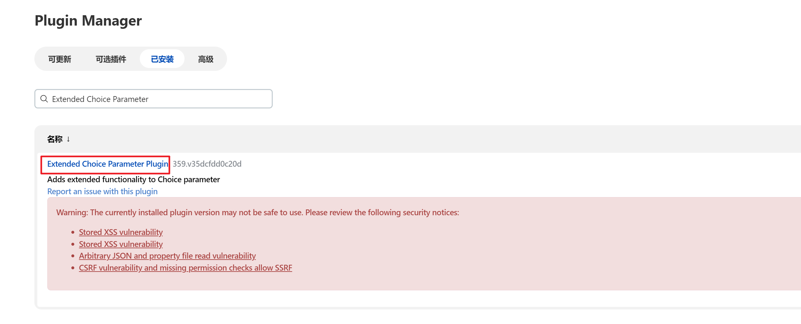

安装好插件以后，在新增参数时，就会多出 `Extended Choice Parameter` 参数类型：


配置好参数名称和描述：

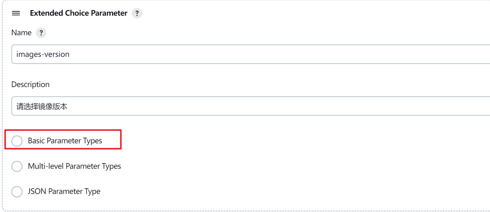

选择 `Basic Parameter Types`：

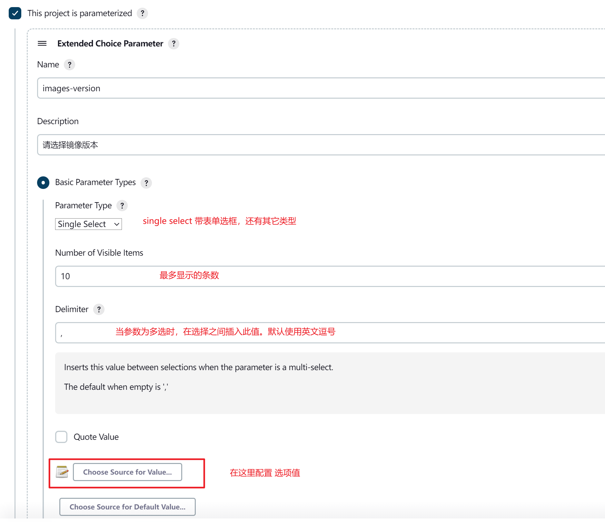

点击 `Choose Sources for Value` 按钮，配置groovy脚本，从第三方接口获取选项值数据，脚本如下：

```groovy
import groovy.json.JsonSlurper
import java.io.BufferedReader;
import java.io.IOException;
import java.io.InputStream;
import java.io.InputStreamReader;
import java.net.HttpURLConnection;
import java.net.MalformedURLException;
import java.net.URL;

 public static String doGet(String httpurl) {
        HttpURLConnection connection = null;
        InputStream is = null;
        BufferedReader br = null;
        String result = null;// 返回结果字符串
        try {
            // 创建远程url连接对象
            URL url = new URL(httpurl);
            // 通过远程url连接对象打开一个连接，强转成httpURLConnection类
            connection = (HttpURLConnection) url.openConnection();
            // 设置连接方式：get
            connection.setRequestMethod("GET");
            // 设置连接主机服务器的超时时间：15000毫秒
            connection.setConnectTimeout(15000);
            // 设置读取远程返回的数据时间：60000毫秒
            connection.setReadTimeout(60000);
            // 发送请求
            connection.connect();
            // 通过connection连接，获取输入流
            if (connection.getResponseCode() == 200) {
                is = connection.getInputStream();
                // 封装输入流is，并指定字符集
                br = new BufferedReader(new InputStreamReader(is, "UTF-8"));
                // 存放数据
                StringBuffer sbf = new StringBuffer();
                String temp = null;
                while ((temp = br.readLine()) != null) {
                    sbf.append(temp);
                    sbf.append("\r\n");
                }
                result = sbf.toString();
            }
        } catch (MalformedURLException e) {
            e.printStackTrace();
        } catch (IOException e) {
            e.printStackTrace();
        } finally {
            // 关闭资源
            if (null != br) {
                try {
                    br.close();
                } catch (IOException e) {
                    e.printStackTrace();
                }
            }
            if (null != is) {
                try {
                    is.close();
                } catch (IOException e) {
                    e.printStackTrace();
                }
            }
            connection.disconnect();// 关闭远程连接
        }
        return result;
    }

def jsonSlurper = new JsonSlurper()
def json = doGet("https://95933b73-c0a2-4fbf-aaec-1c7a5a0ad5bc.mock.pstmn.io/images");
def object = jsonSlurper.parseText(json)
return object.data.images
```

在脚本里定义了 `doGet` 方法，用于封装HTTP请求，然后调用该方法从第三方接口中获取具体值并返回。

第三方接口数据：

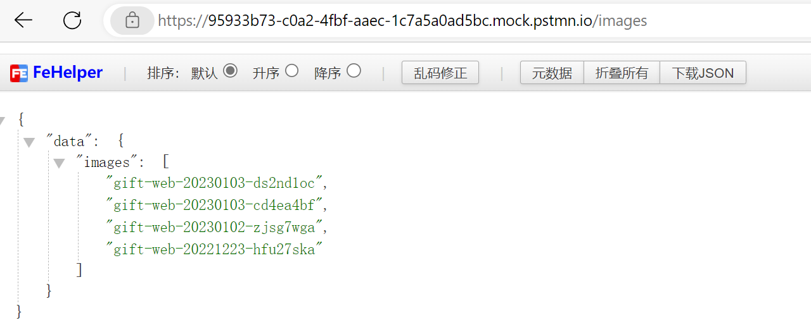

保存流水线后，我们点击构建按钮，就会执行这个脚本拉取选项数据并渲染，但是刚配置好的脚本，会提示脚本未审核：

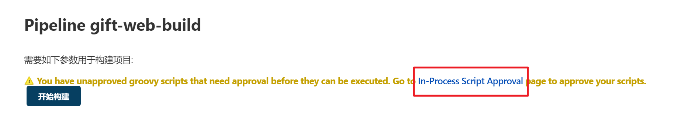

点击链接，进入审核页面：

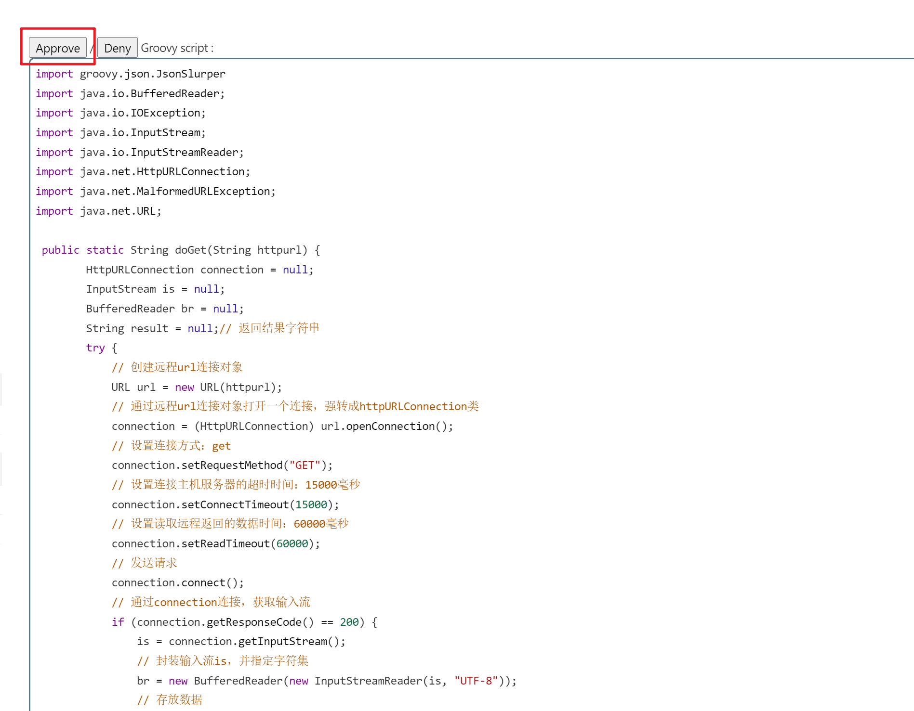

点击 `approve` 同意即可。

此时我们再次点击构建按钮，即可看到第三方接口返回的参数选项：


