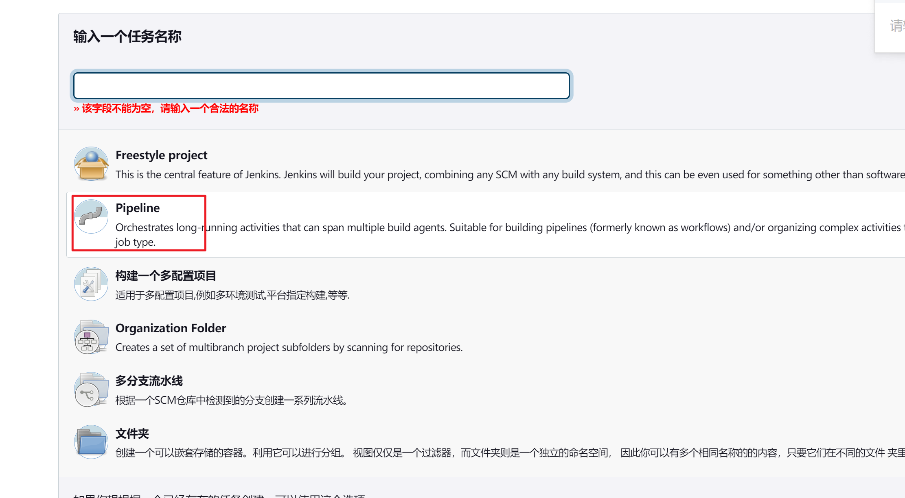
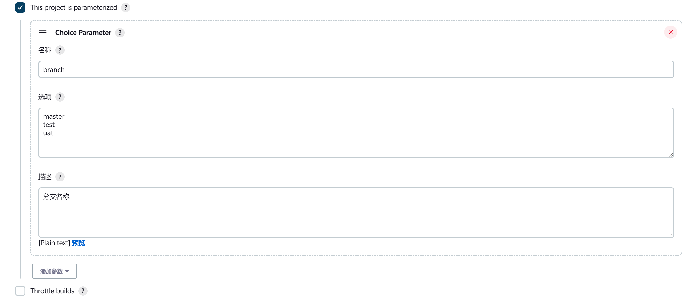

# Jenkins流水线构建Docker镜像

第一步：新建一个Pipline JOB



第二步：新增 branch 变量，参考：[《Jenkins参数化构建》](./_15Jenkins参数化构建.md)



第三步：配置 pipeline 脚本
```shell
import java.util.UUID

// 模块名称
projectName = "gift-web"
// Git仓库地址
reporsitoryURL = "https://gitee.com/bigcoder84/gift-web.git"
// 是否是多模块应用
multiModule = false
// 打包参数
mvnPackageParams = "-Dmaven.test.skip=true"

/***不需要配置的参数***/
// 工作区间路径
workspace = "/opt/jenkins-git/${JOB_NAME}"
// docker仓库地址
dockerHost = "172.18.10.22:10001"


node{
    stage("准备工作"){
        dir(workspace){
        	// branch是流水线定义的变量，用户在构建时会选择需要构建的分支
            git branch: '${branch}', credentialsId: 'd1035200-6318-47e5-bd94-87ea83ea60ed', url: reporsitoryURL
            // 获取当前分支最新的commit hash
        	commitShortHash = sh(returnStdout: true, script: "git log -n 1 --pretty=format:'%h'").trim()
        	println("commitShortHash: ${commitShortHash}")
        	// 获取当前分支最新的commit 时间
        	commitTime = sh(returnStdout: true, script: "git show --pretty=format:'%ci' | head -1").trim()
        	println("commitTime: ${commitTime}")
        	// 此次构建的随机值
        	randomTag = UUID.randomUUID().toString().substring(0, 8)
        	println("randomTag: ${randomTag}")
        	// 镜像名称
        	dockerImageName = "${projectName}-${branch}"
        	// 镜像版本
        	dockerImageTag = "${commitShortHash}-${randomTag}"
        	println("imageName: ${dockerImageName}")
        	
        }   
        
    }
    stage("构建Maven"){
    	// maven打包脚本
    	def packageScript 
    	if (java.lang.Boolean.valueOf(multiModule)) {
    		// 多模块应用，只打包指定模块
    		packageScript = "mvn clean package -pl ./${projectName} -am ${mvnPackageParams}"
    	} else {
    		packageScript = "mvn clean package ${mvnPackageParams}"
    	}
    	dir(workspace){
			sh "${packageScript}"
		}
    }
    stage("构建镜像"){
         dir(workspace){
            // target目录
            def targetDir

            if (java.lang.Boolean.valueOf(multiModule)) {
    			targetDir = "${workspace}/${projectName}/target"
    		} else {
    			targetDir = "${workspace}/target"
    		}

    		dir(targetDir){
    			// 打包完成 jar 的文件名称
            	def jarFileName = sh(returnStdout: true, script: "ls *.jar | head -1").trim()
            	// 构建 docker 镜像
            	sh "docker build -t ${dockerImageName}:${dockerImageTag} --build-arg JAR_FILE_NAME=${jarFileName} -f /opt/jenkins-git/dockerfile/dockerfile ."
    		}              

        }
    }
    stage("镜像推送"){
    	// 重命名docker tag
    	sh "docker tag ${dockerImageName}:${dockerImageTag} ${dockerHost}/${dockerImageName}:${dockerImageTag}"

    	withCredentials([usernamePassword(credentialsId: 'docker-registry', passwordVariable: 'dockerPassword', usernameVariable: 'dockerUser')]) {
            sh "docker login -u ${dockerUser} -p ${dockerPassword} http://${dockerHost}"
            sh "docker push ${dockerHost}/${dockerImageName}:${dockerImageTag}"
        }
    }
    stage("即将完成"){
        // 上报构建结果
        
    }
}
```

- 在脚本中经常会用到 `${}` 去引用变量，这实际是groovy插值字符串的语法。

  > 
  >
  > 在Groovy中字符串有两种类型，一种是Java原生的java.lang.String；另一种是groovy.lang.GString，又叫**插值字符串**(interpolated strings)。
  >
  > 
  >
  > **单引号字符串（Single quoted string）**
  >
  > 在Groovy中，使用单引号括住的字符串就是java.lang.String，不支持插值：
  >
  > def name = 'yjiyjgie'
  >
  > println name.class // class java.lang.String
  >
  > 
  >
  > **三单引号字符串（Triple single quoted string）**
  >
  > 使用三单引号括住字符串支持多行，也是java.lang.String实例，在第一个’‘’起始处加一个反斜杠\可以在新一行开始文本：
  >
  > ```groovy
  > def strippedFirstNewline = '''line one
  > 
  > line two
  > 
  > line three
  > 
  > '''
  > ```
  >
  > 
  >
  > **双引号字符串（Double quoted string）**
  >
  > 如果双引号括住的字符串中没有插值表达式（interpolated expression），那它就是java.lang.String；如是有插值表达式，那它就是groovy.lang.GString：
  >
  > ```groovy
  > def normalStr = "yjiyjige" // 这是一个java.lang.String
  > 
  > def interpolatedStr = "my name is ${normalStr}" // 这是一个groovy.lang.GString
  > ```
  >
  > 
  >
  > **字符串插值（String interpolation）**
  >
  > 在Groovy所有的字符串字面量表示中，除了单引号字符串和三单引号字符串，其他形式都支持字符串插值。字符串插值，也即将占位表达式中的结果最终替换到字符串相应的位置中：
  >
  > ```groovy
  > def name = 'Guillaume' // a plain string
  > 
  > def greeting = "Hello ${name}" // name变量的值会被替换进去
  > ```

- 在“准备工作”阶段，主要完成了代码拉取，和一些常用信息的获取。如果想要读取pom文件中的信息，可以安装 [Pipeline Utility Steps](https://jenkins.io/doc/pipeline/steps/pipeline-utility-steps/) 插件来获取pom信息。例如：version、artifictId

- 在“镜像构建”阶段，会依赖于 `Dockerfile` 文件，可以把该文件托管在git中，或者直接放在jenkins所在服务器的文件系统中，上述引用了 `/opt/jenkins-git/dockerfile/dockerfile` 文件。文件内容如下：

  ```dockerfile
  # 该镜像需要依赖的基础镜像
  FROM openjdk:8
  ARG JAR_FILE_NAME=libary
  # 将当前目录下的jar包复制到docker容器的/目录下
  COPY ${JAR_FILE_NAME} /www/app-boot.jar
  
  # 声明服务运行在8080端口
  EXPOSE 8080
  # 指定docker容器启动时运行jar包
  ENTRYPOINT ["java", "-jar","/www/app-boot.jar"]
  
  # 指定维护者的名字
  MAINTAINER bigcoder
  ```

- 在“即将完成”阶段，我们可以进行一些后处理，例如钉钉通知，因为Pipeline编写的是groovy脚本，所以可以在脚本中发起http请求，调用第三方平台，上报镜像版本信息。

本文参考：

[使用Jenkins pipeline流水线构建docker镜像和发布 - Ryan.Miao - 博客园 (cnblogs.com)](https://www.cnblogs.com/woshimrf/p/jenkins-pipeline.html#gallery-2)

[Jenkins扩展篇-Groovy语法简介 - 知乎 (zhihu.com)](https://zhuanlan.zhihu.com/p/74792026)