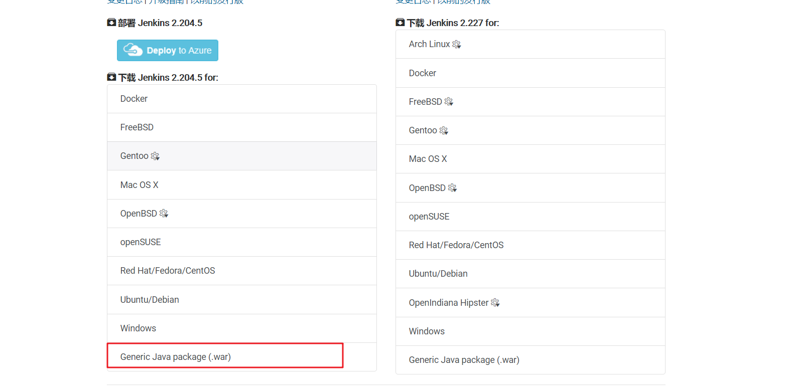
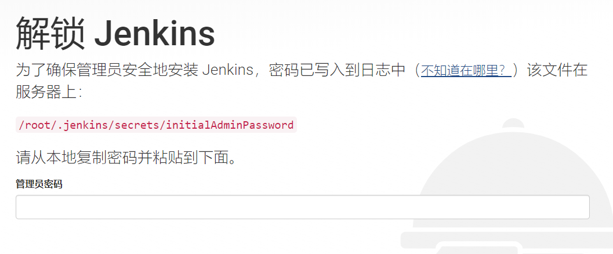
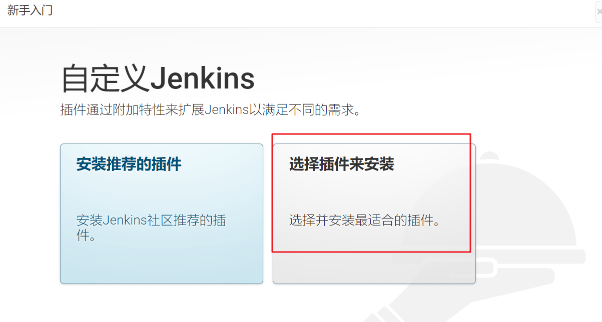
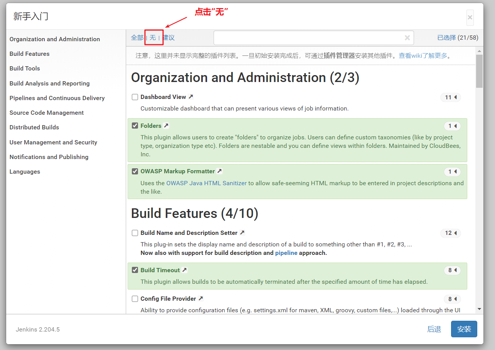
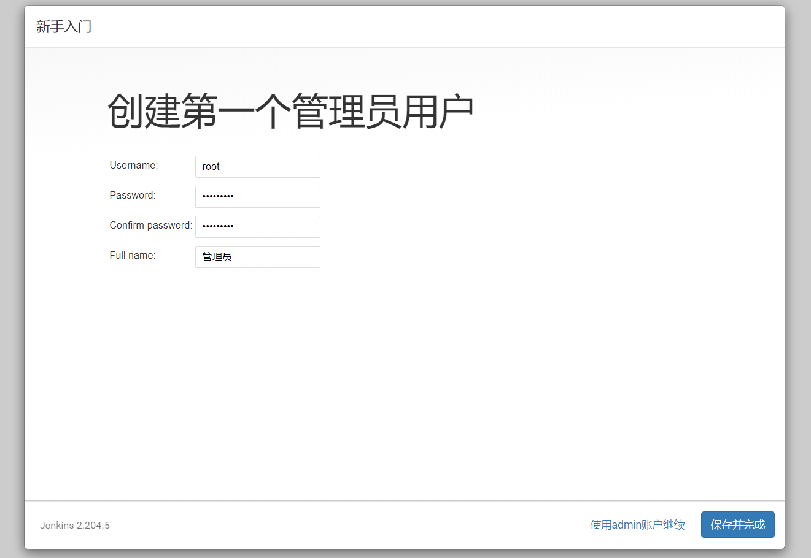
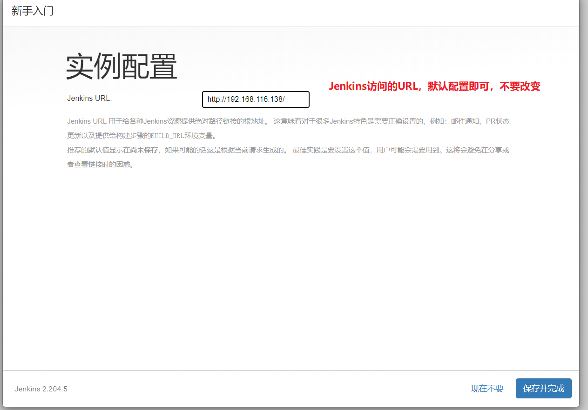
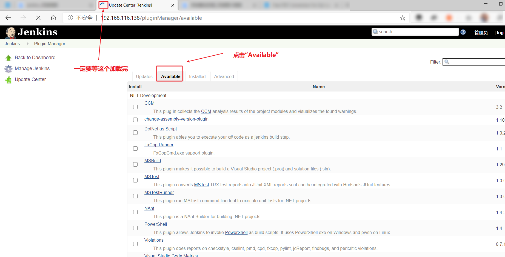
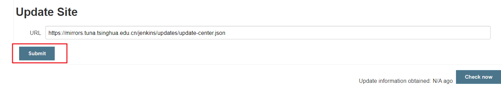

## Jenkins安装与环境配置

## 一.  Jenkins介绍


Jenkins 是一款流行的开源持续集成（Continuous Integration）工具，广泛用于项目开发，具有自动化构建、测试和部署等功能。官网： http://jenkins-ci.org/。

**Jenkins的特征**：

- 开源的Java语言开发持续集成工具，支持持续集成，持续部署。
- 易于安装部署配置：可通过yum安装,或下载war包以及通过docker容器等快速实现安装部署，可方便web界面配置管理。
- 消息通知及测试报告：集成RSS/E-mail通过RSS发布构建结果或当构建完成时通过e-mail通知，生成JUnit/TestNG测试报告。
- 分布式构建：支持Jenkins能够让多台计算机一起构建/测试。
- 文件识别：Jenkins能够跟踪哪次构建生成哪些jar，哪次构建使用哪个版本的jar等。
- 丰富的插件支持：支持扩展插件，你可以开发适合自己团队使用的工具，如git，svn，maven，docker等。

### 1.1 持续集成流程


1. 首先，开发人员每天进行代码提交，提交到Git仓库
2. 然后，Jenkins作为持续集成工具，使用Git工具到Git仓库拉取代码到集成服务器，再配合JDK，Maven等软件完成代码编译，代码测试与审查，测试，打包等工作，在这个过程中每一步出错，都重新再执行一次整个流程。
3. 最后，Jenkins把生成的jar或war包分发到测试服务器或者生产服务器，测试人员或用户就可以访问应用。


## 二. Jenkins安装与持续集成环境配置

### 2.1 GitLab安装

[GitLab安装](../../Git/subfile/_27CentOS7搭建GitLab.md)

### 2.2  Jenkins安装

**第一步**：安装JDK（参考：[JDK安装与配置](../../../其他/项目部署/subfile/_2JDK安装与配置.md)）

**第二步**：安装Tomcat

**第三步**：下载jenkins war包版本，将其放入`{tomcat_home}/webapps`下




**第四步**（可跳过）：配置tomcat，将tomcat端口设置为80，默认访问项目设置为`jekins`（参考：[Tomcat配置](../../../其他/项目部署/subfile/_1Tomcat配置与部署.md)）。这样做可以在浏览器输入服务器IP地址即可访问`jenkins`（默认情况下是访问路径为：`http://{ip}:8080/jenkins`）


**第五步**：启动Tomcat，运行`{tomcat_home}/bin/startup.sh`

```shell
./startup.sh
```


**第六步**：访问`http://{ip}`，需要查看Jenkins生成默认密码才可进入系统。



根据提示，进入服务器，执行下列语句查看密码：

```shell
$ cat /root/.jenkins/secrets/initialAdminPassword
```


**第七步**：跳过插件安装

由于Jenkins默认插件下载地址是国外的，非常慢，所以暂时跳过插件安装。






**第八步**：添加管理员用户






### 2.3 修改Jenkins插件下载地址

由于Jenkins默认下载地址下载速度极慢，我们需要更改下载地址为国内镜像。

**第一步**：加载官方插件列表

在更换地址之前，我们需要将官网的插件列表先加载出来：

```txt
Jenkins->Manage Jenkins->Manage Plugins，点击Available
```



**第二步**：修改插件列表文件中的地址，将里面的地址替换为国内镜像地址

```shell
目的是为了修改：/root/.jenkins/updates/default.json
```
执行下列语句：

进入到`/root/.jenkins/updates/`目录：

```shell
cd /root/.jenkins/updates/
```

执行下列语句：

```shell
sed -i 's/http:\/\/updates.jenkinsci.org\/download/https:\/\/mirrors.tuna.tsinghua.edu.cn\/jenkins/g' default.json && sed -i 's/http:\/\/www.google.com/https:\/\/www.baidu.com/g' default.json
```


**第三步**：Manage Plugins点击Advanced，把Update Site改为国内插件下载地址

```shell
https://mirrors.tuna.tsinghua.edu.cn/jenkins/updates/update-center.jso
```



**第四步**：重启Jenkins

在浏览器输入： `http://{ip}/restart `，重启Jenkins。

