# 安装权限管理插件实现用户权限管理

Jenkins默认自带的权限管理很简单，我们需要利用Role-based Authorization Strategy 插件来管理Jenkins用户权限。

## 一. 安装Role-based Authorization Strategy插件

**第一步**：

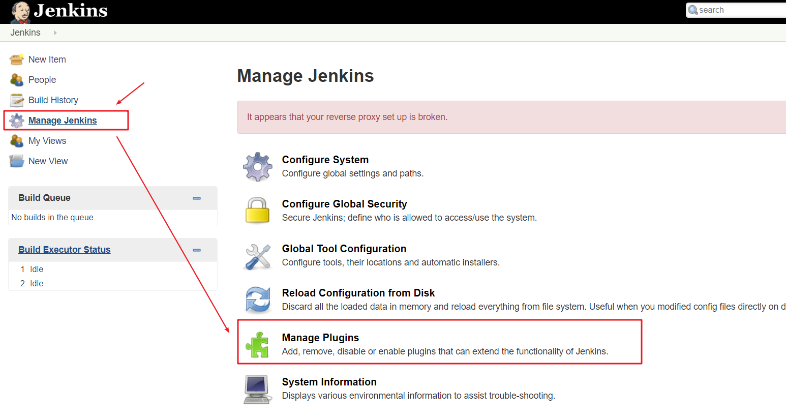

**第二步**：

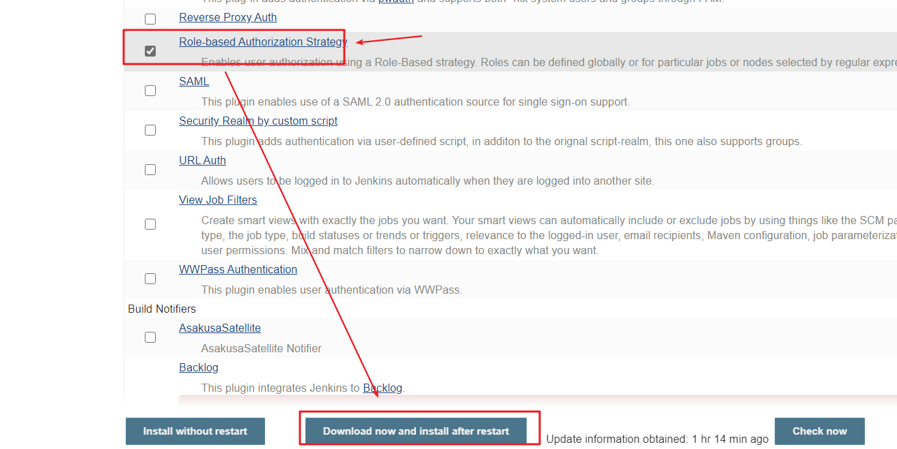

**第三步**：

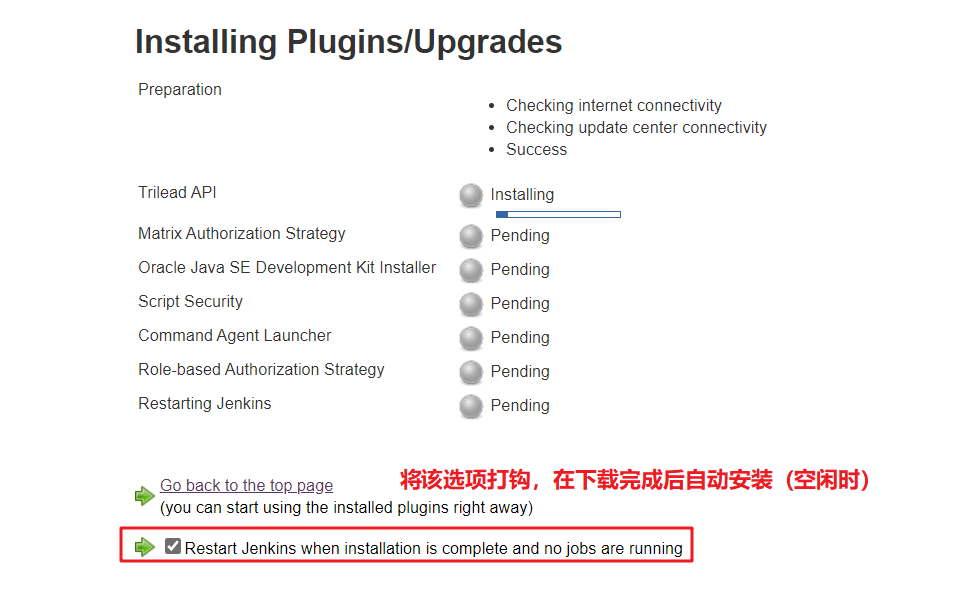

## 二. 开启权限全局安全配置

**第一步**：打开全局安全配置

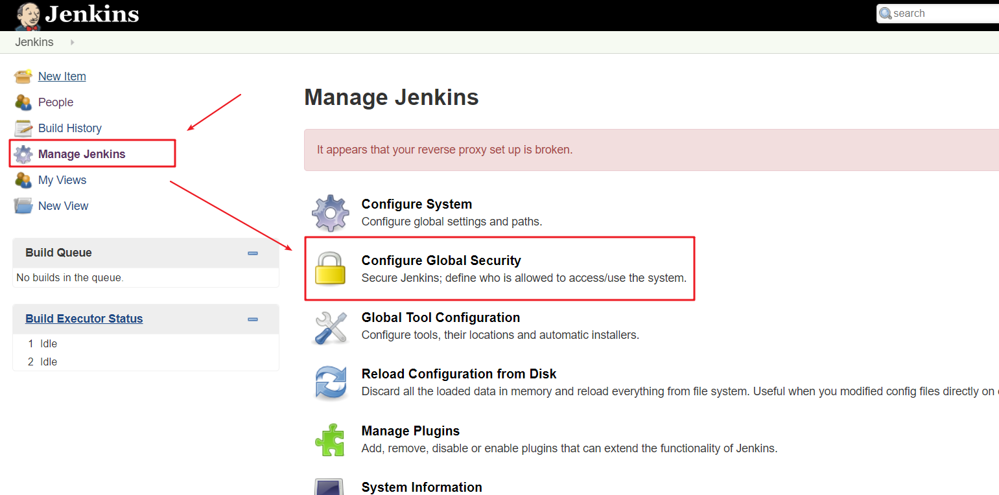

**第二步**：将授权策略切换为"Role-Based Strategy"：

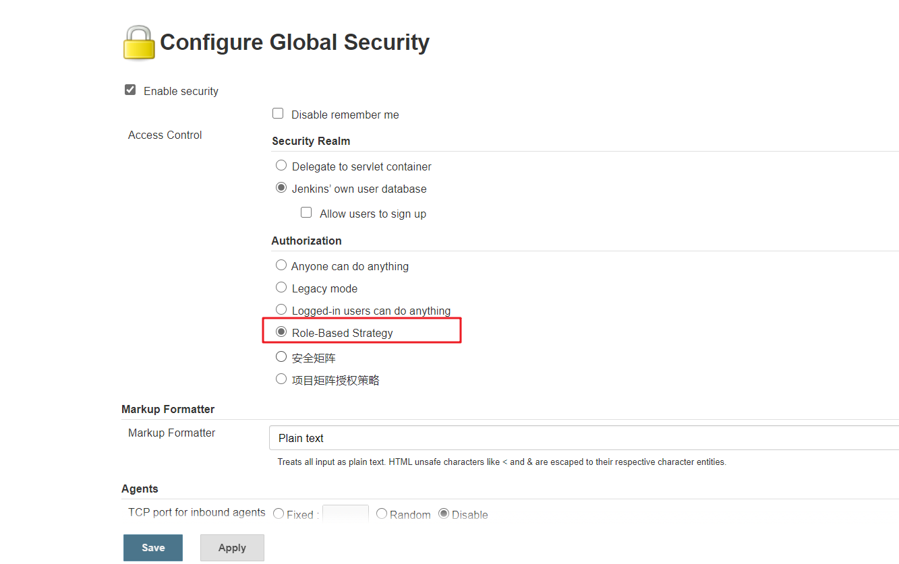

## 三. 创建角色

在系统管理页面进入 Manage and Assign Roles：

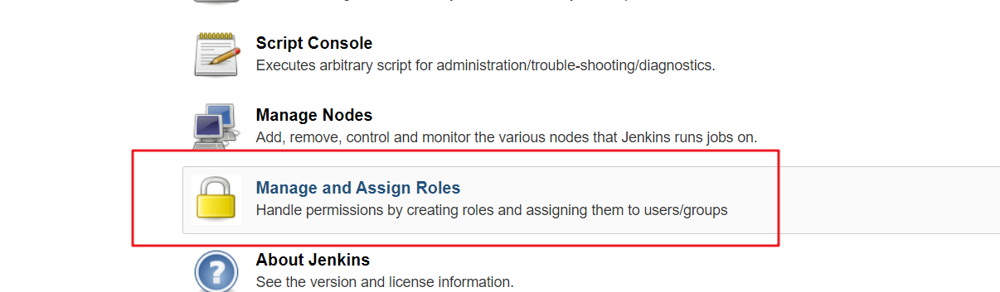

点击"Manage Roles":

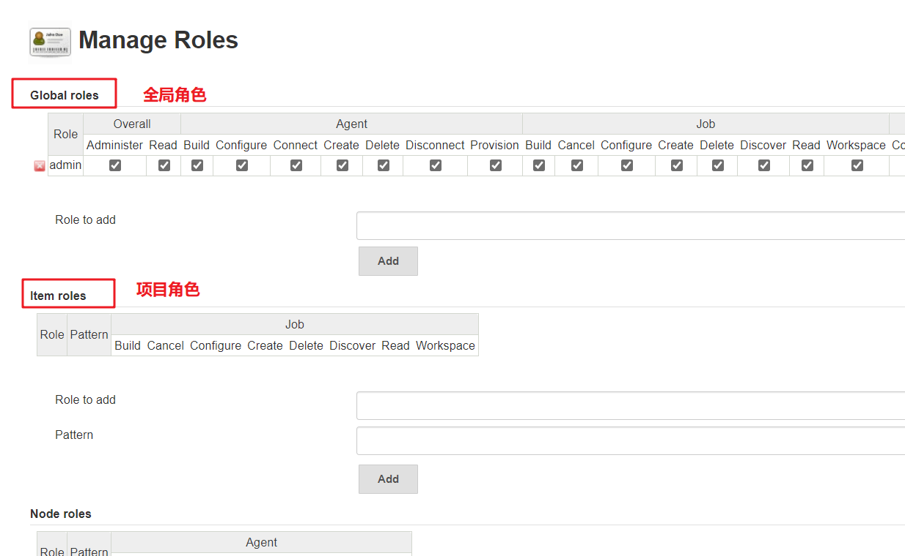

Global roles（全局角色）：管理员等高级用户可以创建基于全局的角色 Project roles（项目角色）：针对某个或者某些项目的角色 Slave roles（奴隶角色）：节点相关的权限

我们添加以下三个角色：

- BaseRole：该角色为全局角色。这个角色需要绑定Overall下面的Read权限，是为了给所有用户绑定最基本的Jenkins访问权限。注意：如果不给后续用户绑定这个角色，会报错误：用户名 ismissing the Overall/Read permission
- role1：该角色为项目角色。使用正则表达式绑定"aaa.*"，意思是只能操作aaa开头的项目
- role2：该角色也为项目角色。绑定"bbb.*"，意思是只能操作bbb开头的项目。

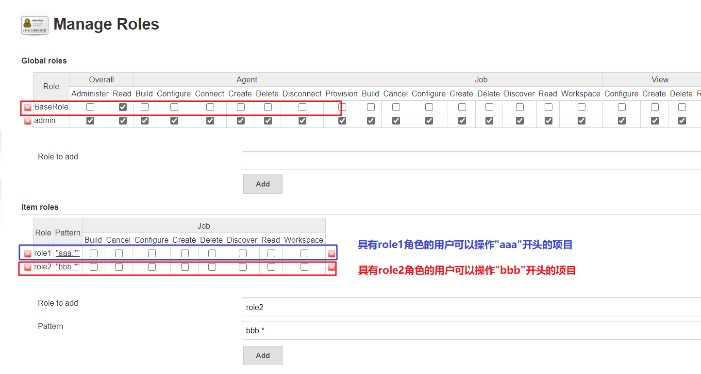

## 四. 创建用户

在系统管理页面进入 Manage Users：

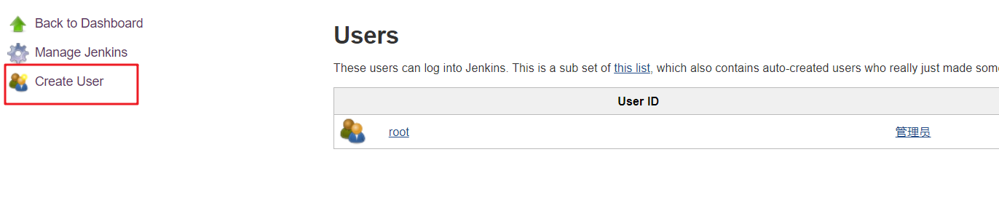

创建test1和test2两个用户。

## 五. 给用户分配角色

### 5.1 角色分配

系统管理页面进入Manage and Assign Roles，点击Assign Roles：

绑定规则如下：

- test1用户分别绑定BaseRole和role1角色

- test2用户分别绑定BaseRole和role2角色

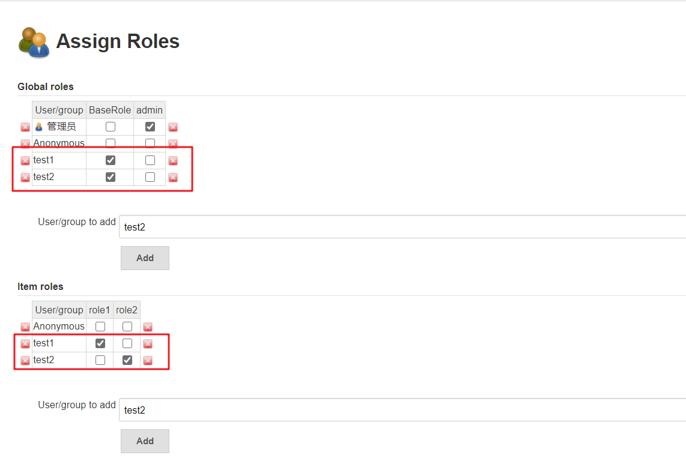

### 5.2 测试权限配置是否成功

以管理员账户创建两个项目，分别为aaaTest和bbbTest：

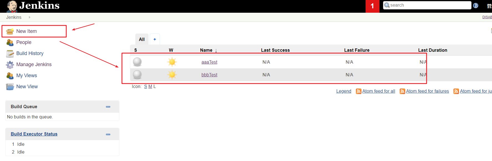

结果为：

- test1用户登录，只能看到aaaTest项目
- test2用户登录，只能看到bbbTest项目

