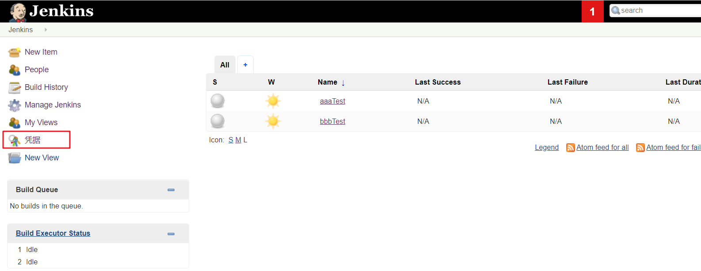
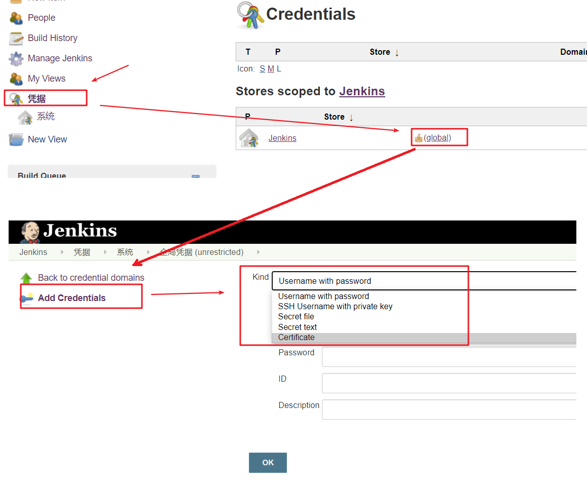
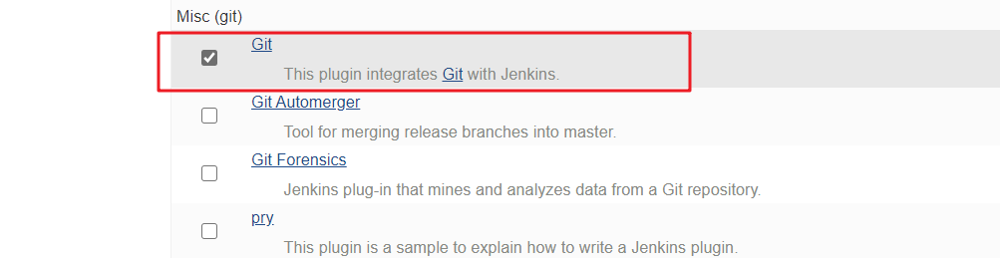
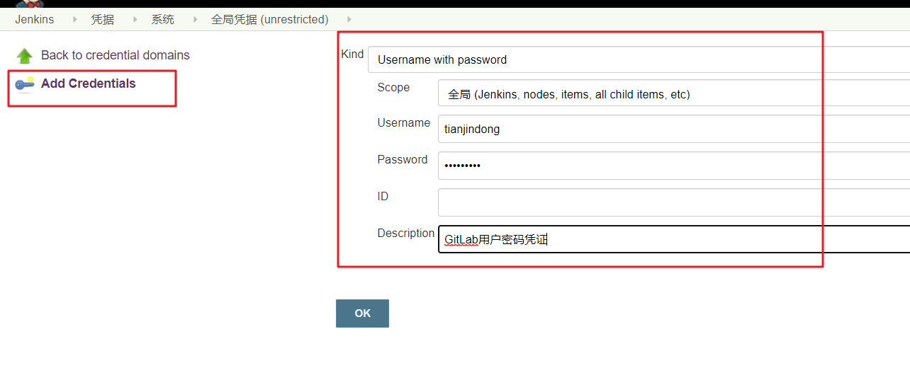
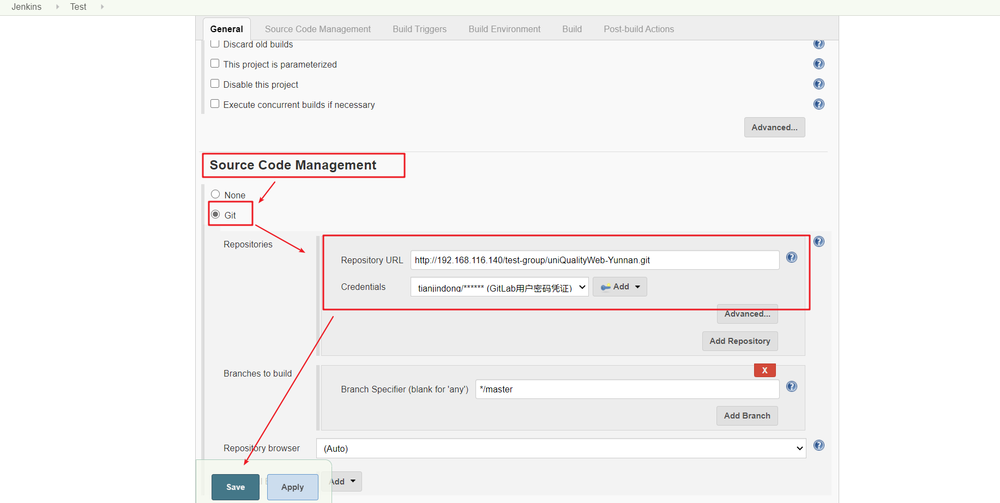
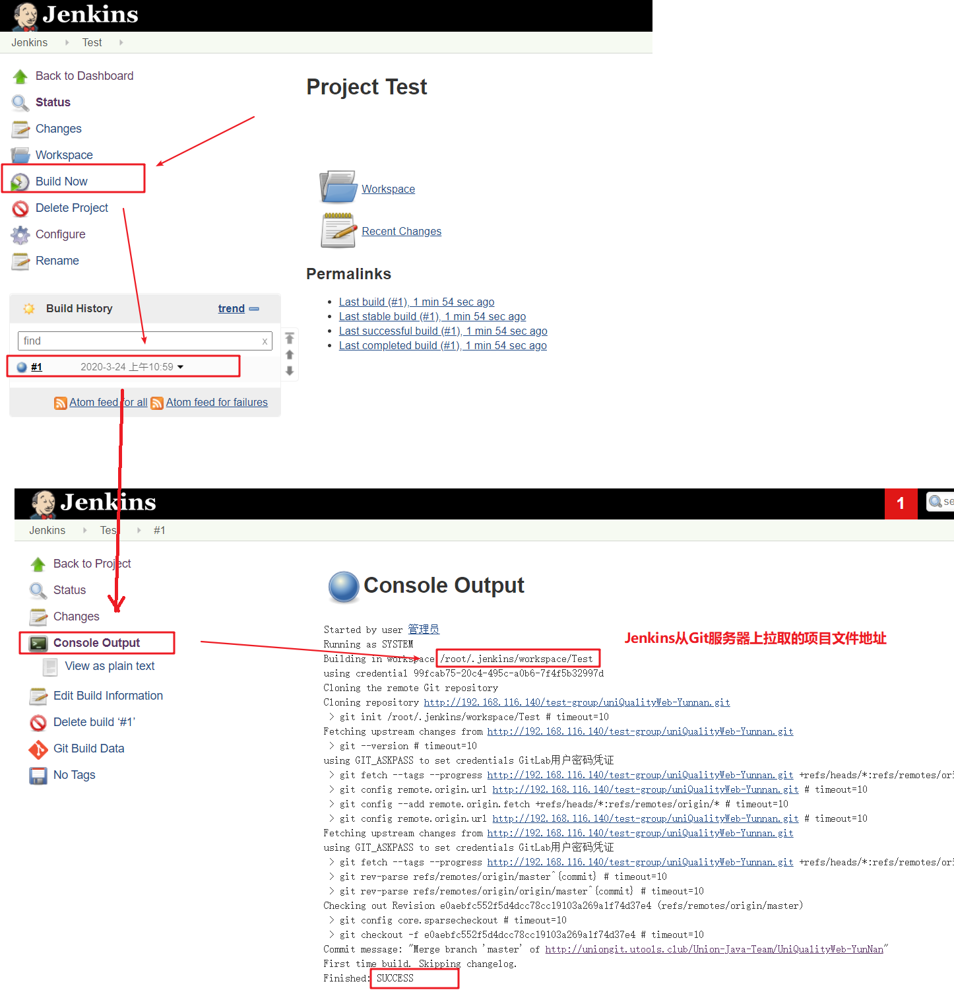
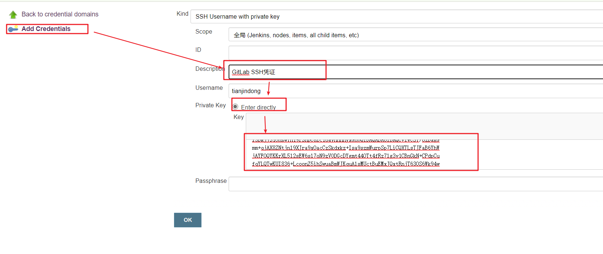
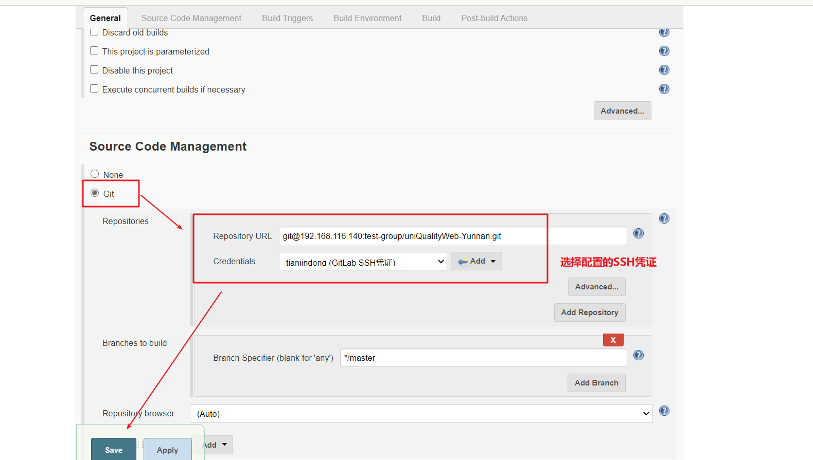

# Jenkins凭证管理

凭据可以用来存储需要密文保护的数据库密码、Gitlab密码信息、Docker私有仓库密码等，以便Jenkins可以和这些第三方的应用进行交互。

## 一. 安装Credentials Binding插件

要在Jenkins使用凭证管理功能，需要安装Credentials Binding插件。安装方式与上一节中权限管理插件的安装一样。

安装插件后，左边多了"凭证"菜单，在这里管理所有凭证：



**可以添加的凭证有5种**：



- Username with password：用户名和密码
- SSH Username with private key： 使用SSH用户和密钥
- Secret fifile：需要保密的文本文件，使用时Jenkins会将文件复制到一个临时目录中，再将文件路径设置到一个变量中，等构建结束后，所复制的Secret fifile就会被删除。
- Secret text：需要保存的一个加密的文本串，如钉钉机器人或Github的api token
- Certifificate：通过上传证书文件的方式

常用的凭证类型有：Username with password（用户密码）和SSH Username with private key（SSH密钥）

接下来以使用Git工具到Gitlab拉取项目源码为例，演示Jenkins的如何管理Gitlab的凭证。


## 二. 管理GitLab凭证

### 2.1 安装Git及Git插件

为了让Jenkins支持从Gitlab拉取源码，需要安装Git插件以及在CentOS7上安装Git工具。

**Jenkins安装Git插件**：



**在Jenkins服务器(CentOS7)上安装Git**：

```shell
$ sudo yum install -y git #安装git
$ git -version #查看git版本号
```


### 2.2 管理用户密码类型凭证

#### 2.2.1 创建凭证

```shell
凭证->系统->全局凭证->添加凭证
```



#### 2.2.2 测试凭证是否可用

**第一步：创建一个FreeStyle项目**

新建Item->FreeStyle Project->确定，即可进入下列页面：



注：在输入`Reporsitory URL`后会报错说无法连接仓库，在Credentials选择刚刚添加的凭证就好了。

保存配置后，点击构建”Build Now“ 开始构建项目


**第二步：构建项目**

保存配置后，点击构建”Build Now“ 开始构建项目



查看`/root/.jenkins/workspace/Test`目录即可看到从Git上来取的代码。


## 2.3 SSH密匙类型凭证

### 2.3.1 SSH密匙配置

**第一步：生成本地SSH密匙（生成过SSH密匙的可跳过）**

```shell
ssh-keygen -t rsa
```

在/root/.ssh/目录保存了公钥和使用。

- id_rsa：私钥文件
- id_rsa.pub：公钥文件


**第二步：在GitLab上配置SSH公匙**

账户登录->点击头像->Settings->SSH Keys。复制刚才id_rsa.pub文件的内容到这里，点击"Add Key"。


**第三步：在Jenkins中添加凭证**

在Jenkins添加一个新的凭证，类型为"SSH Username with private key"，把刚才生成**私钥文件**内容复制过来



### 2.3.2 测试SSH凭证是否有效

**第一步：创建一个FreeStyle项目**

新建Item->FreeStyle Project->确定，即可进入下列页面：



 

**第二步：构建项目，查看构建结果（与2.2.2节操作相同）**

