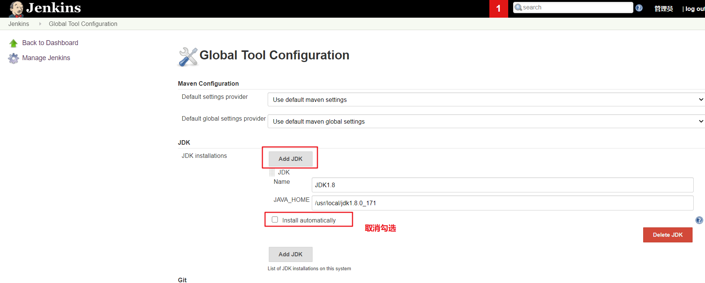
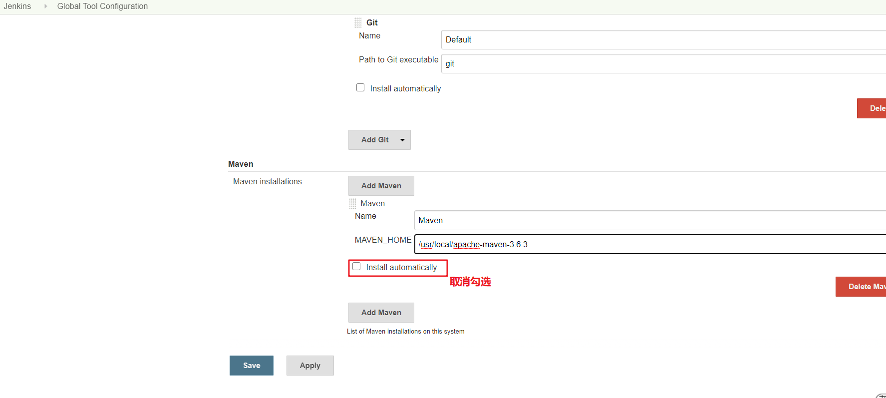
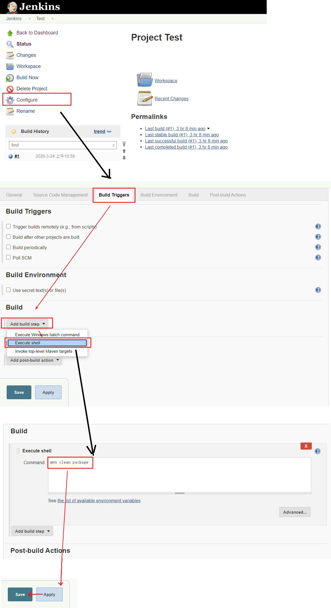
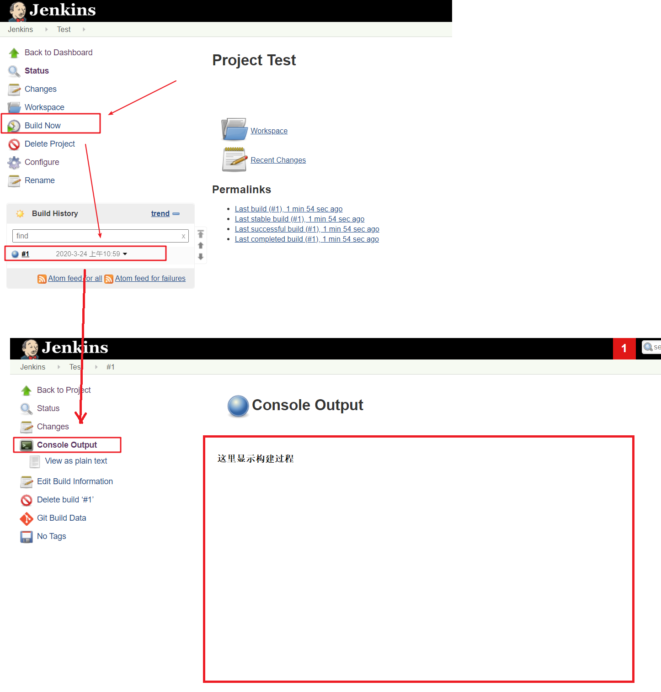

# Maven安装与配置

在Jenkins集成服务器上，我们需要安装Maven来编译和打包项目。

## 第一步：安装Maven

**第一步**：官网下载Maven压缩包，解压至`/usr/local/`目录下

```shell
$ tar -zxvf apache-maven-3.6.3-bin.tar.gz -C /usr/local/
```

**第二步：配置环境变量**

```shell
$ vim /etc/profile
```

输入G快速定位文件尾部，在尾部加上：

```shell
export MAVEN_HOME=/usr/local/apache-maven-3.6.3
export PATH=${MAVEN_HOME}/bin:${PATH}
```

输入以下命令，重新加载配置文件：

```shell
source /etc/profile
```

查看版本号，校验Maven是否安装成功：

```shell
$ mvn -v
```


## 第二步：全局工具配置管理JDK和Maven

Jenkins->Global Tool Confifiguration->JDK->新增JDK，配置如下：



Jenkins->Global Tool Confifiguration->Maven->新增Maven，配置如下：




## 第三步：添加Jenkins全局变量

Manage Jenkins->Confifigure System->Global Properties ，添加三个全局变量JAVA_HOME、M2_HOME、PATH+EXTRA：


## 第四步：修改Maven中央仓库地址

编辑Maven的配置文件：

```shell
vim /usr/local/apache-maven-3.6.3/conf/setting.xml
```

在mirrors标签中添加下列镜像：

```xml
<mirror>  
    <id>alimaven</id>  
    <name>aliyun maven</name>  
    <url>http://maven.aliyun.com/nexus/content/groups/public/</url>  
    <mirrorOf>central</mirrorOf>          
</mirror>
<mirror>
	<id>nexus-tencentyun</id>
	<mirrorOf>central</mirrorOf>
	<name>Nexus tencentyun</name>
	<url>http://mirrors.tencentyun.com/nexus/repository/maven-public/</url>
</mirror> 
<mirror>
	<id>ui</id>
	<mirrorOf>central</mirrorOf>
	<name>Human Readable Name for this Mirror.</name>
	<url>http://uk.maven.org/maven2/</url>
</mirror>
<mirror>
    <id>osc</id>
    <mirrorOf>central</mirrorOf>
    <url>http://maven.oschina.net/content/groups/public/</url>
</mirror>
<mirror>
    <id>osc_thirdparty</id>
    <mirrorOf>thirdparty</mirrorOf>
    <url>http://maven.oschina.net/content/repositories/thirdparty/</url>
</mirror>
```


## 第五步：测试Maven是否配置成功

使用之前的gitlab密码测试项目，修改配置：



再次构建，如果可以把项目打成war包，代表maven环境配置成功啦！



