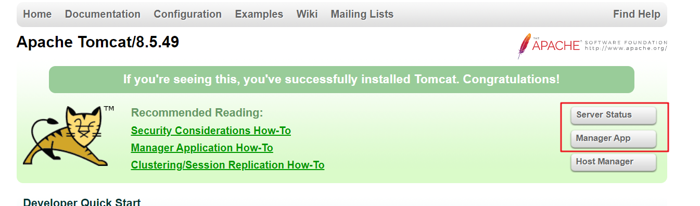
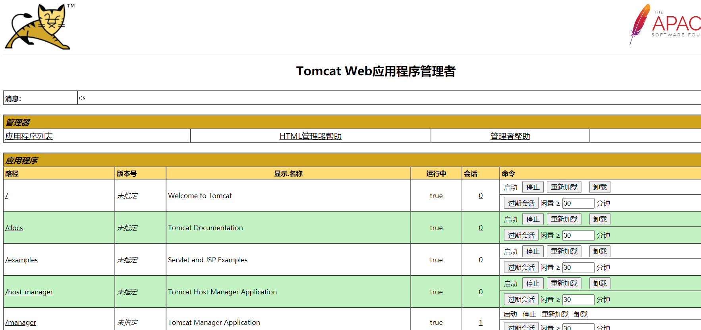

# Tomcat安装与配置

第一步：上传Tomcat压缩包值至服务器，并解压至/usr/local/目录下。

```shell
$ tar -zxvf apache-tomcat-8.5.49.tar.gz -C /usr/local/
```

第二步：打开防火墙8080端口

```shell
/sbin/iptables -I INPUT -p tcp --dport 8080 -j ACCEPT #开启端口
/etc/rc.d/init.d/iptables save #保存配置
```

第三步：配置Tomcat用户权限角色

```shell
vim /usr/local/apache-tomcat-8.5.49/conf/tomcat-users.xml
```

在`tomcat-users`节点里面添加如下配置：

```xml
<role rolename="tomcat"/>
<role rolename="manager-script"/>
<role rolename="manager-gui"/>
<role rolename="manager-status"/>
<role rolename="admin-gui"/>
<role rolename="admin-script"/>
<user username="root" password="123456789" roles="manager-gui,manager-script,tomcat,admin-gui,admin-script"/></tomcat-users>
```

为了使第三方主机能登录Tomcat管理器中需要将`{tomcat_home}/$webapps/manager/META-INF/context.xml`

中如下内容注释：

```xml
<!--
<Valve className="org.apache.catalina.valves.RemoteAddrValve"allow="127\.\d+\.\d+\.\d+|::1|0:0:0:0:0:0:0:1" />
-->
```

第四步：启动tomcat

```shell
cd  /usr/local/apache-tomcat-8.5.49/bin
./startup.sh
```


第五步：访问tomcat，点击后台管理，输入用户名密码看到如下内容及代表配置成功：





