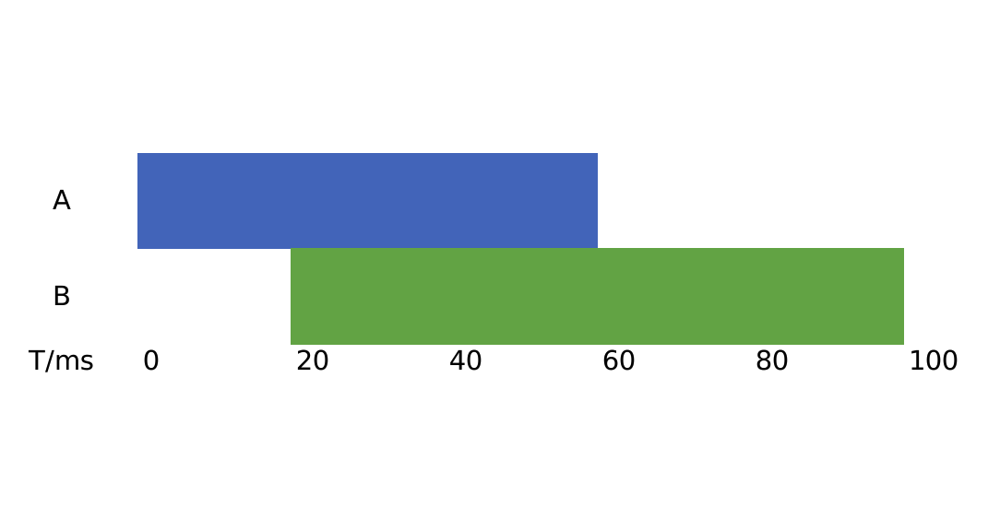
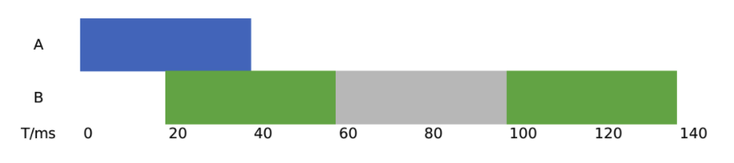
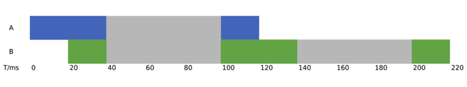
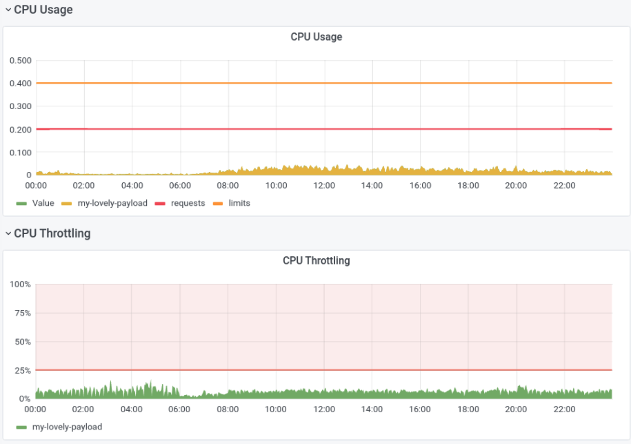

# k8s CPU limit和throttling的迷思

> 本文转载至：[k8s CPU limit和throttling的迷思 · nanmu42](https://nanmu.me/zh-cn/posts/2021/myth-of-k8s-cpu-limit-and-throttle/?utm_source=ld246.com)

你应当小心设定k8s中负载的CPU limit，太小的值会给你的程序带来额外的、无意义的延迟，太大的值会带来过大的爆炸半径，削弱集群的整体稳定性。

## 一. request和limit

k8s的一大好处就是资源隔离，通过设定负载的request和limit，我们可以方便地让不同程序共存于合适的节点上。

其中，request是给调度看的，调度会确保节点上所有负载的CPU request合计与内存request合计分别都不大于节点本身能够提供的CPU和内存，limit是给节点（kubelet）看的，节点会保证负载在节点上只使用这么多CPU和内存。例如，下面配置意味着单个负载会调度到一个剩余CPU request大于0.1核，剩余request内存大于200MB的节点，并且负载运行时的CPU使用率不能高于0.4核（超过将被限流），内存使用不多余300MB（超过将被OOM Kill并重启）。

```yaml
resources:
  requests:
    memory: 200Mi
    cpu: "0.1"
  limits:
    memory: 300Mi
    cpu: "0.4"
```

简单来说：

1. Request是资源预估申请，由K8s调度决策是否能够满足申请，如有资源则保证供给，如果资源资源不足则显示等待状态。
2. Limit是容器资源限额：
   - 内存超额 > OOMKill相关的容器
   - CPU超额 > 限制使用量(throttling)
3. Request <= Limit

## 二. CPU利用率

CPU和内存不一样，它是量子化的，只有“使用中”和“空闲”两个状态。

当我们说内存的使用率是60%时，我们是在说内存有60%在**空间上**已被使用，还有40%的空间可以放入负载。但是，当我们说CPU的某个核的使用率是60%时，我们是在说采样时间段内，CPU的这个核在**时间上**有60%的时间在忙，40%的时间在睡大觉。

你设定负载的CPU limit时，这个时空区别可能会带来一个让你意想不到的效果——过分的降速限流， 节点CPU明明不忙，但是节点故意不让你的负载全速使用CPU，服务延时上升。

## 三. CPU限流

k8s使用CFS（Completely Fair Scheduler，完全公平调度）限制负载的CPU使用率，[CFS本身的机制比较复杂](https://en.wikipedia.org/wiki/Completely_Fair_Scheduler)，但是k8s的文档中给了一个[简明的解释](https://kubernetes.io/docs/concepts/configuration/manage-resources-containers/#how-pods-with-resource-limits-are-run)，要点如下：

- CPU使用量的计量周期为100ms；
- CPU limit决定每计量周期（100ms）内容器可以使用的CPU时间的上限；
- 本周期内若容器的CPU时间用量达到上限，CPU限流开始，容器只能在下个周期继续执行；
- 1 CPU = 100ms CPU时间每计量周期，以此类推，0.2 CPU = 20ms CPU时间每计量周期，2.5 CPU = 250ms CPU时间每计量周期；
- 如果程序用了多个核，CPU时间会累加统计。

举个例子，假设一个API服务在响应请求时需要使用A, B两个线程（2个核），分别使用60ms和80ms，其中B线程晚触发20ms，我们看到API服务在100ms后可给出响应：



如果CPU limit被设为1核，即每100ms内最多使用100ms CPU时间，API服务的线程B会受到一次限流（灰色部分），服务在140ms后响应：



如果CPU limit被设为0.6核，即每100ms内最多使用60ms CPU时间，API服务的线程A会受到一次限流（灰色部分），线程B受到两次限流，服务在220ms后响应：



注意，**即使此时CPU没有其他的工作要做，限流一样会执行**，这是个死板不通融的机制。

这是一个比较夸张的例子，一般的API服务是IO密集型的，CPU时间使用量没那么大（你在跑模型推理？当我没说），但还是可以看到，限流会实打实地延伸API服务的延时。因此，对于延时敏感的服务，我们都应该尽量避免触发k8s的限流机制。

下面这张图是我工作中一个API服务在pod级别的CPU使用率和CPU限流比率（CPU Throttling），我们看到，CPU限流的情况在一天内的大部分时候都存在，限流比例在10%上下浮动，这意味着服务的工作没能全速完成，在速度上打了9折。值得一提，这时pod所在节点仍然有富余的CPU资源，节点的整体CPU使用率没有超过50%。



你可能注意到，监控图表里的CPU使用率看上去没有达到CPU limit（橙色横线），这是由于CPU使用率的统计周期（1min）太长造成的[信号混叠（Aliasing）](https://en.wikipedia.org/wiki/Aliasing)，如果它的统计统计周期和CFS的一样（100ms），我们就能看到高过CPU limit的尖刺了。（这不是bug，这是feature）

不过，[内核版本低于4.18的Linux还真有个bug会造成不必要的CPU限流](https://github.com/kubernetes/kubernetes/issues/67577#issuecomment-466609030)。┑(￣Д ￣)┍

## 四. 避免CPU限流

有的开发者倾向于[完全弃用CPU limit](https://amixr.io/blog/what-wed-do-to-save-from-the-well-known-k8s-incident/)，裸奔直接跑，特别是[内核版本不够有bug的时候](https://medium.com/omio-engineering/cpu-limits-and-aggressive-throttling-in-kubernetes-c5b20bd8a718)。

我认为这么做还是太过放飞自我了，如果程序里有耗尽CPU的bug（例如死循环，我不幸地遇到过），整个节点及其负载都会陷入不可用的状态，爆炸半径太大，特别是在大号的节点上（16核及以上）。

我有两个建议：

1. 监控一段时间应用的CPU利用率，基于利用率设定一个合适的CPU limit（例如，日常利用率的95分位 * 10），同时该limit不要占到节点CPU核数的太大比例（例如2/3），这样可以达到性能和安全的一个平衡。
2. 使用[automaxprocs](https://github.com/uber-go/automaxprocs)一类的工具让程序适配CFS调度环境，各个语言应该都有类似的库或者执行参数，根据CFS的特点调整后，[程序更不容易遇到CPU限流](https://github.com/uber-go/automaxprocs/issues/12#issuecomment-405976401)。

## 五. 结语

上面说到的信号混叠（采样频率不足）和Linux内核bug让我困扰了一年多，现在想想，主要还是望文生义惹的祸，文档还是应该好好读，基础概念还是要搞清，遂记此文章于[错而知新](https://nanmu.me/zh-cn/categories/错而知新/)。

题外话，性能和资源利用率有时是相互矛盾的。对于延时不敏感的程序，CPU限流率控制在10%以内应该都是比较健康可接受的，量体裁衣，在线离线负载混合部署，可以提升硬件的资源利用率。 有消息说腾讯云研发投产了[基于服务优先级的抢占式调度](https://cloud.tencent.com/developer/article/1876817)，这是一条更难但更有效的路，希望有朝一日在上游能看到他们的相关贡献。

