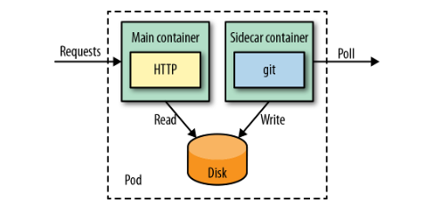

# Kubernetes 应用最佳实践 - Sidecar 模式

## 一. 什么是 Sidecar 模式

Sidecar 和 Kubernetes 之间并没有什么实质性联系，但是通过 Sidecar 的机械工业设计思路，可以提炼出一种代码或者模块间的工作模式，称之为 “Sidecar 模式”。

在前面的文章中提到过，**Pod 是 Kubernetes 中应用运行的最小单位 (同时也是顶级资源)，也称为容器组**，既然每个 Pod 可以存在多个容器， 根据二八原则，可以将多个容器分为核心容器和非核心容器，将机械的 Sidecar (三轮摩托) 映射到 Pod 中的容器资源，就可以得到 “Sidecar 模式” 的通俗表达:

- 核心容器也称为 Main 容器，负责主要工作 (对应三轮摩托的驾驶位)
- 非核心容器也称为 Sidecar 容器，负责辅助工作和扩展性工作 (对应三轮摩托的侧面单轮装置)

### 1.1 组合优于继承

**Sidecar 容器可以在不修改 Main 容器的情况下，进行功能扩展和增强，允许功能单一的容器通过运行时组合完成更多任务，同时分离每个容器的关注点**。

大多数情况下，多个不同的容器由不同的团队开发，并且使用不同的技术栈，通过正交性保证单个容器在其他服务中可以被复用，既可以单个容器作为 Pod 独立运行，也可以多个容器协作运行。

## 二. Sidecar 模式应用场景

Pod 内部的容器可以通过卷 (Volume) 来共享文件数据，并且通过本地网络进行通信，我们可以利用 Pod 这两个特性来列举几个使用 Sidecar 模式的小例子。

### 2.1 静态资源服务器

在这个示例中，主要分为两个容器:

1. Main 容器: HTTP Server 容器仅仅提供静态资源文件的 HTTP 请求服务，不需要关注具体的文件来源
2. Sidecar 容器: 将静态资源文件通过 Git 定时从远程服务器同步到本地 HTTP Server 指定的目录，不需要关注文件同步后的下一步操作

### 2.2 配置热更新

在这个示例中，主要分为两个容器:

1. Main 容器: 也就是应用容器
2. Sidecar 容器: 将 ConfigMap 挂载为一个卷（Volume), 应用可以直接从卷中读取配置数据 (这里的 Sidecar 并不是容器形式，但是这也是 Sidecar 模式的一种体现)

当配置数据需要更新时，修改 ConfigMap, 然后 Kubernetes 会自动触发相关的事件，通知 Pod 更新其挂载的卷，Pod 接收到更新事件，重新加载卷中的配置文件，从而实现配置热更新。

### 2.3 日志采集

在这个示例中，主要分为两个容器:

1. Main 容器: 也就是应用容器
2. Sidecar 容器: 也就是 FileBeat 日志收集组件

FileBeat 收集日志之后，发送到 ElasticSearch 集群, 最后通过 Kibana 展示。

### 2.4 服务网格（Service Mesh）

在传统的微服务架构下服务调用的原理。可以看下面这张图，服务消费者这边除了自身的业务逻辑实现外，还需要集成部分服务框架的逻辑，比如服务发现、负载均衡、熔断降级、封装调用等，而服务提供者这边除了实现服务的业务逻辑外，也要集成部分服务框架的逻辑，比如线程池、限流降级、服务注册等。

而在 Service Mesh 架构中，服务框架的功能都集中实现在 Sidecar 里，并在每一个服务消费者和服务提供者的本地都部署一个 Sidecar，服务消费者和服务提供者只管自己的业务实现，服务消费者向本地的 Sidecar 发起请求，本地的 Sidecar 根据请求的路径向注册中心查询，得到服务提供者的可用节点列表后，再根据负载均衡策略选择一个服务提供者节点，并向这个节点上的 Sidecar 转发请求，服务提供者节点上的 Sidecar 完成流量统计、限流等功能后，再把请求转发给本地部署的服务提供者进程，从而完成一次服务请求。

可以把服务消费者节点上的 Sidecar 叫作正向代理，服务提供者节点上的 Sidecar 叫作反向代理，那么 Service Mesh 架构的关键点就在于服务消费者发出的请求如何通过正向代理转发以及服务提供者收到的请求如何通过反向代理转发。主要有两种实现方案。

- 基于 iptables 的网络拦截。这种方案请见下图，节点 A 上服务消费者发出的 TCP 请求都会被拦截，然后发送给正向代理监听的端口 15001，正向代理处理完成后再把请求转发到节点 B 的端口 9080。节点 B 端口 9080 上的所有请求都会被拦截发送给反向代理监听的端口 15001，反向代理处理完后再转发给本机上服务提供者监听的端口 9080。

  

- 采用协议转换的方式。这种方案请见下图，节点 A 上的服务消费者请求直接发给正向代理监听的端口 15001，正向代理处理完成后，再把请求转发到节点 B 上反向代理监听的端口 15001，反向代理处理完成后再发送给本机上的服务提供者监听的端口 9080。

  

可见，这两种方案最大的不同之处在于，一个是通过 iptables 网络拦截实现代理转发的，一个是靠直接把请求发送给代理来转发的。基于 iptables 网络拦截的方式，理论上会有一定的性能损耗，但它的优点是从网络层实现调用拦截，能做到完全的业务无感知，所以适合云原生应用。而直接把请求发送给代理的方式，要求代理层加入业务逻辑，才能把请求转发给对应的服务提供者监听的端口。

> 本文参考转载至：[Kubernetes 应用最佳实践 - Sidecar 模式 - 蛮荆 (dbwu.tech)](https://dbwu.tech/posts/k8s/sidecar/)