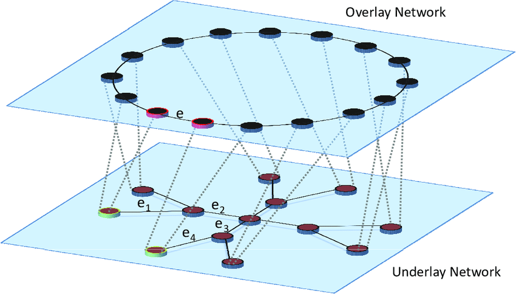

# 为什么集群需要 Overlay 网络

> 本文转载至：[为什么集群需要 Overlay 网络 - 面向信仰编程 (draveness.me)](https://draveness.me/whys-the-design-overlay-network/)

## 一. 什么是 Overlay 网络

对计算机网络或者 Kubernetes 网络稍有了解的工程师都应该听说过延展网络（Overlay Network），Overlay 网络其实并不是一门新技术，它是指构建在另一个网络上的计算机网络，这是一种网络虚拟化技术的形式，近年来云计算虚拟化技术的演进促进了网络虚拟化技术的应用。

因为 Overlay 网络是建立在另一个计算机网络之上的虚拟网络，所以它不能独立出现，Overlay 底层依赖的网络就是 Underlay 网络，这两个概念也经常成对出现。

Underlay 网络是专门用来承载用户 IP 流量的基础架构层，它与 Overlay 网络之间的关系有点类似物理机和虚拟机。Underlay 网络和物理机都是真正存在的实体，它们分别对应着真实存在的网络设备和计算设备，而 Overlay 网络和虚拟机都是依托在下层实体使用软件虚拟出来的层级。

在分析 Overlay 网络的作用之前，我们需要对它的常见实现有大概的了解，在实践中我们一般会使用虚拟局域网扩展技术（Virtual Extensible LAN，VxLAN）组建 Overlay 网络。在下图中，两个物理机可以通过三层的 IP 网络互相访问：

> VxLAN 使用虚拟隧道端点（Virtual Tunnel End Point、VTEP）设备对服务器发出和收到的数据包进行二次封装和解封。

上图中两个 VTEP 会相互连接并获得网络中的 MAC 地址、IP 地址等信息，例如，服务器 1 中的 VTEP 需要知道想要访问绿色网络中的 10.0.0.2 虚拟机需要先访问 IP 地址为 204.79.197.200 的服务器 2。这些配置可以被网络管理员手动配置、自动学习、也可以通过上层的管理器设置。当绿色的 10.0.0.1 虚拟机想要向绿色的 10.0.0.2 发送数据时，会经过以下几个步骤：

1. 绿色的 10.0.0.1 会将 IP 数据包发送给 VTEP；
2. 服务器 1 的 VTEP 收到 10.0.0.1 发送的数据包后；
   1. 从收到的 IP 数据包中获取目的虚拟机的 MAC 地址；
   2. 在本地的转发表中查找该 MAC 地址所在服务器的 IP 地址，即 204.79.197.200；
   3. 将绿色虚拟机所在的虚拟网络标识符（VxLAN Network Identifier、VNI）以及原始的 IP 数据包作为负载，构建新的 UDP 数据包；
   4. 将新的 UDP 数据包发送到网络中；
3. 服务器 2 的 VTEP 收到 UDP 数据包后；
   1. 去掉 UDP 数据包中的协议头；
   2. 查看数据包中 VNI；
   3. 将 IP 数据包转发给目标的绿色服务器 10.0.0.2；
4. 绿色的 10.0.0.2 会收到绿色服务器 10.0.0.1 发送的数据包；

在数据包的传输过程中，通信的双方都不知道底层网络做的这些转换，它们认为两者可以通过二层的网络互相访问，但是实际上经过了三层 IP 网络的中转，通过 VTEP 之间建立的隧道实现了连通。除了 VxLAN 之外，Overlay 网络还有很多实现方案，不过也都大同小异。Overlay 网络虽然能够利用底层网络在多数据中心之间组成二层网络，但是它的封包和拆包过程也会带来额外开销，所以为什么我们的集群需要 Overlay 网络呢，本文将介绍 Overlay 网络解决的三个问题：

- 云计算中集群内的、跨集群的或者数据中心间的虚拟机和实例的迁移比较常见；
- 单个集群中的虚拟机规模可能非常大，大量的 MAC 地址和 ARP 请求会为网络设备带来巨大的压力；
- 传统的网络隔离技术 VLAN 只能建立 4096 个虚拟网络，公有云以及大规模的虚拟化集群需要更多的虚拟网络才能满足网络隔离的需求；

## 二. 应用场景

### 2.1 虚拟机迁移

Kubernetes 目前已经是容器编排领域的事实标准了，虽然很多传统行业仍然在使用物理机部署服务，但是越来越多的计算任务在未来都会跑在虚拟机上。虚拟机迁移是将虚拟机从一个物理硬件设备移到另一个设备的过程，因为日常的更新维护，集群中的大规模虚拟机迁移是比较常见的事情，上千台物理机组成的大集群使得集群内的资源调度变得更加容易，我们可以通过虚拟机迁移来提高资源的利用率、容忍虚拟机的错误并提高节点的可移植性。

当虚拟机所在的宿主机因为维护或者其他原因宕机时，当前实例就需要迁移到其他的宿主机上，为了保证业务不中断，我们需要保证迁移过程中的 IP 地址不变，因为 Overlay 是在网络层实现二层网络，所以多个物理机之间只要网络层可达就能组建虚拟的局域网，虚拟机或者容器迁移后仍然处于同一个二层网络，也就不需要改变 IP 地址。

如上图所示，迁移后的虚拟机与其他的虚拟机虽然位于不同的数据中心，但是由于上述两个数据中心之间可以通过 IP 协议连通，所以迁移后的虚拟机仍然可以通过 Overlay 网络与原集群的虚拟机组成二层网络，集群内部的主机也完全不清楚、不关心底层的网络架构，它们只知道不同虚拟机之间是可以连通的。

### 2.2 虚拟机规模

我们在 [为什么 MAC 地址不需要全球唯一](https://draveness.me/whys-the-design-non-unique-mac-address/) 曾经介绍过二层网络的通信需要依赖 MAC 地址，一个传统的二层网络需要网络设备中存储从 IP 地址到 MAC 地址的转发表。

目前 Kubernetes 官方支持的最大集群为 5000 节点，如果这 5000 个节点中的每个节点都仅仅包含一个容器，这对于内部的网络设备其实没有太大的压力，但是在实际情况下 5000 节点的集群中都包含几万甚至几十万个容器，当某个容器向集群中发送 ARP 请求，集群中的全部容器都会收到 ARP 请求，这时会带来极高的网络负载。

在使用 VxLAN 搭建的 Overlay 网络中，网络会将虚拟机发送的数据重新封装成 IP 数据包，这样网络只需要知道不同 VTEP 的 MAC 地址，由此可以将 MAC 地址表项中的几十万条数据降低到几千条，ARP 请求也只会在集群中的 VTEP 之间扩散，远端的 VTEP 将数据拆包后也仅会在本地广播，不会影响其他的 VTEP，虽然这对于集群中的网络设备仍然有较高的要求，但是已经极大地降低了核心网络设备的压力。

Overlay 网络其实与软件定义网络（Software-defined networking、SDN）[4](https://draveness.me/whys-the-design-overlay-network/#fn:4)密切相关，而 SDN 引入了数据平面和控制平面，其中数据平面负责转发数据，而控制平面负责计算并分发转发表。VxLAN 的 RFC7348 中只定义了数据平面的内容，由该技术组成的网络可以通过传统的自学习模式学习网络中的 MAC 与 ARP 表项[5](https://draveness.me/whys-the-design-overlay-network/#fn:5)，但是在大规模的集群中，我们仍然需要引入控制平面分发路由转发表。

### 2.3 网络隔离

大规模的数据中心往往都会对外提供云计算服务，同一个物理集群可能会被拆分成多个小块分配给不同的租户（Tenant），因为二层网络的数据帧可能会进行广播，所以出于安全的考虑这些不同的租户之间需要进行网络隔离，避免租户之间的流量互相影响甚至恶意攻击。传统的网络隔离会使用虚拟局域网技术（Virtual LAN、VLAN），VLAN 会使用 12 比特表示虚拟网络 ID，虚拟网络的上限是 4096 个。

4096 个虚拟网络对于大规模的数据中心来说远远不够，VxLAN 会使用 24 比特的 VNI 表示虚拟网络个数，总共可以表示 16,777,216 个虚拟网络，这也就能满足数据中心多租户网络隔离的需求了。

更多的虚拟网络其实是 VxLAN 顺手带来的好处，它不应该成为使用 VxLAN 的决定性因素。VLAN 协议的扩展协议 IEEE 802.1ad 允许我们在以太网帧中加入两个 802.1Q 的协议头，两个 VLAN ID 组成的 24 比特也可以表示 16,777,216 个虚拟网络[6](https://draveness.me/whys-the-design-overlay-network/#fn:6)，所以想要解决网络隔离不是使用 VxLAN 或者 Overlay 网络的充分条件。

## 三. 总结

今天的数据中心包含多个集群以及海量的物理机，Overlay 网络是虚拟机和底层网络设备之间的中间层，通过 Overlay 网络这一个中间层，我们可以解决虚拟机的迁移问题、降低二层核心网络设备的压力并提供更大规模的虚拟网络数量：

- 在使用 VxLAN 构成二层网络中，虚拟机在不同集群、不同可用区和不同数据中心迁移后，仍然可以保证二层网络的可达性，这能够帮助我们保证线上业务的可用性、提升集群的资源利用率、容忍虚拟机和节点的故障；
- 集群中虚拟机的规模可能是物理机是几十倍，与物理机构成的传统集群相比，虚拟机构成的集群包含的 MAC 地址数量可能多一两个数量级，网络设备很难承担如此大规模的二层网络请求，Overlay 网络通过 IP 封包和控制平面可以减少集群中的 MAC 地址表项和 ARP 请求；
- VxLAN 的协议头使用 24 位的 VNI 表示虚拟网络，总共可以表示 1600 万的虚拟网络，我们可以为不同的虚拟网络单独分配网络带宽，满足多租户的网络隔离需求；

需要注意的是，Overlay 网络只是一种在物理网络上的虚拟网络，使用该技术并不能直接解决集群中的规模性等问题，而 VxLAN 也不是组建 Overlay 网络的唯一方法，在不同场景中我们可以考虑使用不同的技术，例如：NVGRE、GRE 等。到最后，我们还是来看一些比较开放的相关问题，有兴趣的读者可以仔细思考一下下面的问题：

- VxLAN 将原始数据包封装成 UDP 在网络上分发，那么 NVGRE 和 STT 分别使用哪些方法传输数据呢？
- 在 Kubernetes 中部署 Overlay 网络应该使用什么技术或者软件？

