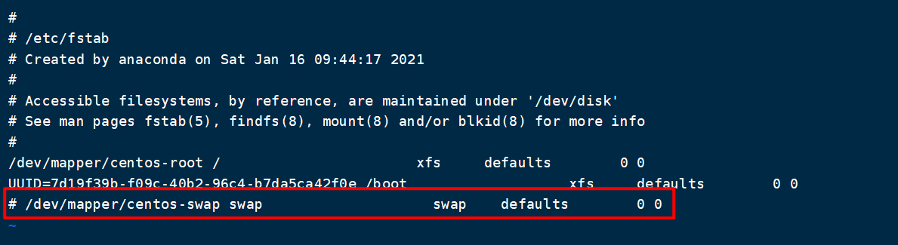

# Kubernetes入门

## 一. Kubernetes中的概念

Master：集群控制节点，每个集群至少需要一个Master节点负责集群管控

Node：工作负载节点，由Master分配容器到这些Node工作节点上，然后Node节点上的Docker负责容器的运行

Pod：Kubernetes的最小控制单元，容器都是运行在Pod中的，一个Pod可以有一个或多个容器

Controller：控制器，通过它来实现对Pod的管理，比如启动Pod、停止Pod、伸缩Pod的数量等

Service：Pod对外服务的统一入口，下面可以维护着同一类的多个Pod

Label：标签，用于对Pod进行分类，同一类Pod会拥有相同的标签

Namespace：命名空间，用来隔离Pod的运行环境

## 二. Kubernetes 组件

一个Kubernetes集群主要是由**控制节点（master）**、**工作节点（node）**构成，每个节点都会安装不同的组件。

**master：集群的控制平面，负责集群的决策**

- ApiServer：资源操作的唯一入口，接收用户输入的命令，提供认证、授权、API注册和发现等机制
- Scheduler：负责集群的资源调度，按照预定的调度策略将Pod调度到相应的node节点上
- ControllerManager：负责维护集群的状态，比如程序部署安排、故障检测、自动扩展、滚动更新等
- Etcd：负责存储集群中各种资源对象的信息

**node：集群的数据平面，负责给容器提供运行环境**

- Kubelet：负责维护容器的声明周期，即通过控制Docker来创建、更新、销毁容器
- KubeProxy：负责提供容器内部的服务发现和负载均衡
- Docker：负责节点上容器的各种操作

下面，以部署一个Nginx服务来说明Kubernetes系统各个组件调用关系：

1. 首先要明确，一旦Kubernetes环境启动之后，master和node都会将自身的信息存储到etcd数据库中
2. 一个Nginx服务的安装请求首先会被发送到master节点的ApiServe组件
3. ApiServer组件会调用Scheduler组件来决定到底应该把这个服务安装到拿个node节点上
4. ApiServer调用ControllerManager去调度Node节点安装Nginx服务
5. Kubelet接收到指令后，会通知Docker，然后Docker来启动一个Nginx的Pod
6. 至此一个Nginx服务就启动成功了，如果需要访问Nginx，就需要通过KubeProxy来对Pod产生访问的代理，这样外界用户就可以访问集群中的Nginx服务了

