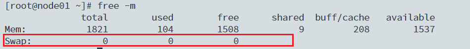
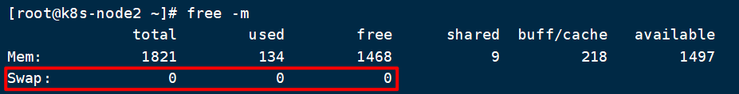
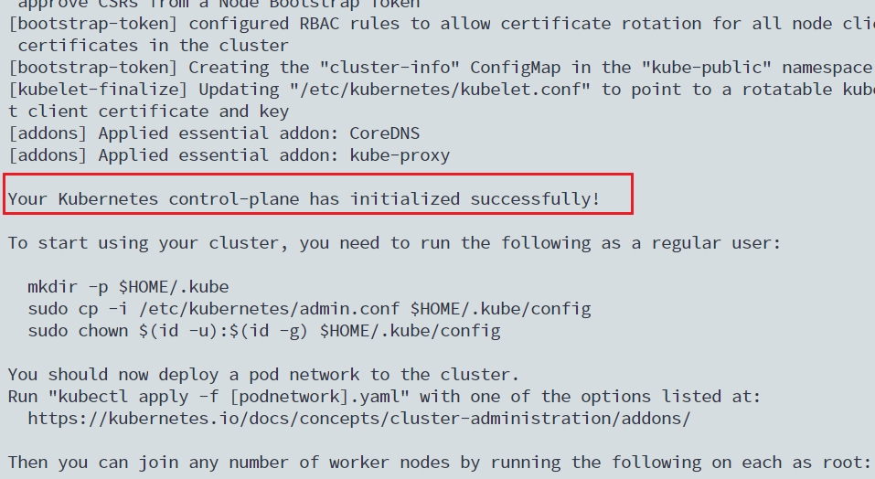
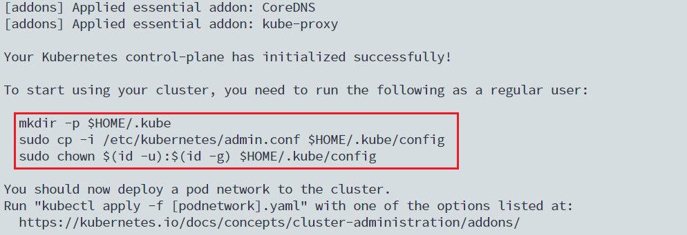
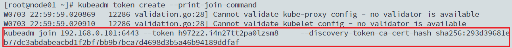
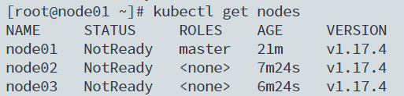
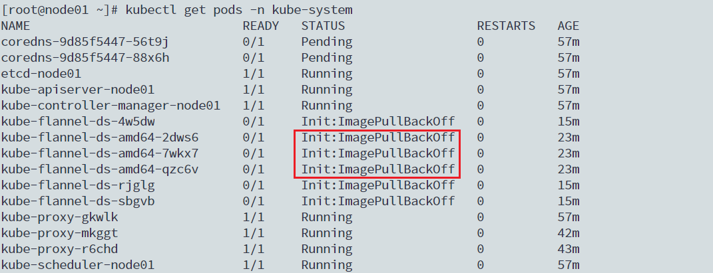
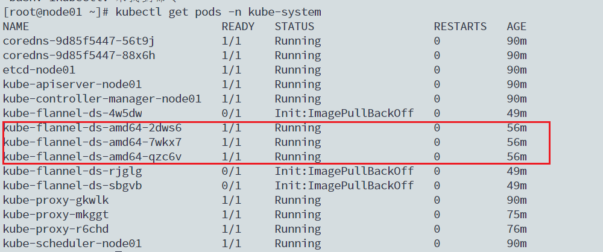
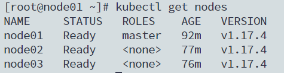

# Kubernetes集群搭建

> [(2条消息) Kubernetes学习--集群安装_404QAQ的博客-CSDN博客](https://blog.csdn.net/qq_43539962/article/details/118001579)

## 一. 环境规划

### 1.1 集群规划

Kubernetes集群大体上分为两类：**一主多从**和**多主多从**

- 一主多从：一台Master节点和多个Node节点，搭建简单，但是有单点故障风险，适合用于测试环境
- 多主多从：多台Master节点和多台Node节点，搭建麻烦，安全性高，适合生产环境

### 1.2 安装方式

Kubernetes有多种搭建方式，目前主流的方式有Kubeadm、minikube、二进制包

- minikube：一个用于快速搭建单节点Kubernetes的工具
- Kubeadm：一个用于快速搭建Kubernetes集群的工具
- 二进制包：从官网下载每个组件的二进制包，依次安装，此方式对于理解Kubernetes组件更加有效

本文用Kubeadm方式安装Kubernetes集群

### 1.3 主机规划

| 主机名称 | 作用   | 操作系统                      | IP地址        | 配置               |
| -------- | ------ | ----------------------------- | ------------- | ------------------ |
| node01   | Master | CentOS7.5 1804 基础设施服务器 | 192.168.0.101 | 2核 2G内存 50G硬盘 |
| node02   | Node   | CentOS7.5 1804 基础设施服务器 | 192.168.0.102 | 2核 2G内存 50G硬盘 |
| node03   | Node   | CentOS7.5 1804 基础设施服务器 | 192.168.0.103 | 2核 2G内存 50G硬盘 |

## 二. 集群搭建

本次环境搭建需要安装三台Linux系统（一主两从），然后为每个节点安装Docker（18.06.3），Kubeadm（1.17.4）、Kubelet（1.17.4）、Kubectl（1.17.4）程序。

### 2.1 环境初始化

（1）检查操作系统版本

```shell
#此方式下安装Kubernetes集群要求CentOS版本要大于等于7.5
cat /etc/redhat-release 
CentOS Linux release 7.5.1804 (Core) 
```

（2）主机名解析

为了后面集群节点的直接调用，在这配置一下主机名解析，企业中推荐使用内部的DNS服务器

```shell
#编辑三台服务器/etc/hosts文件，添加下列内容
192.168.0.101 node01
192.168.0.102 node02
192.168.0.103 node03
```

（3）时间同步

Kubernetes要求集群中的节点时间必须精确一致，这里直接使用`chronyd`服务从网络中同步时间。企业内部建议配置内部的时间同步服务器。

```shell
# 启动chronyd服务
systemctl start chronyd
# 设置chronyd服务开机自启
systemctl enable chronyd
```

（4）禁用iptables和firewalled服务

Kubernetes和Docker在运行时会产生大量的iptables规则，为了不让系统规则跟他们混淆，直接关闭系统规则

```shell
# 关闭firewalld服务
systemctl stop firewalld
systemctl disable firewalld
# 关闭iptables服务
systemctl stop iptables
systemctl disable iptables
```

（5）禁用selinux

selinux是linux系统下的一个安全服务，如果不关闭它，在集群安装过程中会产生很多各种各样的问题

```shell
# 编辑/etc/selinux/config文件，修改SELINUX的值为disabled
# 注意修改完毕后需要重启Linux
SELINUX=disabled
```

重启系统后我们可以使用下列命令，查看SELINUX是否禁用成功：

```shell
getenforce
```


（6）禁用swap分区

swap分区指的是虚拟内存分区，它的作用是在物理内存不足时，将磁盘空间虚拟成内存来使用。启用swap分区会对系统性能产生很大负面影响，因此Kubernetes要求每个节点都禁用swap分区

```shell
# 编辑分区配置文件/etc/fstab，注释掉swap那一行
# 注意修改完毕后需要重启Linux
/dev/mapper/centos-root /                       xfs     defaults        0 0
UUID=118eac9a-1f8b-4483-a783-e039b883a45f /boot                   xfs     defaults       0 0
#/dev/mapper/centos-swap swap                    swap    defaults        0 0
```

重启系统后我们可以使用下列命令检查swap分区是否禁用成功：

```shell
free -m
```



（7）修改Linux内核参数

```shell
# 修改Linux内核参数，添加网桥过滤和地址转发功能
# 编辑/etc/sysctl.d/kubernetes.conf文件，添加如下配置：
net.bridge.bridge-nf-call-ip6tables = 1
net.bridge.bridge-nf-call-iptables = 1
net.ipv4.ip_forward = 1

# 重新加载配置
sysctl -p

# 加载网桥过滤模块
modprobe br_netfilter

# 查看网桥过滤模块是否成功
lsmod | grep br_netfilter
```

（8）配置ipvs

在kubernetes中service有两种代理模型，一种是基于iptables的，一种是基于ipvs的。两者比较的话，ipvs的性能明显要高一些，但是如果要使用它，需要手动载入ipvs模块

```shell
# 安装 ipset ipvsadmin
yum install ipset ipvsadmin -y

# 添加需要加载的模块写入脚本文件
cat <<EOF>  /etc/sysconfig/modules/ipvs.modules
#!/bin/bash
modprobe -- ip_vs
modprobe -- ip_vs_rr
modprobe -- ip_vs_wrr
modprobe -- ip_vs_sh
modprobe -- nf_conntrack_ipv4
EOF

# 为脚本文件添加执行权限
chmod +x /etc/sysconfig/modules/ipvs.modules

# 执行脚本文件
/bin/bash /etc/sysconfig/modules/ipvs.modules

# 查看对应的模块是否加载成功
lsmod | grep -e ip_vs -e nf_conntrack_ipv4
```



（9）重启服务器

上面第（6）步和第（7）部修改完毕后都需要重启服务器，我们在最后一步一起重启生效即可。

```shell
reboot
```

### 2.2 安装Docker

（1）切换镜像源

```shell
wget https://mirrors.aliyun.com/docker-ce/linux/centos/docker-ce.repo -O/etc/yum.repos.d/docker-ce.repo
```

（2）查看当前镜像源中支持的Docker版本

```shell
yum list docker-ce --showduplicates
```

（3）安装特定版本的docker-ce

必须指定`--setopt=obsoletes=0`，否则yum会自动安装最新的版本

```shell
 yum install --setopt=obsoletes=0 docker-ce-18.06.3.ce-3.el7 -y
```

（4）添加配置文件

- Docker在默认情况下使用的Cgroup Driver为cgroupfs，而kubernetes推荐使用systemd来代替cgroupfs。
- 修改Docker镜像仓库地址（加速镜像拉取速度）

```shell
mkdir /etc/docker

cat <<EOF > /etc/docker/daemon.json
{
       "exec-opts": ["native.cgroupdriver=systemd"],
       "registry-mirrors": ["https://kn0t2bca.mirror.aliyuncs.com"]
}
EOF
```

（5）启动Docker

```shell
# 启动docker
systemctl start docker
# 开机启动
systemctl enable docker 
```

### 2.3 安装Kubernetes组件

（1）修改镜像源

由于Kubernetes的镜像源在国外，速度比较慢，这里切换成国内的镜像源

编辑`/etc/yum.repos.d/kubernetes.repo`，添加下面的配置

```shell
cat <<EOF > /etc/yum.repos.d/kubernetes.repo
[kubernetes]
name=Kubernetes
baseurl=http://mirrors.aliyun.com/kubernetes/yum/repos/kubernetes-el7-x86_64
enabled=1
gpgcheck=0
repo_gpgcheck=0
gpgkey=http://mirrors.aliyun.com/kubernetes/yum/doc/yum-key.gpg
http://mirrors.aliyun.com/kubernetes/yum/doc/rpm-package-key.gpg
EOF
```

（2）安装kubeadm、kubelet、kubectl

```shell
yum install --setopt=obsoletes=0 kubeadm-1.17.4-0 kubelet-1.17.4-0 kubectl-1.17.4-0 -y
```

（3）配置kubelet的cgroup

```shell
# 编辑/etc/sysconfig/kubelet，添加下面的配置
KUBELET_CGROUP_ARGS="--cgroup-driver=systemd"
KUBE_PROXY_MODE="ipvs"
```

（4）设置kubelet开机自启

```shell
systemctl enable kubelet
```

### 2.4 初始化集群

（1）初始化主节点

```shell
kubeadm init \
# 使用阿里云镜像仓库
--image-repository registry.aliyuncs.com/google_containers \
--kubernetes-version=v1.17.4 \
--pod-network-cidr=10.244.0.0/16 \
--service-cidr=10.96.0.0/12 \
# 此处填写主节点IP
--apiserver-advertise-address=192.168.0.101
```

这个过程会比较慢，需要等待一段时间，当我们看到下面这个提示时代表Master节点初始化成功：



需要注意的是，在成功输出的下方有一串提示，我们需要执行所提示的命令：



执行下列命令，我们就可以看到集群的主节点了：

```shell
kubectl get nodes
```

tips：如果不执行上面警告的命令，可能会出现`The connection to the server localhost:8080 was refused - did you specify the right host or port?`的保存


（2）将Node节点加入集群管理

在主节点上执行下列命令生成一条token，用于子节点加入集群：

```shell
# 生成新的token和命令。然后在node上执行
kubeadm token create --print-join-command
```



上面生成的命令需要在工作节点上执行（Node02、Node03），这样就将工作节点加入Master节点（Node01）管理。加入完成后我们使用下列命令即可查看整个集群状态：

```shell
kubectl get nodes
```



### 2.5 网络插件安装

在上面的命令中，三个节点都是`NotReady`状态，这是因为集群未安装网络插件。kubernetes支持多种网络插件，比如flannel、calico、canal等等，这里选择使用flannel

> 提示：下列操作只在Master节点执行，插件使用的是DeamonSet的控制器，它会在每个节点上都运行

```shell
# 获取fannel的配置文件
wget https://raw.githubusercontent.com/coreos/flannel/master/Documentation/kube-flannel.yml

# 修改文件中quay.io仓库为quay-mirror.qiniu.com
```

由于国内网络环境，上述文件很难直接下载，这里给出文件内容，我们只需要在Master节点任意地方新建`kube-flannel.yml`文件，然后将下面内容复制进去即可：

```yml
apiVersion: policy/v1beta1
kind: PodSecurityPolicy
metadata:
  name: psp.flannel.unprivileged
  annotations:
    seccomp.security.alpha.kubernetes.io/allowedProfileNames: docker/default
    seccomp.security.alpha.kubernetes.io/defaultProfileName: docker/default
    apparmor.security.beta.kubernetes.io/allowedProfileNames: runtime/default
    apparmor.security.beta.kubernetes.io/defaultProfileName: runtime/default
spec:
  privileged: false
  volumes:
    - configMap
    - secret
    - emptyDir
    - hostPath
  allowedHostPaths:
    - pathPrefix: "/etc/cni/net.d"
    - pathPrefix: "/etc/kube-flannel"
    - pathPrefix: "/run/flannel"
  readOnlyRootFilesystem: false
  # Users and groups
  runAsUser:
    rule: RunAsAny
  supplementalGroups:
    rule: RunAsAny
  fsGroup:
    rule: RunAsAny
  # Privilege Escalation
  allowPrivilegeEscalation: false
  defaultAllowPrivilegeEscalation: false
  # Capabilities
  allowedCapabilities: ['NET_ADMIN']
  defaultAddCapabilities: []
  requiredDropCapabilities: []
  # Host namespaces
  hostPID: false
  hostIPC: false
  hostNetwork: true
  hostPorts:
  - min: 0
    max: 65535
  # SELinux
  seLinux:
    # SELinux is unused in CaaSP
    rule: 'RunAsAny'
---
kind: ClusterRole
apiVersion: rbac.authorization.k8s.io/v1beta1
metadata:
  name: flannel
rules:
  - apiGroups: ['extensions']
    resources: ['podsecuritypolicies']
    verbs: ['use']
    resourceNames: ['psp.flannel.unprivileged']
  - apiGroups:
      - ""
    resources:
      - pods
    verbs:
      - get
  - apiGroups:
      - ""
    resources:
      - nodes
    verbs:
      - list
      - watch
  - apiGroups:
      - ""
    resources:
      - nodes/status
    verbs:
      - patch
---
kind: ClusterRoleBinding
apiVersion: rbac.authorization.k8s.io/v1beta1
metadata:
  name: flannel
roleRef:
  apiGroup: rbac.authorization.k8s.io
  kind: ClusterRole
  name: flannel
subjects:
- kind: ServiceAccount
  name: flannel
  namespace: kube-system
---
apiVersion: v1
kind: ServiceAccount
metadata:
  name: flannel
  namespace: kube-system
---
kind: ConfigMap
apiVersion: v1
metadata:
  name: kube-flannel-cfg
  namespace: kube-system
  labels:
    tier: node
    app: flannel
data:
  cni-conf.json: |
    {
      "name": "cbr0",
      "cniVersion": "0.3.1",
      "plugins": [
        {
          "type": "flannel",
          "delegate": {
            "hairpinMode": true,
            "isDefaultGateway": true
          }
        },
        {
          "type": "portmap",
          "capabilities": {
            "portMappings": true
          }
        }
      ]
    }
  net-conf.json: |
    {
      "Network": "10.244.0.0/16",
      "Backend": {
        "Type": "vxlan"
      }
    }
---
apiVersion: apps/v1
kind: DaemonSet
metadata:
  name: kube-flannel-ds-amd64
  namespace: kube-system
  labels:
    tier: node
    app: flannel
spec:
  selector:
    matchLabels:
      app: flannel
  template:
    metadata:
      labels:
        tier: node
        app: flannel
    spec:
      affinity:
        nodeAffinity:
          requiredDuringSchedulingIgnoredDuringExecution:
            nodeSelectorTerms:
              - matchExpressions:
                  - key: beta.kubernetes.io/os
                    operator: In
                    values:
                      - linux
                  - key: beta.kubernetes.io/arch
                    operator: In
                    values:
                      - amd64
      hostNetwork: true
      tolerations:
      - operator: Exists
        effect: NoSchedule
      serviceAccountName: flannel
      initContainers:
      - name: install-cni
        image: quay-mirror.qiniu.com/coreos/flannel:v0.12.0-amd64
        command:
        - cp
        args:
        - -f
        - /etc/kube-flannel/cni-conf.json
        - /etc/cni/net.d/10-flannel.conflist
        volumeMounts:
        - name: cni
          mountPath: /etc/cni/net.d
        - name: flannel-cfg
          mountPath: /etc/kube-flannel/
      containers:
      - name: kube-flannel
        image: quay-mirror.qiniu.com/coreos/flannel:v0.12.0-amd64
        command:
        - /opt/bin/flanneld
        args:
        - --ip-masq
        - --kube-subnet-mgr
        resources:
          requests:
            cpu: "100m"
            memory: "50Mi"
          limits:
            cpu: "100m"
            memory: "50Mi"
        securityContext:
          privileged: false
          capabilities:
            add: ["NET_ADMIN"]
        env:
        - name: POD_NAME
          valueFrom:
            fieldRef:
              fieldPath: metadata.name
        - name: POD_NAMESPACE
          valueFrom:
            fieldRef:
              fieldPath: metadata.namespace
        volumeMounts:
        - name: run
          mountPath: /run/flannel
        - name: flannel-cfg
          mountPath: /etc/kube-flannel/
      volumes:
        - name: run
          hostPath:
            path: /run/flannel
        - name: cni
          hostPath:
            path: /etc/cni/net.d
        - name: flannel-cfg
          configMap:
            name: kube-flannel-cfg
---
apiVersion: apps/v1
kind: DaemonSet
metadata:
  name: kube-flannel-ds-arm64
  namespace: kube-system
  labels:
    tier: node
    app: flannel
spec:
  selector:
    matchLabels:
      app: flannel
  template:
    metadata:
      labels:
        tier: node
        app: flannel
    spec:
      affinity:
        nodeAffinity:
          requiredDuringSchedulingIgnoredDuringExecution:
            nodeSelectorTerms:
              - matchExpressions:
                  - key: beta.kubernetes.io/os
                    operator: In
                    values:
                      - linux
                  - key: beta.kubernetes.io/arch
                    operator: In
                    values:
                      - arm64
      hostNetwork: true
      tolerations:
      - operator: Exists
        effect: NoSchedule
      serviceAccountName: flannel
      initContainers:
      - name: install-cni
        image: quay-mirror.qiniu.com/coreos/flannel:v0.12.0-arm64
        command:
        - cp
        args:
        - -f
        - /etc/kube-flannel/cni-conf.json
        - /etc/cni/net.d/10-flannel.conflist
        volumeMounts:
        - name: cni
          mountPath: /etc/cni/net.d
        - name: flannel-cfg
          mountPath: /etc/kube-flannel/
      containers:
      - name: kube-flannel
        image: quay-mirror.qiniu.com/coreos/flannel:v0.12.0-arm64
        command:
        - /opt/bin/flanneld
        args:
        - --ip-masq
        - --kube-subnet-mgr
        resources:
          requests:
            cpu: "100m"
            memory: "50Mi"
          limits:
            cpu: "100m"
            memory: "50Mi"
        securityContext:
          privileged: false
          capabilities:
             add: ["NET_ADMIN"]
        env:
        - name: POD_NAME
          valueFrom:
            fieldRef:
              fieldPath: metadata.name
        - name: POD_NAMESPACE
          valueFrom:
            fieldRef:
              fieldPath: metadata.namespace
        volumeMounts:
        - name: run
          mountPath: /run/flannel
        - name: flannel-cfg
          mountPath: /etc/kube-flannel/
      volumes:
        - name: run
          hostPath:
            path: /run/flannel
        - name: cni
          hostPath:
            path: /etc/cni/net.d
        - name: flannel-cfg
          configMap:
            name: kube-flannel-cfg
---
apiVersion: apps/v1
kind: DaemonSet
metadata:
  name: kube-flannel-ds-arm
  namespace: kube-system
  labels:
    tier: node
    app: flannel
spec:
  selector:
    matchLabels:
      app: flannel
  template:
    metadata:
      labels:
        tier: node
        app: flannel
    spec:
      affinity:
        nodeAffinity:
          requiredDuringSchedulingIgnoredDuringExecution:
            nodeSelectorTerms:
              - matchExpressions:
                  - key: beta.kubernetes.io/os
                    operator: In
                    values:
                      - linux
                  - key: beta.kubernetes.io/arch
                    operator: In
                    values:
                      - arm
      hostNetwork: true
      tolerations:
      - operator: Exists
        effect: NoSchedule
      serviceAccountName: flannel
      initContainers:
      - name: install-cni
        image: quay-mirror.qiniu.com/coreos/flannel:v0.12.0-arm
        command:
        - cp
        args:
        - -f
        - /etc/kube-flannel/cni-conf.json
        - /etc/cni/net.d/10-flannel.conflist
        volumeMounts:
        - name: cni
          mountPath: /etc/cni/net.d
        - name: flannel-cfg
          mountPath: /etc/kube-flannel/
      containers:
      - name: kube-flannel
        image: quay-mirror.qiniu.com/coreos/flannel:v0.12.0-arm
        command:
        - /opt/bin/flanneld
        args:
        - --ip-masq
        - --kube-subnet-mgr
        resources:
          requests:
            cpu: "100m"
            memory: "50Mi"
          limits:
            cpu: "100m"
            memory: "50Mi"
        securityContext:
          privileged: false
          capabilities:
             add: ["NET_ADMIN"]
        env:
        - name: POD_NAME
          valueFrom:
            fieldRef:
              fieldPath: metadata.name
        - name: POD_NAMESPACE
          valueFrom:
            fieldRef:
              fieldPath: metadata.namespace
        volumeMounts:
        - name: run
          mountPath: /run/flannel
        - name: flannel-cfg
          mountPath: /etc/kube-flannel/
      volumes:
        - name: run
          hostPath:
            path: /run/flannel
        - name: cni
          hostPath:
            path: /etc/cni/net.d
        - name: flannel-cfg
          configMap:
            name: kube-flannel-cfg
---
apiVersion: apps/v1
kind: DaemonSet
metadata:
  name: kube-flannel-ds-ppc64le
  namespace: kube-system
  labels:
    tier: node
    app: flannel
spec:
  selector:
    matchLabels:
      app: flannel
  template:
    metadata:
      labels:
        tier: node
        app: flannel
    spec:
      affinity:
        nodeAffinity:
          requiredDuringSchedulingIgnoredDuringExecution:
            nodeSelectorTerms:
              - matchExpressions:
                  - key: beta.kubernetes.io/os
                    operator: In
                    values:
                      - linux
                  - key: beta.kubernetes.io/arch
                    operator: In
                    values:
                      - ppc64le
      hostNetwork: true
      tolerations:
      - operator: Exists
        effect: NoSchedule
      serviceAccountName: flannel
      initContainers:
      - name: install-cni
        image: quay-mirror.qiniu.com/coreos/flannel:v0.12.0-ppc64le
        command:
        - cp
        args:
        - -f
        - /etc/kube-flannel/cni-conf.json
        - /etc/cni/net.d/10-flannel.conflist
        volumeMounts:
        - name: cni
          mountPath: /etc/cni/net.d
        - name: flannel-cfg
          mountPath: /etc/kube-flannel/
      containers:
      - name: kube-flannel
        image: quay-mirror.qiniu.com/coreos/flannel:v0.12.0-ppc64le
        command:
        - /opt/bin/flanneld
        args:
        - --ip-masq
        - --kube-subnet-mgr
        resources:
          requests:
            cpu: "100m"
            memory: "50Mi"
          limits:
            cpu: "100m"
            memory: "50Mi"
        securityContext:
          privileged: false
          capabilities:
             add: ["NET_ADMIN"]
        env:
        - name: POD_NAME
          valueFrom:
            fieldRef:
              fieldPath: metadata.name
        - name: POD_NAMESPACE
          valueFrom:
            fieldRef:
              fieldPath: metadata.namespace
        volumeMounts:
        - name: run
          mountPath: /run/flannel
        - name: flannel-cfg
          mountPath: /etc/kube-flannel/
      volumes:
        - name: run
          hostPath:
            path: /run/flannel
        - name: cni
          hostPath:
            path: /etc/cni/net.d
        - name: flannel-cfg
          configMap:
            name: kube-flannel-cfg
---
apiVersion: apps/v1
kind: DaemonSet
metadata:
  name: kube-flannel-ds-s390x
  namespace: kube-system
  labels:
    tier: node
    app: flannel
spec:
  selector:
    matchLabels:
      app: flannel
  template:
    metadata:
      labels:
        tier: node
        app: flannel
    spec:
      affinity:
        nodeAffinity:
          requiredDuringSchedulingIgnoredDuringExecution:
            nodeSelectorTerms:
              - matchExpressions:
                  - key: beta.kubernetes.io/os
                    operator: In
                    values:
                      - linux
                  - key: beta.kubernetes.io/arch
                    operator: In
                    values:
                      - s390x
      hostNetwork: true
      tolerations:
      - operator: Exists
        effect: NoSchedule
      serviceAccountName: flannel
      initContainers:
      - name: install-cni
        image: quay-mirror.qiniu.com/coreos/flannel:v0.12.0-s390x
        command:
        - cp
        args:
        - -f
        - /etc/kube-flannel/cni-conf.json
        - /etc/cni/net.d/10-flannel.conflist
        volumeMounts:
        - name: cni
          mountPath: /etc/cni/net.d
        - name: flannel-cfg
          mountPath: /etc/kube-flannel/
      containers:
      - name: kube-flannel
        image: quay-mirror.qiniu.com/coreos/flannel:v0.12.0-s390x
        command:
        - /opt/bin/flanneld
        args:
        - --ip-masq
        - --kube-subnet-mgr
        resources:
          requests:
            cpu: "100m"
            memory: "50Mi"
          limits:
            cpu: "100m"
            memory: "50Mi"
        securityContext:
          privileged: false
          capabilities:
             add: ["NET_ADMIN"]
        env:
        - name: POD_NAME
          valueFrom:
            fieldRef:
              fieldPath: metadata.name
        - name: POD_NAMESPACE
          valueFrom:
            fieldRef:
              fieldPath: metadata.namespace
        volumeMounts:
        - name: run
          mountPath: /run/flannel
        - name: flannel-cfg
          mountPath: /etc/kube-flannel/
      volumes:
        - name: run
          hostPath:
            path: /run/flannel
        - name: cni
          hostPath:
            path: /etc/cni/net.d
        - name: flannel-cfg
          configMap:
            name: kube-flannel-cfg
```

使用配置文件启动fannel：

```shell
kubectl apply -f kube-flannel.yml
```

执行完成后如果还是处于NotReady状态：


我们执行下列命令查看`flannel`是否正常运行：

```shell
kubectl get pods -n kube-system
```



我们发现`flannel`由于拉取不到镜像，启动失败了，这说明更换的七牛云镜像也已经失效了，我们尝试从阿里云拉取镜像，然后把Tag标签更换为七牛云镜像：

```shell
# 拉取阿里镜像
docker pull registry.cn-shanghai.aliyuncs.com/leozhanggg/flannel:v0.12.0-amd64
# 更改镜像标签
docker tag registry.cn-shanghai.aliyuncs.com/leozhanggg/flannel:v0.12.0-amd64 quay-mirror.qiniu.com/coreos/flannel:v0.12.0-amd64
```

需要注意的是，上述命令需要在所有节点上都运行一遍，因为所有节点都需要运行`flannel`镜像。

此时我们再次在Master节点查看`flannel`状态，发现启动成功：



再次查看节点状态，三个节点都变成了Ready：




[k8s自学之路之集群搭建-亲测有效，无效请捶我 - 知乎 (zhihu.com)](https://zhuanlan.zhihu.com/p/364045880)

