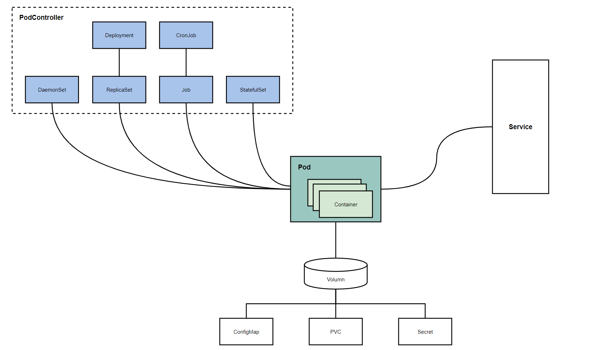

# 资源管理

## 一. 介绍

在Kubernetes中所有内容都抽象为资源，用户通过操作资源来管理Kubernetes。

Kubernetes本质上就是一个集群系统，用户可以在集群中部署各种各样的服务，所谓的部署服务，其实就是在Kubernetes集群中运行若干个容器，并将指定的程序放在容器中。

Kubernetes最小管理单元是Pod而不是容器，所以只能将容器放在Pod中，二Kubernetes一般也不会直接管理Pod，而是通过Pod控制器来管理Pod。

Pod可以提供服务之后，就需要考虑如何访问Pod的中的服务，Kubernetes提供了Service资源实现了这个功能。

当然，如果Pod中程序的数据需要持久化，Kubernetes提供了各种存储系统。



学习Kubernetes的核心，就是学习如何对集群上的Pod、Pod控制器、Service、存储等各种资源进行操作。

## 二. 资源管理方式

- 命令式对象管理，直接使用命令去操作Kubernetes资源

```shell
kubectl run nginx-pod --image=nginx:1.17.1 --port=80
```

- 命令式对象配置：通过命令配置和配置文件去操作Kubernetes资源

```shell
kubectl create/patch -f nginx-pod.yaml
```

- 声明对象配置：通过apply命令和配置文件去操作Kubernetes资源（创建和更新）

```shell
kubectl apply -f nginx-pod.yaml
```

| 类型           | 操作对象 | 适用环境 | 优点           | 缺点                             |
| -------------- | -------- | -------- | -------------- | -------------------------------- |
| 命令式对象管理 | 对象     | 测试     | 简单           | 只能操作活动对象，无法审计、跟踪 |
| 命令式对象配置 | 文件     | 开发     | 可以审计、跟踪 | 项目大时，配置文件多，操作麻烦   |
| 声明对象配置   | 目录     | 开发     | 支持目录操作   | 意外情况下难以调试               |

### 2.1 命令式对象管理

kubectl是Kubernetes集群的命令行工具，通过它能够对集群本身进行管理，并能够在集群上进行容器化应用的安装部署。kubectl命令的语法如下：

```shell
kubectl [command] [type] [name] [flags]
```

- command：指定要对资源执行的操作，例如create、get、delete
- type：指定资源类型，比如deployment、pod、service
- name：指定资源的名称，名称大小写敏感
- flags：指定额外的可选参数

```shell
# 查看所有pod
kubectl get pod

# 查看某个pod
kubectl get pod [pod_name]

# 查看某个pod，以yaml格式展示结果
kubectl get pod [pod_name] -o yaml

# 查看某个pod，展示详细信息
kubectl get pod [pod_name] -o wide
```

#### （1）command

基本命令

| 命令    | 作用         |
| ------- | ------------ |
| create  | 创建一个资源 |
| edit    | 编辑一个资源 |
| get     | 获取一个资源 |
| patch   | 更新一个资源 |
| delete  | 删除一个资源 |
| explain | 解释一个资源 |

运行和调试

| 命令      | 作用                     |
| --------- | ------------------------ |
| run       | 在集群中运行一个指定镜像 |
| expose    | 暴露资源给Service        |
| describe  | 显示资源内部信息         |
| logs      | 输出容器在Pod中的日志    |
| attach    | 进入运行中的容器         |
| exec      | 执行容器中的一个命令     |
| cp        | 在Pod内外复制文件        |
| rollout   | 管理资源的发布           |
| scale     | 扩缩容Pod的数量          |
| autoscale | 自动调整Pod的数量        |

高级命令

| 命令  | 作用                   |
| ----- | ---------------------- |
| apply | 通过文件对资源进行管理 |
| label | 更新资源上的标签       |

其它命令

| 命令         | 作用                         |
| ------------ | ---------------------------- |
| cluster-info | 显示集群信息                 |
| version      | 显示当前Server和Client的版本 |

#### （2）type

Kubernetes中资源类型繁多，下面列举一下常用的资源，如果有需要可以通过下列命令查看资源列表：

```shell
kubectl api-resources
```

集群级别资源

| 资源名称  | 缩写 | 资源作用     |
| --------- | ---- | ------------ |
| nodes     | no   | 集群组成部分 |
| namespace | ns   | 隔离Pod      |

Pod资源

| 资源名称 | 缩写 | 资源作用 |
| -------- | ---- | -------- |
| pods     | po   | 装载容器 |

Pod资源控制器

| 资源名称                 | 缩写 | 资源作用    |
| ------------------------ | ---- | ----------- |
| replicationcontrollers   | rc   | 控制Pod资源 |
| replicasets              | rs   | 控制Pod资源 |
| deployments              | ds   | 控制Pod资源 |
| daemonsets               | ds   | 控制Pod资源 |
| jobs                     |      | 控制Pod资源 |
| cronjobs                 | cj   | 控制Pod资源 |
| horizontalpodautoscalers | hpa  | 控制Pod资源 |
| statefulsets             | sts  | 控制Pod资源 |

服务发现资源

| 资源名称 | 缩写 | 资源作用        |
| -------- | ---- | --------------- |
| services | svc  | 统一Pod对外接口 |
| ingress  | ing  | 统一Pod对外接口 |

存储资源

| 资源名称               | 缩写 | 资源作用 |
| ---------------------- | ---- | -------- |
| volumeattachments      |      | 存储     |
| persistentvolumes      | pv   | 存储     |
| persistentvolumeclaims | pvc  | 存储     |

配置资源

| 资源名称   | 缩写 | 资源作用 |
| ---------- | ---- | -------- |
| configmaps | cm   | 配置     |
| secrets    |      | 配置     |

下面以一个namespace、pod的创建和删除简单演示下列命令的使用：

```shell
# 创建一个namespace
kubectl create namespace dev

# 获取namesapce
kubectl get ns

# 在dev namespace下创建并运行一个nginxPod
kubectl run pod --image=nginx -n dev

# 查看新建的Pod (只要不是对default命名空间下资源的操作都需要加上-n参数，指明操作的命名空间)
Kubectl get pod -n dev
NAME                   READY   STATUS    RESTARTS   AGE
pod-864f9875b9-2vdfq   1/1     Running   0          60s

# 删除指定Pod
kubectl delete pods pod-864f9875b9-2vdfq -n dev

# 删除指定namespace
kubectl delete ns dev
```

### 2.2 命令式对象配置

命令式对象配置就是使用命令配合配置文件一起来操作Kubernetes资源。

（1）创建一个nginxpod.yaml，内容如下：

```yaml
apiVersion: v1
kind: Namespace
metadata: 
  name: dev
  
---

apiVersion: v1
kind: Pod
metadata: 
  name: nginxpod
  namespace: dev
spec:
  containers:
  - name: nginx-containers
    image: nginx:1.17.1
```

（2）执行create命令，创建资源：

```shell
[root@node01 ~]# kubectl create -f nginxpod.yaml 
namespace/dev created
pod/nginxpod created
```

此时发现创建了两个资源，分别是namespace和pod

（3）执行get命令查看资源

```shell
[root@node01 ~]# kubectl get -f nginxpod.yaml 
NAME            STATUS   AGE
namespace/dev   Active   2m56s

NAME           READY   STATUS    RESTARTS   AGE
pod/nginxpod   1/1     Running   0          2m55s
```

（4）删除资源

```shell
[root@node01 ~]# kubectl delete -f nginxpod.yaml 
namespace "dev" deleted
pod "nginxpod" deleted
```

### 2.3 声明式对象配置

声明式对象配置与命令式对象配置很相似，但是它只有一个命令apply，主要用于资源的创建与更新。

```shell
# 首次执行一次kubectl apply -f nginxpod.yaml文件，代表创建资源
[root@node01 ~]# kubectl apply -f nginxpod.yaml 
namespace/dev created
pod/nginxpod created

# 第二次执行kubectl apply -f nginxpod.yaml文件，代表更新配置，但是由于配置文件内容并没有改变，所以会显示
namespace/dev unchanged
pod/nginxpod unchanged
```

其实声明式对象配置就是使用apply描述一个资源的最终状态（在yaml文件中定义）。如果描述的资源不存在，则创建该资源；如果描述的资源存在，则尝试更新该资源。

## 三. Node节点运行kubectl

默认情况下只能在Master节点上运行kubectl命令，我们需要将Master节点`~/.kube`文件夹复制到Node节点上才能在Node节点上运行该命令：

```shell
# 将家目录下,kube文件夹拷贝到node02节点的家目录下（这里写node02是因为hosts中配置node02的IP）
scp ~/.kube/ node02:~/
```

