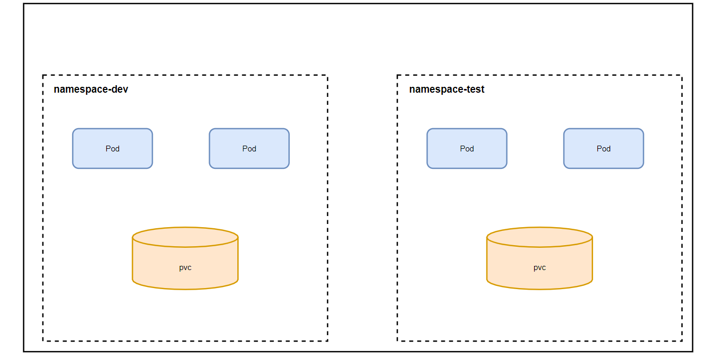
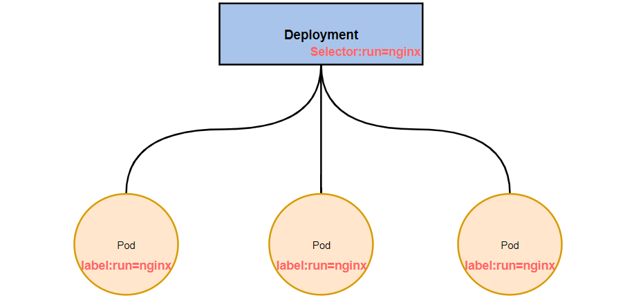
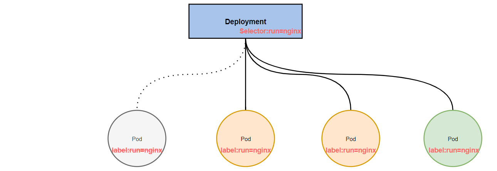

# 常见资源的基础操作

- [一. Namespace](#1)
  - [1.1 查看namespace](#1.1)
  - [1.2 新增namespace](#1.2)
  - [1.3 删除namespace](#1.3)
  - [1.4 声明式配置](#1.4)
- [二. Pod](#2)
  - [2.1 创建并运行](#2.1)
  - [2.2 查看Pod信息](#2.2)
  - [2.3 访问Pod](#2.3)
  - [2.4 删除Pod](#2.4)
- [三. Label](#3)
  - [3.1 为Pod打标签](#3.1)
  - [3.2 查看Pod上的标签](#3.2)
  - [3.3 更新标签](#3.3)
  - [3.4 删除标签](#3.4)
  - [3.5 通过标签筛选(Label Selector)](#3.5)
  - [3.6 声明式配置](#3.6)
- [四. Deployment](#4)
  - [4.1 创建Deployment](#4.1)
  - [4.2 查看Deployment](#4.2)
  - [4.3 删除Deployment](#4.3)
  - [4.4 声明式配置](#4.4)
- [五. Service](#5)
  - [5.1 创建Service](#5.1)
  - [5.2 查看Service](#5.2)
  - [5.3 删除Service](#5.3)
  - [5.4 声明式配置](#5.4)

## 一. Namespace<a name="1"></a>

Namespace是kubernetes系统中的一种非常重要资源，它的主要作用是用来实现**多套环境的资源隔离**或者**多租户的资源隔离**。

默认情况下，kubernetes集群中的所有的Pod都是可以相互访问的。但是在实际中，可能不想让两个Pod之间进行互相的访问，那此时就可以将两个Pod划分到不同的namespace下。kubernetes通过将集群内部的资源分配到不同的Namespace中，可以形成逻辑上的“组”，以方便不同的组的资源进行隔离使用和管理。

可以通过kubernetes的授权机制，将不同的namespace交给不同租户进行管理，这样就实现了多租户的资源隔离。此时还能结合kubernetes的资源配额机制，限定不同租户能占用的资源，例如CPU使用量、内存使用量等等，来实现租户可用资源的管理。



在集群启动后，会有几个默认的namespace：

```shell
[root@node01 ~]# kubectl get namespace
NAME              STATUS   AGE
default           Active   18h #所有未指定namespace的资源都会被分配到default命名空间中	
kube-node-lease   Active   18h #集群节点间的心跳维护，从v1.13开始引入
kube-public       Active   18h #此命名空间下的资源可以被所有人访问（包括未认证用户）
kube-system       Active   18h #所有由Kubernetes系统创建的资源都处于这个命名空间
```

下面来看Namespace资源的具体操作

#### （1）查看namespace<a name="1.1"></a>

```shell
kubectl get namespace 
kubectl get ns  

#查看指定Namespace
kubectl get ns [名称]

#指定输出格式
kubectl get ns [名称] -o [wide|json|yaml]

#查看namespace详情
kubectl describe ns [名称]

[root@node01 ~]# kubectl describe ns kube-system 
Name:         kube-system
Labels:       <none>
Annotations:  <none>
Status:       Active #Active 表示命名空间正在使用，Terminating表示正在删除该命名空间

No resource quota.#resource quota 针对命名空间做的资源限制

No LimitRange resource. #LimitRange针对命名空间中的每个组件做资源限制
```

#### （2）新增namespace<a name="1.2"></a>

```shell
kubectl create ns [名称]
```

#### （3）删除namespace<a name="1.3"></a>

```shell
kubectl delete ns [名称]
```

#### （4）声明式配置<a name="1.4"></a>

首先准备一个yaml文件：ns-dev.yaml

```yaml
apiVersion: v1
kind: Namespace
metadata: 
  name: dev
```

## 二. Pod<a name="2"></a>

Pod是kubernetes集群进行管理的最小单元，程序要运行必须部署在容器中，而容器必须存在于Pod中Pod可以认为是容器的封装，一个Pod中可以存在一个或者多个容器。

Kubernetes在集群启动之后，集群中的各个组件也都是以Pod方式运行的。可以通过下面命令查看：

```shell
[root@node01 ~]# kubectl get pod -n kube-system
NAME                             READY   STATUS    RESTARTS   AGE
coredns-9d85f5447-56t9j          1/1     Running   0          18h
coredns-9d85f5447-88x6h          1/1     Running   0          18h
etcd-node01                      1/1     Running   0          18h
kube-apiserver-node01            1/1     Running   0          18h
kube-controller-manager-node01   1/1     Running   0          18h
kube-flannel-ds-amd64-9sbgq      1/1     Running   0          155m
kube-flannel-ds-amd64-plfll      1/1     Running   0          155m
kube-flannel-ds-amd64-wwmvj      1/1     Running   0          155m
kube-proxy-gkwlk                 1/1     Running   0          18h
kube-proxy-mkggt                 1/1     Running   0          18h
kube-proxy-r6chd                 1/1     Running   0          18h
kube-scheduler-node01            1/1     Running   1          18h
```

#### （1）创建并运行<a name="2.1"></a>

Kubernetes没有提供单独运行Pod的命令，都是通过Pod控制器来实现的

```shell
# 命令格式：kubectl run [pod控制器名称] [参数]
# --image 镜像版本
# --port  暴露端口
# --namespace 命名空间

kubectl run nginx --image=nginx:1.17.1 --port=80 --namespace=dev
```

#### （2）查看Pod信息<a name="2.2"></a>

```shell
# 查看Pod基本信息
[root@node01 ~]# kubectl get pod -n dev
NAME                     READY   STATUS    RESTARTS   AGE
nginx-64777cd554-8rdmn   1/1     Running   0          25s

# 查看Pod详细信息
[root@node01 ~]# kubectl describe pod nginx-64777cd554-8rdmn -n dev
Name:         nginx-64777cd554-8rdmn
Namespace:    dev
Priority:     0
Node:         node03/192.168.0.103
Start Time:   Sun, 04 Jul 2021 16:38:12 +0800
Labels:       pod-template-hash=64777cd554
              run=nginx
Annotations:  <none>
Status:       Running
IP:           10.244.2.5
IPs:
  IP:           10.244.2.5
Controlled By:  ReplicaSet/nginx-64777cd554
Containers:
  nginx:
    Container ID:   docker://12ca94abb0735a3d640c139bcb53d46c2834b0d9e405dad090ad26f832fa66f5
    Image:          nginx:1.17.1
    Image ID:       docker-pullable://nginx@sha256:b4b9b3eee194703fc2fa8afa5b7510c77ae70cfba567af1376a573a967c03dbb
    Port:           80/TCP
    Host Port:      0/TCP
    State:          Running
      Started:      Sun, 04 Jul 2021 16:38:13 +0800
    Ready:          True
    Restart Count:  0
    Environment:    <none>
    Mounts:
      /var/run/secrets/kubernetes.io/serviceaccount from default-token-fpxdb (ro)
Conditions:
  Type              Status
  Initialized       True 
  Ready             True 
  ContainersReady   True 
  PodScheduled      True 
Volumes:
  default-token-fpxdb:
    Type:        Secret (a volume populated by a Secret)
    SecretName:  default-token-fpxdb
    Optional:    false
QoS Class:       BestEffort
Node-Selectors:  <none>
Tolerations:     node.kubernetes.io/not-ready:NoExecute for 300s
                 node.kubernetes.io/unreachable:NoExecute for 300s
Events: # Pod启动过程中发生的事件
  Type    Reason     Age        From               Message
  ----    ------     ----       ----               -------
  Normal  Scheduled  <unknown>  default-scheduler  Successfully assigned dev/nginx-64777cd554-8rdmn to node03
  Normal  Pulled     52m        kubelet, node03    Container image "nginx:1.17.1" already present on machine
  Normal  Created    52m        kubelet, node03    Created container nginx
  Normal  Started    52m        kubelet, node03    Started container nginx
```

#### （3）访问Pod<a name="2.3"></a>

```shell
#获取IP 
[root@node01 ~]# kubectl get pod -n dev -o wide
NAME                     READY   STATUS    RESTARTS   AGE   IP           NODE     NOMINATED NODE   READINESS GATES
nginx-64777cd554-8rdmn   1/1     Running   0          10m   10.244.2.5   node03   <none>           <none>

# 访问Pod
[root@node01 ~]# curl 10.244.2.5:80
<!DOCTYPE html>
<html>
<head>
<title>Welcome to nginx!</title>
<style>
    body {
        width: 35em;
        margin: 0 auto;
        font-family: Tahoma, Verdana, Arial, sans-serif;
......
```

#### （4）删除Pod<a name="2.4"></a>

```shell
# 删除指定Pod
[root@node01 ~]# kubectl delete pod nginx-64777cd554-8rdmn -n dev
pod "nginx-64777cd554-8rdmn" deleted

# 此时虽然显示删除成功，但是再查询，发现又新产生了一个
[root@node01 ~]# kubectl get pod -n dev 
NAME                     READY   STATUS    RESTARTS   AGE
nginx-64777cd554-479kh   1/1     Running   0          24s
```

直接删除Pod后，又会重新生成一个Pod是因为Pod控制器会监控Pod状况，一旦发现Pod死亡，会立即重建。

如果想要真正删除Pod，则需要将Pod控制器删除即可，删除Pod控制器后，它所控制的Pod也会自动删除：

```shell
# 查看Pod控制器
[root@node01 ~]# kubectl get deployment -n dev
NAME    READY   UP-TO-DATE   AVAILABLE   AGE
nginx   1/1     1            1           15m

# 删除Pod控制器
[root@node01 ~]# kubectl delete deployment nginx -n dev
deployment.apps "nginx" deleted
```

## 三. Label<a name="3"></a>

Label是kubernetes系统中的一个重要概念。它的作用就是在资源上添加标识，用来对它们进行区分和选择。Label的特点：

- 一个Label会以kev/value键值对的形式附加到各种对象上，如Node、Pod、Service等等
- 一个资源对象可以定义任意数量的Label，同一个Label也可以被添加到任意数量的资源对象上去
- Label通常在资源对象定义时确定，当然也可以在对象创建后动态添加或者删除

可以通过Label实现资源的多维度分组，以便方便灵活地进行资源分配、调度、配置、部署等管理工作。

> 一些常用的Label示例如下：
>
> - 版本标签：“version”:”release”，“version”:”stable”
> - 环境标签：“env”:”dev”，“env”:”test”

标签定义完毕之后，还要考虑到标签的选择，这就是Label Selector。Label Selector用于查询和筛选拥有某些标签的资源对象。

#### （1）为Pod打标签<a name="3.1"></a>

```shell
# 命令格式：kubectl label pod [pod名称] [-n 命名空间] [key=value]
[root@node01 ~]# kubectl label pod nginx-64777cd554-vblj9 -n dev version=1.0
pod/nginx-64777cd554-vblj9 labeled
```

#### （2）查看Pod上的标签<a name="3.2"></a>

```shell
[root@node01 ~]# kubectl get pod -n dev --show-labels
NAME                     READY   STATUS    RESTARTS   AGE    LABELS
nginx-64777cd554-vblj9   1/1     Running   0          6m7s   pod-template-hash=64777cd554,run=nginx,version=1.0
```

#### （3）更新标签<a name="3.3"></a>

```shell
kubectl label pod nginx-64777cd554-vblj9 -n dev version=1.0 --overwrite
```

#### （4）删除标签<a name="3.4"></a>

```shell
# 在key后面紧跟一个-号即可删除标签
[root@node01 ~]# kubectl label pod nginx-64777cd554-vblj9 -n dev version-
pod/nginx-64777cd554-vblj9 labeled
```

#### （5）通过标签筛选（Label Selector）<a name="3.5"></a>

通过Label进行筛选我们需要使用到Label Selector，当前有两种Label Selector：

- 基于等式的Label Selector

`name=slave`：选择所有Label信息中包含key=“name”且value=“slave”的资源对象。

`env!=production`：选择所有Label信息中存在key为“env”，但是这个Label的value不等于production的资源对象。

- 基于集合的Label Selector

`name in (master,slave)`

`env not in (production,test)`

标签选择器可以同时使用多个，多个Label Selector之间使用逗号分割：

`name=slave,env not in (production,test)`

```shell
#使用-l参数指定标签信息进行筛选
kubel get pod -l "version=1.0" -n dev --show-labels

#删除指定标签的Pod
[root@node01 ~]# kubectl delete pod -l env=test -n dev
pod "nginx-64777cd554-vblj9" deleted
pod "nginx1-79d7bd676b-4tjpt" deleted
```

#### （6）声明式配置<a name="3.6"></a>

```yaml
apiVersion: apps/v1
kind: Pod
metadata:
  name: nginx
  namespace: dev
  labels:
  	version: "3.0"
  	env: "test"
```

## 四. Deployment<a name="4"></a>

在Kubernetes中，Pod是最小的控制单元，但是Kubernetes很少直接控制Pod，一般都是通过Pod控制器来完成对Pod的管理。Pod控制器用于Pod的管理，**确保Pod资源符合预期的状态**，当Pod的资源出现故障时，会尝试进行重启或重建Pod。

在Kubernetes中Pod控制器种类很多种，本节只介绍一种：Deployment



Deployment通过Label Selector去关联需要管理的Pod，每个Deployment会定一个Label Selector，只有满足Selector的Pod才会被Deployment所管理，假如我们通过`kubectl run`命令创建一个副本个数为3的Deployment（--replicas=3），这样三个Pod都会带上类似于`run:nginx`的标签。如果我们将其中一个Pod的`run:nginx`标签删除，那么Deployment将不再认为这个Pod归属它管理，此时Pod资源不符合副本数为3个的预期状态，Deployment会自动创建一个新的Pod。



#### （1）创建Deployment<a name="4.1"></a>

当我们使用`kubectl run`命令时，就会默认创建一个Deployment用于管理Pod：

```shell
# --replicas=3 代表Deployment会维持3个nginx实例（副本数量）
[root@node01 ~]# kubectl run nginx --image=nginx:1.17.1 --port=80 --replicas=3 -n dev
kubectl run --generator=deployment/apps.v1 is DEPRECATED and will be removed in a future version. Use kubectl run --generator=run-pod/v1 or kubectl create instead.
deployment.apps/nginx created
```

#### （2）查看Deployment<a name="4.2"></a>

```shell
# 查看deployment和pod
[root@node01 ~]# kubectl get deployment,pod -n dev --show-labels
NAME                    READY   UP-TO-DATE   AVAILABLE   AGE     LABELS
deployment.apps/nginx   3/3     3            3           6m57s   run=nginx

NAME                         READY   STATUS    RESTARTS   AGE     LABELS
pod/nginx-64777cd554-br6cb   1/1     Running   0          6m57s   pod-template-hash=64777cd554,run=nginx #可以看到所有Pod副本上都会带上“run=nginx”的标签
pod/nginx-64777cd554-f55xb   1/1     Running   0          6m57s   pod-template-hash=64777cd554,run=nginx
pod/nginx-64777cd554-zsl9j   1/1     Running   0          6m57s   pod-template-hash=64777cd554,run=nginx

# 查看Deployment详细信息
[root@node01 ~]# kubectl describe deployment nginx -n dev
Name:                   nginx
Namespace:              dev
CreationTimestamp:      Sun, 04 Jul 2021 20:25:12 +0800
Labels:                 run=nginx
Annotations:            deployment.kubernetes.io/revision: 1
Selector:               run=nginx #Selector用于指明只要带有“run=nginx”标签的Pod就会被它管理
Replicas:               3 desired | 3 updated | 3 total | 3 available | 0 unavailable
StrategyType:           RollingUpdate
MinReadySeconds:        0
RollingUpdateStrategy:  25% max unavailable, 25% max surge
Pod Template:
  Labels:  run=nginx
  Containers:
   nginx:
    Image:        nginx:1.17.1
    Port:         80/TCP
    Host Port:    0/TCP
    Environment:  <none>
    Mounts:       <none>
  Volumes:        <none>
Conditions:
  Type           Status  Reason
  ----           ------  ------
  Available      True    MinimumReplicasAvailable
  Progressing    True    NewReplicaSetAvailable
OldReplicaSets:  <none>
NewReplicaSet:   nginx-64777cd554 (3/3 replicas created)
Events:
  Type    Reason             Age    From                   Message
  ----    ------             ----   ----                   -------
  Normal  ScalingReplicaSet  4m41s  deployment-controller  Scaled up replica set nginx-64777cd554 to 3
```

#### （3）删除Deployment<a name="4.3"></a>

```shell
[root@node01 ~]# kubectl delete deployment nginx -n dev
deployment.apps "nginx" deleted
```

#### （4）声明式配置<a name="4.4"></a>

```yaml
apiVersion: apps/v1
kind: Deployment
metadata:
  name: nginx
  namespace: dev
spec:
  replicas: 3
  selector:
    matchLabels: 
      run: nginx #指明Deployment的选择器，表示只有标注了“run=nginx”的Pod才会被管理
  template:
    metadata:
      labels:
        run: nginx #指明Pod的标签
    spec:
      containers:
      - image: nginx:1.17.1
        name: nginx
        ports:
        - containerPort: 80
          protocol: TCP
```

## 五. Service<a name="5"></a>

通过上面的讲解，已经能够利用Deployment来创建一组Pod来提供具有高可用性的服务了。

虽然每个Pod都会分配一个单独的IP，然而却存在如下两个问题：

- Pod IP会随着Pod的重建而发生变化
- Pod IP仅仅是集群内可见的虚拟IP，外部无法访问

这样外部如果需要访问这个服务就会非常困难。因此Kubernetes设计了Service来解决这个问题。

Service可以看做是一组同类Pod对外提供的访问接口。接祖Service，应用可以方便地实现服务发现和负载均衡。

#### （1）创建Service<a name="5.1"></a>

```shell
#命令格式：kubectl expose deployment [Pod控制器名称] --name=[service名称] --type-ClusterIP --port=[service端口] --target-port=[目标端口] -n [命名空间]
[root@node01 ~]# kubectl expose deployment nginx --name=svc-nginx --type=ClusterIP --port=80 --target-port=80 -n dev
service/svc-nginx exposed
```

需要注意的是，这里我们将Service Type设置为`ClusterIP`，它会为Service分配一个集群IP，这个IP也是集群中的虚拟IP，只有加入集群的节点才能通过这个IP访问，如果我们想要在集群外部访问，也就是对外提供服务，我们需要使用`NodePort`类型。

```shell
[root@node01 ~]# kubectl expose deployment nginx --name=svc-nginx2 --type=NodePort --port=80 --target-port=80 -n dev
service/svc-nginx2 exposed
[root@node01 ~]# kubectl get service -n dev
NAME         TYPE        CLUSTER-IP      EXTERNAL-IP   PORT(S)        AGE
svc-nginx    ClusterIP   10.109.216.54   <none>        80/TCP         6m57s
svc-nginx2   NodePort    10.101.198.54   <none>        80:31447/TCP   12s
```

此时我们就可以通过集群中任意一台节点的IP加上`31447`端口，就能访问到我们创建的Nginx服务。

#### （2）查看Service<a name="5.2"></a>

```shell
[root@node01 ~]# kubectl get service -n dev
NAME        TYPE        CLUSTER-IP      EXTERNAL-IP   PORT(S)   AGE
svc-nginx   ClusterIP   10.109.216.54   <none>        80/TCP    37s
```

#### （3）删除Service<a name="5.3"></a>

```shell
[root@node01 ~]# kubectl delete service svc-nginx -n dev
service "svc-nginx" deleted
```

#### （4）声明式配置<a name="5.4"></a>

```yaml
apiVersion: apps/v1
kind: Service
metadata:
  name: svc-nginx
  namespace: dev
spec:
  clusterIP: 10.109.179.231 #IP可省略，省略后会自动申请
  ports:
  - port: 80
    protocol: TCP
    targetPort: 80
  selector:
  	run: nginx
  type: ClusterIP
```


