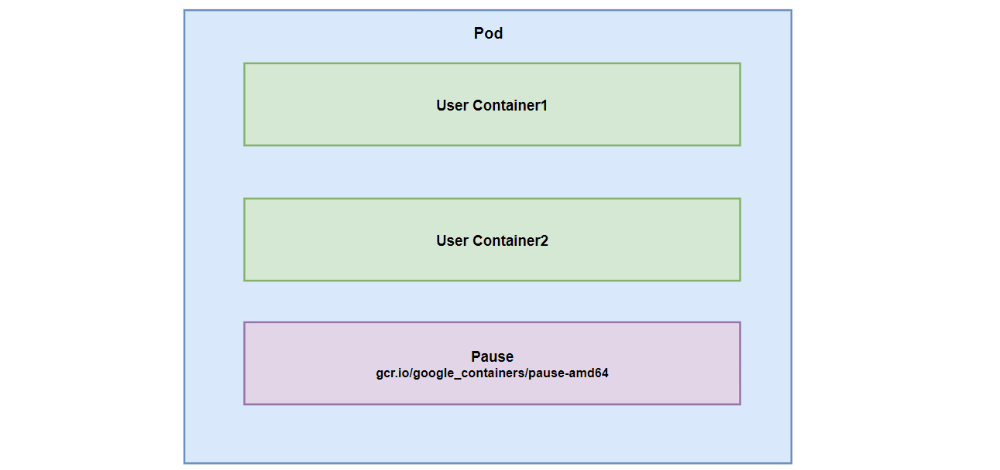

# Pod详解

> 本文转载至：[5 第五章 Pod详解 - 孤独的小人物 - 博客园 (cnblogs.com)](https://www.cnblogs.com/weicunqi/p/14931793.html)

- [一. Pod介绍](#1)
  - [1.1 Pod结构](#1.1)
  - [1.2 Pod定义](#1.2)
  - [1.3 文档查看](#1.3)
- [二. Pod配置](#2)
  - [2.1 基本配置](#2.1)
  - [2.2 镜像拉取](#2.2)
  - [2.3 启动命令](#2.3)
  - [2.4 环境变量](#2.4)
  - [2.5 端口设置](#2.5)
  - [2.6 资源配额](#2.6)
- [三. Pod生命周期](#3)
  - [3.1 创建和终止](#3.1)
  - [3.2 初始化容器](#3.2)
  - [3.3 钩子函数](#3.3)
  - [3.4 容器探测](#3.4)
  - [3.5 重启策略](#3.5)
- [四. Pod调度](#4)
  - [4.1 定向调度](#4.1)
  - [4.2 亲和性调度](#4.2)

## 一. Pod介绍<a name="1"></a>

### 1.1 Pod结构<a name="1.1"></a>



每一个Pod中都可以包含一个或多个容器，这些容器可以分为两类：

- 用户程序所在的容器，数量可多可少
- Pause容器，这是每个Pod都会有的一个**根容器**，它的作用有两个：
  - 可以以它为依据，评估整个Pod的健康状态
  - 可以在根容器上设置IP地址，其它容器都以此IP（Pod IP），以实现Pod内部的网络通信。这里Pod内部的通讯，Pod的之间的通讯采用虚拟二层网络技术来实现，我们当前环境用的是Flannel。

### 1.2 Pod定义<a name="1.2"></a>

下面是Pod的资源清单：

```yaml
apiVersion: v1 #必选，版本号，例如：v1
kind: Pod #必选，资源类型，例如：Pod
metadata: #必选，元数据
  name: string #必选，Pod名称，
  namaspace: string #Pod所属命名空间，默认是“default”
  labels: #自定义标签列表
  - name: string
  annotations: 
  - name: string
spec: #必选，Pod中容器的详细定义
  containers: #必选，Pod中容器列表
  - name: string #必选，容器名称
    images: string #必选，容器镜像名称
    imagePullPolicy: [Always | Never | IfNotPresent] #获取镜像的策略
    command: [string] #容器的启动命令列表，如果不指定，使用打包时使用的启动命令
    args: [string] #容器的启动命令参数列表
    workingDir: string #容器的工作目录
    volumeMounts: #挂载到容器内部的存储卷位置
    - name: string #引用Pod定义的共享存储卷的名称，需要用volumns[]部分定义的卷名
      mountPath: string #存储卷在容器内mount的绝对路径，应少于512字符
      readOnly: boolean #是否是只读模式
    ports: #需要暴露的端口号列表
    - name: string #端口的名称
      containerPort: int #容器需要监听的端口号
      hostPort: int #容器所在主机需要监听的端口号，默认与Container相同
      protocol: string #端口协议，支持TCP和UDP，默认TCP
    env: #容器运行时需要配置的环境变量列表
    - name: string #环境变量名称
      value: string #环境变量的值
    resources: #资源限制和请求的设置
      limits: #资源限制的设置
        cpu: string #CPU的限制，单位是core数量，将用于 docker run --cpu-shares参数
        memory: string #内存限制，单位以Mib/Gib，将用于docker run --memory参数
      requests: #资源请求设置
        cpu: string #CPU请求，容器启动的初始可用数量
        memory: string #内存请求，容器启动的初始可用数量
    livenessProbe: #对Pod内各个容器健康检查的设置，当探测无响应几次后将自动重启该容器
      exec: #对Pod容器内检查方式设置为exec方式
        command: [string] #exec方式需要制定的命令或脚本
      httpGet: # 对Pod内各个容器健康检查方法设置为httpGet，需要指定path和port
        path: string
        port: int
        host: string
        scheme: string
        httpHeaders:
        - name: string
          value: string
      tcpSocket: # 对Pod内各个容器健康检查方式设置为tcpSocket
        port: int
      initialDelaySeconds: number #容器内完成首次探测的时间，单位为秒
      timeoutSeconds: number #对容器健康探测等待响应的超时时间，单位为秒，默认1秒
      periodSeconds: number #对容器健康检查定期探测时间，单位为秒，默认10秒一次
      successThreshold: 0
      failureThreshold: 0
    securityContext:
      privileged: false
  restartPolicy: [Always | Never | OnFailure] #Pod重启策略
  nodeName: <string> #设置nodeName表示将该Pod调度到指定名称的Node节点上
  nodeSelector: object #设置nodeSelector表示将该Pod调度到包含这个label的Node上
  imagePullSecrets: #Pull镜像时使用的secret名称，以key：secretkey格式指定
  - name: string
  hostNetwork: false #是够使用主机网络模式，默认为false，如果设置为true，表示使用宿主机网络
  volumes: #在该Pod上定义共享存储卷列表
  - name: string #共享存储卷名称（volumns类型有很多种）
    emptyDir: {} #类型为emptyDor的存储卷，与Pod同生命周期的一个临时目录。为空值
    hostPath: #类型为hostPath的存储卷，表示挂载Pod所在宿主机的目录
      path: string 
    secret: #类型为secret的存储卷，表示挂载集群定义的secret对象到容器内部
      secretName: string 
      items:
      - key: string
        path: string
    configMap: #类型为configMap的存储卷，挂载预定义的configMap对象到容器内部
      name: string
      items:
      - key: string
        path: string
```

### 1.3 文档查看<a name="1.3"></a>

```shell
#小提示：
#   在这里，可通过一个命令来查看每种资源的可配置项
#   kubectl explain 资源类型         查看某种资源可以配置的一级属性
#   kubectl explain 资源类型.属性     查看属性的子属性
[root@k8s-master01 ~]# kubectl explain pod
KIND:     Pod
VERSION:  v1
FIELDS:
   apiVersion   <string>
   kind <string>
   metadata     <Object>
   spec <Object>
   status       <Object>

[root@k8s-master01 ~]# kubectl explain pod.metadata
KIND:     Pod
VERSION:  v1
RESOURCE: metadata <Object>
FIELDS:
   annotations  <map[string]string>
   clusterName  <string>
   creationTimestamp    <string>
   deletionGracePeriodSeconds   <integer>
   deletionTimestamp    <string>
   finalizers   <[]string>
   generateName <string>
   generation   <integer>
   labels       <map[string]string>
   managedFields        <[]Object>
   name <string>
   namespace    <string>
   ownerReferences      <[]Object>
   resourceVersion      <string>
   selfLink     <string>
   uid  <string>
```

在kubernetes中基本所有资源的一级属性都是一样的，主要包含5部分：

- apiVersion： 版本，由kubernetes内部定义，版本号必须可以用 kubectl api-versions 查询到
- kind： 类型，由kubernetes内部定义，版本号必须可以用 kubectl api-resources 查询到
- metadata：元数据，主要是资源标识和说明，常用的有name、namespace、labels等
- spec：描述，这是配置中最重要的一部分，里面是对各种资源配置的详细描述
- status： 状态信息，里面的内容不需要定义，由kubernetes自动生成

在上面的属性中，spec是接下来研究的重点，继续看下它的常见子属性:

- containers： 容器列表，用于定义容器的详细信息
- nodeName： 根据nodeName的值将pod调度到指定的Node节点上
- nodeSelector： 根据NodeSelector中定义的信息选择将该Pod调度到包含这些label的Node 上
- hostNetwork：是否使用主机网络模式，默认为false，如果设置为true，表示使用宿主机网络
- volumes：存储卷，用于定义Pod上面挂在的存储信息
- restartPolicy： 重启策略，表示Pod在遇到故障的时候的处理策略

## 二. Pod配置<a name="2"></a>

本小节主要来研究`pod.spec.containers`属性，这也是pod配置中最为关键的一项配置。

```shell
[root@k8s-master01 ~]# kubectl explain pod.spec.containers
KIND:     Pod
VERSION:  v1
RESOURCE: containers <[]Object>   # 数组，代表可以有多个容器
FIELDS:
   name  <string>     # 容器名称
   image <string>     # 容器需要的镜像地址
   imagePullPolicy  <string> # 镜像拉取策略 
   command  <[]string> # 容器的启动命令列表，如不指定，使用打包时使用的启动命令
   args     <[]string> # 容器的启动命令需要的参数列表
   env      <[]Object> # 容器环境变量的配置
   ports    <[]Object>     # 容器需要暴露的端口号列表
   resources <Object>      # 资源限制和资源请求的设置
```

### 2.1 基本配置<a name="2.1"></a>

创建pod-base.yaml文件，内容如下：

```yaml
apiVersion: v1
kind: Pod
metadata:
  name: pod-base
  namespace: dev
  labels:
    user: heima
spec:
  containers:
  - name: nginx
    image: nginx:1.17.1
  - name: busybox
    image: busybox:1.30
```

上面定义了一个比较简单Pod的配置，里面有两个容器：

- nginx：用1.17.1版本的nginx镜像创建，（nginx是一个轻量级web容器）
- busybox：用1.30版本的busybox镜像创建，（busybox是一个小巧的linux命令集合）

```shell
# 创建Pod
[root@k8s-master01 pod]# kubectl apply -f pod-base.yaml
pod/pod-base created

# 查看Pod状况
# READY 1/2 : 表示当前Pod中有2个容器，其中1个准备就绪，1个未就绪
# RESTARTS  : 重启次数，因为有1个容器故障了，Pod一直在重启试图恢复它
[root@k8s-master01 pod]# kubectl get pod -n dev
NAME       READY   STATUS    RESTARTS   AGE
pod-base   1/2     Running   4          95
```

最终我们发现Pod的Ready状态一直处于未就绪（1/2），这说明Pod中有容器未启动成功，我们可以使用`describe`命令查看具体的事件信息：

```shell
# 可以通过describe查看内部的详情
# 此时已经运行起来了一个基本的Pod，虽然它暂时有问题
[root@node01 ~]# kubectl describe pod pod-base -n dev
...
Events:
  Type     Reason     Age                    From               Message
  ----     ------     ----                   ----               -------
  Normal   Scheduled  <unknown>              default-scheduler  Successfully assigned dev/pod-base to node02
  Normal   Pulled     3m29s                  kubelet, node02    Container image "nginx:1.17.1" already present on machine
  Normal   Created    3m29s                  kubelet, node02    Created container nginx
  Normal   Started    3m28s                  kubelet, node02    Started container nginx
  Normal   Pulling    3m28s                  kubelet, node02    Pulling image "busybox:1.30"
  Normal   Pulled     2m54s                  kubelet, node02    Successfully pulled image "busybox:1.30"
  Normal   Created    2m10s (x4 over 2m54s)  kubelet, node02    Created container busybox
  Normal   Started    2m10s (x4 over 2m54s)  kubelet, node02    Started container busybox
  Warning  BackOff    91s (x8 over 2m52s)    kubelet, node02    Back-off restarting failed container
  Normal   Pulled     77s (x4 over 2m53s)    kubelet, node02    Container image "busybox:1.30" already present on machine
```

### 2.2 镜像拉取<a name="2.2"></a>

创建pod-imagepullpolicy.yaml文件，内容如下：

```yaml
apiVersion: v1
kind: Pod
metadata:
  name: pod-imagepullpolicy
  namespace: dev
spec:
  containers:
  - name: nginx
    image: nginx:1.17.1
    imagePullPolicy: Never # 用于设置镜像拉取策略
  - name: busybox
    image: busybox:1.30
```

imagePullPolicy，用于设置镜像拉取策略，kubernetes支持配置三种拉取策略：

- Always：总是从远程仓库拉取镜像（一直远程下载）
- IfNotPresent：本地有则使用本地镜像，本地没有则从远程仓库拉取镜像（本地有就本地 本地没远程下载）
- Never：只使用本地镜像，从不去远程仓库拉取，本地没有就报错 （一直使用本地）

> 默认值说明：
>
> 如果镜像tag为具体版本号， 默认策略是：IfNotPresent
>
> 如果镜像tag为：latest（最终版本） ，默认策略是always

### 2.3 启动命令<a name="2.3"></a>

在前面的案例中，一直有一个问题没有解决，就是的busybox容器一直没有成功运行，那么到底是什么原因导致这个容器的故障呢？

原来busybox并不是一个程序，而是类似于一个工具类的集合，kubernetes集群启动管理后，它会自动关闭。解决方法就是让其一直在运行，这就用到了command配置。

创建pod-command.yaml文件，内容如下：

```yaml
apiVersion: v1
kind: Pod
metadata:
  name: pod-command
  namespace: dev
spec:
  containers:
  - name: nginx
    image: nginx:1.17.1
  - name: busybox
    image: busybox:1.30
    command: ["/bin/sh","-c","touch /tmp/hello.txt;while true;do /bin/echo $(date +%T) >> /tmp/hello.txt; sleep 3; done;"]
```

command用于在pod中的容器初始化完毕之后运行一个命令。

> 稍微解释下上面命令的意思：
>
> "/bin/sh","-c", 使用sh执行命令
>
> touch /tmp/hello.txt; 创建一个/tmp/hello.txt 文件
>
> while true;do /bin/echo $(date +%T) >> /tmp/hello.txt; sleep 3; done; 每隔3秒向文件中写入当前时间

```shell
# 创建Pod
[root@k8s-master01 pod]# kubectl create  -f pod-command.yaml
pod/pod-command created

# 查看Pod状态
# 此时发现两个pod都正常运行了
[root@k8s-master01 pod]# kubectl get pods pod-command -n dev
NAME          READY   STATUS   RESTARTS   AGE
pod-command   2/2     Runing   0          2s

# 进入pod中的busybox容器，查看文件内容
# 补充一个命令: kubectl exec  pod名称 -n 命名空间 -it -c 容器名称 /bin/sh  在容器内部执行命令
# 使用这个命令就可以进入某个容器的内部，然后进行相关操作了
# 比如，可以查看txt文件的内容
[root@k8s-master01 pod]# kubectl exec pod-command -n dev -it -c busybox /bin/sh
/ # tail -f /tmp/hello.txt
14:44:19
14:44:22
14:44:25
```

```shell
特别说明：
    通过上面发现command已经可以完成启动命令和传递参数的功能，为什么这里还要提供一个args选项，用于传递参数呢?这其实跟docker有点关系，kubernetes中的command、args两项其实是实现覆盖Dockerfile中ENTRYPOINT的功能。
 1 如果command和args均没有写，那么用Dockerfile的配置。
 2 如果command写了，但args没有写，那么Dockerfile默认的配置会被忽略，执行输入的command
 3 如果command没写，但args写了，那么Dockerfile中配置的ENTRYPOINT的命令会被执行，使用当前args的参数
 4 如果command和args都写了，那么Dockerfile的配置被忽略，执行command并追加上args参数
```

### 2.4 环境变量<a name="2.4"></a>

创建pod-env.yaml文件，内容如下：

```yaml
apiVersion: v1
kind: Pod
metadata:
  name: pod-env
  namespace: dev
spec:
  containers:
  - name: busybox
    image: busybox:1.30
    command: ["/bin/sh","-c","while true;do /bin/echo $(date +%T);sleep 60; done;"]
    env: # 设置环境变量列表
    - name: "username"
      value: "admin"
    - name: "password"
      value: "123456"
```

env，环境变量，用于在pod中的容器设置环境变量。

```shell
# 创建Pod
[root@k8s-master01 ~]# kubectl create -f pod-env.yaml
pod/pod-env created

# 进入容器，输出环境变量
[root@k8s-master01 ~]# kubectl exec pod-env -n dev -c busybox -it /bin/sh
/ # echo $username
admin
/ # echo $password
123456
```

这种方式不是很推荐，推荐将这些配置单独存储在配置文件中，这种方式将在后面介绍。

### 2.5 端口设置<a name="2.5"></a>

本小节来介绍容器的端口设置，也就是containers的ports选项。

首先看下ports支持的子选项：

```shell
[root@k8s-master01 ~]# kubectl explain pod.spec.containers.ports
KIND:     Pod
VERSION:  v1
RESOURCE: ports <[]Object>
FIELDS:
   name         <string>  # 端口名称，如果指定，必须保证name在pod中是唯一的		
   containerPort<integer> # 容器要监听的端口(0<x<65536)
   hostPort     <integer> # 容器要在主机上公开的端口，如果设置，主机上只能运行容器的一个副本(一般省略) 
   hostIP       <string>  # 要将外部端口绑定到的主机IP(一般省略)
   protocol     <string>  # 端口协议。必须是UDP、TCP或SCTP。默认为“TCP”。
```

接下来，编写一个测试案例，创建pod-ports.yaml：

```shell
apiVersion: v1
kind: Pod
metadata:
  name: pod-ports
  namespace: dev
spec:
  containers:
  - name: nginx
    image: nginx:1.17.1
    ports: # 设置容器暴露的端口列表
    - name: nginx-port
      containerPort: 80
      protocol: TCP
```

### 2.6 资源配额<a name="2.6"></a>

容器中的程序要运行，肯定是要占用一定资源的，比如cpu和内存等，如果不对某个容器的资源做限制，那么它就可能吃掉大量资源，导致其它容器无法运行。针对这种情况，kubernetes提供了对内存和cpu的资源进行配额的机制，这种机制主要通过resources选项实现，他有两个子选项：

- limits：用于限制运行时容器的最大占用资源，当容器占用资源超过limits时会被终止，并进行重启（资源上限）
- requests ：用于设置容器需要的最小资源，如果环境资源不够，容器将无法启动（资源下限）

可以通过上面两个选项设置资源的上下限。

接下来，编写一个测试案例，创建pod-resources.yaml

```yaml
apiVersion: v1
kind: Pod
metadata:
  name: pod-resources
  namespace: dev
spec:
  containers:
  - name: nginx
    image: nginx:1.17.1
    resources: # 资源配额
      limits:  # 限制资源（上限）
        cpu: "2" # CPU限制，单位是core数
        memory: "10Gi" # 内存限制
      requests: # 请求资源（下限）
        cpu: "1"  # CPU限制，单位是core数
        memory: "10Mi"  # 内存限制
```

在这对cpu和memory的单位做一个说明：

- cpu：core数，可以为整数或小数
- memory： 内存大小，可以使用Gi、Mi、G、M等形式

## 三. Pod生命周期<a name="3"></a>

我们一般将pod对象从创建至终的这段时间范围称为pod的生命周期，它主要包含下面的过程：

- pod创建过程
- 运行初始化容器（init container）过程
- 运行主容器（main container）
  - 容器启动后钩子（post start）、容器终止前钩子（pre stop）
  - 容器的存活性探测（liveness probe）、就绪性探测（readiness probe）
- pod终止过程


在整个生命周期中，Pod会出现5种**状态**（**相位**），分别如下：

- 挂起（Pending）：apiserver已经创建了pod资源对象，但它尚未被调度完成或者仍处于下载镜像的过程中
- 运行中（Running）：pod已经被调度至某节点，并且所有容器都已经被kubelet创建完成
- 成功（Succeeded）：pod中的所有容器都已经成功终止并且不会被重启
- 失败（Failed）：所有容器都已经终止，但至少有一个容器终止失败，即容器返回了非0值的退出状态
- 未知（Unknown）：apiserver无法正常获取到pod对象的状态信息，通常由网络通信失败所导致

### 3.1 创建和终止<a name="3.1"></a>

**pod的创建过程**

1. 用户通过kubectl或其他api客户端提交需要创建的pod信息给apiServer
2. apiServer开始生成pod对象的信息，并将信息存入etcd，然后返回确认信息至客户端
3. apiServer开始反映etcd中的pod对象的变化，其它组件使用watch机制来跟踪检查apiServer上的变动
4. scheduler发现有新的pod对象要创建，开始为Pod分配主机并将结果信息更新至apiServer
5. node节点上的kubelet发现有pod调度过来，尝试调用docker启动容器，并将结果回送至apiServer
6. apiServer将接收到的pod状态信息存入etcd中


**pod的终止过程**

1. 用户向apiServer发送删除pod对象的命令
2. apiServcer中的pod对象信息会随着时间的推移而更新，在宽限期内（默认30s），pod被视为dead
3. 将pod标记为terminating状态
4. kubelet在监控到pod对象转为terminating状态的同时启动pod关闭过程
5. 端点控制器监控到pod对象的关闭行为时将其从所有匹配到此端点的service资源的端点列表中移除
6. 如果当前pod对象定义了preStop钩子处理器，则在其标记为terminating后即会以同步的方式启动执行
7. pod对象中的容器进程收到停止信号
8. 宽限期结束后，若pod中还存在仍在运行的进程，那么pod对象会收到立即终止的信号
9. kubelet请求apiServer将此pod资源的宽限期设置为0从而完成删除操作，此时pod对于用户已不可见

### 3.2 初始化容器<a name="3.2"></a>

初始化容器是在pod的主容器启动之前要运行的容器，主要是做一些主容器的前置工作，它具有两大特征：

1. 初始化容器必须运行完成直至结束，若某初始化容器运行失败，那么kubernetes需要重启它直到成功完成
2. 初始化容器必须按照定义的顺序执行，当且仅当前一个成功之后，后面的一个才能运行

初始化容器有很多的应用场景，下面列出的是最常见的几个：

- 提供主容器镜像中不具备的工具程序或自定义代码
- 初始化容器要先于应用容器串行启动并运行完成，因此可用于延后应用容器的启动直至其依赖的条件得到满足

接下来做一个案例，模拟下面这个需求：

假设要以主容器来运行nginx，但是要求在运行nginx之前先要能够连接上mysql和redis所在服务器

为了简化测试，事先规定好mysql`(192.168.5.4)`和redis`(192.168.5.5)`服务器的地址

创建pod-initcontainer.yaml，内容如下：

```yaml
apiVersion: v1
kind: Pod
metadata:
  name: pod-initcontainer
  namespace: dev
spec:
  containers:
  - name: main-container
    image: nginx:1.17.1
    ports: 
    - name: nginx-port
      containerPort: 80
  initContainers:
  - name: test-mysql
    image: busybox:1.30
    command: ['sh', '-c', 'until ping 192.168.5.14 -c 1 ; do echo waiting for mysql...; sleep 2; done;']
  - name: test-redis
    image: busybox:1.30
    command: ['sh', '-c', 'until ping 192.168.5.15 -c 1 ; do echo waiting for reids...; sleep 2; done;']
```

测试：

```shell
# 创建pod
[root@k8s-master01 ~]# kubectl create -f pod-initcontainer.yaml
pod/pod-initcontainer created

# 查看pod状态
# 发现pod卡在启动第一个初始化容器过程中，后面的容器不会运行
root@k8s-master01 ~]# kubectl describe pod  pod-initcontainer -n dev
........
Events:
  Type    Reason     Age   From               Message
  ----    ------     ----  ----               -------
  Normal  Scheduled  49s   default-scheduler  Successfully assigned dev/pod-initcontainer to node1
  Normal  Pulled     48s   kubelet, node1     Container image "busybox:1.30" already present on machine
  Normal  Created    48s   kubelet, node1     Created container test-mysql
  Normal  Started    48s   kubelet, node1     Started container test-mysql

# 动态查看pod
[root@k8s-master01 ~]# kubectl get pods pod-initcontainer -n dev -w
NAME                             READY   STATUS     RESTARTS   AGE
pod-initcontainer                0/1     Init:0/2   0          15s
pod-initcontainer                0/1     Init:1/2   0          52s
pod-initcontainer                0/1     Init:1/2   0          53s
pod-initcontainer                0/1     PodInitializing   0          89s
pod-initcontainer                1/1     Running           0          90s

# 接下来新开一个shell，为当前服务器新增两个ip，观察pod的变化
[root@k8s-master01 ~]# ifconfig ens33:1 192.168.5.14 netmask 255.255.255.0 up
[root@k8s-master01 ~]# ifconfig ens33:2 192.168.5.15 netmask 255.255.255.0 up
```

### 3.3 钩子函数<a name="3.3"></a>

钩子函数能够感知自身生命周期中的事件，并在相应的时刻到来时运行用户指定的程序代码。

kubernetes在**主容器的启动之后**和**停止之前**提供了两个钩子函数：

- post start：容器创建之后执行，如果失败了会重启容器
- pre stop ：容器终止之前执行，执行完成之后容器将成功终止，在其完成之前会阻塞删除容器的操作

钩子处理器支持使用下面三种方式定义动作：

- Exec命令：在容器内执行一次命令

  ```yaml
  ……
    lifecycle:
      postStart: 
        exec:
          command:
          - cat
          - /tmp/healthy
  ……
  ```

- TCPSocket：在当前容器尝试访问指定的socket

  ```yaml
  ……      
    lifecycle:
      postStart:
        tcpSocket:
          port: 8080
  ……
  ```

- HTTPGet：在当前容器中向某url发起http请求

  ```yaml
  ……
    lifecycle:
      postStart:
        httpGet:
          path: / #URI地址
          port: 80 #端口号
          host: 192.168.5.3 #主机地址
          scheme: HTTP #支持的协议，http或者https
  ……
  ```

接下来，以exec方式为例，演示下钩子函数的使用，创建pod-hook-exec.yaml文件，内容如下：

```yaml
apiVersion: v1
kind: Pod
metadata:
  name: pod-hook-exec
  namespace: dev
spec:
  containers:
  - name: main-container
    image: nginx:1.17.1
    ports:
    - name: nginx-port
      containerPort: 80
    lifecycle:
      postStart: 
        exec: # 在容器启动的时候执行一个命令，修改掉nginx的默认首页内容
          command: ["/bin/sh", "-c", "echo postStart... > /usr/share/nginx/html/index.html"]
      preStop:
        exec: # 在容器停止之前停止nginx服务
          command: ["/usr/sbin/nginx","-s","quit"]
```

测试：

```shell
# 创建pod
[root@k8s-master01 ~]# kubectl create -f pod-hook-exec.yaml
pod/pod-hook-exec created

# 查看pod
[root@k8s-master01 ~]# kubectl get pods  pod-hook-exec -n dev -o wide
NAME           READY   STATUS     RESTARTS   AGE    IP            NODE    
pod-hook-exec  1/1     Running    0          29s    10.244.2.48   node2   

# 访问pod
[root@k8s-master01 ~]# curl 10.244.2.48
postStart...
```

### 3.4 容器探测<a name="3.4"></a>

容器探测用于检测容器中的应用实例是否正常工作，是保障业务可用性的一种传统机制。如果经过探测，实例的状态不符合预期，那么kubernetes就会把该问题实例" 摘除 "，不承担业务流量。kubernetes提供了两种探针来实现容器探测，分别是：

- liveness probes：存活性探针，用于检测应用实例当前是否处于正常运行状态，如果不是，k8s会重启容器
- readiness probes：就绪性探针，用于检测应用实例当前是否可以接收请求，如果不能，k8s不会转发流量

livenessProbe 决定是否重启容器，readinessProbe 决定是否将请求转发给容器。

上面两种探针目前均支持三种探测方式：

- Exec命令：在容器内执行一次命令，如果命令执行的退出码为0，则认为程序正常，否则不正常

  ```yaml
  ……
    livenessProbe:
      exec:
        command:
        - cat
        - /tmp/healthy
  ……
  ```

- TCPSocket：将会尝试访问一个用户容器的端口，如果能够建立这条连接，则认为程序正常，否则不正常

  ```yaml
  ……      
    livenessProbe:
      tcpSocket:
        port: 8080
  ……
  ```

- HTTPGet：调用容器内Web应用的URL，如果返回的状态码在200和399之间，则认为程序正常，否则不正常

  ```yaml
  ……
    livenessProbe:
      httpGet:
        path: / #URI地址
        port: 80 #端口号
        host: 127.0.0.1 #主机地址
        scheme: HTTP #支持的协议，http或者https
  ……
  ```

下面以liveness probes为例，做几个演示：

#### **方式一：Exec**

创建pod-liveness-exec.yaml

```yaml
apiVersion: v1
kind: Pod
metadata:
  name: pod-liveness-exec
  namespace: dev
spec:
  containers:
  - name: nginx
    image: nginx:1.17.1
    ports: 
    - name: nginx-port
      containerPort: 80
    livenessProbe:
      exec:
        command: ["/bin/cat","/tmp/hello.txt"] # 执行一个查看文件的命令
```

创建pod，观察效果

```shell
# 创建Pod
[root@k8s-master01 ~]# kubectl create -f pod-liveness-exec.yaml
pod/pod-liveness-exec created

# 查看Pod详情
[root@k8s-master01 ~]# kubectl describe pods pod-liveness-exec -n dev
......
  Normal   Created    20s (x2 over 50s)  kubelet, node1     Created container nginx
  Normal   Started    20s (x2 over 50s)  kubelet, node1     Started container nginx
  Normal   Killing    20s                kubelet, node1     Container nginx failed liveness probe, will be restarted
  Warning  Unhealthy  0s (x5 over 40s)   kubelet, node1     Liveness probe failed: cat: can't open '/tmp/hello11.txt': No such file or directory
  
# 观察上面的信息就会发现nginx容器启动之后就进行了健康检查
# 检查失败之后，容器被kill掉，然后尝试进行重启（这是重启策略的作用，后面讲解）
# 稍等一会之后，再观察pod信息，就可以看到RESTARTS不再是0，而是一直增长
[root@k8s-master01 ~]# kubectl get pods pod-liveness-exec -n dev
NAME                READY   STATUS             RESTARTS   AGE
pod-liveness-exec   0/1     CrashLoopBackOff   2          3m19s

# 当然接下来，可以修改成一个存在的文件，比如/tmp/hello.txt，再试，结果就正常了......
```

#### **方式二：TCPSocket**

创建pod-liveness-tcpsocket.yaml

```yaml
apiVersion: v1
kind: Pod
metadata:
  name: pod-liveness-tcpsocket
  namespace: dev
spec:
  containers:
  - name: nginx
    image: nginx:1.17.1
    ports: 
    - name: nginx-port
      containerPort: 80
    livenessProbe:
      tcpSocket:
        port: 8080 # 尝试访问8080端口
```

创建pod，观察效果

```shell
# 创建Pod
[root@k8s-master01 ~]# kubectl create -f pod-liveness-tcpsocket.yaml
pod/pod-liveness-tcpsocket created

# 查看Pod详情
[root@k8s-master01 ~]# kubectl describe pods pod-liveness-tcpsocket -n dev
......
  Normal   Scheduled  31s                            default-scheduler  Successfully assigned dev/pod-liveness-tcpsocket to node2
  Normal   Pulled     <invalid>                      kubelet, node2     Container image "nginx:1.17.1" already present on machine
  Normal   Created    <invalid>                      kubelet, node2     Created container nginx
  Normal   Started    <invalid>                      kubelet, node2     Started container nginx
  Warning  Unhealthy  <invalid> (x2 over <invalid>)  kubelet, node2     Liveness probe failed: dial tcp 10.244.2.44:8080: connect: connection refused
  
# 观察上面的信息，发现尝试访问8080端口,但是失败了
# 稍等一会之后，再观察pod信息，就可以看到RESTARTS不再是0，而是一直增长
[root@k8s-master01 ~]# kubectl get pods pod-liveness-tcpsocket  -n dev
NAME                     READY   STATUS             RESTARTS   AGE
pod-liveness-tcpsocket   0/1     CrashLoopBackOff   2          3m19s

# 当然接下来，可以修改成一个可以访问的端口，比如80，再试，结果就正常了......
```

#### **方式三：HTTPGet**

创建pod-liveness-httpget.yaml

```yaml
apiVersion: v1
kind: Pod
metadata:
  name: pod-liveness-httpget
  namespace: dev
spec:
  containers:
  - name: nginx
    image: nginx:1.17.1
    ports:
    - name: nginx-port
      containerPort: 80
    livenessProbe:
      httpGet:  # 其实就是访问http://127.0.0.1:80/hello  
        scheme: HTTP #支持的协议，http或者https
        port: 80 #端口号
        path: /hello #URI地址
```

创建pod，观察效果

```shell
# 创建Pod
[root@k8s-master01 ~]# kubectl create -f pod-liveness-httpget.yaml
pod/pod-liveness-httpget created

# 查看Pod详情
[root@k8s-master01 ~]# kubectl describe pod pod-liveness-httpget -n dev
.......
  Normal   Pulled     6s (x3 over 64s)  kubelet, node1     Container image "nginx:1.17.1" already present on machine
  Normal   Created    6s (x3 over 64s)  kubelet, node1     Created container nginx
  Normal   Started    6s (x3 over 63s)  kubelet, node1     Started container nginx
  Warning  Unhealthy  6s (x6 over 56s)  kubelet, node1     Liveness probe failed: HTTP probe failed with statuscode: 404
  Normal   Killing    6s (x2 over 36s)  kubelet, node1     Container nginx failed liveness probe, will be restarted
  
# 观察上面信息，尝试访问路径，但是未找到,出现404错误
# 稍等一会之后，再观察pod信息，就可以看到RESTARTS不再是0，而是一直增长
[root@k8s-master01 ~]# kubectl get pod pod-liveness-httpget -n dev
NAME                   READY   STATUS    RESTARTS   AGE
pod-liveness-httpget   1/1     Running   5          3m17s

# 当然接下来，可以修改成一个可以访问的路径path，比如/，再试，结果就正常了......
```

至此，已经使用liveness Probe演示了三种探测方式，但是查看livenessProbe的子属性，会发现除了这三种方式，还有一些其他的配置，在这里一并解释下：

```shell
[root@k8s-master01 ~]# kubectl explain pod.spec.containers.livenessProbe
FIELDS:
   exec <Object>  
   tcpSocket    <Object>
   httpGet      <Object>
   initialDelaySeconds  <integer>  # 容器启动后等待多少秒执行第一次探测
   timeoutSeconds       <integer>  # 探测超时时间。默认1秒，最小1秒
   periodSeconds        <integer>  # 执行探测的频率。默认是10秒，最小1秒
   failureThreshold     <integer>  # 连续探测失败多少次才被认定为失败。默认是3。最小值是1
   successThreshold     <integer>  # 连续探测成功多少次才被认定为成功。默认是1
```

下面稍微配置两个，演示下效果即可：

```yaml
[root@k8s-master01 ~]# more pod-liveness-httpget.yaml
apiVersion: v1
kind: Pod
metadata:
  name: pod-liveness-httpget
  namespace: dev
spec:
  containers:
  - name: nginx
    image: nginx:1.17.1
    ports:
    - name: nginx-port
      containerPort: 80
    livenessProbe:
      httpGet:
        scheme: HTTP
        port: 80 
        path: /
      initialDelaySeconds: 30 # 容器启动后30s开始探测
      timeoutSeconds: 5 # 探测超时时间为5s
```

### 3.5 重启策略<a name="3.5"></a>

在上一节中，一旦容器探测出现了问题，kubernetes就会对容器所在的Pod进行重启，其实这是由pod的重启策略决定的，pod的重启策略有 3 种，分别如下：

- Always ：容器失效时，自动重启该容器，这也是默认值。
- OnFailure ： 容器终止运行且退出码不为0时重启
- Never ： 不论状态为何，都不重启该容器

重启策略适用于pod对象中的所有容器，首次需要重启的容器，将在其需要时立即进行重启，随后再次需要重启的操作将由kubelet延迟一段时间后进行，且反复的重启操作的延迟时长以此为10s、20s、40s、80s、160s和300s，300s是最大延迟时长。

创建pod-restartpolicy.yaml：

```yaml
apiVersion: v1
kind: Pod
metadata:
  name: pod-restartpolicy
  namespace: dev
spec:
  containers:
  - name: nginx
    image: nginx:1.17.1
    ports:
    - name: nginx-port
      containerPort: 80
    livenessProbe:
      httpGet:
        scheme: HTTP
        port: 80
        path: /hello
  restartPolicy: Never # 设置重启策略为Never
```

运行Pod测试

```yaml
# 创建Pod
[root@k8s-master01 ~]# kubectl create -f pod-restartpolicy.yaml
pod/pod-restartpolicy created

# 查看Pod详情，发现nginx容器失败
[root@k8s-master01 ~]# kubectl  describe pods pod-restartpolicy  -n dev
......
  Warning  Unhealthy  15s (x3 over 35s)  kubelet, node1     Liveness probe failed: HTTP probe failed with statuscode: 404
  Normal   Killing    15s                kubelet, node1     Container nginx failed liveness probe
  
# 多等一会，再观察pod的重启次数，发现一直是0，并未重启   
[root@k8s-master01 ~]# kubectl  get pods pod-restartpolicy -n dev
NAME                   READY   STATUS    RESTARTS   AGE
pod-restartpolicy      0/1     Running   0          5min42s
```

## 四. Pod调度<a name="4"></a>

在默认情况下，一个Pod在哪个Node节点上运行，是由Scheduler组件采用相应的算法计算出来的，这个过程是不受人工控制的。但是在实际使用中，这并不满足的需求，因为很多情况下，我们想控制某些Pod到达某些节点上，那么应该怎么做呢？这就要求了解kubernetes对Pod的调度规则，kubernetes提供了四大类调度方式：

- 自动调度：运行在哪个节点上完全由Scheduler经过一系列的算法计算得出
- 定向调度：NodeName、NodeSelector
- 亲和性调度：NodeAffinity、PodAffinity、PodAntiAffinity
- 污点（容忍）调度：Taints、Toleration

### 4.1 定向调度<a name="4.1"></a>

定向调度，指的是利用在pod上声明nodeName或者nodeSelector，以此将Pod调度到期望的node节点上。注意，这里的调度是强制的，这就意味着即使要调度的目标Node不存在，也会向上面进行调度，只不过pod运行失败而已。

#### NodeName

NodeName用于强制约束将Pod调度到指定的Name的Node节点上。这种方式，其实是直接跳过Scheduler的调度逻辑，直接将Pod调度到指定名称的节点。

接下来，实验一下：创建一个pod-nodename.yaml文件

```yaml
apiVersion: v1
kind: Pod
metadata:
  name: pod-nodename
  namespace: dev
spec:
  containers:
  - name: nginx
    image: nginx:1.17.1
  nodeName: node1 # 指定调度到node1节点上
```

测试：

```shell
#创建Pod
[root@k8s-master01 ~]# kubectl create -f pod-nodename.yaml
pod/pod-nodename created

#查看Pod调度到NODE属性，确实是调度到了node1节点上
[root@k8s-master01 ~]# kubectl get pods pod-nodename -n dev -o wide
NAME           READY   STATUS    RESTARTS   AGE   IP            NODE      ......
pod-nodename   1/1     Running   0          56s   10.244.1.87   node1     ......   

# 接下来，删除pod，修改nodeName的值为node3（并没有node3节点）
[root@k8s-master01 ~]# kubectl delete -f pod-nodename.yaml
pod "pod-nodename" deleted
[root@k8s-master01 ~]# vim pod-nodename.yaml #将nodeName修改为node3
[root@k8s-master01 ~]# kubectl create -f pod-nodename.yaml
pod/pod-nodename created

#再次查看，发现已经向Node3节点调度，但是由于不存在node3节点，所以pod无法正常运行
[root@k8s-master01 ~]# kubectl get pods pod-nodename -n dev -o wide
NAME           READY   STATUS    RESTARTS   AGE   IP       NODE    ......
pod-nodename   0/1     Pending   0          6s    <none>   node3   ......           
```

#### NodeSelector

NodeSelector用于将pod调度到添加了指定标签的node节点上。它是通过kubernetes的label-selector机制实现的，也就是说，在pod创建之前，会由scheduler使用MatchNodeSelector调度策略进行label匹配，找出目标node，然后将pod调度到目标节点，该匹配规则是强制约束。

接下来，实验一下：

第一步：首先分别为node节点添加标签

```shell
[root@k8s-master01 ~]# kubectl label nodes node1 nodeenv=pro
node/node2 labeled
[root@k8s-master01 ~]# kubectl label nodes node2 nodeenv=test
node/node2 labeled
```

第二步：创建一个pod-nodeselector.yaml文件

```shell
apiVersion: v1
kind: Pod
metadata:
  name: pod-nodeselector
  namespace: dev
spec:
  containers:
  - name: nginx
    image: nginx:1.17.1
  nodeSelector: 
    nodeenv: pro # 指定调度到具有nodeenv=pro标签的节点上
```

第三步：创建Pod

```shell
#创建Pod
[root@k8s-master01 ~]# kubectl create -f pod-nodeselector.yaml
pod/pod-nodeselector created

#查看Pod调度到NODE属性，确实是调度到了node1节点上
[root@k8s-master01 ~]# kubectl get pods pod-nodeselector -n dev -o wide
NAME               READY   STATUS    RESTARTS   AGE     IP          NODE    ......
pod-nodeselector   1/1     Running   0          47s   10.244.1.87   node1   ......

# 接下来，删除pod，修改nodeSelector的值为nodeenv: xxxx（不存在打有此标签的节点）
[root@k8s-master01 ~]# kubectl delete -f pod-nodeselector.yaml
pod "pod-nodeselector" deleted
[root@k8s-master01 ~]# vim pod-nodeselector.yaml
[root@k8s-master01 ~]# kubectl create -f pod-nodeselector.yaml
pod/pod-nodeselector created

#再次查看，发现pod无法正常运行,Node的值为none
[root@k8s-master01 ~]# kubectl get pods -n dev -o wide
NAME               READY   STATUS    RESTARTS   AGE     IP       NODE    
pod-nodeselector   0/1     Pending   0          2m20s   <none>   <none>

# 查看详情,发现node selector匹配失败的提示
[root@k8s-master01 ~]# kubectl describe pods pod-nodeselector -n dev
.......
Events:
  Type     Reason            Age        From               Message
  ----     ------            ----       ----               -------
  Warning  FailedScheduling  <unknown>  default-scheduler  0/3 nodes are available: 3 node(s) didn't match node selector.
```

### 4.2 亲和性调度<a name="4.2"></a>

上一节，介绍了两种定向调度的方式，使用起来非常方便，但是也有一定的问题，那就是如果没有满足条件的Node，那么Pod将不会被运行，即使在集群中还有可用Node列表也不行，这就限制了它的使用场景。

基于上面的问题，kubernetes还提供了一种亲和性调度（Affinity）。它在NodeSelector的基础之上的进行了扩展，可以通过配置的形式，实现优先选择满足条件的Node进行调度，如果没有，也可以调度到不满足条件的节点上，使调度更加灵活。

Affinity主要分为三类：

- nodeAffinity(node亲和性）: 以node为目标，解决pod可以调度到哪些node的问题
- podAffinity(pod亲和性) : 以pod为目标，解决pod可以和哪些已存在的pod部署在同一个拓扑域中的问题
- podAntiAffinity(pod反亲和性) : 以pod为目标，解决pod不能和哪些已存在pod部署在同一个拓扑域中的问题

> 关于亲和性(反亲和性)使用场景的说明：
>
> **亲和性**：如果两个应用频繁交互，那就有必要利用亲和性让两个应用的尽可能的靠近，这样可以减少因网络通信而带来的性能损耗。
>
> **反亲和性**：当应用的采用多副本部署时，有必要采用反亲和性让各个应用实例打散分布在各个node上，这样可以提高服务的高可用性。

#### NodeAffinity

首先来看一下`NodeAffinity`的可配置项：

```txt
pod.spec.affinity.nodeAffinity
  requiredDuringSchedulingIgnoredDuringExecution  Node节点必须满足指定的所有规则才可以，相当于硬限制
    nodeSelectorTerms  节点选择列表
      matchFields   按节点字段列出的节点选择器要求列表
      matchExpressions   按节点标签列出的节点选择器要求列表(推荐)
        key    键
        values 值
        operator 关系符 支持Exists, DoesNotExist, In, NotIn, Gt, Lt
  preferredDuringSchedulingIgnoredDuringExecution 优先调度到满足指定的规则的Node，相当于软限制 (倾向)
    preference   一个节点选择器项，与相应的权重相关联
      matchFields   按节点字段列出的节点选择器要求列表
      matchExpressions   按节点标签列出的节点选择器要求列表(推荐)
        key    键
        values 值
        operator 关系符 支持In, NotIn, Exists, DoesNotExist, Gt, Lt
	weight 倾向权重，在范围1-100。
```

