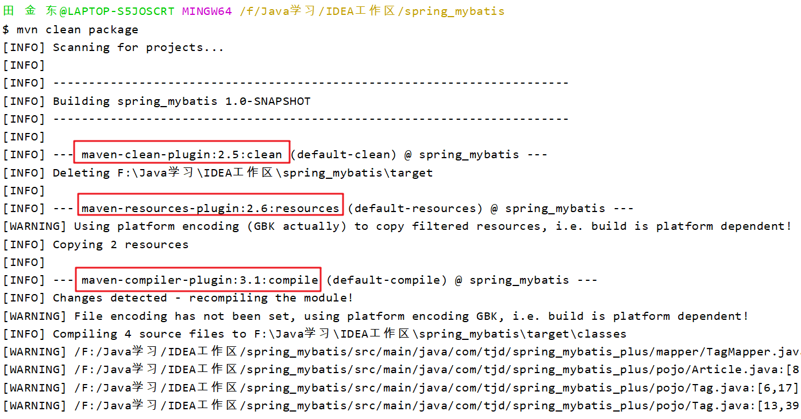

# Maven生命周期与插件

除了坐标、依赖以及仓库以外，Maven另外两个核心概念是生命周期和插件。

## 1. 什么是生命周期

​		Maven生命周期是为了对所有的构建过程进行抽象和统一。Maven从大量项目和构建工具中学习和反思，然后总结了一套高度完善的、易扩展的生命周期。这个生命周期包含了项目的清理、初始化、编译、测试、打包、集成测试、验证部署和站点生成等几乎所有步骤。也就是说，几乎所有项目的构建，都能映射到这样一个生命周期中上。

​		Maven的生命周期是一个抽象的概念，这意味着生命周期本身不做任何实际的工作，在Maven的设计中，实际的任务（如编译源码）都交给插件来完成。这种设计思想与设计模式中**模板模式（Template Pattern）**非常类似。

```java
public abstract class AbstrctBuild {
    public void build() {
        initialize();
        compile();
        test();
        packagee();
        integrationTest();
        deploy();
    }
    
    protected abstract void initialize();
    protected abstract void compile();
    protected abstract void test(); 
    protected abstract void packagee();
    protected abstract void integrationTest();
    protected abstract void deploy();
}
```

​		模板模式在父类中定义了算法的整体结构，子类可以通过实现或者重写父类的方法来控制实际的行为，这样既保证了算法有足够的扩展性，又能够严格控制算法的整体结构。

​		由于生命周期只是对项目构建过程的一种抽象，那么项目构建还是需要实际的程序来构建，这就引入了插件的概念。在Maven的生命周期中，每个构建步骤都可以绑定一个或多个插件行为，而且Maven为绝大多数构建步骤都提供了默认的插件绑定，这样大多数用户在使用Maven时不需要进行任何的插件配置即可完成项目的构建工作。

## 2. 生命周期详解

### 2.1 三套生命周期

​		Maven拥有三套相互独立的生命周期，他们分别是：clean、default、site。clean生命周期的目的是清理项目，default生命周期的目的是为了构建项目，而site生命周期的目的是建立项目站点。

​		`Maven生命周期包含一些阶段（phase）`，这些阶段是有序的，并且后面的阶段依赖于前面的阶段，用户和Maven最直接的交互方式就是调用这些生命周期阶段。以clean生命周期为例，它包含的阶段有pre-clean、clean、post-clean。当用户调用pre-clean时只有pre-clean这个阶段会执行；当用户调用clean阶段时，pre-clean和clean阶段会得以执行；当用户调用post-clean阶段时，clean生命周期的三个阶段都会执行。

​		较之于生命周期阶段的前后依赖关系，三套生命周期本身是相互独立的。用户仅调用clean生命周期的某个阶段并不会对其他生命周期产生影响。例如用户调用clean生命周期中的clean阶段时，并不会触发default以及Site生命周期中的任何阶段。


### 2.2 clean生命周期

clean生命周期的目的是清理项目，它包含三个阶段：

| clean生命周期阶段 |             任务             |
| :---------------: | :--------------------------: |
|     pre-clean     | 执行一些清理前需要完成的操作 |
|       clean       |   清理上一次构建生成的文件   |
|    post-clean     | 执行一些清理后需要完成的操作 |


### 2.3 default生命周期

​		default生命周期定义了真正构建时所需要执行的所有步骤，它是三套生命周期中最核心的部分，default生命周期包含以下阶段：

- validate
- initialize
- generate-sources
- process-sources：处理项目的主资源文件。一般来说，是对src/main/resources目录内的内容进行变量替换等工作后，复制到项目输出的主classpath下。
- generate-resources
- process-resources
- compile：编译项目的主源码。一般来说，是编译src/main/java目录下的Java文件至项目输出的主classpath中。
- process-classes
- generate-test-sources
- process-test-sources：处理项目测试的资源文件。
- generate-test-resources
- process-test-resources
- test-compile：编译项目的测试代码
- process-test-classes
- test：使用单元测试框架进行测试，测试代码不会被打包或部署
- prepare-package
- package：接受编译好的代码，将其打包为可发布的格式，如JAR
- pre-integration-test
- integration-test
- post-integration-test
- verify
- install：将打包好的文件安装到本地仓库中，方便其他Maven项目使用。
- deploy：将最终的包复制到远程仓库，供其他开发人员或Maven项目使用


### 2.4 site生命周期

​		site生命周期的目的是建立和发布项目的站点，Maven能够基于POM所包含的信息，自动生成一个友好的站点，方便团队交流和发布项目信息。该生命周期包含如下阶段：

| site生命周期阶段 |                   任务                   |
| :--------------: | :--------------------------------------: |
|     pre-site     | 执行一些在生成项目站点之前需要完成的工作 |
|       site       |               生成项目站点               |
|    post-site     | 执行一些在生成项目站点之后需要完成的工作 |
|   site-deploy    |      将生成的项目站点发布到服务器上      |


### 2.5 Maven命令与生命周期

​	从命令行执行Maven任务的最主要方式就是调用Maven的生命周期阶段。下面我们就以一些常用的命令为例，解释其执行的生命周期阶段：

- mvn clean：调用clean生命周期中clean阶段，实际执行的阶段是pre-clean和clean阶段。
- mvn test：该命令调用default生命周期test阶段。实际上执行的是default生命周期中validate到test的所有阶段
- mvn clean install：该命令调用clean生命周期的clean阶段，以及default生命周期中的install阶段。实际执行的阶段为clean生命周期的pre-clean、clean阶段，以及default生命周期的从validate至install的所有阶段。


## 3. 插件目标

​		对于插件本身，为了能够复用代码，他往往能够完成多个任务。例如maven-dependency-plugin，它能够基于项目依赖做很多事情。它能够分析项目的依赖，帮助找到潜在的无用依赖；它能够列出项目的依赖树；帮助分析依赖来源；它能够列出项目所有已解析的依赖，等等。为每个这样的功能编写一个插件是很不可取的，因为这些任务背后有很多可以复用的代码，因此，`这些功能聚集在一个插件里，每个功能就是一个插件目标`。

​		maven-dependency-plugin有十多个目标，每个目标对应一个功能，上述几个功能分别对应的插件目标为dependency:analyze、dependency:tree、dependency:list。这是一种通用的写法，冒号前面写插件的前缀，冒号后面是该插件的目标。


## 4. 插件绑定

​		Maven的生命周期与插件相互绑定，用以完成实际的构建任务。具体而言，是生命周期的阶段与插件的目标相互绑定，以完成某个具体的构建任务。例如项目编译这一任务，它对应了default生命周期的compile阶段，而maven-dependency-plugin插件的compile目标能够完成该任务。因此，将它们绑定，就能实现项目编译的目的。

### 4.1 内置绑定

为了让用户几乎不用任何配置就能构架Maven项目，Maven默认为一些主要的生命周期阶段绑定了对应插件目标，具体的绑定见下表：

**clean生命周期**：

| 生命周期阶段 |         插件目标         |
| :----------: | :----------------------: |
|  pre-clean   |            —             |
|    clean     | maven-clean-plugin:clean |
|  post-clean  |            —             |

**site生命周期**：

| 生命周期阶段 |         插件目标         |
| :----------: | :----------------------: |
|   pre-site   |            —             |
|     site     |  maven-site-plugin:site  |
|  post-site   |            —             |
| site-deploy  | maven-site-plugin:deploy |

**default生命周期**：

|      生命周期阶段      |               插件目标               |                    执行任务                    |
| :--------------------: | :----------------------------------: | :--------------------------------------------: |
|   process-resources    |   maven-resources-plugin:resources   |           复制主资源文件至主输出目录           |
|        compile         |    maven-compiler-plugin:compile     |             编译主代码至主输出目录             |
| process-test-resources | maven-resources-plugin:testResources |         复制测试资源文件至测试输出目录         |
|      test-compile      |  maven-compiler-plugin:testCompile   |           编译测试代码值测试输出目录           |
|          test          |      maven-surefire-plugin:test      |                  执行测试用例                  |
|        package         |         maven-jar-plugin:jar         | 将项目打包为jar，如果打包为war则不是该插件目标 |
|        install         |     maven-install-plugin:install     |          将项目输出构建安装到本地仓库          |
|         deploy         |      maven-deploy-plugin:deploy      |          将项目输出构建部署到远程仓库          |

​	读者可以从Maven命令行输出中看到项目构建过程中执行了哪些插件目标，例如我们执行 mvn clean package命令输出如下信息：



### 4.2 自定义绑定

​		除了内置绑定以外，用户还能够自己选择将某个插件目标绑定到生命周期的某个阶段上。

​		一个常见的例子是创建项目的源码JAR包，内置的插件绑定关系中并没有涉及到当前任务，因此需要用户自行配置。maven-source-plugin可以帮助我们完成这个任务，它的jar-no-fork目标能够将项目的主代码打包成jar文件，我们可以将其绑定到default生命周期的verify阶段上，在执行完成测试后和安装构件前创建源码jar包：

```xml
<build>
	<plugins>
	    <plugin>
	        <groupId>org.apache.maven.plugins</groupId>
	        <artifactId>maven-source-plugin</artifactId>
	        <version>2.1.1</version>
	        <executions>
	            <execution>
	                <id>attach-sources</id>
	                <phase>verify</phase>
	                <goals>
	                    <goal>jar-no-fork</goal>
	                </goals>
	            </execution>
	        </executions>
	    </plugin>
	</plugins>
</build>
```

​		groupId、artifactId、version仍然是定位插件的基本坐标，而`<executions>`是用于插件执行配置，executions下每一个execution子元素可以用来配置一个任务。该例中配置了一个id为attach-sources的任务，通过phase配置，将其绑定到verify生命周期阶段上，再通过`<goals>`配置指定要执行的插件目标。

​		需要指出的是：有时候即使不指定phase元素配置生命周期阶段，插件目标仍能绑定到生命周期中去。这是因为`有些插件的目标在编写时已经定义了默认的生命周期阶段`。

​		我们都知道，当插件绑定到不同的生命周期阶段中时，它的执行顺序由生命周期阶段顺序决定；`如果多个目标被绑定到同一个生命周期阶段，那么它们生命的先后顺序就决定了执行顺序`。


## 5. 插件配置

​		完成插件和生命周期的绑定后，用户还可以配置插件目标的参数，进一步调整插件目标所执行的任务，以满足项目需求。几乎所有Maven插件的目标都有一些可配置的参数，用户可以通过命令行和POM配置等方式来配置这些参数。


### 5.1 命令行插件的配置

​		在日常的Maven使用中，我们会经常从命令行输入并执行Maven命令，用户可以在Maven命令中使用-D参数，并伴随一个“参数键=参数值”的形式，来配置插件目标的参数。

​		例如，maven-surefire-plugin提供了一个maven.test.skip参数，当其值为true的时候，就会跳过执行测试。

```shell
$ mvn install -Dmaven.test.skip=true
```

​		参数-D是Java自带的，其功能是通过命令行设置一个Java系统属性，Maven简单的重用了该参数，在准备插件时检查系统属性，便实现了插件参数配置。


### 5.2 POM中插件全局配置

​		并不是所有参数都适合用命令行参数配置，有些参数不会经常改变，甚至根本不会改变，若每次使用maven命令都带上参数，显得特别繁琐。此时我们可以在POM中进行插件的全局配置。

​		用户可以在声明插件时，对插件进行一个全局配置。也就是说所有基于该插件目标的任务，都会使用这些配置，例如maven-compiler-plugin告诉它编译Java1.5版本的源文件，生成JVM1.5兼容的字节码文件：

```xml
<plugin>
	<groupId>org.apache.maven.plugins</groupId>
	<artifactId>maven-compiler-plugin</artifactId>
	<version>3.7.0</version>
	<configuration>
	    <source>1.8</source>
	    <target>1.8</target>
	    <encoding>UTF-8</encoding>
	</configuration>
</plugin>
```


## 6. 使用命令行调用插件

​		有些插件不适合绑定到生命周期上，例如maven-dependency-plugin插件，它使用来分析项目的依赖的插件，我们不需要在构建项目时显示依赖树，我们只需要在需要的时候调用它即可。从命令行调用插件的格式如下：

```shell
$ mvn [options] [<goal(s)>] [<phase(s)>]
```

​		就拿maven-dependency-plugin为例：

```shell
$ mvn org.apache.maven.plugins:maven-dependency-plugin:2.1:tree
```

​		这条命令非常清晰，里面写明了插件的groupId、artifactId、version、goal，它的意思是调用maven-dependency-plugin 2.1版本插件的tree目标，显示项目的依赖树。

​		但是上面这条命令显得过于繁琐，我们可以执行下列命令，到达同样的效果：

```shell
$ mvn dependency:tree
```

​		dependency是什么呢？它是看上去不是groupId、artifactId、version、goal中任意一个，这里引入`目标前缀（Goal Prefix）的概念，dependency就是maven-dependency-plugin的前缀，有了目标前缀，Maven就能找到对应插件的artifactId`。


## 7. 查看插件的描述信息

​		前面我们提到了目标前缀的概念，我们到底如何查看插件的目标前缀呢？我们可以借助`maven-help-plugin`插件来实现这个任务。

```shell
# 注意：在描述插件时可以省略版本信息，让Maven自动获取最新版本来进行表述
$ mvn help:describe -D plugin=org.apache.maven.plugins:maven-dependency-plugin:2.1
```

