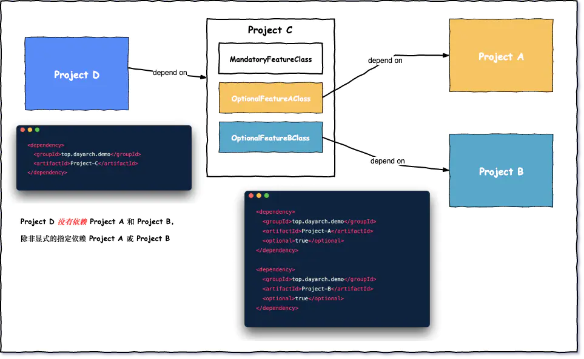
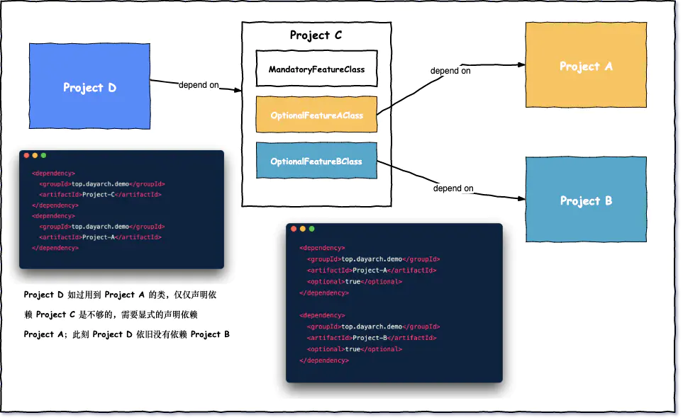

# Maven中optional关键字

> 本文转载至：[Maven optional关键字透彻图解 (juejin.cn)](https://juejin.cn/post/6844903987322290189)

本来想写一篇[如何自定义标准Spring Boot Starter](https://dayarch.top/p/spring-boot-starter-custom.html)，但是为了更好理解 Starter 的一些设计理念和其中的关键点，所以提前将一些细节内容单独提取出来讲解说明

在 Maven pom.xml 中，你经常会看到依赖项中有类似下面的代码:

```xml
<dependency>
  <groupId>sample.ProjectA</groupId>
  <artifactId>Project-A</artifactId>
  <version>1.0</version>
  <scope>compile</scope>
  <optional>true</optional> 
</dependency>
```

这里的 `<optional>true</optional>` 是什么意思呢？

## optional 关键字的奥秘

老规矩，画个图说明问题:



由于 project C 使用到了两个来自 project A 的类 (OptionalFeatureAClass) 和 project B 的类 (OptionalFeatureBClass). 如果 project C 没有依赖 packageA 和 packageB，那么编译将会失败。

project D 依赖 project C，但是对于 project D 来说，类 (OptionalFeatureAClass) 和类 (OptionalFeatureBClass) **是可选的特性**，所以为了让最终的 war/ejb package 不包含不必要的依赖，使用`<optional>` 声明当前依赖是可选的, 默认情况下也不会被其他项目继承(好比 Java 中的 final 类，不能被其他类继承一样)

如果 project D 确实需要用到 project C 中的 OptionalFeatureAClass 怎么办呢？那我们就需要在 project D 的 pom.xml 中显式的添加声明 project A 依赖，继续看下图:



Project D 需要用到 Project A 的 OptionalFeatureAClass，那么需要在 Project D 的 pom.xml 文件中显式的添加对 Project A 的依赖

到这也就很好理解为什么 Maven 为什么要设计 optional 关键字了，假设一个关于数据库持久化的项目(Project C), 为了适配更多类型的数据库持久化设计，比如 Mysql 持久化设计(Project A) 和 Oracle 持久化设计(Project B)，当我们的项目(Project D) 要用的 Project C 的持久化设计，不可能既引入 mysql 驱动又引入 oracle 驱动吧，所以我们要显式的指定一个，就是这个道理了.