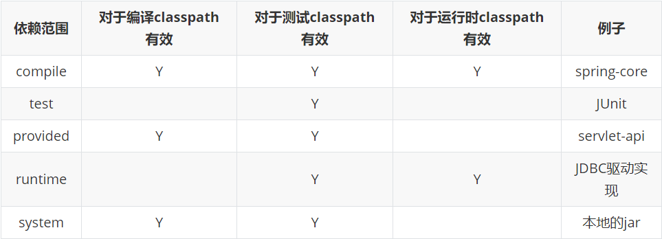
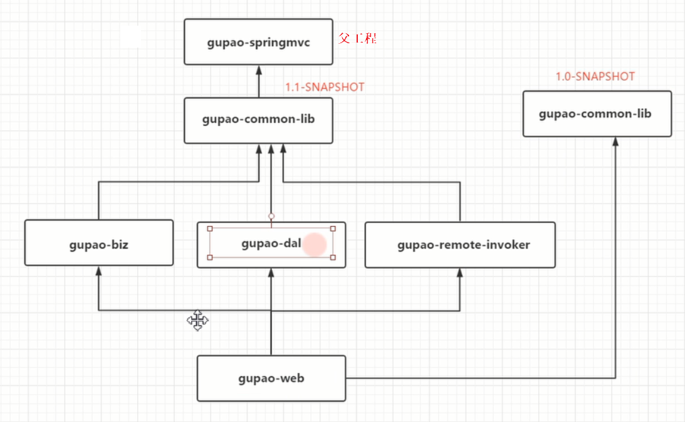
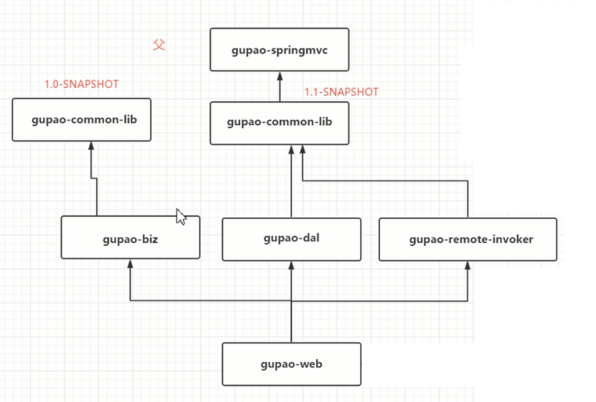
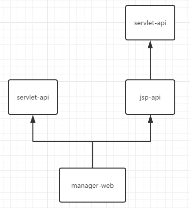

# Maven的基本使用

## **1. Maven到底是干什么的**

​	Maven的主要用途有两个：

- 依赖管理
- 项目构建

### **1.1 何为依赖管理**

​	在传统项目中，我们的项目如果需要第三方提供的库就必须得去官网上下载，有了Maven我们只需要在pom文件中配置对应库的坐标，Maven则会自动的去中央仓库下载对应的第三方库，这就是Maven的依赖管理。


### **1.2 何为项目构建**

​	依赖管理可能比较好理解，那到底什么是项目构建呢？

​	在工作中，除了需要编写源代码以外，我们每天有相当一部分时间花在了项目编译、运行单元测试、生成文档、打包和部署等繁琐且不起眼的工作上，这就是构建。如果我们还去手工的完成这一部分工作，那么效率就太低了，Maven的出现使得这一整套的动作向一条流水线一样，通过一个简单的命令就能完成。


## 2. Maven的核心思想

约定优于配置（convention over configuration），Maven通过`超级pom`约定了很多通用的配置（例如：目录结构），这样做省去了我们繁琐的配置，我们只需要按照Maven的约定进行项目的创建即可。

### **2.1 超级POM的位置**

```shell
${Maven_Home}/lib/maven-model-builder-3.3.9.jar/org/apache/maven/model/pom4.0.0.xml
```


上面截取的是超级POM的一部分，它定义了Maven项目的目录结构、编译后的输出目录、资源目录等。

### **2.2 Maven的目录结构**


## **3. 坐标和依赖**

### **3.1 何为坐标**

在一个平面中只要给定一个直角坐标系，所有的点都能通过一个（x,y）来表示；同样的Maven也需要定义一种坐标形式来定位众多的构件。

### **3.2 项目坐标定义**

任何一个构件都必须明确定义自己的坐标，而坐标是通过以下元素来定义的：groupId、artifactId、version、packaging、classfier。

- groupId：定义当前Maven项目`隶属的实际项目`。首先Maven项目和实际项目并不是一一对应的，因为有些大的项目会分成很多模块，例如SpringFramework项目（实际项目）被分成spring-core、spring-beans、spring-context等模块。

  ```xml
  <groupId>org.springframework</groupId>
  <artifactId>spring-beans</artifactId>
  <version>5.1.9.RELEASE</version>
  <packaging>jar</packaging>
  ```

- artifactId：该元素定义实际项目中的一个Maven项目（模块）

- version：该元素定义的Maven项目所处的版本

- packaging：该元素定义Maven项目的打包方式，当不定义packaging时Maven会使用默认值jar。

- classfier：该元素用于定义构件输出的一些附属构件。附属构件与主构件对应，例如主构件是nexus-indexer-2.0.0.jar的项目还可以通过使用一些插件来生成例如nexus-indexer-2.0.0-javadoc.jar、nexus-indexer-2.0.0-sources.jar这样一些附属构件。

在上面五个元素中，groupId、artifactId、version是必须定义的，而packaging是可选的（默认为jar），而classfier是不能直接定义的。


### **3.3 依赖的配置**

依赖管理时Maven的两大核心功能之一，它定义了一套成熟的依赖管理模式：

```xml
<dependencies>
	<dependency>
		<groupId>...</groupId>
		<artifactId>...</artifactId>
		<version>...</version>
		<type>...</type>
		<scope>...</scope>
		<optional>...</optional>
		<exclusions>
			<exclusion>....</exclusion>
			...
		</exclusions>
	</dependency>
    ...
</dependencies>
```

- groupId、artifactId、version：依赖的基本坐标，对任何一个依赖来说，基本坐标是最重要的。
- type：依赖的类型，对应项目坐标定义中的packaging属性。
- scope：依赖的范围。
- optional：标记依赖是否可选
- exclusions：用于排除传递性依赖。


### **3.4 依赖范围**

​	Maven在编译主代码的时候会使用一套classpath；其次Maven在编译和执行测试的时候会使用另外一套classpath；最后，实际运行Maven项目的时候，又会使用一套classpath。而依赖范围就是用来控制依赖于这三种classpath（编译classpath、测试classpath、运行classpath）。

​	**Maven有以下几种依赖范围**：

- `compile`：编译依赖范围，如果未指定scope属性，那么该依赖默认范围是compile。compile也是我们项目中运用最多的依赖范围。

- `test`：测试依赖范围，只在测试classpath中有效，在编译主代码时不能使用该此依赖。

- `provided`：已提供依赖范围，例如servlet-api，我们将项目部署到服务器时，服务器会自动的提供这些依赖环境，但是我们在编译时又必须使用该依赖，否则编译不了，所以就有了provided依赖范围。

- `runtime`：运行时依赖范围，有些依赖我们只需要在运行时加进去就可以了，例如MySQL驱动，由于MySQL驱动完全是按照java提供的规范编写，所有在Java自带的API中有对应的接口，我们面向接口编程不需要显示调用驱动中的代码，所以在代码编译时就不需要提供。

- `system`：系统依赖范围。该依赖与三种classpath的关系和provided依赖范围完全一致。但是使用system范围的依赖时必须通过systemPath元素显示的指定依赖文件的路径。由于此依赖不是通过Maven仓库解析的，，而且往往与本机系统弄个绑定，可能造成构件的不可移植，因此需谨慎使用。

  ```xml
  <dependency>
  	<groupId>javax.sql</groupId>
  	<artifactId>jdbc-stdext</artifactId>
  	<version>2.0</version>
  	<scope>system</scope>
  	<systemPath>${java.home}/lib/rt.jar</systemPath>
  </dependency>
  ```

  




### **3.5 依赖的传递**

#### **3.5.1 何为依赖传递**

Maven的依赖传递大大减轻了我们对项目依赖文件的管理难度，如果不使用Maven如果我们要在自己的项目中搭建Spring环境，那么我们就需要去下载Spring的jar包，引入到本地项目中，但是Spring仍然需要依赖其它第三方的jar包，此时我们就必须查阅相关文档手动引入Spring所依赖的环境，这个非常繁琐。

Maven的依赖传递机制就很好的解决了这一问题，如果你在pom文件中引入spring-core那么Maven就会将spring-core和spring-core所依赖的环境都引入到工程中。

#### 3.5.2 依赖范围影响依赖的传递

​	依赖范围不仅可以控制依赖于三种classpath的关系，还对传递性依赖产生影响。假设A依赖于B，B依赖于C，我们说A对于B是第一直接依赖，B对于C是第二直接依赖，A对于C是间接依赖。


​	下图中，最左边一列代表第一直接依赖，最上面一行代表第二直接依赖：


​	见上图我们可发现这样一个规律：当第二直接依赖为compile时，传递依赖与第一直接依赖一致；当第二直接依赖为test时，依赖不会得到传递；当第二直接依赖是provided时，只传递第一直接依赖为provided的依赖，且传递依赖依然为provided；当第二直接依赖是runtime时，传递依赖除compile以外与第一传递依赖一致。

​	**表格的具体理解**：


​	对于这张图，A->B和A->D就是第一直接依赖，B->C和D->E是第二直接依赖。第一和第二的概念是相对于现在所处的项目来说的。假如A项目使我们此时正在进行的项目，B、D都是本项目直接依赖的jar，那么C、E分别是B、D的直接依赖，那他们是否会随着B和D的引入而引入A项目呢？

​	根据表格得知，compile-test是无效的，也就是C根本不会被引入到A项目中；而compile-runtime是runtime也就是说E会被引入A项目，并且在A项目中E的scope是runtime。


### 3.6 依赖仲裁三原则

1. **版本声明原则**

​	优先按照依赖管理`<dependencyManagement>`元素中指定的版本声明进行仲裁，此时下面的两个原则都无效了。

2. **最短路径原则**



​	在此种依赖关系下，`gupao-web`到底依赖的是1.1版本还是1.0版本的`gupao-common-lib`。

​	根据最短路径原则，在`gupao-web`依赖的是1.0版本的，Maven会自动过滤掉1.1版本的`gupao-common-lib`

3. **最先声明原则**

   

   若`最短路径原则`无法做出仲裁，那么就需要使用`最先声明原则`了，在这个案例中，`gupao-common-lib`到底依赖哪个版本取决于，`gupao-biz`和`gupao-dal`谁先声明。


### 3.7 依赖冲突

#### 3.7.1 何为依赖冲突

大多数的依赖冲突发生的原因是因为maven的传递依赖会引入很多隐式的依赖，这些依赖可能会和我们显示依赖版本不一致。


如图，我们显示依赖了 spring-boot1.5.9，和spring-core4.0.8（当然这种情况在正常情况下不会发生）在这种情况，根据Maven的最短依赖路径原则，会使用spring-core4.0.8,当在启动项目的时候会报错。这是因为spring-boot1.5.9运行所需要的spring-core版本是4.3.13，但是项目中编译的spring-core版本是4.0.8。

​	**Maven冲突的实质是：不同版本的jar中会有部分API不一样，例如A依赖B的1.4版本中的某些新特性，但是系统根据`仲裁法则`选择了1.3版本的B，此时A所依赖的新特性用不了，这就导致项目无法运行。**


#### 3.7.2 如何解决依赖冲突

​	冲突导致项目无法运行的原因是因为系统按照“`三大依赖仲裁法则`”留下的jar包的版本不适用于所有需求者，那么我们需要通过仲裁法则或者<exclutions>标签来解决冲突。	**解决冲突的最终目的就是将我们需要的版本留下来，让系统忽略不兼容的版本。**

​	解决依赖有两大种方法：

1. 利用`依赖仲裁三原则`选出我们需要的版本

- 版本声明原则：我们在`<dependencyManagement>`锁定版本号。
- 最短路径原则：我们直接在项目中显示引入需要的jar包版本即可。
- 优先声明原则：我们将需要的版本放在前面声明

2. 利用`<exclution>`标签添加排除



在IDEA中就会显示servlet-api冲突，（omitted for duplicate：省略重复的）

​	

在当前这个情况中，我们以添加<exclution>进行排除

```xml
<dependency>
    <groupId>javax.servlet</groupId>
    <artifactId>servlet-api</artifactId>
    <scope>provided</scope>
</dependency>
<dependency>
    <groupId>javax.servlet</groupId>
    <artifactId>jsp-api</artifactId>
    <scope>provided</scope>
    <exclusions>
        <exclusion>
            <groupId>javax.servlet</groupId>
            <artifactId>servlet-api</artifactId>
        </exclusion>
    </exclusions>
</dependency>
```

