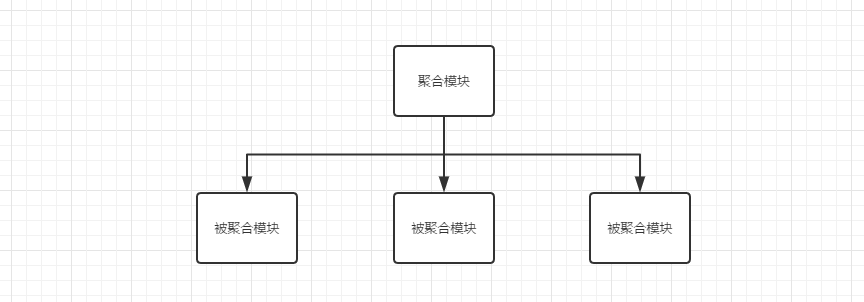

# 聚合与继承

​		在这个技术飞速发展的时代，软件开发的工程量也与日俱增，分模块开发的概念也逐渐成为了主流。分模块开发带来了更好的设计思想，以及更高的代码重用性。

## **1. 分模块开发**		

​		以一个简单的博客系统为例，在传统开发中我们将所有代码写在同一个项目中，实际上我们可以将一个WEB项目分为三个子模块：


​		一般来说，一个项目的子模块应该使用同样的groupId，如果他们一起开发和发布，还应该使用同样的version，此外，它们的artifactId还应该使用相同的前缀，以方便同其他项目区分。

**blog-web的pom.xml文件**：

```xml
<project xmlns="http://maven.apache.org/POM/4.0.0" xmlns:xsi="http://www.w3.org/2001/XMLSchema-instance"
	xsi:schemaLocation="http://maven.apache.org/POM/4.0.0 http://maven.apache.org/xsd/maven-4.0.0.xsd">
	<modelVersion>4.0.0</modelVersion>
	<groupId>com.wennry.blog</groupId>
	<artifactId>blog-web</artifactId>
	<packaging>war</packaging>
    <name>Blog Dao</name>
	<version>1.0.0-SNAPSHOT</version>
</project>
```

**blog-service的pom.xml文件**：

```xml
<project xmlns="http://maven.apache.org/POM/4.0.0" xmlns:xsi="http://www.w3.org/2001/XMLSchema-instance"
	xsi:schemaLocation="http://maven.apache.org/POM/4.0.0 http://maven.apache.org/xsd/maven-4.0.0.xsd">
	<modelVersion>4.0.0</modelVersion>
	<groupId>com.wennry.blog</groupId>
	<artifactId>blog-service</artifactId>
	<packaging>jar</packaging>
    <name>Blog Service</name>
	<version>1.0.0-SNAPSHOT</version>
</project>
```

**blog-dao的pom.xml文件**：

```xml
<project xmlns="http://maven.apache.org/POM/4.0.0" xmlns:xsi="http://www.w3.org/2001/XMLSchema-instance"
	xsi:schemaLocation="http://maven.apache.org/POM/4.0.0 http://maven.apache.org/xsd/maven-4.0.0.xsd">
	<modelVersion>4.0.0</modelVersion>
	<groupId>com.wennry.blog</groupId>
	<artifactId>blog-dao</artifactId>
	<packaging>jar</packaging>
    <!--在使用Maven命令进行构建，输出时会以name属性输出信息，使得输出更加直观-->
    <name>Blog Dao</name>  
	<version>1.0.0-SNAPSHOT</version>
</project>
```

​		此时三个项目相互独立，`如果我们此时想要一次构建三个项目该怎么办呢，而不是分别执行三次Maven命令。Maven聚合就是为这一任务诞生的`。


## **2. 聚合**

​		为了能够实现一条命令构建三个模块的效果，我们需要创建一个额外的名为blog-aggregator的模块，然后通过该模块构建整个项目的所有模块。blog-aggregator本身是一个Maven项目，它必须要有自己的POM，同时作为一个聚合项目，其POM文件又有特殊的地方。如下为blog-aggregator的POM：

```xml
<project xmlns="http://maven.apache.org/POM/4.0.0" xmlns:xsi="http://www.w3.org/2001/XMLSchema-instance"
	xsi:schemaLocation="http://maven.apache.org/POM/4.0.0 http://maven.apache.org/xsd/maven-4.0.0.xsd">
	<modelVersion>4.0.0</modelVersion>
	<groupId>com.wennry.blog</groupId>
	<artifactId>blog-aggregator</artifactId>
	<packaging>pom</packaging>
    <name>Blog Aggregator</name>
	<version>1.0.0-SNAPSHOT</version>
    <modules>
    	<module>blog-web</module>
        <module>blog-service</module>
        <module>blog-dao</module>
    </modules>
</project>
```

​		对于聚合项目来说，其打包方式packaging的值必须为pom，不然无法构建。用户在POM中通过任意数量的module元素来实现模块聚合。`这里每个module的值都是一个当前POM的相对目录`。例如blog-aggregator的POM路径为：D:/..../blog-aggregator/pom.xml，那么blog-web的目录就为：D:/..../blog-aggregator/blog-web/。blog-web里面又是一个完整的Maven项目结构。离开聚合项目后依然可以独立构建。

​		一般来说，为了方便定位内容，artifactId应与当前目录名称一致，不过这不是Maven的要求，用户可以将blog-web项目放在web-blog目录下，这时聚合项目的配置就应该改为`<module>web-blog</module>`。

​		为了方便用户构建项目，通常将聚合项目放在最顶层，其他模块则作为聚合项目的子目录存在。但是这仍然不是Maven的规定，我们仍然可以使用平行结构，但是聚合模块的POM也需要做出相应的修改：

```xml
<modules>
	<module>../blog-web</module>
	<module>../blog-service</module>
	<module>../blog-dao</module>
</modules>
```


## **3. 继承**

​		聚合解决了分模块开发需要多次构建的问题，但是分模块开发中还有一个问题需要解决，那就是POM重复配置的问题，例如web、service、dao三个模块中groupId、version以及各模块所依赖的JAR以及插件都有一定的重复。重复往往就意味着更多的劳动和更多的潜在问题。在面向对象的世界中可以使用类继承在一定程度上消除重复。在Maven的世界中，也有类似的继承机制让我们抽出重复的配置。

### **3.1 定义父模块**

​		我们需要创建一个父POM来对重复配置进行抽取，以实现一次声明多处使用的目的。我们继续以上面的项目结构为基础，在blog-aggregator下创建一个名为blog-parent的子目录，在blog-parent目录下创建pom.xml。由于父模块只是为了帮助消除配置的重复，因此他本并不包含除POM之外的项目文件，也就不需要src/main/java之类的文件夹了。

```xml
<project xmlns="http://maven.apache.org/POM/4.0.0" xmlns:xsi="http://www.w3.org/2001/XMLSchema-instance"
	xsi:schemaLocation="http://maven.apache.org/POM/4.0.0 http://maven.apache.org/xsd/maven-4.0.0.xsd">
	<modelVersion>4.0.0</modelVersion>
	<groupId>com.wennry.blog</groupId>
	<artifactId>blog-parent</artifactId>
	<packaging>pom</packaging>
    <name>Blog Parent</name>
	<version>1.0.0-SNAPSHOT</version>
</project>
```

此时整个项目的目录结构如下：


有了父模块之后我们需要让子模块继承父模块，我们就以blog-web模块为例：

```xml
<project xmlns="http://maven.apache.org/POM/4.0.0" xmlns:xsi="http://www.w3.org/2001/XMLSchema-instance"
	xsi:schemaLocation="http://maven.apache.org/POM/4.0.0 http://maven.apache.org/xsd/maven-4.0.0.xsd">
	<modelVersion>4.0.0</modelVersion>
    <parent>
    	<groupId>com.wennry.blog</groupId>
        <artifactId>blog-parent</artifactId>
        <version>1.0.0-SNAPSHOT</version>
        <relativePath>../blog-parent/pom.xml</relativePath>
    </parent>
	<artifactId>blog-web</artifactId>
	<packaging>war</packaging>
    <name>Blog Dao</name>
</project>
```

​		在子模块中我们需要使用parent标签指定父模块，以达到继承的效果。需要注意的是，relativePath表示父模块POM的相对路径。当项目构件时，Maven会首先根据relativePath检查父POM，如果找不到再去本地仓库查找。`relativePath的默认值为../pom.xml`。

​		正确设置relativePath非常重要。考虑这一情况，开发团队的新成员从源码库迁出一个包含父模块关系的Maven项目。由于只关心其中的某一个子模块是，它就直接到该模块的目录下进行构建，但是此时父模块并没有安装到本地仓库，因此如果子模块没有正确设置relativePath属性，Maven无法找到父POM，这将直接导致构建失败。

​		在子模块中如果继承了父模块，那么通常就不要定义groupId、version了，它会默认继承父POM的两个属性。

### **3.2 可继承的POM元素**

在上面我们提到了groupId、version是可以被继承的，那么还有哪些元素时可以被继承的呢？

|          元素          |                        作用                        |
| :--------------------: | :------------------------------------------------: |
|        groupId         |                      项目组ID                      |
|        version         |                      项目版本                      |
|      description       |                    项目描述信息                    |
|      organization      |                   项目的组织信息                   |
|     inceptionYear      |                   项目的创始年份                   |
|          url           |                     项目的URL                      |
|       developers       |                  项目的开发者信息                  |
|      contributors      |                  项目的贡献者信息                  |
| distributionManagement |                   项目的部署配置                   |
|    issueManagement     |                 项目的缺陷跟踪信息                 |
|      ciManagement      |               项目的持续集成系统信息               |
|          scm           |               项目的版本控制系统信息               |
|      mailingLists      |                 项目的邮件列表信息                 |
|       properties       |                  自定义Maven属性                   |
|      dependencies      |                   项目的依赖配置                   |
|  dependencyManagement  |                 项目的依赖管理配置                 |
|     reporsitories      |                   项目的仓库配置                   |
|         build          | 包括项目的源码目录配置、输出目录配置、插件管理配置 |
|       reporting        |     包括项目的报告输出目录配置、报告插件配置等     |

​	

### **3.3 依赖管理**

​		dependencies元素时可以继承的，所以我们可以将公有的依赖（例如Spring的依赖）在父POM中定义，但是这样又有一个问题，我们不能保证以后所有的项目都会依赖这些JAR，例如我们根据需求产生了blog-pojo模块，它专门用于对数据库进行实体封装。它就不需要Spring的依赖，如果直接在父POM中定义dependencies是不合理的。

​		Maven提供了dependencyManagement元素既能然子模块继承父模块的依赖配置，又能保证子模块依赖使用的灵活性。在dependencyManagement元素下的依赖声明并不会引入实际的JAR，不过它能够约束dependencies下的依赖使用。dependencyManagement声明依赖能够统一项目范围中依赖的版本，当依赖版本在父POM中声明以后，子模块声明依赖时无需声明版本，也就不会发生多个模块使用依赖版本不一致的问题。

**在blog-parent的POM进行依赖管理**：

```xml		
<project>
	<modelVersion>4.0.0</modelVersion>
	<groupId>com.wennry.blog</groupId>
	<artifactId>blog-parent</artifactId>
	<packaging>pom</packaging>
    <name>Blog Parent</name>
	<version>1.0.0-SNAPSHOT</version>
    
    <properties>
    	<spring.version>2.5.6</spring.version>
    </properties>
    <dependencyManagement>
    	<dependency>
        	<groupId>org.springframework</groupId>
            <artifactId>spring-core</artifactId>
            <version>${spring.version}</version>
        </dependency>
    </dependencyManagement>
</project>
```

**blog-web中继承父POM的声明信息**，就不需要声明依赖版本号：

```xml
<project>
	<modelVersion>4.0.0</modelVersion>
    <parent>
    	<groupId>com.wennry.blog</groupId>
        <artifactId>blog-parent</artifactId>
        <version>1.0.0-SNAPSHOT</version>
        <relativePath>../blog-parent/pom.xml</relativePath>
    </parent>
	<artifactId>blog-web</artifactId>
	<packaging>war</packaging>
    <name>Blog Dao</name>
    
    <dependencies>
    	<dependency>
        	<groupId>org.springframework</groupId>
            <artifactId>spring-core</artifactId>
        </dependency>
    </dependencies>
</project>
```


### **3.4 插件管理**

​		类似地，Maven也提供了pluginManagement元素帮助管理插件。在该元素中配置插件并不会造成实际的插件调用行为，当POM中配置了真正的plugin元素，并且其groupId和artifactId与pluginManagement中配置的插件匹配时，pluginManagement的配置才会实际影响插件的行为。

**父POM中进行插件管理**：

```xml
<build>
	<pluginManagement>
    	<plugins>
        	<plugin>
            	<groupId>org.apache.maven.plugins</groupId>
        		<artifactId>maven-source-plugin</artifactId>
        		<version>2.1.1</version>
        		<executions>
        			<execution>
            			<id>attach-sources</id>
                		<phase>verify</phase>
                		<goals>
                			<goal>jar-no-fork</goal>
                		</goals>
            		</execution>
        		</executions>
            </plugin>
        </plugins>
    </pluginManagement>
</build>
```

当子模块需要生成源码包时候，只需要进行如下简单的配置：

```xml
<build>
	<plugins>
    	<plugin>
        	<groupId>org.apache.maven.plugins</groupId>
        	<artifactId>maven-source-plugin</artifactId>
        </plugin>
    </plugins>
</build>
```

​		当项目中的多个模块有同样的插件配置时，就应当使用pluginManagement进行统一管理。即使各个模块对于同一个插件的具体不尽相同，也应当使用父POM的pluginManagement统一插件版本。


## 4. 聚合和继承的关系

​		初学者容易将聚合和继承搞混，要说关系他们其实没有任何关系，聚合主要是为了方便快速的构建项目，继承主要是为了消除一些重复的配置，这也就是为什么笔者在上面的案例中，刻意将聚合项目和用于继承的父项目分开的原因，而在日常开发中我们将通常将聚合项目与被继承的父项目放在一起，这样做容易混淆大家对聚合与继承的概念区分。

​		对于聚合模块来说，它知道有哪些子模块被聚合，但那些子模块并不知道自己被别人“聚合”了。



​		对于继承关系的父POM来说，它不知道有哪些子模块继承于它，但那些子模块都必须知道自己的父POM是什么。


​		如果非要说这两个特性的共同点，那么可以看到，聚合POM与继承关系中的父POM的packaging都必须是pom，同时，聚合模块与继承关系中的父模块除了POM之外都没有实际的内容。


