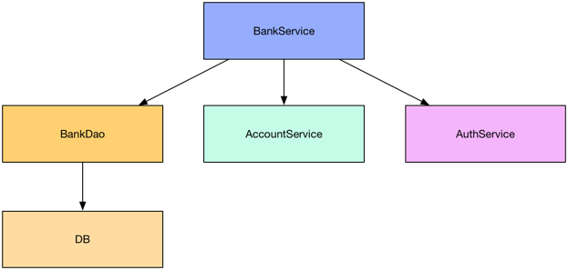

# 基本使用

> 本文参考转载至：https://segmentfault.com/a/1190000006746409

## 一. 什么是Mockito

Mockito 是一个强大的用于 Java 开发的模拟测试框架, 通过 Mockito 我们可以创建和配置 Mock 对象, 进而简化有外部依赖的类的测试.
使用 Mockito 的大致流程如下:

- 创建外部依赖的 Mock 对象, 然后将此 Mock 对象注入到测试类中.
- 执行测试代码.
- 校验测试代码是否执行正确.

## 二. 为什么使用 Mockito

我们已经知道了 Mockito 主要的功能就是创建 Mock 对象, 那么什么是 Mock 对象呢? 对 Mock 对象不是很了解的朋友, 可以参考[这篇文章](https://segmentfault.com/a/1190000006731125).

现在我们对 Mock 对象有了一定的了解了, 那么自然就会有人问了, 为什么要使用 Mock 对象? 使用它有什么好处呢?

下面我们以一个简单的例子来展示一下 Mock 对象到底有什么用.
假设我们正在编写一个银行的服务 BankService, 这个服务的依赖关系如下:



当我们需要测试 BankService 服务时, 该真么办呢?

一种方法是构建真实的 BankDao, DB, AccountService 和 AuthService 实例, 然后注入到 BankService 中.

不用我说, 读者们也肯定明白, 这是一种既笨重又繁琐的方法, 完全不符合单元测试的精神. 那么还有一种更加优雅的方法吗? 自然是有的, 那就是我们今天的主角 **Mock Object**. 下面来看一下使用 Mock 对象后的框架图:


我们看到, BankDao, AccountService 和 AuthService 都被我们使用了虚拟的对象(Mock 对象) 来替换了, 因此我们就可以对 BankService 进行测试, 而不需要关注它的复杂的依赖了.

## 三. Mockito的基本使用

为了简洁期间, 下面的代码都省略了静态导入 `import static org.mockito.Mockito.*;`

### 3.1 引入Maven依赖

```xml
<dependency>
    <groupId>org.mockito</groupId>
    <artifactId>mockito-core</artifactId>
    <version>2.0.26-beta</version>
</dependency>
```

### 3.2 创建Mock对象

```java
@Test
public void createMockObject() {
    // 使用 mock 静态方法创建 Mock 对象.
    List mockedList = mock(List.class);
    Assert.assertTrue(mockedList instanceof List);

    // mock 方法不仅可以 Mock 接口类, 还可以 Mock 具体的类型.
    ArrayList mockedArrayList = mock(ArrayList.class);
    Assert.assertTrue(mockedArrayList instanceof List);
    Assert.assertTrue(mockedArrayList instanceof ArrayList);
}
```

如上代码所示, 我们调用了 **mock** 静态方法来创建一个 Mock 对象. mock 方法接收一个 class 类型, 即我们需要 mock 的类型.

### 3.3 配置 Mock 对象

当我们有了一个 Mock 对象后, 我们可以定制它的具体的行为. 例如:

```java
@Test
public void configMockObject() {
    List mockedList = mock(List.class);

    // 我们定制了当调用 mockedList.add("one") 时, 返回 true
    when(mockedList.add("one")).thenReturn(true);
    // 当调用 mockedList.size() 时, 返回 1
    when(mockedList.size()).thenReturn(1);

    Assert.assertTrue(mockedList.add("one"));
    // 因为我们没有定制 add("two"), 因此返回默认值, 即 false.
    Assert.assertFalse(mockedList.add("two"));
    Assert.assertEquals(mockedList.size(), 1);

    Iterator i = mock(Iterator.class);
    when(i.next()).thenReturn("Hello,").thenReturn("Mockito!");
    String result = i.next() + " " + i.next();
    //assert
    Assert.assertEquals("Hello, Mockito!", result);
}
```

我们使用` when(...).thenReturn(...) `方法链来定义一个行为, 例如 `when(mockedList.add("one")).thenReturn(true) `表示: 当调用了`mockedList.add("one")`, 那么返回 true。 并且要注意的是, `when(...).thenReturn(...) `方法链不仅仅要匹配方法的调用, 而且要方法的参数一样才行.

