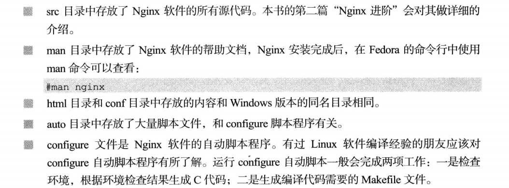
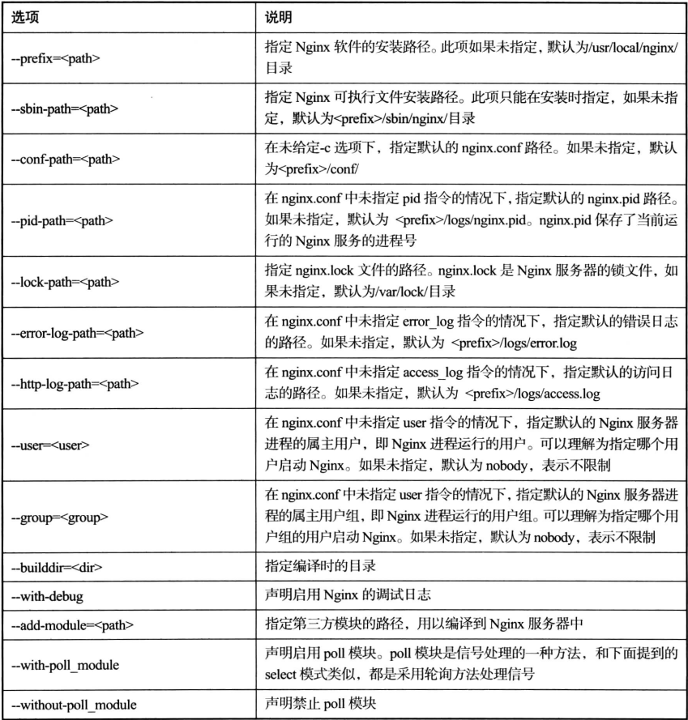

# Nginx编译与安装

## 第一步：环境安装

由于Nginx的一些模块需要第三方库的支持，我们需要在安装之前需要先安装依赖环境：

```shell
yum -y install gcc gcc-c++ automake pcre pcre-devel zlib zlib-devel open openssl-devel
```

## 第二步：解压归档

```shell
tar zxvf nginx-1.16.1.tar.gz [-C 指定路径]
```

**解压后的目录结构**：



## 第三步：生成Makefile

Nginx源代码的编译需要先使用configure脚本文件自动生成Makefile文件。configure脚本支持的常用选项：



如果我们需要将Nginx安装到`/Nginx`目录下，我们只需要执行下列语句生成Makefile文件：

```shell
./configure --prefix=/Nginx --with-http_ssl_module
```

- --prefix：指定安装目录
- --with-http_ssl_module：指定安装ssl模块，这是配置https的前提

执行完成后会发现当前目录新增了一个Makefile文件。


## 第三步：编译与安装

在生成Makefile文件后，我们只需要执行make命令即可完成编译：

```shell
make
```

在编译完成后，我们使用install命令安装即可：

```shell
make install
```

安装完毕后，我们可以看到在根目录新增`/Nginx`目录。

