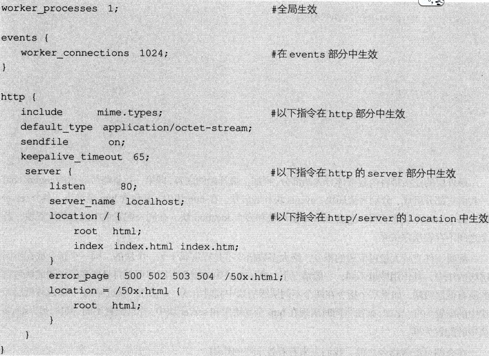
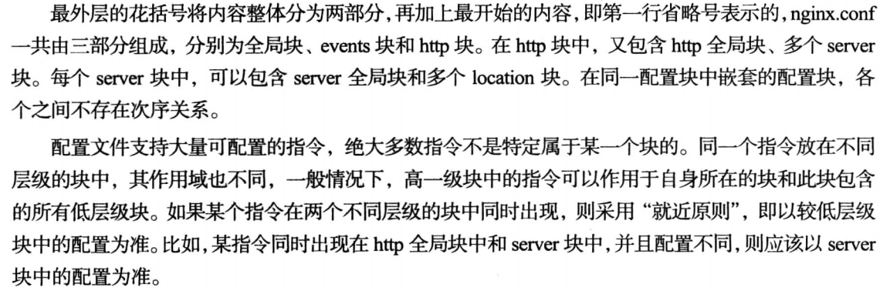
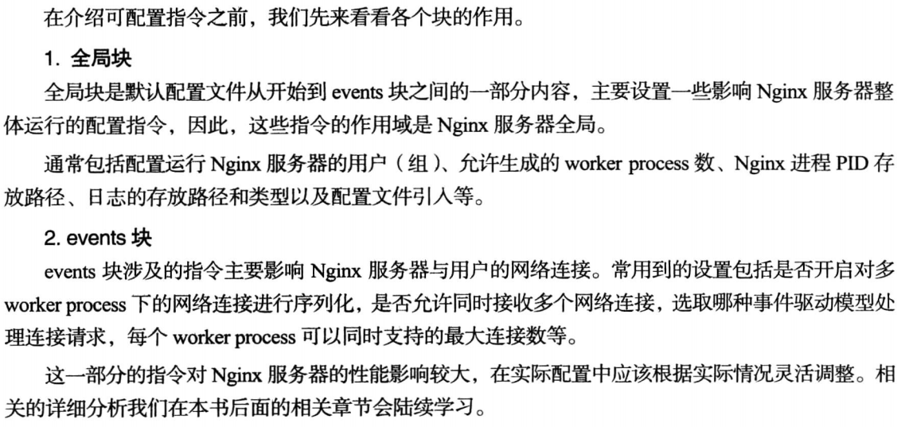
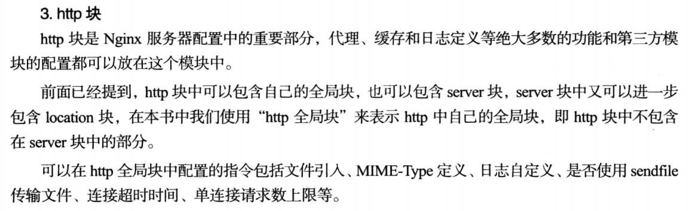
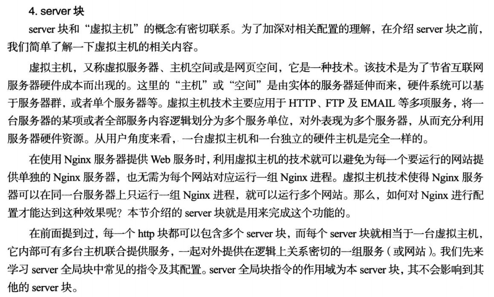
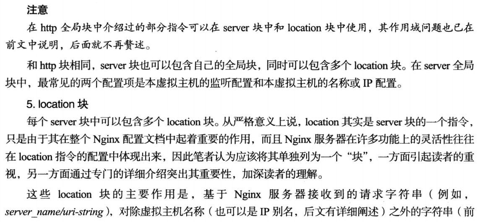
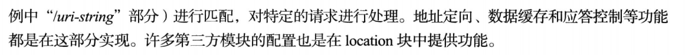

# nginx.conf文件结构

在Linux版本的Nginx在conf目录中，所有配置文件都会有一个对应的`.defualt`结尾的文件，它们是对正式配置文件的备份。

删除注释以后，默认的配置文件如下：



## 一. Nginx配置文件的文件结构

```json
...    #全局块
events {  #events块
	...
}

http {  #http块
	...    #http全局块
    server {    #server块
    	...    #server全局块
        location [PATTERN] {    #location块
        	...
        }
        location [PATTERN] {
			...
        }      
    }
    ...   #http全局块
    server {
    	...
        location [PATTERN] {
        	...
        }
        location [PATTERN] {
			...
        }      
    }
}
```











