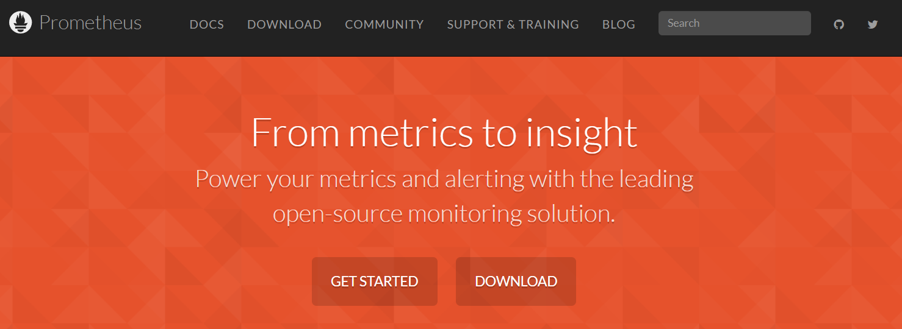
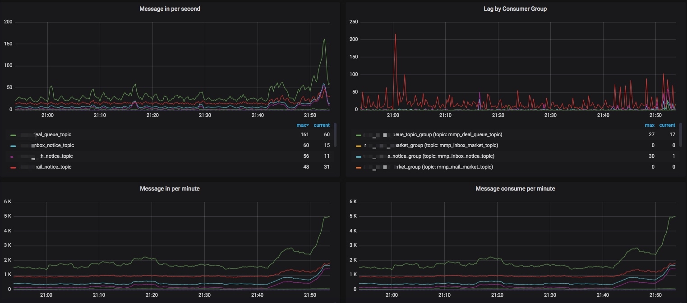

# 为什么要学Prometheus

说到 Prometheus，大多数人可能不太清楚它是做什么的。即使知道它是做监控的，也不明白为什么要做监控。这其中涉及到许多原因，我想主要有下面两点原因。

**第一，全局观不足。** 许多开发同学长期在一线开发，局限于自己开发的需求上，对整个系统不了解，对整个系统业务不了解。只有当你做了 leader 之后，你才会更关注系统的整体情况。而如果你当了 leader，你会发现业务监控系统是多么重要！（毕竟，你也不想半夜被电话吵醒，睡眼惺忪地打开电脑解决问题~）

**第二，工作经验欠缺。** 刚刚工作一两年的同学，对于 Java 整个知识体系还学得不够全面。而 Prometheus 的监控知识更多属于进阶的知识，自然会被排到更后面的位置。

除了前面说到的这两个主要原因，其实也还有一些其他原因，例如：公司技术体系问题等等。

言归正传，那 Prometheus 到底是做什么的，为什么要学习 Prometheus 呢？

## 一. 什么是Prometheus

Prometheus（普罗米修斯）是古希腊的一个神明，名字的意思是「先见之明」。从它的名字可以看出，Prometheus 是做「先见之明」的监控告警用途。

[Prometheus 官网](https://prometheus.io/)则是用「From metrics to insight」（用指标洞察系统的意思）描述了 Prometheus 的用途。

看到这里我们大概知道 **Prometheus 其实就是一个数据监控解决方案，它能帮你简单快速地搭建起一套可视化的监控系统**。 但这么说还是有点抽象，下面我举几个简单的例子，帮助大家理解 Prometheus 究竟能做什么？

- 对于运维人员来说，他们需要监控机器的 CPU、内存、硬盘的使用情况，以此来保证运行在机器上的应用的稳定性。

- 对于研发人员来说，他们关注某个异常指标的变化情况，从而来保证业务的稳定运行。

- 对于产品或运营来说，他们更关心产品层面的事情，例如：某个活动参加人数的增长情况，活动积分的发放情况。

对于上面说到的这些功能，Prometheus 都能够实现。Prometheus 能根据这些收集的数据实现告警功能。

例如：运维希望在 CPU 达到 80% 的时候给值班的运维人员发送邮件，产品希望活动积分发放数量超过 10 万的时候发送告警邮件。这些都可以通过 Prometheus 实现。

除了数据收集、告警功能之外，Prometheus 还有很多强大的功能，例如：强大的 ProQL 查询、许多客户端库等。

## 二. 为什么要学Prometheus

对于一直在一线开发的同学而言，你可能只需要把自己的需求做好、没有 bug、顺利上线，那么你的任务就完成了。但是如果你是一个 leader，那么你是对整个业务系统负责，这个业务系统出了什么问题，都是你的责任。这个时候，你需要时刻关注这个系统是否正常运行。

对于流量不是很大的系统来说，出现几分钟的故障可能造成不了多少损失。但是对于像淘宝、美团、字节跳动这样的巨无霸来说，宕机 1 分钟损失的金额可能就是几百万！

所以弄清楚此时此刻系统的运行是否正常？各项业务指标是否超过阈值？这些问题是每个经验丰富的研发人员所需要关注的事情！

那么如何监控你的系统？如何得知系统目前是正常还是异常？甚至如何预知未来一段时间系统可能出问题？**Prometheus 正是这么一套数据监控解决方案。它能让你随时掌控系统的运行状态，快速定位出现问题的位置，快速排除故障**。

只要按照 Prometheus 的方式来做，按部就班地学习和部署，我们就可以监控机器的 CPU、内存等资源的使用情况、Java 应用的运行情况以及业务各项指标的实时数据。

当然有一些公司会自己使用 Kafaka 收集监控数据，并且存储在 Hive 中，最终通过页面聚合数据，同样能够实现数据监控。但是这种解决方案需要开发人员掌握 Hive + Hadoop 等大数据框架，并且在前端展示上比较局限。

而通过 Prometheus 则可以直接部署使用，并且其与 Grafana 配套使用可以呈现出非常多样化的图表配置。**对于中小规模的团队来说，可以极大地减少成本，加快研发速度**。

而对于个人来讲，**掌握 Prometheus 可以增加你当 leader 的竞争力** 。毕竟如果一个研发对自己的系统运行状况都不了解，那么他怎么做 leader，怎么带领一个团队往前冲呢？

## 三. 总结

对于工作多年的研发人员，对自己负责的系统必须了然于胸。而要做到了然于胸，单靠一味的自信是不够的，必须借助一套功能强大的业务监控系统。Prometheus 作为这其中的翘楚，凭借其完善的功能、海量数据支持，可以让我们较低成本地实现业务监控。

> 本文转载至：[Prometheus 快速入门教程（开篇）：为什么要学 Prometheus ？ - 陈树义 - 博客园 (cnblogs.com)](https://www.cnblogs.com/chanshuyi/p/00_why_learn_prometheus.html)