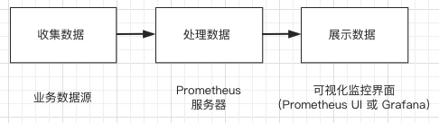
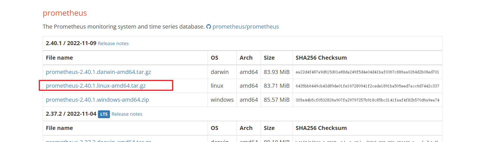
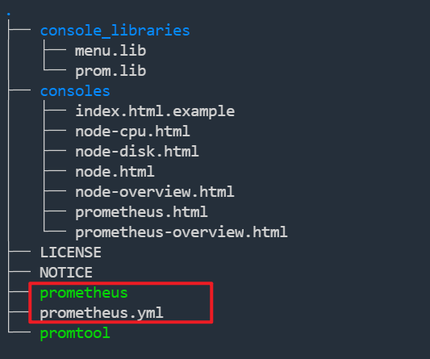
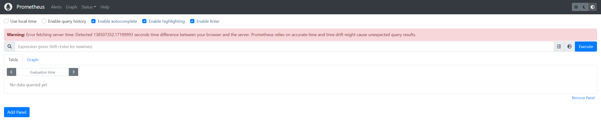
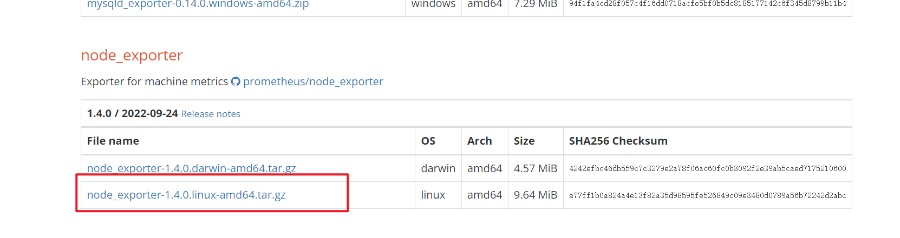
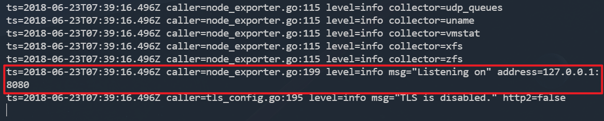
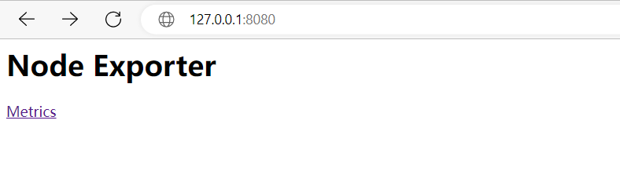
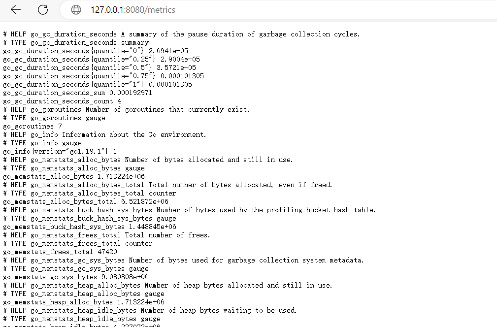
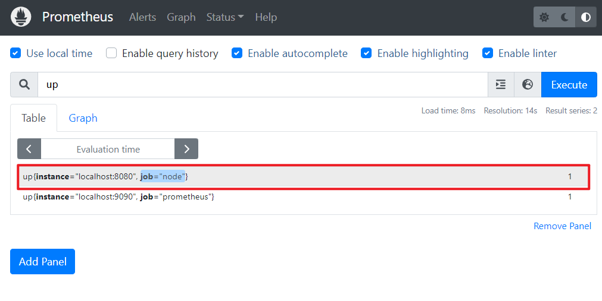
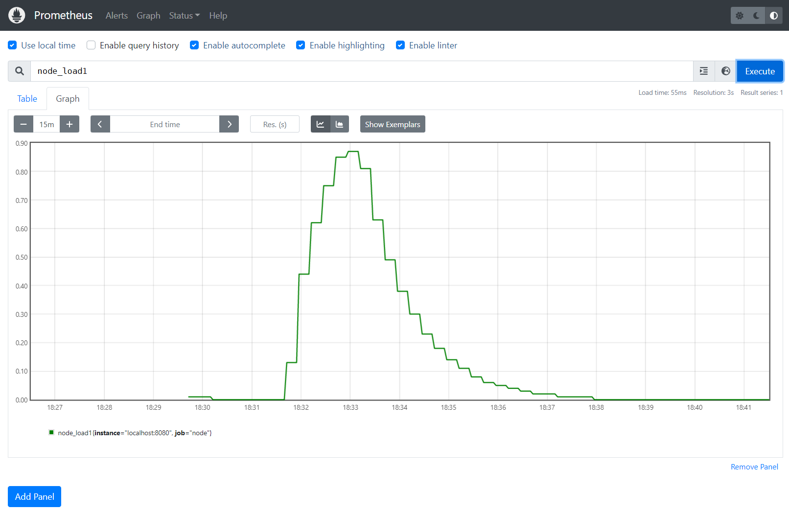

# Prometheus快速入门

Prometheus 是任何一个高级工程师必须要掌握的技能。那么如何从零部署一套 Prometheus 监控系统呢？本篇文章将从 Prometheus 的原理讲起，手把手带你用一个最简单的例子部署一套 Prometheus 监控系统。

## 一. 基本原理

Prometheus的基本架构如下图所示：


从上图可以看到，整个 Prometheus 可以分为四大部分，分别是：

- **Prometheus 服务器**

Prometheus Server 是 Prometheus组件中的核心部分，负责实现对监控数据的获取，存储以及查询。

- **NodeExporter 业务数据源**

业务数据源通过 Pull/Push 两种方式推送数据到 Prometheus Server。

- **AlertManager 报警管理器**

Prometheus 通过配置报警规则，如果符合报警规则，那么就将报警推送到 AlertManager，由其进行报警处理。

- **可视化监控界面**

Prometheus 收集到数据之后，由 WebUI 界面进行可视化图标展示。目前我们可以通过自定义的 API 客户端进行调用数据展示，也可以直接使用 Grafana 解决方案来展示。

简单地说，Prometheus 的实现架构也并不复杂。**其实就是收集数据、处理数据、可视化展示，再进行数据分析进行报警处理。** 但其珍贵之处在于提供了一整套可行的解决方案，并且形成了一整个生态，能够极大地降低我们的研发成本。



## 二. 快速入门

下面我们通过一个简单的例子来实现对服务器 CPU、内存等硬件信息的监控。

### 2.1 安装 Prometheus 服务器

Prometheus 服务端负责数据的收集，因此我们应该首先安装并运行 Prometheus Server。

从 https://prometheus.io/download/ 找到最新版本的Prometheus Sevrer软件包：



下载后解压，可以看到如下目录结构：



`prometheus.yml` 是 Prometheus的配置文件，`prometheus` 是运行的命令。

启动prometheus服务，其会默认加载当前路径下的prometheus.yaml文件。当然我们也可以手动指定配置文件地址：

```shell
./prometheus --config.file=prometheus.yml
```

正常的情况下，你可以看到以下输出内容：


输入 `http://{ip}:9090/graph` 可以看到如下页面，这个是 Prometheus 自带的监控管理界面：



> 如果和我一样，页面上面出现 “Warning: Error fetching server time: Detected 138507352.18400002 seconds time difference between your browser and the server. Prometheus relies on accurate time and time drift might cause unexpected query results.” 警告信息，说明服务器和浏览器时钟不同步，我们纠正以下服务器的时钟时间即可：
>
> 参考：[【Prometheus时间不同步】Warning! Detected 60.44 seconds time difference between your browser and the server. Prometheus relies on accurate time and time drift might cause unexpected query results. - 西泽Xiz - 博客园 (cnblogs.com)](https://www.cnblogs.com/lotoblog/p/15726478.html)
>
> 如果是CentOS8，系统无法使用 ntpdate 工具同步时钟，可参考这篇文章：
>
> [CentOS8 同步时间chrony ntpdate已无法使用_罗四强的博客-CSDN博客_centos8 ntpdate](https://blog.csdn.net/weixin_42350212/article/details/107783051)

### 2.2 运行 NodeExporter 客户端数据源

NodeExporter 是 Prometheus 提供的一个可以采集到主机信息的应用程序，它能采集到机器的 CPU、内存、磁盘等信息。

我们从 https://prometheus.io/download/ 获取最新的 Node Exporter 版本的二进制包。



下载解压后运行 Node Exporter，我们指定用 8080 端口运行:

```shell
./node_exporter --web.listen-address 127.0.0.1:8080 #如果不是在本机启动，则将ip更换为对应机器ip即可
```

启动成功后，可以看到以下输出：



访问 `http://localhost:8080/` 可以看到以下页面：



访问 `http://localhost:8080/metrics`，可以看到当前 node exporter 获取到的当前主机的所有监控数据，如下所示：



每一个监控指标之前都会有一段类似于如下形式的信息：

```bash
# HELP node_cpu Seconds the cpus spent in each mode.
# TYPE node_cpu counter
node_cpu{cpu="cpu0",mode="idle"} 362812.7890625
# HELP node_load1 1m load average.
# TYPE node_load1 gauge
node_load1 3.0703125
```

其中 HELP 用于解释当前指标的含义，TYPE 则说明当前指标的数据类型。

在上面的例子中 node_cpu 的注释表明当前指标是 cpu0 上 idle 进程占用 CPU 的总时间，CPU 占用时间是一个只增不减的度量指标，从类型中也可以看出 node_cpu 的数据类型是计数器(counter)，与该指标的实际含义一致。

又例如node_load1该指标反映了当前主机在最近一分钟以内的负载情况，系统的负载情况会随系统资源的使用而变化，因此node_load1反映的是当前状态，数据可能增加也可能减少，从注释中可以看出当前指标类型为仪表盘(gauge)，与指标反映的实际含义一致。

除了这些以外，在当前页面中根据物理主机系统的不同，你还可能看到如下监控指标：

```txt
node_boot_time：系统启动时间
node_cpu：系统CPU使用量
nodedisk*：磁盘IO
nodefilesystem*：文件系统用量
node_load1：系统负载
nodememeory*：内存使用量
nodenetwork*：网络带宽
node_time：当前系统时间
go_*：node exporter中go相关指标
process_*：node exporter自身进程相关运行指标
```

### 2.3 配置 Prometheus 的监控数据源

现在我们运行了 Prometheus 服务器，也运行了业务数据源 NodeExporter。但此时 Prometheus 还获取不到任何数据，我们还需要配置下 prometheus.yml 文件，让其去拉取 Node Exporter 的数据。

我们配置一下 Prometheus 的配置文件，让 Prometheus 服务器定时去业务数据源拉取数据。编辑prometheus.yml 并在 scrape_configs 节点下添加以下内容:

```yml
scrape_configs:
  - job_name: 'prometheus'
    static_configs:
      - targets: ['localhost:9090']
  # 采集node exporter监控数据
  - job_name: 'node'
    static_configs:
      - targets: ['localhost:8080']
```

上面配置文件配置了两个任务。一个是名为 prometheus 的任务，其从「localhost:9090」地址读取数据。另一个是名为 node 的任务，其从「localhost:8080」地址读取数据。

配置完成后，我们重新启动 Prometheus。

```shell
./prometheus --config.file=prometheus.yml
```

### 2.4 查询监控数据

配置完 Prometheus 读取的数据源之后，Prometheus 便可以从 Node Exporter 获取到数据了。那么接下来我们如何查看到这些数据呢？答案是：Prometheus UI！

Prometheus UI 是 Prometheus 内置的一个可视化管理界面，我们通过 `http://localhost:9090` 就可以访问到该页面。

通过 Prometheus UI 可以查询 Prometheus 收集到的数据，而 Prometheus 定义了 PromQL 语言来作为查询监控数据的语言，其余 SQL 类似。

接下来我们访问 `http://localhost:9090`，进入到 Prometheus Server。如果输入「up」并且点击执行按钮以后，可以看到如下结果：



可以看到 `Element` 处有几条记录，其中 instance 值为 localhost:8080 的记录，value 是 1，这代表对应应用是存活状态。

例如查看我们所运行 NodeExporter 节点所在机器的内存使用情况，可以输入 `node_memory_Active_bytes/(1024*1024*1024)` 查看：


查看 NodeExporter 节点所在机器 CPU 1 分钟的负载情况，可以输入 `node_load1` 即可查看。



到这里，我们基本上为完成了数据的收集过程，即数据从业务侧收集到 Prometheus 侧，并且还学会了如何使用 Prometheus 自带的控制台。

## 三. 总结

这篇文章我们从 Prometheus 的原理入门，剖析了 Prometheus 实现的原理，并且用一个简单的例子从零实现了一套业务监控系统。

通过 NodeExporter 组件获取物理机监控信息并暴露接口，通过 Prometheus 配置的定时Job不断拉取采集器的数据并记录到时序数据库中，通过 Prometheus UI，我们可以实时获取到机器的存活信息、CPU、内存信息。


> 本文参考至：[Prometheus 快速入门教程（一）：Prometheus 快速入门 - 陈树义 - 博客园 (cnblogs.com)](https://www.cnblogs.com/chanshuyi/p/01_head_first_of_prometheus.html)