# Prometheus+Grafana实现监控指标可视化


## 一. 什么是Grafana

Prometheus UI 提供了快速验证 PromQL 以及临时可视化支持的能力，但其可视化能力却比较弱。一般情况下，我们都用 Grafana 来实现对 Prometheus 的可视化实现。

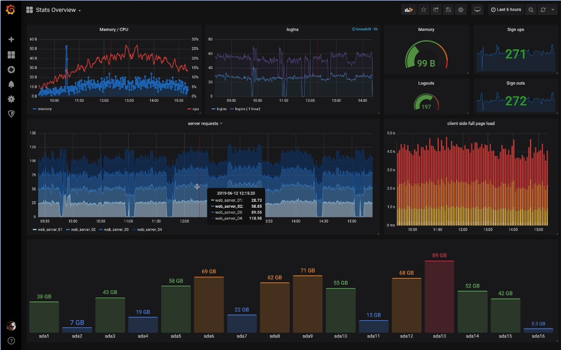

## 二. 快速入门

我们只需要在 Grafana 上配置一个 Prometheus 的数据源。接着我们就可以配置各种图表，Grafana 就会自动去 Prometheus 拉取数据进行展示。

### 2.1 启动服务器

首先我们从 https://grafana.com/grafana/download 下载对应系统的安装包，下载解压后用下面的命令启动：

```shell
./grafana-server web
```

或者使用docker启动grafana镜像：

```shell
docker run -d --name=grafana -p 9091:3000 grafana/grafana-enterprise
```

Grafana 默认使用 3000 端口启动，我们访问：[http://localhost:3000](http://localhost:3000/) 查看对应页面。

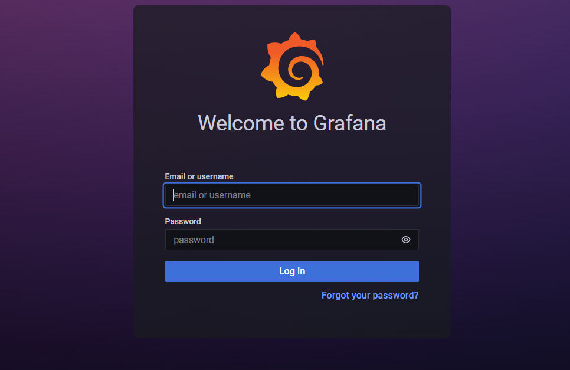

默认的账号密码是 admin/admin，登陆进去后是这样的。

### 2.2 配置数据源

之后我们去设置菜单添加 Prometheus 数据源：

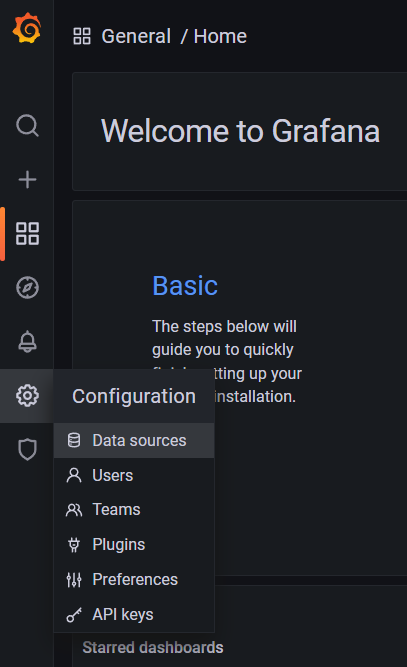

打开如下图所示：

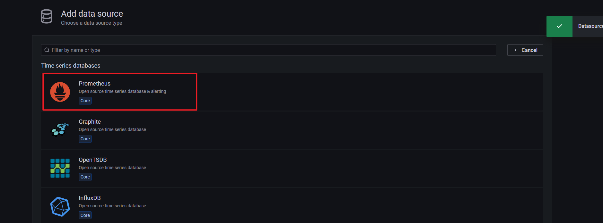

我们使用 Prometheus 作为数据源，之后输入对应的名称和URL即可：

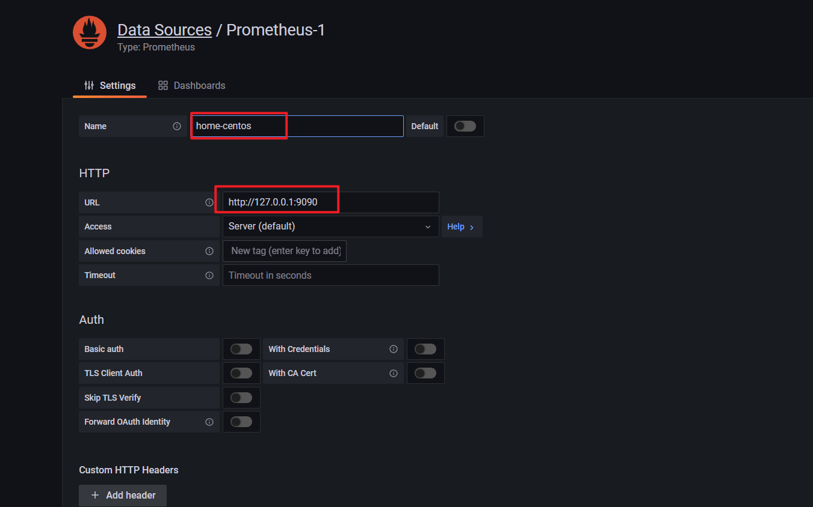

这里我们添加了一个名为「Prometheus-1」的数据源，数据获取地址为：[http://127.0.0.1:9090](http://localhost:9090/)。

> 需要注意的是，如果使用容器启动的话，这里就不能使用127.0.0.1，得使用 Prometheus 所在宿主机IP。

### 2.3 配置面板

在 Grafana 中有「Dashboard」和「Panel」的概念，Dashboard 可以理解成「看板」，而 Panel 可以理解成「图表，一个看看板中包含了无数个图表。例如下图就是一个看板（Dashboard）：


里面一个个小的图表，就是一个个小的图表（Panel）。

点击「+号」-> 「Dashboard」就可以添加一个大面板。

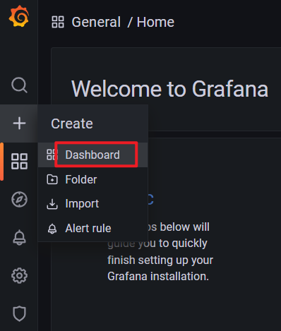

添加后的面板是空白的，下面我们创建一个图标来显示 CPU 的使用率变化情况。点击右上角的创建图表按钮：

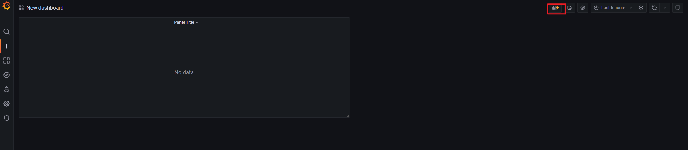

点击创建图表会进入如下界面：

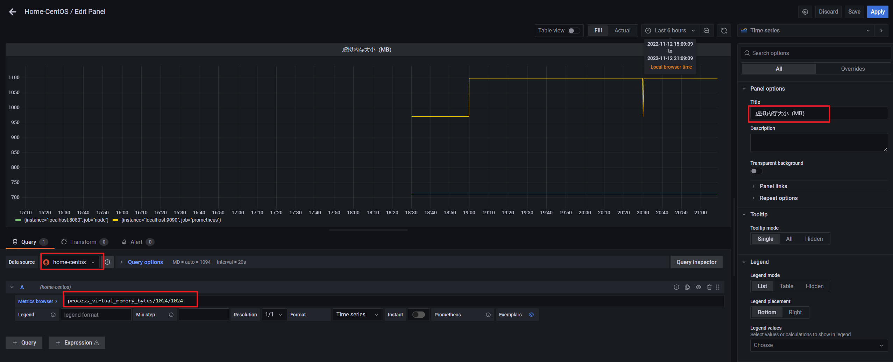

我们设置好数据源、Metrics数据、图表名称，之后点击右上角的 Apply 按钮即可。保存之后我们就可以在面板中看到机器的 虚拟内存 使用情况了。


### 2.4 邮件通道

如果我们要使用 Prometheus 进行监控告警，那么 Grafana 也能够实现。

Grafana 的告警渠道有很多，这里我们以邮件告警为例。

首先需要在 Grafana 的配置文件，默认是 conf/default.ini 文件。

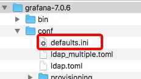

在 default.ini 文件中增加如下配置：

```yml
[smtp]
enabled = true
host = smtp.exmail.qq.com:465
user = xxx@qq.com
# If the password contains # or ; you have to wrap it with triple quotes. Ex """#password;"""
password = xxxx
cert_file =
key_file =
skip_verify = false
from_address = xxx@qq.com  //必须与上面的 user 属性一致
from_name = Grafana
ehlo_identity =
```

host 这里是你邮箱所在运营商的 SMTP 服务器。user 属性是发件人的邮箱地址。password 是发件人邮箱的登陆密码。from_address 与 user 属性一样，都是发件人的邮箱地址。from_name 是发件人的显示名称。

修改完成之后，保存配置文件，之后重启 Grafana。接着通过 Alerting 菜单添加告警渠道。

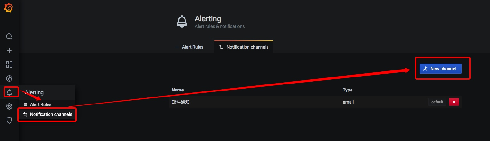

之后填写「提醒通道」名称、类型，之后点击「Send Test」按钮测试一下。

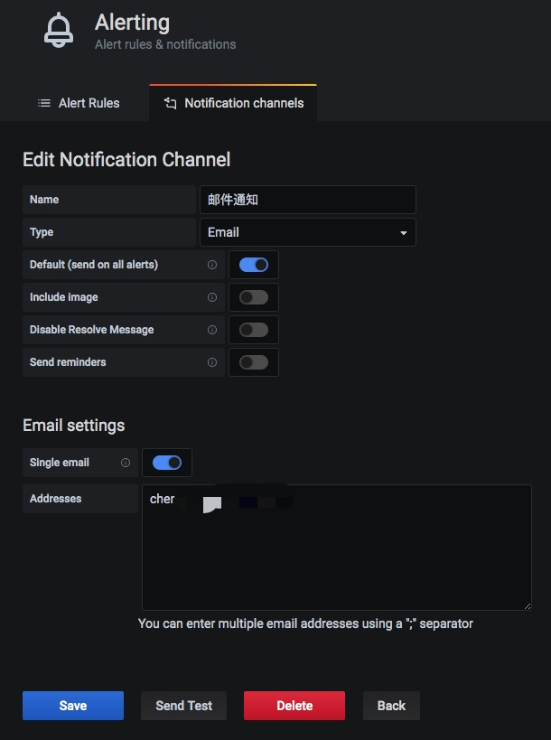

正常的话，会受到一封测试邮件，这表明邮件配置已经完成。

此外我们还可以配置 AlertManager、钉钉等其他告警方式，配置的流程都大同小异，这里不再赘述。

### 2.5 指标告警配置

配置好邮件发送通道信息后，Grafana 就具备了发送邮件的能力。但是什么时候发送邮件呢？这就需要我们进行指标告警配置了。

我们需要在图表面板设置中设置相关报警信息：

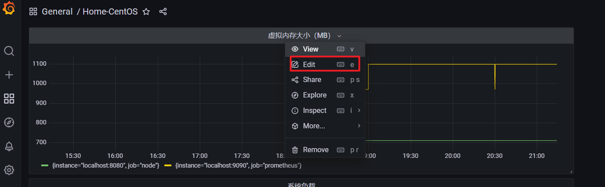

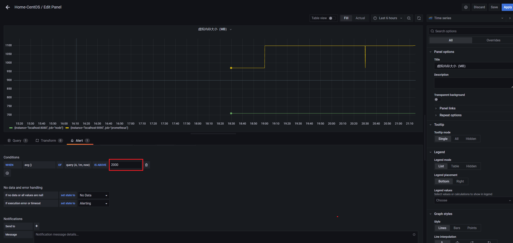

这里我配置了 1 分钟内值大于 2000，那么就报警，即：1 分钟内挂机了，那么就报警。

发送的邮件大概样式如下：

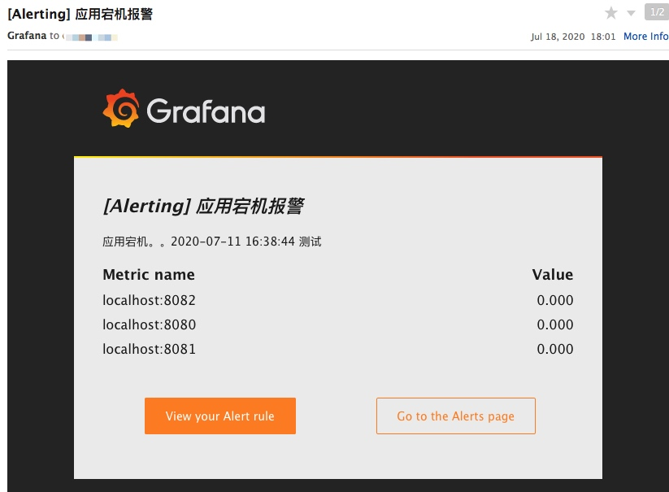

## 二. Grafana模板中心

对于线上监控来讲，如果我们每个面板都需要自己从零开始，那么就太累了。事实上，我们用到的许多监控信息都是类似的。因此 [Grafana官网 - Dashboards 模块](https://grafana.com/grafana/dashboards) 提供了下载 Dashboard 模板的功能。


Dashboards 里有许多各种类型的 Dashboard 面板，例如 JVM 监控、MySQL 数据库监控等。你只需找到合适自己的监控面板，之后根据 ID 添加即可。

例如我找到的这个这个面板包含了各种常见的资源监控，例如：CPU、内存等。

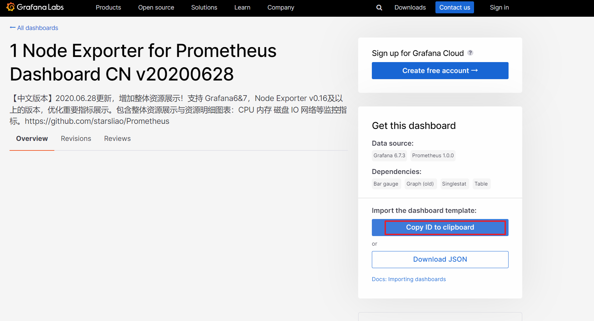

你只需要复制它的 ID 并使用 Grafana 的 import 功能导入即可，如下图所示：

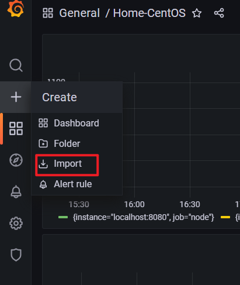

最终效果如图所示：

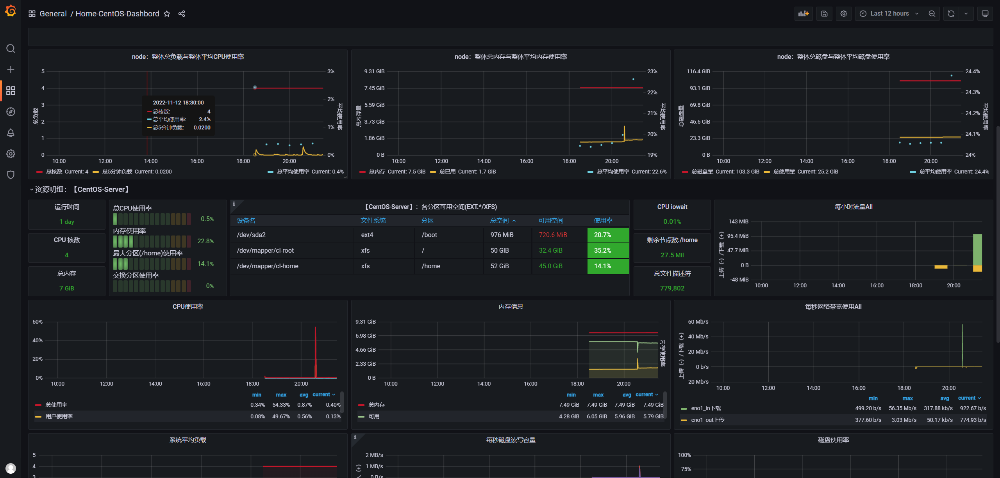


> 本文参考至：[Prometheus 快速入门教程（二）：Prometheus + Grafana实现可视化、告警 - 陈树义 - 博客园 (cnblogs.com)](https://www.cnblogs.com/chanshuyi/p/02_grafana_quick_start.html)