# Grafana 图表配置快速入门

前面我们使用 Prometheus + Grafana 实现了一个简单的 CPU 使用率变化图，但是这个图还有许多缺陷，例如：左边栏的数值太小了无法调整，下面的图标信息无法定制化等等。

其实 Grafana 的功能是非常强大的，可以针对不同的需求进行针对性设置，从而做出让你满意的监控图表。那么我们今天就系统地讲一讲如何设置 Grafana 图表！

## 一. Dashboard 与 Panel

Dashboard（面板）与 Panel（图表）是 Prometheus 的基本单元，我们所有的监控数据都会通过这两个东西来呈现。

Dashboard 就是一个大的面板，里面包含了无数个图表（Panel）。例如：我们希望监控订单系统的各项业务指标，那么我们可以建立一个名为「订单业务监控」的面板，然后在这个面板下建立许多个图表。

## 二. Panel 图表配置

Panel（图表）是 Prometheus 中数据呈现的最小单元，我们看到的面板数据，都是由一个个图表构成的。图表（Panel）的设置区域一共可以分为三部分：

- 预览区：用来预览设置的图表。
- 数据设置区：用来设置数据源、数据指标等。
- 图表设置区：用来对图表的名称等进行设置。

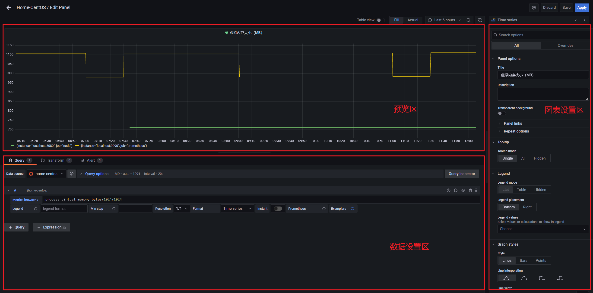

### 2.1 预览区

预览区非常简单，就是针对「数据设置区」和「图表设置区」的设置结果，进行模拟显示，从而让我们可以实时看到效果，方便我们进行配置。

### 2.2 数据设置区

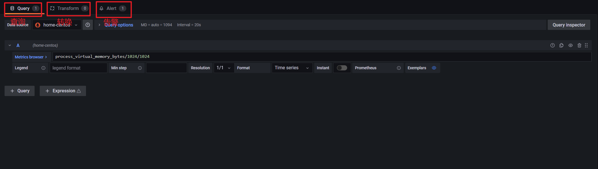

#### 2.2.1 查询

查询设置区可以分为两块，分别是：

- 数据源设置
- 数据指标设置

##### 数据源设置

数据源设置用来设置使用哪个数据源。此外，还可以针对选择的数据进行更精细化的设置，例如：Max data points 等设置。

##### 数据指标设置

这块用来设置你想显示数据源中的哪个指标、标识填什么、格式是啥。

整体来说有这么几个选项：

- Metrics 指标名

表明这个图表是用来展示数据源中的什么数据，是显示变化率，还是数值，这里相当于一个表达式。例如我这里是用来显示 CPU 的变化率的，所以我填入的是：「rate(system_cpu_usage[1m])」，这表示使用 1 分钟的数据变化率来显示 CPU 的变化情况。

- Legend 图例

图例可以设置图例的显示数值是什么，例如这里我写了：「{{instance}}-1m」，这表示使用实例名为前缀，后面再加上「-1m」字符串，最终显示为：「localhost:8080-1m」，其中 localhost:8080 为实例名。

- Min Step 最小步长

最小步长表示图形里每两个点的最小数据间隔是多少，例如：这里我设置了 200，那表示图形上每隔 200 个单位才会有一个点。观察一下图形可以大致知道 min step 的作用。

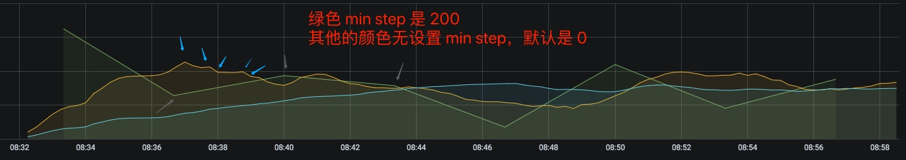

- Resolution 精度

这表示其数据精度是怎样的，是 1 比 1 的精度，还是原有的 1/2，还是 1/3 等等。如果是 1/2 的话，那么就是原本 1 个单位显示一个点，现在 2 个单位合并起来显示成一个点了，那么其精度就变低了。

- Format 格式

表示你的数据格式是什么，这里有：Time series、Table、Heap Map 三个选项。Time series 表示是时间序列数据，即随着时间的流动有源源不断的数据。Table 表示是一个表格数据。Heap Map 表示是热力图数据。

我们可以通过左下角的 Query 来增加显示的数据。例如我这里使用了 3 个图例数据来分别显示：1 分钟的 CPU 使用率情况、5 分钟的 CPU 使用率情况、15 分钟的 CPU 使用率情况。

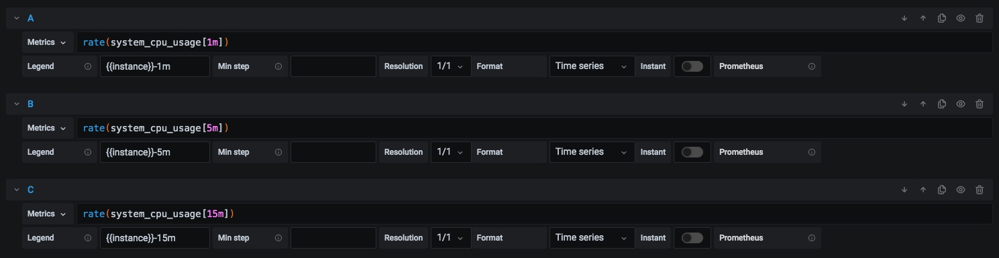

设置完成后的图标整体效果如下：

#### 2.2.2 转换设置区

转换设置区主要是用来一些更复杂的数据处理，例如：过滤一些数据，做集合操作等。

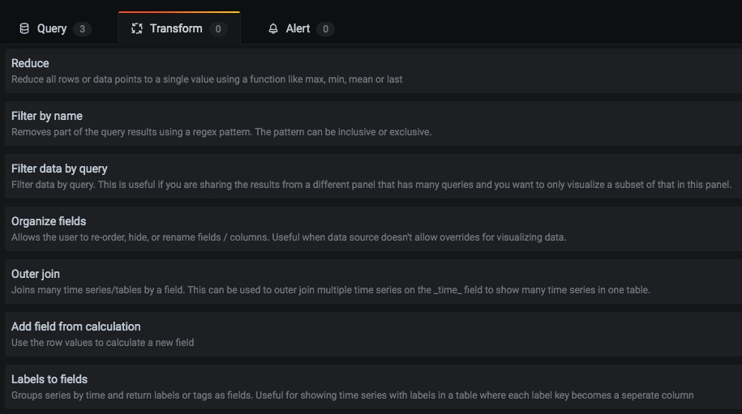

这块使用得相对少一些，这里就不深入讲解，等使用到的时候再深入了解也不迟。

#### 2.2.3 告警设置区

告警设置区用来进行指标告警，这块内容也相对简单，直接看页面就可以弄清楚了。后面文章也有例子讲解，这里不再赘述。

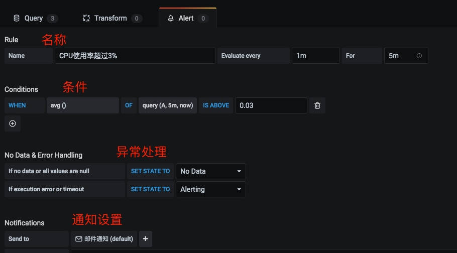

### 2.3 图表设置区

这块用来设置图表名称、Y 轴显示样式等图表细节的。主要有下面几个区域：

- Settings 设置
- Visualization 可视化

#### 2.3.1 Setttings 设置

用来设置图表名称和描述。

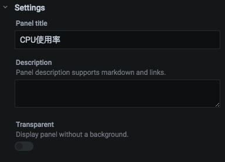

#### 2.3.2 Visualization 可视化

用来设置图表使用什么格式显示，有 图形（Graph）、统计（Stat）、表格（Table）、文本（Text）等。

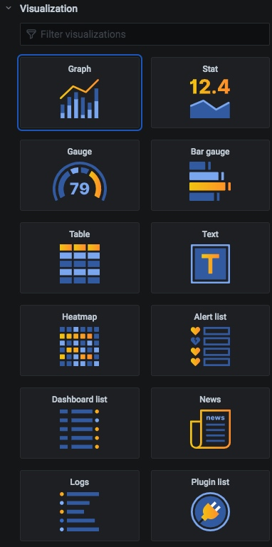

#### 2.3.3 Display 显示

用来设置图表样式相关信息。

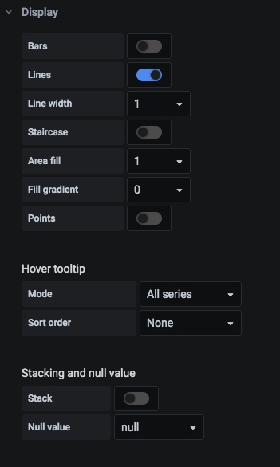

例如 Bars 表示图形有长条，如下图所示：

例如设置 Hover tooltip 的 Mode 为 Single，表示鼠标悬浮到图表时，只显示单条线的悬浮提示，而不是全部线条都显示悬浮提示。

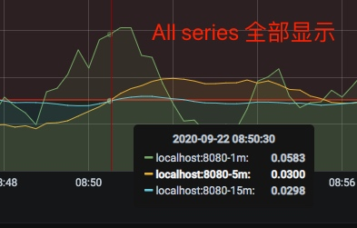

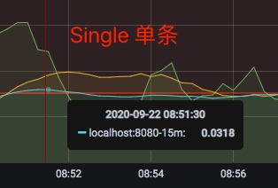

其他设置都相对简单，这里不再赘述。

#### 2.3.4 Axes 轴

用来设置轴的相关信息，例如：X/Y轴的显示单位，X/Y轴的最小最大值等。

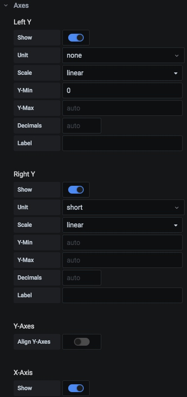

例如在显示 CPU 使用率时，CPU 使用率的数据是 0-1，但是默认是显示成小数，如下图所示：

那如果我希望它能用百分比显示，那么我可以设置 Left Y 的 Unit 参数，将其设置为：percent(0.0-1.0)。

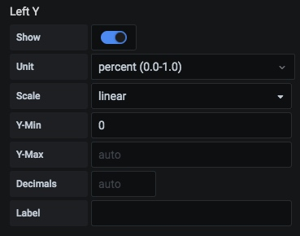

设置完之后图表变成了这样：

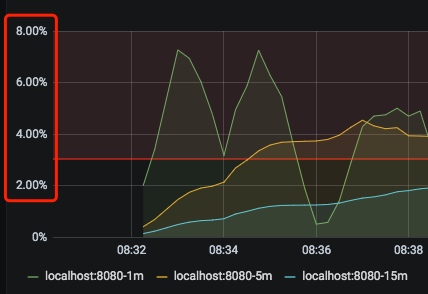

其他参数的设置都类似，这里不再赘述了。

#### 2.3.5 legend 图例

这里用来设置图例信息，例如：图例的显示位置、图例显示最大值、最小值。

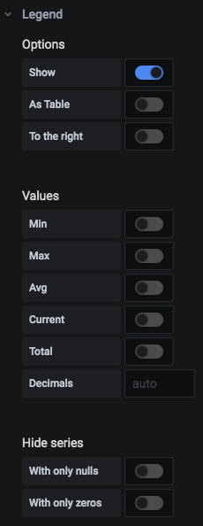

这块的内容也相对简单，自己去试试就清楚了，不再赘述。

#### 2.3.6 Thresholds 阈值

用来设置一个阈值，当超过指定的值，会有标记成背景颜色。通常用来针对某个关键数据，当超过某个值进行高亮，方便一目了然查看数据。

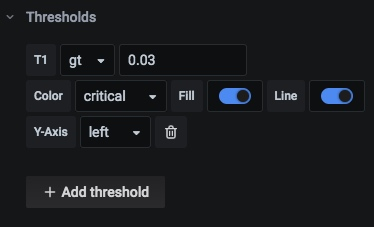

例如 CPU 使用率的例子，我设置了超过 3% 就高亮成红色（Critical）。最终效果如下图所示：

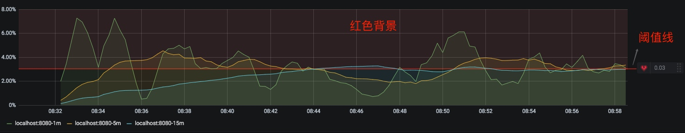

## 三. 总结

我们通过一个 CPU 使用率的例子，将 Grafana 图表的配置都过了一遍。总的来说，Grafana 图表配置可分为：预览区、数据配置区、图表配置区。其中涉及到了数据源的配置、数据指标的配置以及各种图表显示的配置等。

虽然我们可以直接使用 [Grafana官网 - Dashboards 模块](https://grafana.com/grafana/dashboards)的现成模板，但如果你想做符合自己业务情况的监控面板，掌握 Grafana 图表的配置可是必不可少哦。