# PromQL 快速入门

我们在 [Grafana图表配置快速入门](./_4Grafana图表配置快速入门.md) 中提到可以针对业务指标做自定义监控，其中有一个设置属性为 Metrics，即：

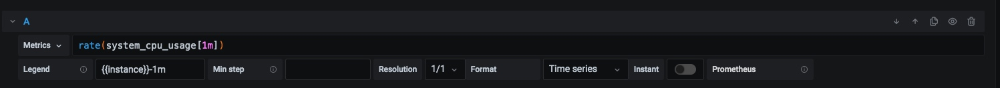

这个 Metrics 属性的值遵守了 PromQL 规则。我们只要学会了 PromQL 表达式，就知道了怎么设置这个属性了。

## 一. 什么是 PromQL

PromQL（Prometheus Query Language）是 Prometheus 内置的数据查询语言，它能实现对事件序列数据的查询、聚合、逻辑运算等。它并且被广泛应用在 Prometheus 的日常应用当中，包括对数据查询、可视化、告警处理当中。

简单地说，PromQL 广泛存在于以 Prometheus 为核心的监控体系中。所以需要用到数据筛选的地方，就会用到 PromQL。例如：监控指标的设置、报警指标的设置等等。

参考：[Prometheus 中文文档](https://prometheus.fuckcloudnative.io/di-san-zhang-prometheus/di-4-jie-cha-xun/basics)

## 二. PromQL 基础用法

当Prometheus通过 Exporter 采集到相应的监控指标样本数据后，我们就可以通过 PromQL 对监控样本数据进行查询。

当我们直接使用监控指标名称查询时，可以查询该指标下的所有时间序列。我们这里启动 Prometheus 服务器，并打开 http://localhost:9090/graph 地址。在查询框中，我们输入：`prometheus_http_requests_total` 并点击执行。

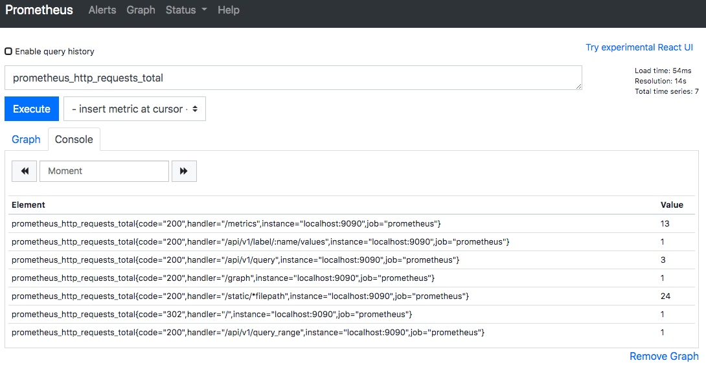

可以看到我们查询出了所有指标名称为 `prometheus_http_requests_total` 的数据。

PromQL 支持户根据时间序列的标签匹配模式来对时间序列进行过滤，目前主要支持两种匹配模式：完全匹配和正则匹配。

### 2.1 完全匹配

PromQL 支持使用 = 和 != 两种完全匹配模式。

- 等于。通过使用 `label=value` 可以选择那些标签满足表达式定义的时间序列。
- 不等于。通过使用 `label!=value` 则可以根据标签匹配排除时间序列。

例如我们上面查询出了所有指标名称为 `prometheus_http_requests_total` 的数据。这时候我们希望只查看错误的请求，即过滤掉所有 code 标签不是 200 的数据。那么我们的 PromQL 表达式可以修改为：`prometheus_http_requests_total{code!="200"}`。

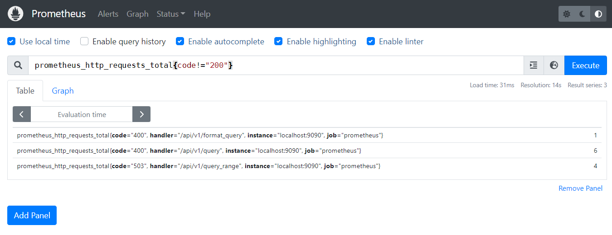

从上图可以看到，查询出的结果已经过滤掉了所有 code 不为 200 的数据。

### 2.2 正则匹配

PromQL 还可以使用正则表达式作为匹配条件，并且可以使用多个匹配条件。

- 正向匹配。使用 `label=~regx` 表示选择那些标签符合正则表达式定义的时间序列。
- 反向匹配。使用 `label!~regx` 进行排除。

例如我想查询指标 `prometheus_http_requests_total` 中，所有 handler 标签以 `/api/v1` 开头的记录，那么我的表达式为：`prometheus_http_requests_total{handler=~"/api/v1/.*"}`。

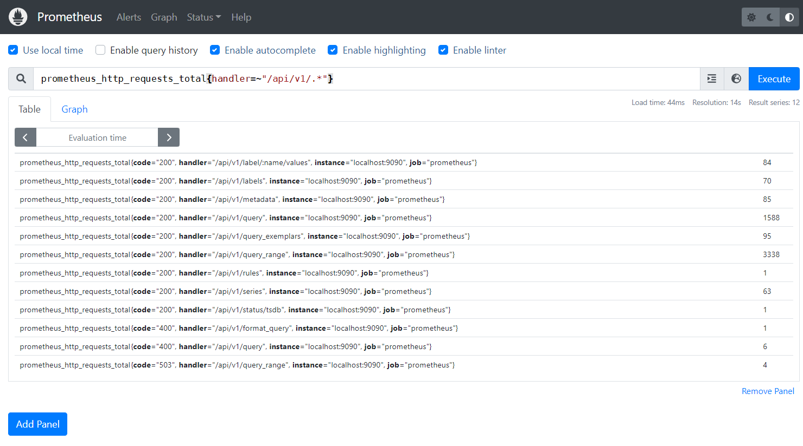

从上面的查询结果可以看出，查询的结果已经只保留了handler 标签以 `/api/v1` 开头的数据。

### 2.3 范围查询

我们上面直接通过类似 `prometheus_http_requests_total` 表达式查询时间序列时，同一个指标同一标签只会返回一条数据。这样的表达式我们称之为**瞬间向量表达式**，而返回的结果称之为**瞬间向量**。

而如果我们想查询一段时间范围内的样本数据，那么我们就需要用到**区间向量表达式**，其查询出来的结果称之为**区间向量**。时间范围通过时间范围选择器 `[]` 进行定义。例如，通过以下表达式可以选择最近5分钟内的所有样本数据：

```promql
prometheus_http_requests_total{}[5m]
```

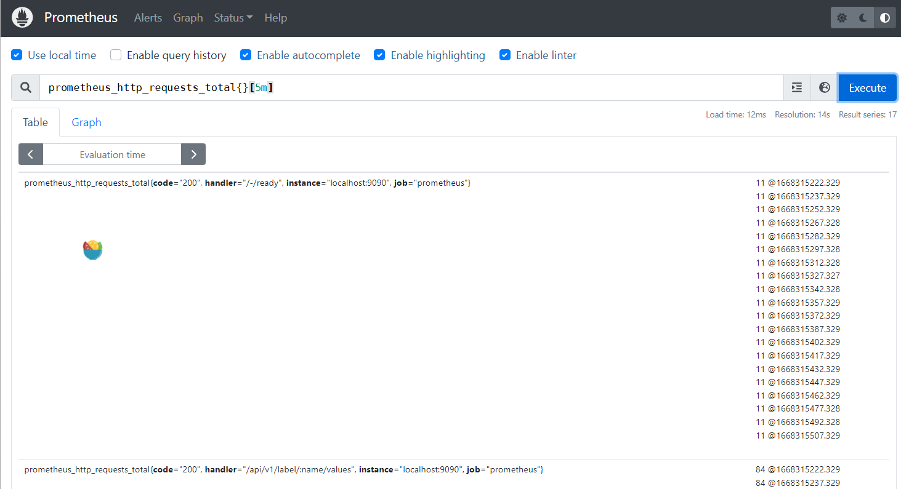

通过查询结果可以看到，此时我们查询出了所有的样本数据，而不再是一个样本数据的统计值。

除了使用m表示分钟以外，PromQL的时间范围选择器支持其它时间单位：

- s - 秒
- m - 分钟
- h - 小时
- d - 天
- w - 周
- y - 年

### 2.4 时间位移操作

在瞬时向量表达式或者区间向量表达式中，都是以当前时间为基准：

```bash
# 瞬时向量表达式，选择当前最新的数据
prometheus_http_requests_total{} 
# 区间向量表达式，选择以当前时间为基准，5分钟内的数据
prometheus_http_requests_total{}[5m] 
```

如果我们想查询 5 分钟前的瞬时样本数据，或昨天一天的区间内的样本数据呢? 这个时候我们就可以使用位移操作，位移操作的关键字为 offset。

```txt
# 查询 5 分钟前的最新数据
http_request_total{} offset 5m
# 往前移动 1 天，查询 1 天前的数据
# 例如现在是 2020-10-07 00:00:00
# 那么这个表达式查询的数据是：2020-10-05 至 2020-10-06 的数据
http_request_total{}[1d] offset 1d
```

### 2.5 聚合操作

一般情况下，我们通过 PromQL 查询到的数据都是很多的。PromQL 提供的聚合操作可以用来对这些时间序列进行处理，形成一条新的时间序列。

以我们的 `prometheus_http_requests_total` 指标为例，不加任何条件我们查询到的数据为：

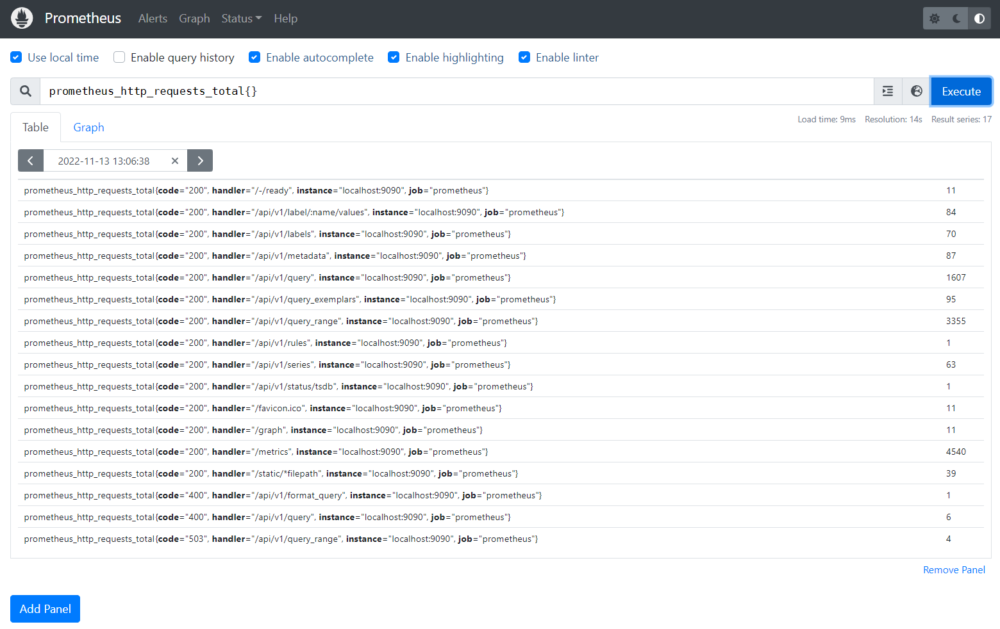

从上图查询结果可以知道，一共有 17 条数据，这 17 条数据的 value 总和为 9986。那么我们使用下面两个聚合操作表达式来查询，看看结果对不对。

第一个表达式，计算一共有几条数据：`count(prometheus_http_requests_total)`:

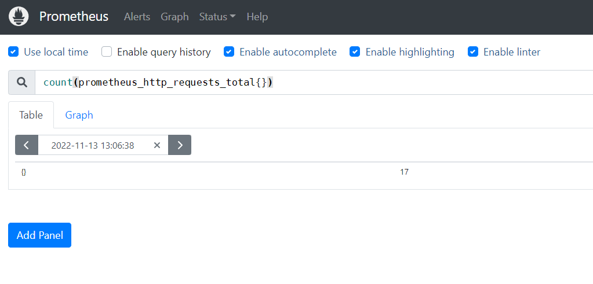

第二个表达式，计算所有数据的 value 总和：`sum(prometheus_http_requests_total)`。

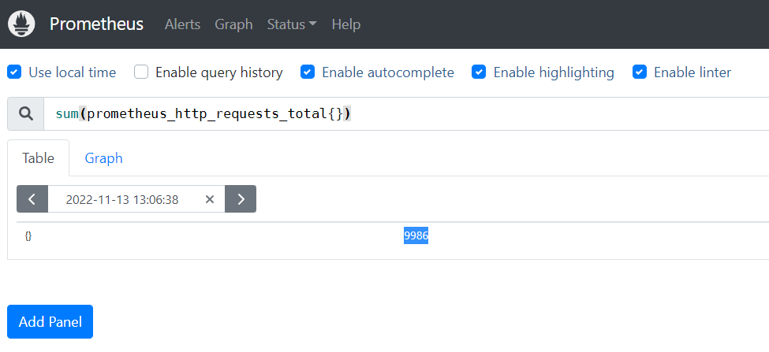

可以看到 count 的数值是一致的，都是 8。但是 sum 的数值有误差，这是因为我们两次查询的时间间隔内，某些记录的数值发生了变化。

### 2.6 标量

在 PromQL 中，标量是一个浮点型的数字值，没有时序。例如：`10`。

需要注意的是，当使用表达式`count(http_requests_total)`，返回的数据类型，依然是瞬时向量。用户可以通过内置函数scalar()将单个瞬时向量转换为标量。

如上图所示，我们将 sum 操作的值用 scalar 转换了一下，最终的结果就是一个标量了。

### 2.7 字符串

在 PromQL 中，字符串是一个简单的字符串值。直接使用字符串作为 PromQL 表达式，则会直接返回字符串。

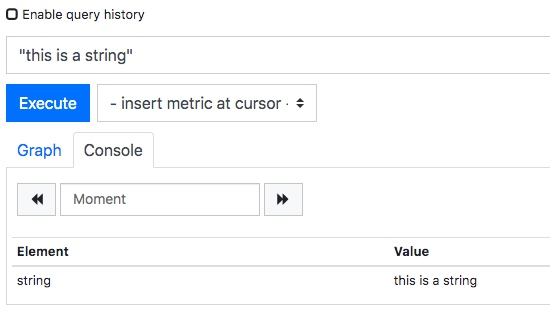

上图中我使用字符串 `"this is a string"` 直接作为 PromQL 查询表达式，结果返回的是一个字符串。

## 三. PromQL 操作符

PromQL 还支持丰富的操作符，用户可以使用这些操作符对进一步的对事件序列进行二次加工。这些操作符包括：数学运算符，逻辑运算符，布尔运算符等等。

### 3.1 数学运算符

数学运算符比较简单，就是简单的加减乘除等。

例如我们通过 `prometheus_http_response_size_bytes_sum` 可以查询到 Prometheus 这个应用的 HTTP 响应字节总和。但是这个单位是字节，我们希望用 MB 显示。那么我们可以这么设置：`prometheus_http_response_size_bytes_sum/8/1024`

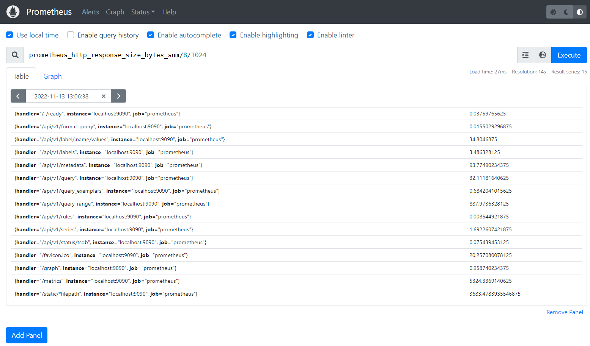

最终显示的数据就是以 MB 作为单位的数值。

PromQL支持的所有数学运算符如下所示：

- `+ (加法)`
- `- (减法)`
- `* (乘法)`
- `/ (除法)`
- `% (求余)`
- `^ (幂运算)`

### 3.2 逻辑运算符

逻辑运算符支持用户根据时间序列中样本的值，对时间序列进行过滤。例如我们可以通过 `prometheus_http_requests_total` 查询出每个接口的请求次数，但是如果我们想筛选出请求次数超过 20 次的接口呢？

此时我们可以用下面的 PromQL 表达式：

```undefined
prometheus_http_requests_total > 20
```

可以看到我们将所有 value 值超过 20 的数据都筛选了出来，从其指标名称可以看出对应的接口名。

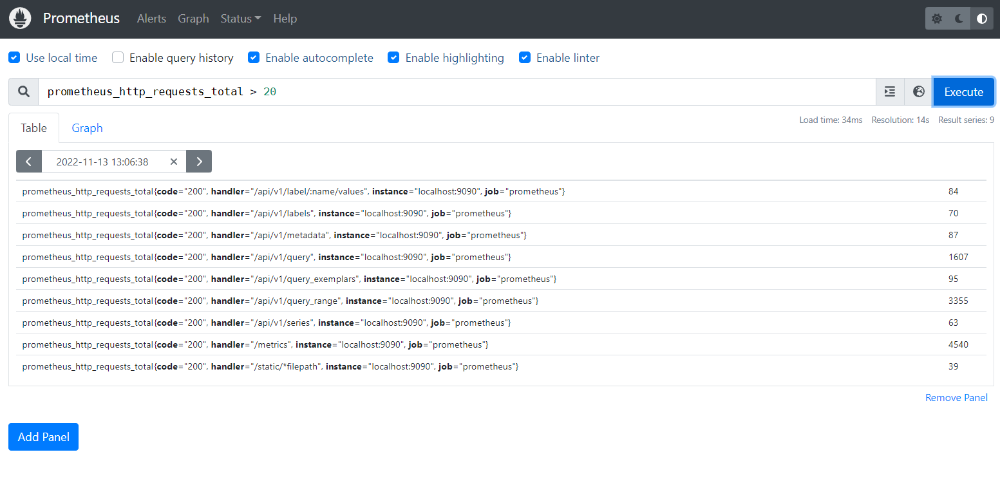

从上面的图中我们可以看到，value 的值还是具体的数值。但如果我们希望对符合条件的数据，value 变为 1。不符合条件的数据，value 变为 0。那么我们可以使用 **bool修饰符** 。

我们使用下面的 PromQL 表达式：

```cpp
prometheus_http_requests_total > bool 20
```

从下面的执行结果可以看到，这时候并不过滤掉数据，而是将 value 的值变成了 1 或 0。

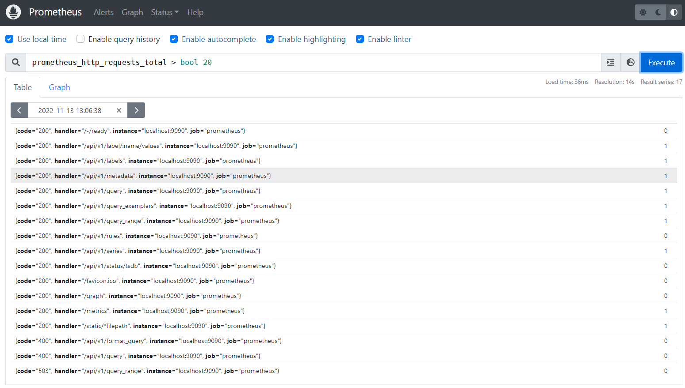

目前，Prometheus支持以下布尔运算符如下：

- `== (相等)`
- `!= (不相等)`
- `> (大于)`
- `< (小于)`
- `>= (大于等于)`
- `<= (小于等于)`

### 3.2 集合运算符

通过集合运算，可以在两个瞬时向量与瞬时向量之间进行相应的集合操作。目前，Prometheus 支持以下集合运算符：

- and 与操作
- or 或操作
- unless 排除操作

#### 3.2.1 and 与操作

vector1 and vector2 进行一个and操作，会产生一个新的集合。该集合中的元素同时在 vector1 和 vector2 中都存在。

例如我们有 vector1 为 A B C，vector2 为 B C D，那么 vector1 and vector2 的结果为：B C。

#### 3.2.2 or 或操作

vector1 and vector2 进行一个或操作，会产生一个新的集合。该集合中包含 vector1 和 vector2 中的所有元素。

例如我们有 vector1 为 A B C，vector2 为 B C D，那么 vector1 or vector2 的结果为：A B C D。

#### 3.2.3 unless 排除操作

vector1 and vector2 进行一个或操作，会产生一个新的集合。该集合首先取 vector1 集合的所有元素，然后排除掉所有在 vector2 中存在的元素。

例如我们有 vector1 为 A B C，vector2 为 B C D，那么 vector1 unless vector2 的结果为：A。

### 3.3 操作符优先级

在PromQL操作符中优先级由高到低依次为：

- `^`
- `*, /, %`
- `+, -`
- `==, !=, <=, <, >=, >`
- `and, unless`
- `or`

## 四. 聚合操作

Prometheus 还提供了聚合操作符，这些操作符作用于瞬时向量。可以将瞬时表达式返回的样本数据进行聚合，形成一个新的时间序列。目前支持的聚合函数有：

- sum (求和)
- min (最小值)
- max (最大值)
- avg (平均值)
- stddev (标准差)
- stdvar (标准方差)
- count (计数)
- count_values (对value进行计数)
- bottomk (后n条时序)
- topk (前n条时序)
- quantile (分位数)

### 4.1 sum 求和

用于对记录的 value 值进行求和。

例如：`sum(prometheus_http_requests_total)` 表示统计所有 HTTP 请求的次数。

### 4.2 min 最小值

返回所有记录的最小值。

prometheus_http_requests_total 指标所有数据如下图所示：


当我们执行如下 PromQL 时，会筛选出最小的记录值。

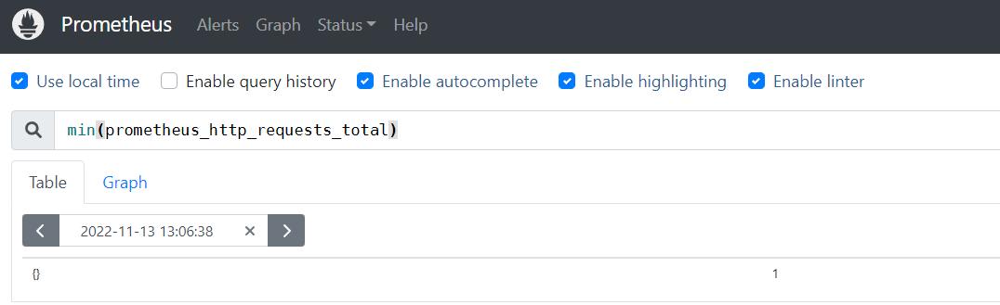

### 4.3 max 最大值

返回所有记录的最大值。

当我们执行如下 PromQL 时，会筛选出最大的记录值。

```scss
max(prometheus_http_requests_total)
```

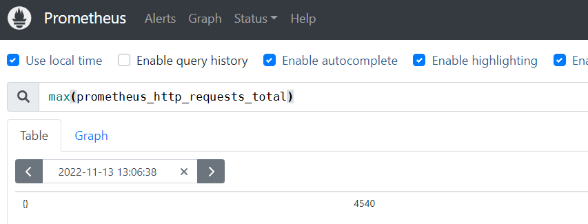

### 4.4 avg 平均值

avg 函数返回所有记录的平均值。

当我们执行如下 PromQL 时，会计算平均值。

```scss
avg(prometheus_http_requests_total)
```

### 4.5 stddev 标准差

标准差（Standard Deviation）常用来描述数据的波动大小。例如我们统计篮球队员身高：

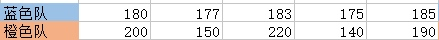

两支队伍平均身高都是 180，看起来似乎差不多。但如果画图的话，得到结果如下：

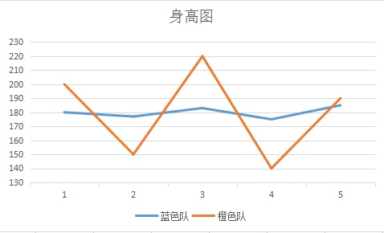

很显然，蓝色队队员身高更加整齐一些，橙色队身高显得参差不齐。为了反映一组数据，偏离平均值的程度，就有了「标准差 」这个概念。

如果数据量很大，比如几万人的身高，我们不容易从折线图看出来，可以直接用公式计算。上图的数据标准差计算结果为：

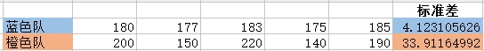

很明显，橙色队的标准差比蓝色队标准差大很多。这说明橙色队的身高波动更大。

当我们执行如下 PromQL 时，会计算出不同 HTTP 请求的数量波动情况。

```scss
stddev(prometheus_http_requests_total)
```

### 4.6 count 计数

count 函数返回所有记录的计数。

例如：`count(prometheus_http_requests_total)` 表示统计所有 HTTP 请求的次数。

### 4.7 bottomk 后几条

bottomk 用于对样本值进行排序，返回当前样本值后 N 位的时间序列。

例如获取 HTTP 请求量后 5 位的请求，可以使用表达式：

```scss
bottomk(5, prometheus_http_requests_total)
```

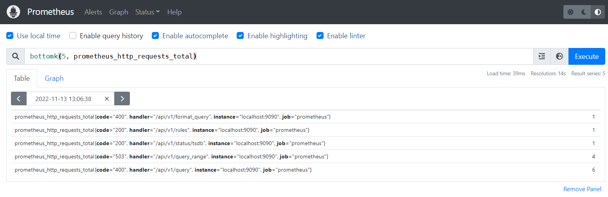

### 4.8 topk 前几条

topk 用于对样本值进行排序，返回当前样本值前 N 位的时间序列。

例如获取 HTTP 请求量前 5 位的请求，可以使用表达式：

```scss
topk(5, prometheus_http_requests_total)
```

## 五. PromQL 内置函数

PromQL 提供了大量的内置函数，可以对时序数据进行丰富的处理。例如 irate() 函数可以帮助我们计算监控指标的增长率，不需要我们去手动计算。

### 5.1 rate 增长率

们知道 counter 类型指标的特点是只增不减，在没有发生重置的情况下，其样本值是不断增大的。为了能直观地观察期变化情况，需要计算样本的增长率。

`increase(v range-vector)` 函数是 PromQL 中提供的众多内置函数之一。其中参数 v 是一个区间向量，increase 函数获取区间向量中的第一个后最后一个样本并返回其增长量。因此，可以通过以下表达式Counter类型指标的增长率：

```css
increase(node_cpu[2m]) / 120
```

这里通过 `node_cpu[2m]` 获取时间序列最近两分钟的所有样本，`increase` 计算出最近两分钟的增长量，最后除以时间120秒得到 `node_cpu` 样本在最近两分钟的平均增长率。并且这个值也近似于主机节点最近两分钟内的平均CPU使用率。

除了使用 `increase` 函数以外，PromQL 中还直接内置了 `rate(v range-vector)` 函数，rate函数可以直接计算区间向量v在时间窗口内平均增长速率。因此，通过以下表达式可以得到与increase函数相同的结果：

```scss
rate(node_cpu[2m])
```

需要注意的是使用rate或者increase函数去计算样本的平均增长速率，容易陷入「长尾问题」当中，其无法反应在时间窗口内样本数据的突发变化。

例如，对于主机而言在 2 分钟的时间窗口内，可能在某一个由于访问量或者其它问题导致 CPU 占用 100% 的情况，但是通过计算在时间窗口内的平均增长率却无法反应出该问题。

为了解决该问题，PromQL提供了另外一个灵敏度更高的函数 `irate(v range-vector)`。irate 同样用于计算区间向量的计算率，但是其反应出的是瞬时增长率。irate 函数是通过区间向量中最后两个样本数据来计算区间向量的增长速率。

这种方式可以避免在时间窗口范围内的「长尾问题」，并且体现出更好的灵敏度，通过 irate 函数绘制的图标能够更好的反应样本数据的瞬时变化状态。

```scss
irate(node_cpu[2m])
```

irate函数相比于rate函数提供了更高的灵敏度，不过当需要分析长期趋势或者在告警规则中，irate的这种灵敏度反而容易造成干扰。因此在长期趋势分析或者告警中更推荐使用rate函数。

### 5.2 predict_linear 增长预测

在一般情况下，系统管理员为了确保业务的持续可用运行，会针对服务器的资源设置相应的告警阈值。例如，当磁盘空间只剩512MB时向相关人员发送告警通知。 这种基于阈值的告警模式对于当资源用量是平滑增长的情况下是能够有效的工作的。

但是如果资源不是平滑变化的呢？ 比如有些某些业务增长，存储空间的增长速率提升了高几倍。这时，如果基于原有阈值去触发告警，当系统管理员接收到告警以后可能还没来得及去处理问题，系统就已经不可用了。

因此阈值通常来说不是固定的，需要定期进行调整才能保证该告警阈值能够发挥去作用。 那么还有没有更好的方法吗？

PromQL 中内置的 `predict_linear(v range-vector, t scalar)` 函数可以帮助系统管理员更好的处理此类情况，predict_linear 函数可以预测时间序列v在t秒后的值。

它基于简单线性回归的方式，对时间窗口内的样本数据进行统计，从而可以对时间序列的变化趋势做出预测。例如，基于2小时的样本数据，来预测主机可用磁盘空间的是否在4个小时候被占满，可以使用如下表达式：

```scss
predict_linear(node_filesystem_free{job="node"}[2h], 4 * 3600) < 0
```

> 本文参考至：[Prometheus 快速入门教程（四）：PromQL 快速入门 - 陈树义 - 博客园 (cnblogs.com)](https://www.cnblogs.com/chanshuyi/p/04_quick_start_of_promql.html)
>
> [初识 PromQL - Prometheus 中文文档 (fuckcloudnative.io)](https://prometheus.fuckcloudnative.io/di-san-zhang-prometheus/di-4-jie-cha-xun/basics)