## VMware安装MacOS

### 一. 环境准备

- VMwareWorkstationPro 15：[官网下载地址](https://www.vmware.com/go/getworkstation-win)
- **Unlocker 3.0** (解锁Apple Mac OS X)： [下载地址](https://github.com/DrDonk/unlocker)
- OS X 10.13镜像：[百度网盘下载地址](https://pan.baidu.com/s/1vvf0z_jyAlFYaioGCpF98g)提取码：46ru

### 二. 给VMware安装`unlocker`插件

​	VMware默认是不支持安装Mac的，所以我们需要安装一`unlocker`

​	安装`unlocker`后，VMware就有MacOS的选项了。

**第一步：停止VMware的相关服务**

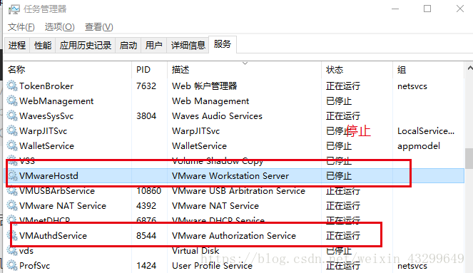

**第二步：解压`unlocker`到VMware的安装目录下**

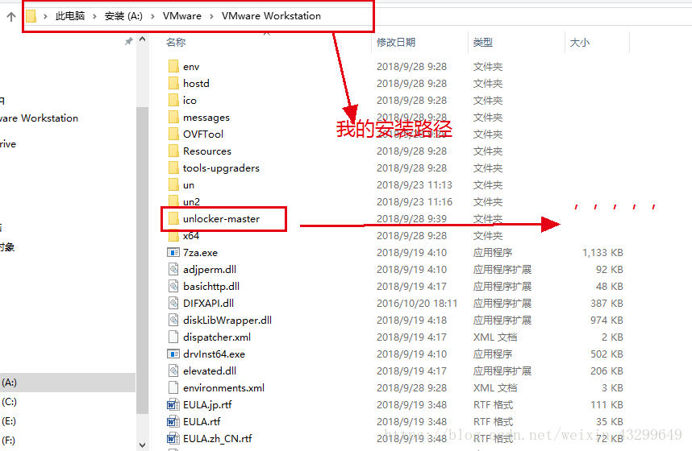

（一定要解压到VMware的安装目录下）

**第三步：安装`unlocker`**

​	此时`unlocker`插件就安装结束了，进入VMware就可以看到，在新建虚拟机页面中有MacOS的选项了。

### 三. 安装MacOS

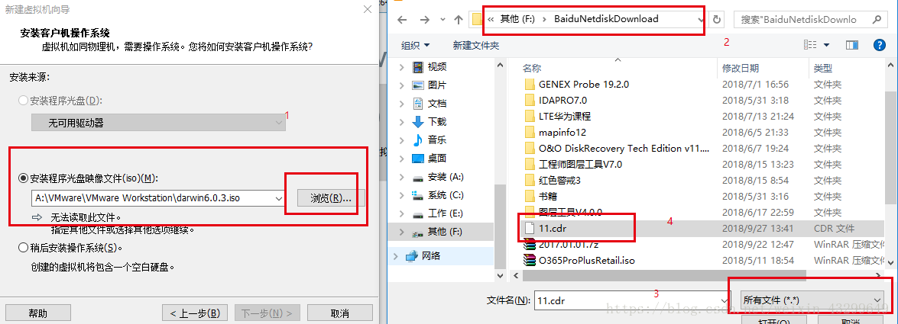

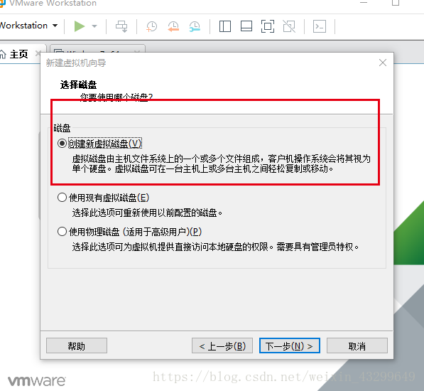

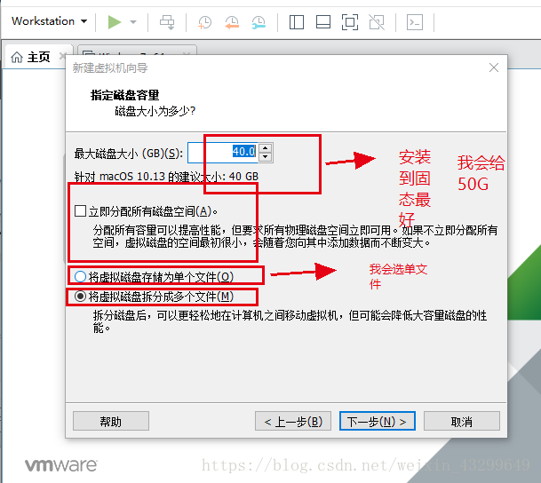

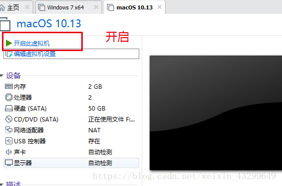

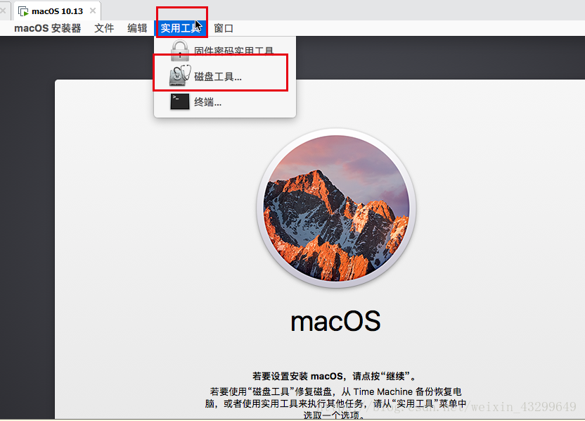

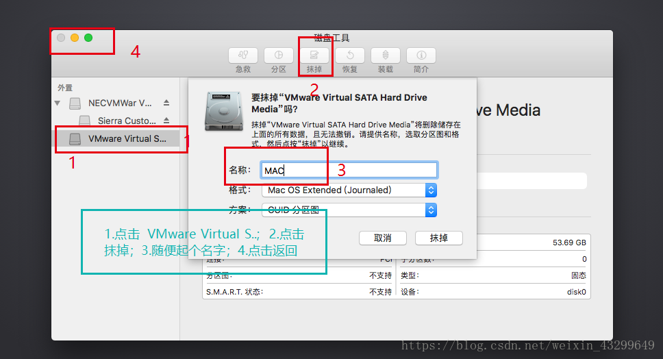

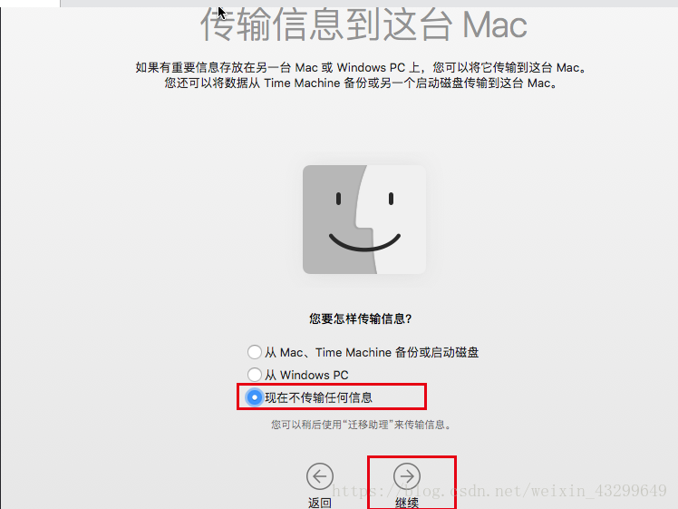

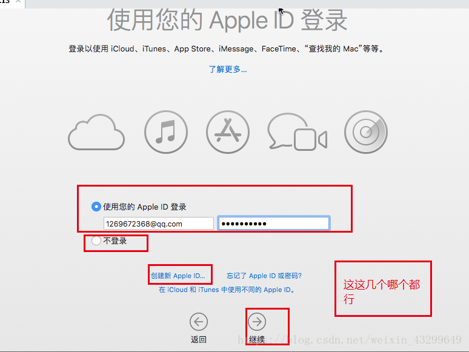

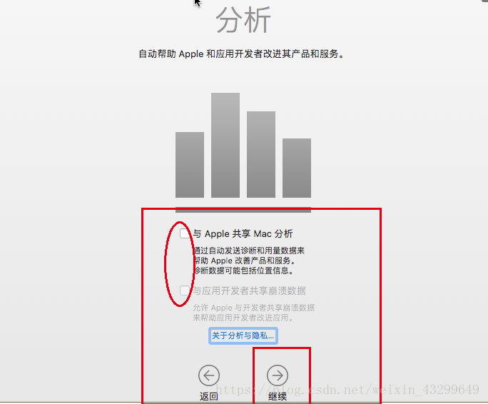

#### 参考文章

[VMware安装MacOS  一](https://blog.csdn.net/u011415782/article/details/78505422)

[VMware安装MacOS  二](https://blog.csdn.net/weixin_43299649/article/details/82881567)

[VMware MacOS安装 VMware Tools](https://blog.csdn.net/zlf_php/article/details/77927728)

[VMware 安装MacOS无法全屏问题解决](https://www.jianshu.com/p/d7d4d7ba95a3)