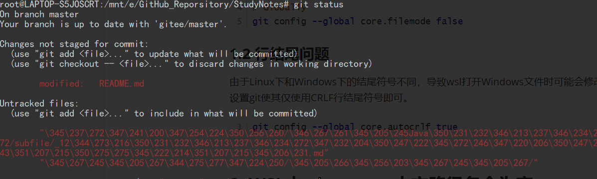

# WSL中git使用的常见问题

## 1. Win10中git status与WSL中git status结果不一致

当使用wsl打开Windows下的仓库时可能会出现所有文件都被标记为modified，这时一般有两种情况。

#### 1.1 文件权限问题

由于wsl申请对文件的读写权限导致文件的权限发生改变。这时只需修改git的设置，忽略文件权限带来的影响。

```shell
# For the current repository
git config core.filemode false   

# Globally
git config --global core.filemode false
```

### 1.2 行结尾问题

由于Linux下和Windows下的结尾符号不同，导致wsl打开Windows文件时可能会修改文件行结尾符号。这时只需设置git使其仅使用CRLF行结尾符号即可。

````shell
git config --global core.autocrlf true
````


## 2. WSL中 git status 中文路径名全为`\xxx`



解决方案：

```shell
git config --global core.quotepath false
```

core.quotepath设为false的话，就不会对0x80以上的字符进行quote。中文显示正常。

