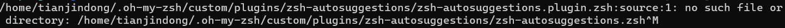
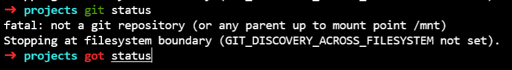
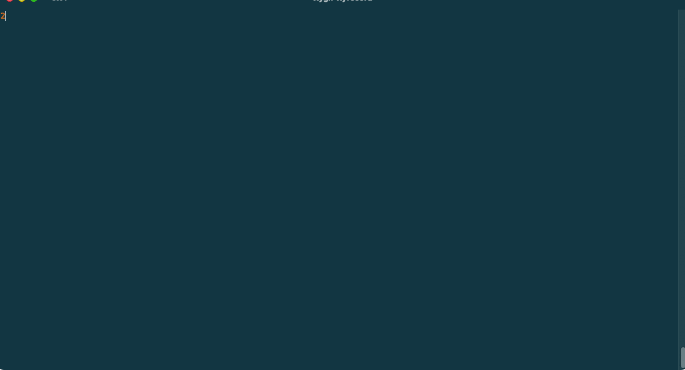
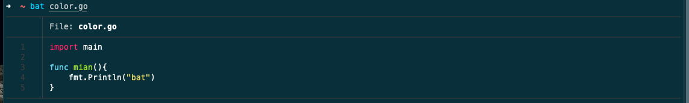
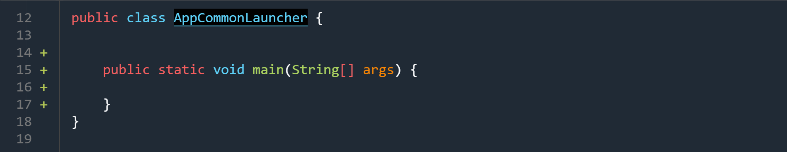
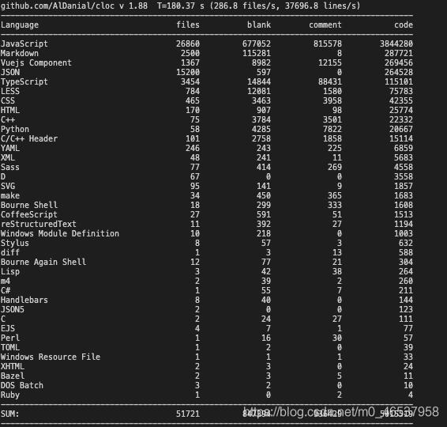

# wsl使用zsh与终端美化

> 本文参考至：https://zhuanlan.zhihu.com/p/166103184

记录如何从bash切换到zsh，如何使用oh-my-zsh对终端进行美化以及zsh一些常用插件的安装。

## 一. 美化后的zsh

这是我修改后的终端样式：


## 二. 安装zsh

- 直接使用apt命令安装即可

```bash
sudo apt-get install zsh
```

- 切换为shell为zsh

```bash
chsh -s /bin/zsh
```

想了解zsh请移步至：[终极 Shell——ZSH](https://www.cnblogs.com/dhcn/p/11666845.html)

## 三. 安装[ohmyzsh](https://github.com/ohmyzsh/ohmyzsh)

- 使用git进行下载

```bash
wget https://raw.githubusercontent.com/ohmyzsh/ohmyzsh/master/tools/install.sh
sh install.sh
```

- 打开zsh的配置文件

```bash
sudo vim ~/.zshrc
```

- 选择主题为我们下载主题：[主题列表](https://github.com/ohmyzsh/ohmyzsh/wiki/Themes)

```bash
ZSH_THEME=powerlevel10k/powerlevel10k
```

- 重新加载配置文件：

```shell
source ~/.zshrc
```

## 四. 安装字体

为了防止终端可能会出现乱码，也是因为你的电脑不支持那么多字体，所以我们需要先安装扩展字体。

推荐使用 [Meslo Nerd Font](https://link.zhihu.com/?target=https%3A//github.com/romkatv/powerlevel10k%23meslo-nerd-font-patched-for-powerlevel10k) 字体，Download these four ttf files:

- [MesloLGS NF Regular.ttf](https://link.zhihu.com/?target=https%3A//github.com/romkatv/powerlevel10k-media/raw/master/MesloLGS%2520NF%2520Regular.ttf)
- [MesloLGS NF Bold.ttf](https://link.zhihu.com/?target=https%3A//github.com/romkatv/powerlevel10k-media/raw/master/MesloLGS%2520NF%2520Bold.ttf)
- [MesloLGS NF Italic.ttf](https://link.zhihu.com/?target=https%3A//github.com/romkatv/powerlevel10k-media/raw/master/MesloLGS%2520NF%2520Italic.ttf)
- [MesloLGS NF Bold Italic.ttf](https://link.zhihu.com/?target=https%3A//github.com/romkatv/powerlevel10k-media/raw/master/MesloLGS%2520NF%2520Bold%2520Italic.ttf)

WSL配置字体其实就是配置终端的字体，点击设置会自动跳转到一个json格式的文档。

## 五. 配置环境变量

编辑`/etc/zsh/zshrc`文件，该文件类似ubuntu系统bash环境下的bashrc文件

## 六. 插件推荐

### 6.1 安装自动提示插件

[zsh-autosuggestions](https://github.com/zsh-users/zsh-autosuggestions)

1. 下载自动补全插件至`oh-my-zsh`的插件目录中  `~/.oh-my-zsh/custom/plugins`

   ```shell
   git clone https://github.com/zsh-users/zsh-autosuggestions ${ZSH_CUSTOM:-~/.oh-my-zsh/custom}/plugins/zsh-autosuggestions
   ```

2. 编辑 `~/.zshrc`文件，注册插件:

   ```shell
   plugins=(zsh-autosuggestions)
   ```

3. 重新加载`~/.zshrc`

   ```shell
   source ~/.zshrc
   ```

安装自动补全插件可能会遇到问题：



这是因为Git在克隆后自动将换行符换成本地配置的换行符了，此时我们进入刚刚克隆的插件路径下，执行下列命令还原即可：

```shell
git reset --hard HEAD
```

参考解决方案：

https://github.com/zsh-users/zsh-autosuggestions/issues/557

### 6.2 安装命令高亮提示插件

执行下列命令安装插件：

```shell
git clone https://github.com/zsh-users/zsh-syntax-highlighting.git ${ZSH_CUSTOM:-~/.oh-my-zsh/custom}/plugins/zsh-syntax-highlighting
```

配置`~/.zshrc`文件，在plugins加入刚刚下载的插件名称：

```shell
plugins=([其它插件名称...] zsh-syntax-highlighting)
```

安装效果：



### 6.3 wsl的ls文件夹为绿色的问题

https://www.cnblogs.com/sgmder/p/13177561.html

### 6.4 安装 thefuck

[GitHub源码](https://github.com/nvbn/thefuck)

[命令行](https://so.csdn.net/so/search?q=命令行&spm=1001.2101.3001.7020)没有提示，经常会敲错字母，然后删掉重新敲。是不是很烦？这时你只要在心里默念the fuck，这时终端显灵，帮你把错误命令修正，并且可以直接输出。是不是很爽，是不是很nice，心里是不是美滋滋？



1. 安装：`brew install thefuck`

2. 配置：

   > 1. `vi ~/.zshrc` 或者 `vi ~/.bashrc`
   > 2. 文件末尾增加：`eval "$(thefuck --alias cao)"`
   > 3. 保存并且退出，`source ~/.zshrc`，即可生效

### 6.5 bat工具（cat命令升级版）

[GitHub源码](https://github.com/sharkdp/bat)

终端常用的cat，显示效果很单一，如果显示行号还需要输入-n ，就非常不方便。bat 支持语言高亮，默认行号，可以上下翻页，显示效果非常棒：



和 Git 配合使用：

```shell
git diff --name-only --diff-filter=d | xargs bat --diff
```



与第三方工具的配合使用可参考官方文档：

[bat/doc/README-zh.md at master · sharkdp/bat --- bat/doc/README-zh.md 位于 master sharkdp/bat (github.com)](https://github.com/sharkdp/bat/blob/master/doc/README-zh.md)

### 6.6 cloc：统计文件空白行、注释行和物理行数

傻瓜式使用方法，只需打开你的项目根目录，直接输入指令`cloc .`即可统计当前项目所有的代码行数，各个语言的行数，无需安装客户端，即可非常简单的快捷统计。



安装：

```shell
sudo apt install cloc 
```

