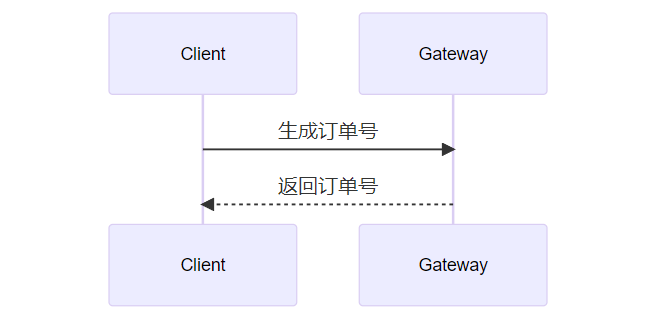

# Markdown时序图语法

Markdown 的原生语法不支持绘制图形，但通过扩展模块，我们可以将一些格式化的文字渲染成我们需要的图形。常用的图形有 “流程图”、“时序图”、“类图”、“状态图”、“甘特图”、"饼图" 等。

本节将重点介绍如何通过 Mermaid 绘制「时序图」。

时序图 (Sequence Diagram) ，用来体现对象之间的时间顺序关系，可以表达出对象的交互过程，也就是 “从哪到哪” 的图形化描述。

**环境说明**：

考虑到 Markdown 工具之间的不兼容，有的内容直接从页面复制粘贴到本地不会正常显示，大家学习时自己动手写是肯定没问题的。本节所有实例代码及演示效果均使用 Typora 工具完成。

Mermaid 为 Markdown 扩展语法，需要在 Typora 设置中开启对图表的语法支持。其方式为：「设置」->「Markdown」->「Markdown 扩展语法」-> 勾选「图表」，如下图：

## 一. 语法

### 1.1 连线

时序图中的消息是对参与者之间通信的时机与内容的描述，其声明方式如：`[发起者][连线类型][接收者]:消息内容`。

其中连接类型有如下几种形式：

| 类型 | 描述             |
| :--- | :--------------- |
| ->   | 没有箭头的实线   |
| -->  | 没有箭头的虚线   |
| ->>  | 有箭头的实线     |
| -->> | 有箭头的虚线     |
| -x   | 有交叉箭头的实线 |
| --x  | 有交叉箭头的虚线 |

时序图由以矩形代表参与者，参与者下方代表生存期间的长实线，连接线之间代表消息的箭头和控制焦点组成。

时序图的内容也需要书写在「mermaid」类型代码块之间，如下：

````txt
```mermaid

```
````

绘制时序图，必须包含时序图类型声明、对象及消息三个部分。

一个基本的时序图：

````txt
```mermaid
sequenceDiagram
 Client->>Gateway: 生成订单号
 Gateway-->>Client: 返回订单号
```
````



### 1.2 别名

时序图中的对象可以通过别名形式简化书写：

````txt

````


### 1.3 聚焦

聚焦代表一条消息在其对象的生命周期中的处理活动。

聚焦使用 `activate` 关键字开始，使用 `deactivate` 结束：

````txt

````


聚焦可以使用 `+`、`-` 符号简化书写。

````txt

````


### 1.4 备注

语法：`Note [位置] [对象]：<注释内容>`

注释显示的位置有三个，以被标记的对象中心为参考系，给予横跨多个时，可以用逗号分割：

- right of
- left of
- over

在参与者的生命线右侧增加备注：`Note right of [参与者]: [备注]`

````java

````


在参与者的生命线左侧增加备注：`Note left of [参与者]: [备注]`

````txt

````


在参与者的生命线之上增加备注：`Note over [参与者1,...]:[备注]`

```java
sequenceDiagram
 participant c as Client
 participant g as Gateway
 c->>+g: 生成订单号
 Note over g,c: 做一些业务操作
 g-->>-c: 返回订单号
```


### 1.5 循环

循环代表时序图中的一项活动，有可能执行一次，有可能重复执行多次，每次在临界点判断循环的条件是否满足，语法如下：

```txt
loop 条件
 [消息流]
end
```

示例：

````txt

````


### 1.6 选择(alt)

在多个条件中做出判断，每个条件对应不同的消息队列(相当于if else 语句)。语法格式如下：

```txt
alt 条件说明
	[消息流]
else 条件说明
	[消息流]
else 
	[消息流]
end
```

例如：

```txt
sequenceDiagram
 participant c as Client
 participant g as Gateway
 c->>+g: 生成订单号
 alt 余额==0
 g-->>c:返回余额不足
 else 余额>price
 g->>g:扣减余额
 g-->>c:返回订单号
 else 余额 == price
 g-->>g: 余额设置为0
 g-->>-c: 返回订单号
 end
```


### 1.7 可选(opt)

在满足某条件的时候执行消息序列，否则不执行，相当于单个分支的if语句。 语法格式如下:

```java
opt  条件说明
	[消息流]
end
```

示例代码：

````txt

````


### 1.8 并行(par)

将消息序列分成多个片段，并行执行。语法格式如下：

```txt
par 说明
	[消息流]
and 
	[消息流]
and
	……
end
```

示例代码：

````java

````


